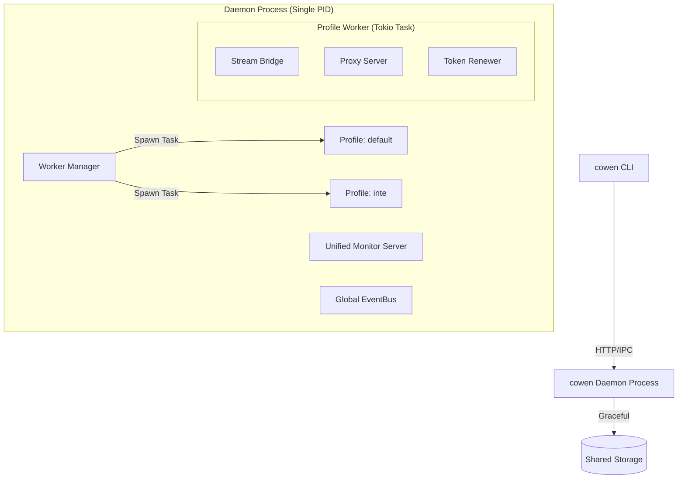

# cli/cowen v0.3.2 概要设计 (HLD)

## 1. 架构目标
v0.3.2 的核心架构目标是**彻底实现从“多进程松散耦合”向“单进程任务自治”的演进**，并通过全路径配置引擎和 IPC 同步机制，提升系统的运维自动化与鲁棒性。

## 2. 系统视图 (System View)

### 2.1 单进程守护架构 (Single-Process Daemon)
不再启动多个二进制实例。一个 `cowen daemon` 进程作为宿主，内部管理多个 Profile 的协程任务。

### 2.2 核心变更模块

#### 1. 全路径配置引擎 (Full-Path Config Engine)
*   **双层管理**: 
    *   **Global 层**: 管理 `app.yaml` 中的 `storage` 和全局 `monitor_port`。
    *   **Profile 层**: 管理各 Profile 独立的 `proxy_port`, `webhook`, `log` 等。
*   **统一接口**: CLI 通过 `config set <PATH> <VALUE>` 统一调用，内部根据路径前缀自动分发至全局或 Profile 存储。

#### 2. IPC 授权同步中心
*   **机制**: 废弃日志轮询。
*   **实现**: `init` 流程中，CLI 接收到浏览器回调后，通过管理 API 将授权信息推送到 Daemon。Daemon 完成置换后通过 API 告知 CLI。

#### 3. 优雅关机控制器 (Shutdown Manager)
*   **机制**: 引入基于 `CancellationToken` 的两阶段停机协议。
*   **阶段**: 
    1.  **Draining**: 停止所有 Worker 的接收端（Bridge/Proxy），标记状态。
    2.  **Cleanup**: 等待正在处理的任务完成，强制刷新存储缓存，关闭连接池。

## 3. 关键流程

### 3.1 跨 Profile 配置热重载
1.  用户执行 `cowen config set --profile prod proxy_port 16001`。
2.  Daemon 的 `ConfigWatcher` 或管理 API 接收到变更。
3.  `WorkerManager` 定向重启 `prod` 相关的 `ProxyServer` 任务，不影响 `default` 环境。

## 4. 架构决策 (ADR)
*   **ADR-032-1**: 弃用 `Command::spawn` 多进程模式，改为 `tokio::task::spawn` 单进程模式。
*   **ADR-032-2**: `config` 命令作为配置修改的唯一入口，不再推荐手动编辑 YAML。
