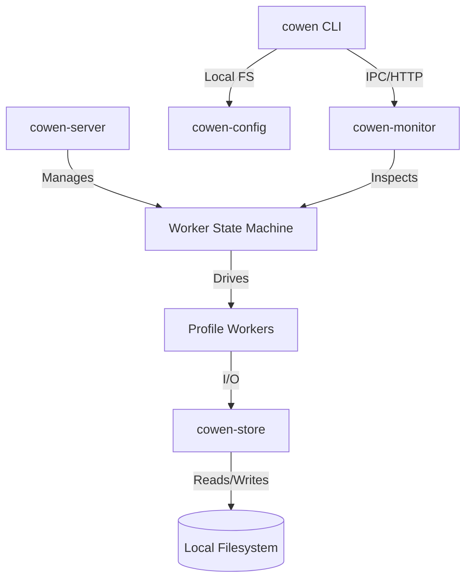

# cli/cowen v0.3.3 概要设计 (HLD)

> **版本**: v0.3.3
> **阶段**: Architecture Blueprint
> **状态**: `DRAFT`

## 1. 系统上下文与依赖拓扑 (System Context & Topology)
v0.3.3 维持原有的单进程架构，但强化了内部组件间的状态同步契约。

## 2. 核心模块设计 (Core Module Design)

### 2.1 ProfileWorker 状态机模型
`WorkerManager` 将不再直接管理 `tokio::task::JoinHandle`，而是管理一组 `ProfileWorker` 容器。

*   **状态定义 (State Enum)**:
    *   `Created`, `Starting`, `Running`.
    *   `Backoff`: 崩溃后的等待期，持有 `retry_count` 和 `next_retry_at`。
    *   `Failed`: 触发熔断，停止自愈。
    *   `Draining`, `Stopped`.

*   **状态可见性 (Observability)**:
    *   Monitor API (`/v1/status`) 扩展返回 `Backoff` 详情及 `Failed` 熔断原因。
    *   `cowen status` 命令渲染重试倒计时。

### 2.2 路径解析器 (Path Parser) 扩展
`path_parser.rs` 支持数组 AST 解析、键值匹配寻址与坍缩删除。

*   **算子优先级**:
    1.  `field` (点号): 访问属性。
    2.  `locator` (`key:val`): 数组内部匹配寻址。
    3.  `index` (数字): 基础下标寻址。
    4.  `append` (`+`): 数组末尾新增。

### 2.3 存储层 (Storage Layer) 扁平化与迁移
消除 `FileStore` 中的深层嵌套与布局混乱。

*   **物理布局标准化**:
    标准路径：`vault/{profile}/{prefix}/{id}.json`。

*   **平滑迁移器 (Migration Module)**:
    启动时执行单向静默迁移。

*   **垃圾回收接口 (GC Interface)**:
    定义 `list_orphans()` 方法，通过扫描物理目录并对比当前配置（如插件列表），识别出不再被配置引用的“孤儿数据文件”。

## 3. 部署架构 (Deployment Architecture)
`cowen` 采用单二进制 Sidecar 模式部署。

*   **二进制交付**: AArch64/X86_64 静态链接二进制。
*   **资源目录**: 遵循 XDG 规范，存储于 `~/.cowen/`。
*   **持久化层**: v0.3.3 引入目录分级，每个 Profile 拥有独立的 `vault/` 树结构。

## 4. 非功能性需求设计 (NFRs)

### 4.1 可观测性 (Observability)
*   **指标 (Metrics)**: Monitor API 新增 `cowen_worker_restart_total` 和 `cowen_worker_state` 指标，支持接入 Prometheus 监控。
*   **告警 (Alerting)**: 当 Worker 转移至 `Failed` 状态时，`cowen-monitor` 会在 `/v1/health` 接口返回 `DOWN` 状态，触发外部存活探针告警。

### 4.2 高可用与性能 (HA & Performance)
*   **启动时延**: `migrate_v2_to_v3` 必须在 500ms 内完成（以 1000 个小文件计），避免阻塞守护进程启动。
*   **容错**: 状态机在 `Backoff` 状态下仍允许接收 `Stop` 指令，确保系统可控退出。

## 5. 架构决策记录 (ADR)
*   **ADR-001**: 采用手写状态机而非第三方 crate，目的是减少编译依赖并获得对 `tokio` 异步上下文的最高控制权。
*   **ADR-002**: 存储布局从单文件切换到目录树，是为了解决超大规模 DLQ 场景下的单文件 I/O 锁竞争问题。
