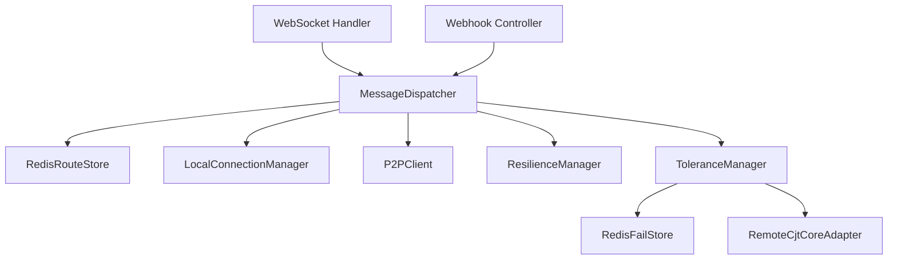

# OpenSpec 提案：系统集成与虚拟线程配置 (SYKFPT-1061-5.3)

| 属性 | 内容 |
| --- | --- |
| **提案 ID** | SYKFPT-1061-5.3 |
| **状态** | 草案 (Draft) |
| **负责人** | Gemini CLI |
| **相关任务** | Task 5.3: 系统集成与虚拟线程配置 |

---

## 1. 问题背景 (Context)
目前系统的各个模块（Core, Infra, Server）已经独立开发完成并通过了各自的单元/集成测试。为了使网关能够作为完整服务运行，我们需要通过 Spring Boot 的依赖注入将它们装配起来。同时，作为一个高并发桥接器，我们需要开启 Java 21 的虚拟线程（Project Loom）来处理所有的阻塞 I/O（如 Redis 查询、P2P HTTP 转发），以取代传统的线程池模型。

## 2. 目标 (Objectives)
- 配置 Spring 依赖注入，将 `RedisRouteStore`、`RemoteCjtCoreAdapter`、`MessageDispatcher` 等 Bean 装配到 `connector-server`。
- 开启 Spring Boot 4 的虚拟线程支持。
- 实现 WebSocket 握手拦截器，集成 `IAuthService` 进行在线验签。
- 提供完整的 `application.yml` 示例配置。
- **严格遵循 TDD**：通过端到端启动测试验证全链路 Bean 注入。

## 3. 技术设计 (Technical Design)

### 3.1 虚拟线程配置
- 设置 `spring.threads.virtual.enabled=true`。
- 确保 Tomcat 和线程池使用虚拟线程。

### 3.2 依赖装配图

### 3.3 握手拦截 (Handshake Interceptor)
- 实现 `HttpSessionHandshakeInterceptor`。
- 调用 `INonceStore` 和 `IAuthService` 验证签名。
- 验证失败则拒绝 WebSocket 升级。

## 4. 实施计划 (Implementation Plan)
1.  **编写集成测试**: `SystemIntegrationTest`。验证启动时无循环依赖且所有 SPI 均有实现。
2.  **实现配置类**: 创建 `AppConfig`、`StoreConfig`、`ServiceConfig`。
3.  **实现拦截器**: `AuthHandshakeInterceptor` 并注册到 WebSocket。
4.  **全局配置**: 完善 `application.yml`。

## 5. 验证策略 (Verification Strategy)
- **启动验证**: 运行 `make build-java` 并启动 JAR，观察日志。
- **并发验证**: 监控活跃线程数，确认是否使用了 `VirtualThread`。
- **功能验证**: 模拟带签名的握手，验证拦截器逻辑。

---
**审批意见**：待评审。
