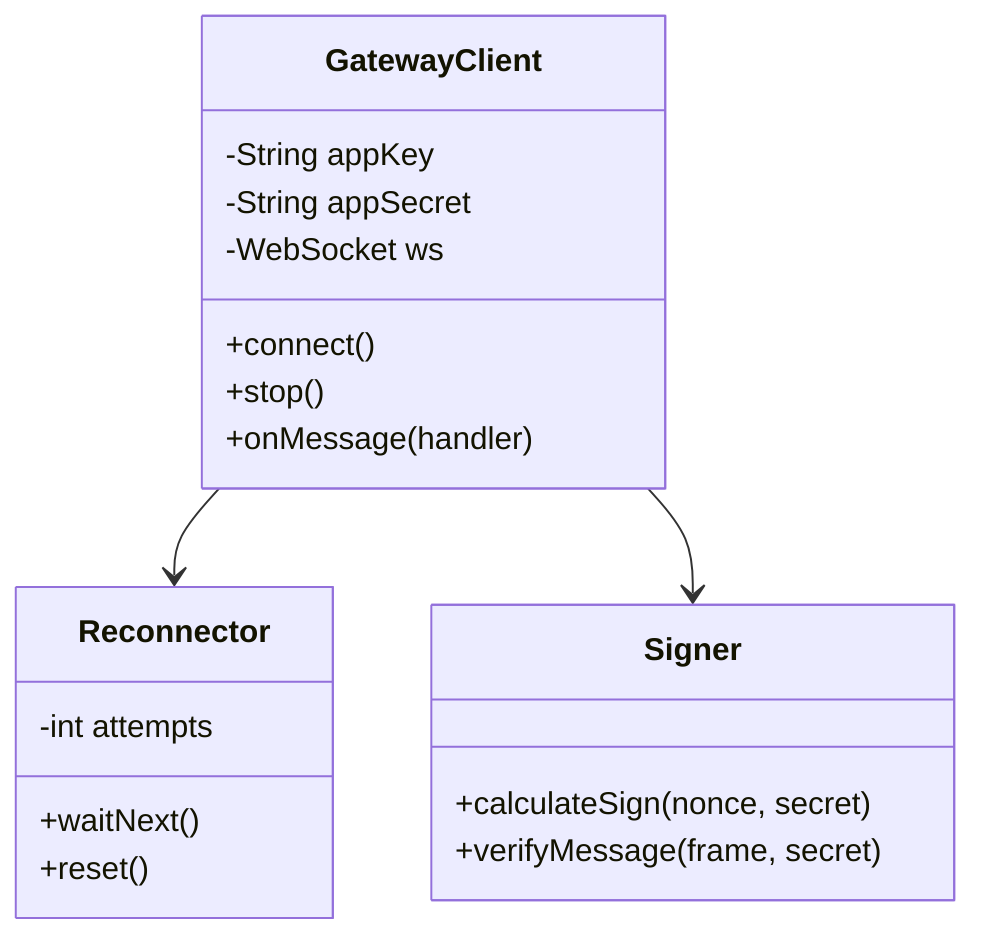

# Design: Java SDK Architecture (SYKFPT-1061-6.1)

## 1. 核心类图 (Class Diagram)

## 2. 握手时序 (Handshake Flow)
1. SDK -> Gateway: `GET /challenge?app_key=...`
2. Gateway -> SDK: `200 OK {nonce: "..."}`
3. SDK: `sign = HMAC_SHA256(appKey + nonce, appSecret)`
4. SDK -> Gateway: `wss://.../connect?nonce={nonce}&sign={sign}`

## 3. 容错与自愈
- **状态监听**: 监听 WebSocket `onClose` 和 `onError`。
- **指数退避**: `1s, 2s, 4s, 8s...` 最高上限 `60s`。
- **抖动 (Jitter)**: 每次重连增加 `±100ms` 随机波动，防止集群同时重连压力。

## 4. TDD 测试矩阵
- `shouldConnectSuccessfullyWithValidCredentials()`
- `shouldRetryWhenGatewayIsDown()`
- `shouldVerifyMessageSignatureCorrectly()`
- `shouldAutoSendAckAfterProcessing()`
