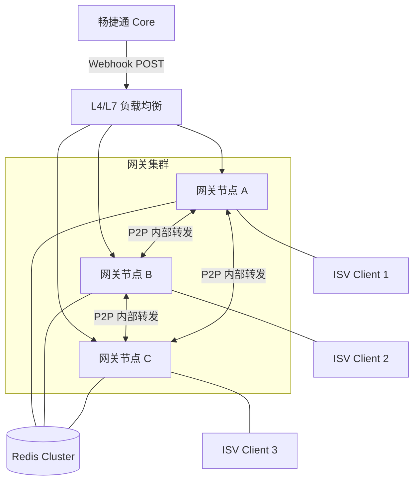

# 畅捷通 Stream Gateway 架构设计文档 v0.1.0

## 1. 概述

畅捷通 Stream Gateway 是一个高性能、低延迟的 Webhook-to-WebSocket 透明同步桥接器。它解决了 ISV 在无公网 IP 和 SSL 证书环境下无法接收畅捷通 Core 服务 Webhook 的痛点。

### 1.1 设计目标
- **免公网 IP**：ISV 仅需发起 WebSocket 连接即可接收业务事件。
- **透明转发**：网关不存储业务明文数据，不对业务数据进行二次解析。
- **高可用与自愈**：集群模式部署，通过 Redis 注册中心实现 P2P 路由及毫秒级故障转移。
- **同步阻塞桥接**：利用 Core 原生的 Webhook 衰减重试机制，网关层不设消息队列。

## 2. 整体架构

### 2.1 部署架构图
系统采用对称部署模式，所有节点地位平等，共同承担 HTTP 接收与 WebSocket 连接维护职责。

### 2.2 核心组件说明

| 组件名称 | 职责 |
| --- | --- |
| **HttpReceiver** | 监听 80/443 端口，接收来自 Core 的 Webhook。负责提取 AppKey 并调用 Router 寻找目标连接。 |
| **WsManager** | 管理 WebSocket 长连接的生命周期。维护本地内存连接池（Connection Pool），处理心跳及 ACK。 |
| **Router** | 路由寻址逻辑。查询 Redis 路由表，判断连接在本地还是远程。负责跨节点 P2P HTTP 转发。 |
| **AuthManager** | 鉴权逻辑。执行 Nonce 挑战应答协议，通过 REST 代理 Core 的验证接口（Verify-PreAuth/Sign）。 |
| **PushController** | 动态推送控制逻辑。根据 AppKey 的在线状态，通过 Core 接口动态开启或挂起 Webhook 推送。 |

## 3. 核心业务流

### 3.1 Webhook 转发全链路 (Happy Path)

1. **Webhook 接入**：Node A 接收到 Webhook (POST)，Header 携带 `X-C-APP_KEY`。
2. **路由寻址**：Node A 查询 Redis `route:{AppKey}`，发现目标连接在 Node B。
3. **P2P 转发**：Node A 发起内部 HTTP POST 请求至 Node B，并挂起等待响应。
4. **WS 推送**：Node B 收到内部请求，根据 ClientID 从本地连接池找到 WS 实例，推送事件帧。
5. **ACK 确认**：ISV Client 返回 ACK 帧。Node B 释放内部 HTTP 响应 (200 OK)。
6. **响应 Core**：Node A 收到 Node B 响应，返回 HTTP 200 OK 给 Core 结束 Webhook 会话。

### 3.2 动态推送控制逻辑 (Self-Healing)

当 Webhook 到达且无任何在线连接时：
1. **计时开始**：在 Redis 写入 `fail_start:{AppKey}`，网关向 Core 返回 503。
2. **容忍期 (30min)**：在此期间 Webhook 重试均返回 503。
3. **状态挂起**：若超过 30 分钟仍无连接，网关调用 Core `DisablePush` 接口。
4. **状态恢复**：当该 AppKey 任一客户端重连，网关立即调用 Core `EnablePush` 恢复推送。

## 4. 技术栈选型

- **开发语言**：JDK 21
- **核心框架**：Spring Boot 4 (Spring Framework 7+)
- **并发模型**：基于 Java 21 Virtual Threads (Project Loom) 实现高并发阻塞 IO，简化异步编码。
- **协议支持**：Spring WebSocket / Spring WebFlux (for HTTP Client)
- **数据存储**：Redis Cluster 7.x (用于路由、Nonce、限流及状态机)
- **监控审计**：Prometheus + Grafana (指标) / ELK (审计流水)

## 5. 跨节点 P2P 转发协议

内部转发采用标准 HTTP/1.1 或 HTTP/2 (H2C)，Header 必须透传：
- `X-Internal-Target-Client-ID`: 目标 ClientID
- `X-Trace-Id`: 全链路追踪 ID
- `X-MSG-ID`: 原始消息 ID

## 6. 安全架构

### 6.1 No-Secret 模式
网关内存绝对不加载或持有 `AppSecret`。所有签名校验工作由 Core (Auth Center) 通过 API 接口完成。网关仅作为 Nonce 的颁发者和 Sign 的传递者。

### 6.2 流量防护
- **握手前置过滤**：基于 `X-CJT-PreAuth` 的 16 位 HMAC 前缀校验。
- **恶意扫描阻断**：基于 IP 维度的 Nonce 获取频率限制及 Sign 校验失败熔断机制。
- **内存保护**：节点级最大并发挂起请求数限制。

## 7. 后续演进

- **逻辑拆分部署**：未来流量增加时，可通过启动参数实现 HTTP 层与 WS 层的逻辑分离部署。
- **Wasm 插件扩展**：支持 ISV 提交 WebAssembly 脚本在网关侧执行轻量级预处理。
