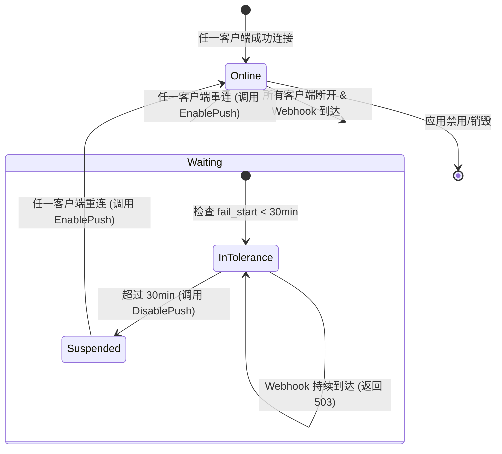

# 畅捷通 Stream Gateway 数据模型与状态设计 v0.1.0

## 1. Redis 键设计 (Redis Schema)

网关集群通过 Redis Cluster 共享路由信息及鉴权状态。

### 1.1 路由表 (Route Table)
- **Key**: `route:{AppKey}`
- **Type**: `Set`
- **Value**: `{node_ip}:{client_id}`
- **TTL**: 60s (由 WsManager 每 20s 自动续期)
- **用途**: 判断目标连接所在的物理节点。

### 1.2 鉴权挑战 (Nonce)
- **Key**: `nonce:{uuid}`
- **Type**: `String`
- **Value**: `{AppKey}`
- **TTL**: 30s
- **用途**: 握手协议中的挑战令牌，单次有效。

### 1.3 首次失败计时器 (Fail Start)
- **Key**: `fail_start:{AppKey}`
- **Type**: `String`
- **Value**: `{Timestamp}`
- **TTL**: 1h
- **用途**: 记录客户端全量离线后的首条消息到达时间，用于判断 30 分钟容忍期。

### 1.4 消息幂等 (Deduplication)
- **Key**: `dedup:{X-MSG-ID}`
- **Type**: `String`
- **Value**: `1`
- **TTL**: 10m
- **用途**: 网关层可选去重，防止 Core 重复投递（如网络抖动）。

### 1.5 鉴权失败计数器 (Auth Failure Counter)
- **Key**: `auth_fail:{IP}`
- **Type**: `String`
- **Value**: `Count`
- **TTL**: 5m
- **用途**: 防暴力破解。5 分钟内失败 5 次封禁 IP。

## 2. 状态机设计 (State Machine)

针对每个 AppKey，其在网关系统中的推送状态如下：

### 2.1 状态迁移图

### 2.2 状态判定规则

| 状态 | 条件 | 网关对 Webhook 的响应 |
| --- | --- | --- |
| **Online** | Redis `route:{AppKey}` 有效 | 200 OK (转发并等待 ACK) |
| **Waiting** | 路由为空，且 `Now - fail_start < 30min` | 503 Service Unavailable |
| **Suspended** | 路由为空，且 `Now - fail_start >= 30min` | 503 (且已通知 Core 停止推送) |

## 3. 内存背压保护 (Backpressure)

网关节点需维护本地内存级计数器：

- **单机最大挂起请求数**: `node_concurrent_requests` (默认 5000)。
- **单租户最大并发数**: `app_concurrent_requests` (默认 100)。

**溢出策略**：
- 节点级溢出：返回 HTTP 503 (系统过载)。
- 租户级溢出：返回 HTTP 429 (Too Many Requests)。
