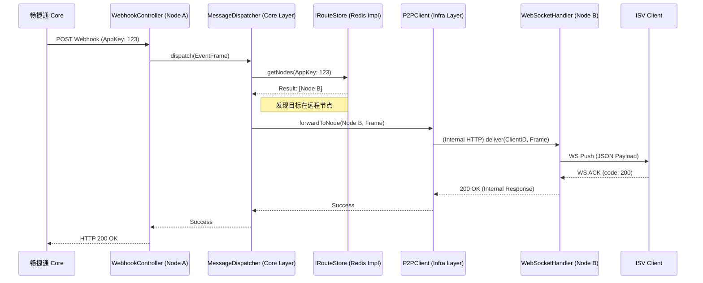

# 畅捷通 Stream Gateway 详细 UML 与 Package 设计 v0.1.0

## 1. 领域组件架构图 (Component Diagram)

该图展示了逻辑层、传输层与基础设施层之间的依赖方向。核心原则是：**所有业务逻辑（Core）仅依赖抽象接口（API），具体实现（Infra）反向依赖 API。**

```mermaid
component {
  package "connector-server (接入层)" as server {
    [WebhookController]
    [WebSocketHandler]
    [SessionRegistry]
  }

  package "connector-core (领域逻辑层)" as core {
    [MessageDispatcher]
    [RouteService]
    [PushStateManager]
    [ResilienceLogic]
  }

  package "connector-api (契约层)" as api {
    interface "IRouteStore"
    interface "IAuthService"
    interface "IPushControl"
  }

  package "connector-infra (基础设施层)" as infra {
    [RedisRouteStore]
    [CjtCoreClient]
    [LocalNonceCache]
  }

  server ..> core : 触发业务逻辑
  core ..> api : 依赖抽象
  infra --|> api : 实现契约
  server ..> infra : 运行时注入实现
}
```

---

## 2. 核心领域职责与 Package 边界

### 2.1 `connector-api` (契约领域)
**职责**：定义整个系统的“标准化接口”，不包含任何业务逻辑。
- `com.chanjet.connector.api.store`: 
    - `IRouteStore`: 定义如何增删改查路由（NodeIP -> ClientID）。
    - `INonceStore`: 定义 Nonce 的生成与核销。
- `com.chanjet.connector.api.auth`: 
    - `IAuthService`: 定义与 Core 协作的签名验证接口。
- `com.chanjet.connector.api.push`:
    - `IPushControl`: 定义如何向 Core 申请开启/挂起 Webhook 推送。

### 2.2 `connector-core` (逻辑领域)
**职责**：处理系统的核心决策逻辑。
- `com.chanjet.connector.core.router`: 
    - **职责**：决策消息该发给哪个节点或哪个 Session。它持有 `IRouteStore` 的引用。
    - **边界**：它不知道 Redis 的存在，也不知道 WebSocket 的底层细节。
- `com.chanjet.connector.core.state`:
    - **职责**：实现 30 分钟容忍期逻辑。维护 AppKey 的“在线/重试中/已挂起”状态。
    - **边界**：仅负责逻辑判定，具体发送指令通过 `IPushControl` 接口。
- `com.chanjet.connector.core.resilience`:
    - **职责**：熔断器、令牌桶限流。防止网关节点被洪峰冲垮。

### 2.3 `connector-server` (传输领域)
**职责**：适配外部协议（HTTP/WS），管理物理连接。
- `com.chanjet.connector.server.websocket`:
    - **职责**：实现 `WebSocketHandler`，管理物理 Session（`WsSession`）。
    - **边界**：它是 `core` 的“手脚”，负责真正把字节流发出去。
- `com.chanjet.connector.server.controller`:
    - **职责**：暴露 REST 接口。接收 Webhook 报文并将其包装成 `EventFrame` 给 `core`。
- `com.chanjet.connector.server.adapter`:
    - **职责**：将 Spring 的 `WebSocketSession` 适配为 `core` 能理解的 `Connection` 对象。

### 2.4 `connector-infra` (实现领域)
**职责**：与具体的中间件和外部服务打交道。
- `com.chanjet.connector.infra.redis`: 具体的 Redis Cluster 命令实现。
- `com.chanjet.connector.infra.cjtcore`: 使用 `RestClient` 调用畅捷通 Core API 的具体实现。

---

## 3. 核心交互时序图 (Webhook Flow)

展示跨节点转发时，各组件如何协作。



---

## 4. 关键设计约束

1.  **无环依赖**：禁止出现 `core` 依赖 `server` 的情况。如果 `core` 需要给 `server` 发指令（如强制断开连接），应通过事件总线或 API 定义的 `IConnectionManager` 接口。
2.  **线程模型**：在 `server` 接入层，所有的 Controller 和 WebSocket Handler 均运行在 Java 21 **Virtual Threads** 上。这意味着在 `core` 逻辑中可以放心使用阻塞式的接口调用（如同步查询 Redis），而无需使用回调。
3.  **异常透传**：`infra` 层的中间件异常（如 Redis 连接断开）必须包装为 `connector-common` 中定义的领域异常（如 `StoreUnavailableException`），以便 `core` 层进行熔断处理。
