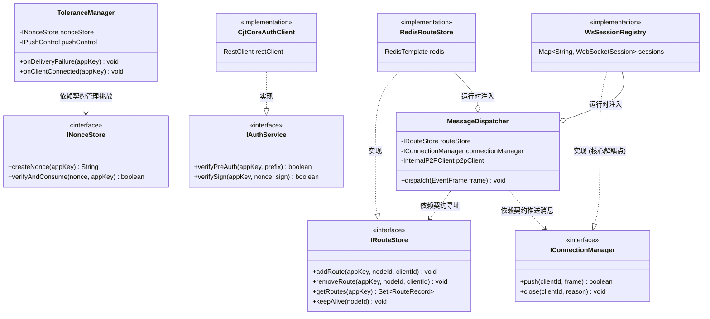

# 畅捷通 Stream Gateway 领域模型与契约设计 v0.1.0

## 1. 核心类图与领域依赖 (Class Diagram)

该图展示了 `core` 逻辑如何通过 `api` 契约与 `infra` 实现及 `server` 传输层进行解耦。



---

## 2. 接口契约详述 (Interface Contracts)

### 2.1 路由存储契约 `IRouteStore`
**位置**：`connector-api`
**职责**：管理集群内所有活跃客户端的物理位置。
- `addRoute(appKey, nodeId, clientId)`: 客户端建连成功后，注册路由。
- `getRoutes(appKey)`: 根据应用 Key 获取所有在线实例的 `NodeIP:ClientID` 列表。用于 `core` 层的 Load Balance。
- `removeRoute(appKey, nodeId, clientId)`: 客户端断连时清理。

### 2.2 连接管理契约 `IConnectionManager`
**位置**：`connector-api`
**职责**：**核心解耦接口**。允许 `core` 逻辑向物理连接发送数据，而无需知道 WebSocket 的 API。
- `push(clientId, frame)`: 根据 ClientID 寻找本地物理连接并下发。返回是否发送成功。
- `close(clientId, reason)`: 强制断开某个连接。

### 2.3 鉴权与推送控制契约 `IAuthService` / `IPushControl`
**位置**：`connector-api`
**职责**：定义与畅捷通 Core 后台交互的抽象。
- `verifySign(appKey, nonce, sign)`: 代理 Core 的签名验证接口。
- `switchPushStatus(appKey, status)`: 通知 Core 开启或挂起特定应用的 Webhook 推送。

---

## 3. 领域模型 (Domain Models / Records)

使用 Java 21 **Records** 定义不可变协议帧，保证线程安全。

```java
// connector-common
public record EventFrame(
    String msgId,
    String traceId,
    String appKey,
    Map<String, String> headers,
    String payload,
    long timestamp
) {}

public record RouteRecord(
    String nodeId,    // 节点 IP:Port
    String clientId   // 客户端实例标识
) {}

public record AckFrame(
    String msgId,
    int code,
    String message
) {}
```

---

## 4. 领域依赖规则 (Dependency Rules)

为了保证高度松耦合，系统遵循以下严格的依赖准则：

1.  **契约高于实现**：`connector-core` 模块的代码中**禁止出现**任何 `infra` 或 `server` 包下的类名。所有的引用必须是 `api` 包下的接口。
2.  **双向解耦 (Core <-> WS)**：
    - `server` 模块接收到 Webhook 后，调用 `core.MessageDispatcher`。
    - `core` 处理完逻辑后，通过 `IConnectionManager` 回调 `server` 发送 WS 消息。
    - **以此避免了 `core` 对 `WebSocketSession` 的直接依赖。**
3.  **无状态逻辑**：`core` 内部不维护连接状态，所有状态信息（如 30 分钟计时、路由表）必须通过 `api` 接口持久化到 `infra`（如 Redis）。
4.  **异常治理**：
    - `infra` 抛出的底层异常（`JedisConnectionException`）必须在 `infra` 适配层被捕获，并转化为 `api` 域定义的业务异常（`StoreOperationException`）。

---

## 5. 模块间对象流转示意

1.  **Webhook 入口** (`server`): 接收 HTTP -> 封装 `EventFrame` -> 调用 `core.dispatch`。
2.  **逻辑处理** (`core`): 查 `IRouteStore` -> 发现是本地 -> 调用 `IConnectionManager.push`。
3.  **基础设施** (`infra`): 执行 Redis 命令，返回结果给 `core`。
4.  **物理发送** (`server`): `WsSessionRegistry` 实现 `push` 接口 -> 找到 `WebSocketSession.sendMessage()`。
