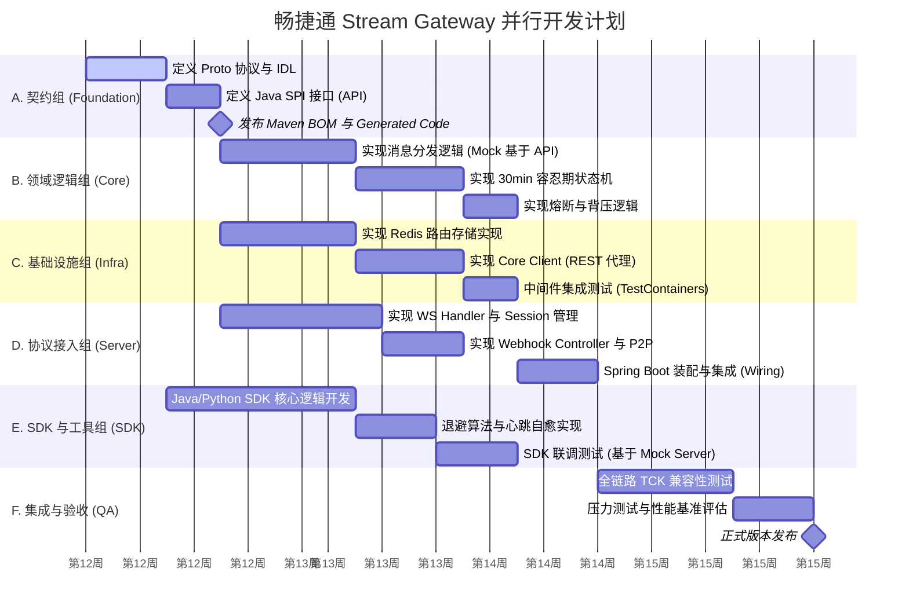

# 畅捷通 Stream Gateway 项目开发甘特图 v1.0

## 1. 项目开发进度与依赖概览 (Gantt Chart)

本甘特图展示了五个并行开发流的协作节奏。核心依赖点在于 **第 1 周的契约冻结**，之后各组进入并行开发阶段。

---

## 2. 关键依赖路径 (Critical Path)

### 2.1 阻塞点：契约交付 (Foundation -> All)
- **依赖说明**：所有组（Core, Infra, Server, SDK）均依赖 `proto` 定义和 `connector-api` 接口。
- **风险规避**：契约组必须在第 1 周内完成定义并发布快照版本，否则后续并行流无法启动。

### 2.2 逻辑闭环：Core & Infra -> Server
- **依赖说明**：`connector-server` 的装配逻辑依赖 `connector-core` 的业务判定以及 `connector-infra` 的具体存储实现。
- **并行方案**：Server 组在前期（s1, s2）可以先使用 `In-Memory` 的简易实现进行开发，待第 4 周再切换为真实的 `core` 和 `infra`。

### 2.3 端到端验证：SDK -> Integration
- **依赖说明**：最后的 TCK 测试需要 SDK 组交付稳定的客户端库进行联调。
- **并行方案**：SDK 组在开发期间通过 Mock Server 进行自测，不依赖后端服务的实时可用性。

---

## 3. 各阶段交付物清单

| 阶段 | 交付物 | 接收方 |
| :--- | :--- | :--- |
| **Foundation** | `proto/` 文件, `connector-api.jar` | 全体开发组 |
| **Core** | `connector-core.jar` (含单元测试) | Server 组 |
| **Infra** | `connector-infra.jar` (Redis/Core 实现) | Server 组 |
| **Server** | 可运行的网关镜像 (Docker Image) | QA 组, ISV |
| **SDK** | `sdk-java`, `sdk-python` 包 | ISV, 合作伙伴 |
| **Integration** | TCK 测试报告, 压力测试报告 | 项目组, 架构组 |

---

## 4. 进度同步机制

- **每日站会**：对齐 `proto` 是否有变更，接口是否需要微调。
- **集成周 (Week 4)**：各组将代码合并至 `main` 分支，通过 Spring DI 进行物理链路打通。
- **冒烟测试**：每完成一个子任务（如 Redis 存储实现），需在 CI 流水线中通过相应的 TCK 子集验证。
