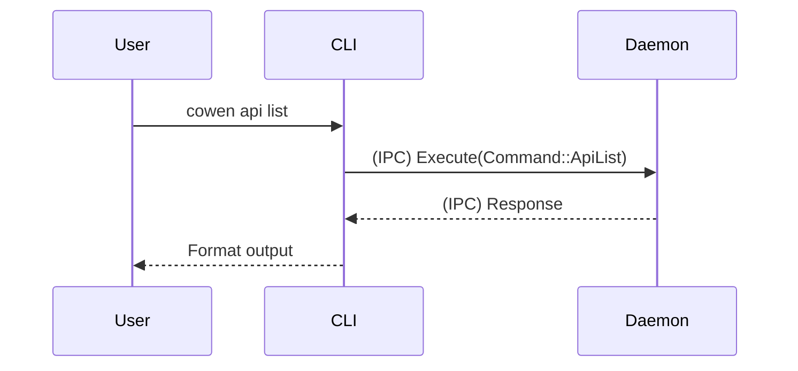

# cowen-cli Design Notes

本文档用于记录该模块在开发过程中的架构设计考量、选型决策记录 (ADR) 以及任何特殊的历史包袱说明。

## 设计决策 (Architecture Decisions)
- **采用 Thin CLI 架构**：CLI 只负责参数解析和向 Daemon 进程发送 IPC 指令。这避免了 CLI 本身需要维持数据库连接、执行耗时计算，从而彻底解决了多个 CLI 实例并发调用时的竞态条件和死锁问题。
- **配置文件的延迟加载**：由于大部分配置仅在 Daemon 中有意义，CLI 仅加载最基础的通信配置用于寻找 Socket 端口。

## 时序流或关系图

