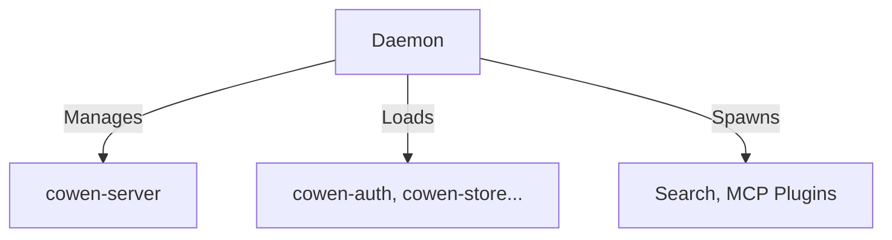

# cowen-daemon Design Notes

本文档用于记录该模块在开发过程中的架构设计考量、选型决策记录 (ADR) 以及任何特殊的历史包袱说明。

## 设计决策 (Architecture Decisions)
- **系统级总控中枢 (Control Plane)**：作为主守护进程，它按顺序实例化并装配所有的底层 `Services`，然后启动长连接服务器。
- **侧车进程的宿主**：引入了子进程生命周期管理器，以监督并自动重启崩溃的 Sidecar 插件（如搜索插件和 MCP 插件）。

## 时序流或关系图

