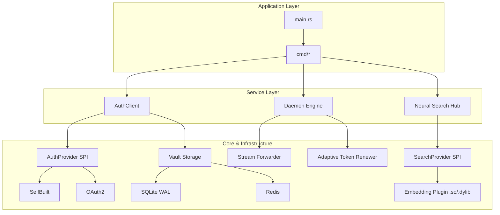

# cowen 架构设计 (Architecture v0.3.1)

本文档详细介绍了 `cowen` CLI 的核心设计理念、模块划分以及实现细节。本项目遵循 **TDD (测试驱动开发)** 与 **OCP (开闭原则)**。

关于 `cowen` 与畅捷通开放平台交互的具体接口清单，请参考 **[开放平台接口集成规范](OPEN_PLATFORM_APIS.md)**。

---

## 🏛️ 总体架构

`cowen` 采用物理隔离的模块化（Physical Crate Isolation）分层架构，确保核心引擎的极简与外围能力的插件化。

### 1. 核心分层说明

- **Application Layer**: 负责命令行解析（基于 `clap`）、环境初始化及全局异常捕获。
- **Service Layer**: 业务逻辑层。包含鉴权协调者 `AuthClient`、后台守护进程 `Daemon` 以及语义搜索。
- **Core & Infrastructure**: 基础设施层。提供配置、安全、存储、网络及遙测等基础能力。

---

## 🔌 SPI 与 插件化设计 (OCP Implementation)

### 1. AuthProvider SPI: 鉴权插件体系
允许不同的认证模式注入自定义逻辑。在 v0.3.1 中，通过 `Vault` 与 `ConfigManager` 的物理隔离，确保了鉴权上下文的纯净。

### 2. Store SPI: 多维持久化体系
支持五大领域（Config, Secret, Token, Audit, DLQ）的异构后端存储。通过 `inventory` 宏实现 Schema 驱动的自动发现。

### 3. SearchProvider SPI: 可插拔搜索 (v0.3.1+)
为了保持主二进制文件的轻量，复杂的语义搜索（向量化、ONNX 推理）已被剥离为动态插件：
- **枢纽 (Hub)**: `cowen-search` crate 提供基础 Trait 与插件加载逻辑。
- **插件 (Plugin)**: 导出 C ABI 接口的动态链接库（`.dylib`, `.so`）。
- **加载机制**: 使用 `cowen-infra` 中的 `PluginLoader` 实现跨平台动态链接，支持在运行时根据配置文件显式启用或禁用特定搜索算法。

---

## 🔄 核心业务流程

### 1. 智能 Token 维护 (Adaptive Refresh)
不再采用硬编码的定时检查，v0.3.1 引入了**自适应刷新算法**：
- **80% 规则**: 下次检查时间 = `(Token 剩余寿命 * 0.8)`。
- **动态阈值**: 锁定在 `[30s, 3600s]` 之间，既保证了实时性，又避免了对服务端的无效轮询。
- **抖动 (Jitter)**: 注入 `±60s` 的随机偏移，防止集群规模下的请求波峰。

### 2. 守护进程自愈与死锁防护
- **并发优化**: SQLite 连接池通过 WAL 模式与 `max_connections(5)` 实现读写分离。
- **异步锁**: 跨进程 Token 刷新使用 `try_lock` + 异步等待，彻底避免了 Tokio 线程池被物理文件锁阻塞导致的死锁。

---

## 💾 物理模块隔离 (Crate Isolation)

v0.3.1 实现了严格的物理目录隔离，每个领域拥有独立的 `Cargo.toml`：
- `cowen-common`: 核心模型与脱敏类型。
- `cowen-store`: 存储 SPI 与 SQL/Redis 驱动。
- `cowen-auth`: 鉴权 SPI 与 OAuth2/SelfBuilt 实现。
- `cowen-search`: 搜索枢纽。
- `cowen-infra`: 插件加载器、混淆器等基础设施。

---

## 🔍 语义搜索 (Neural Search Hub)

`cowen api list -s "关键词"` 的实现细节：
- **模型**: BGE-small-zh-v1.5 (量化版 ONNX)。
- **推理**: 使用 `ort` (ONNX Runtime) 执行。
- **原理**: 将所有 API 路径和描述转化为向量，通过 Cosine Similarity 计算相关度，优于传统关键词匹配。

---

## 🛠️ 开发规范 (Engineering Standards)

为确保 `cowen` 的代码质量、安全性及可维护性，所有代码贡献必须严格遵循以下规范：

### 1. 架构遵循原则
- **SPI First**: 核心业务逻辑（如 `AuthClient`）严禁直接依赖具体实现。必须通过 Trait (如 `AuthProvider`, `Store`) 进行解耦。
- **OCP (开闭原则)**: 增加新功能（如新的鉴权模式或存储后端）应当通过“增加类/模块”而非“修改现有判断逻辑”来实现。使用 `inventory` 宏或注册表模式进行发现。
- **Layer Isolation**: 基础设施层（Network, Storage）不应包含业务逻辑。业务逻辑层不应直接处理低级别的 I/O 细节。

### 2. 并发与同步规范
- **异步优先**: 所有 I/O 操作必须使用 `tokio` 异步执行。
- **状态保护**: 跨进程/多线程访问共享资源（如 `TokenPair`）时，必须使用 **文件锁 (File Lock)** 或 **分布式锁**。严禁在无保护的情况下进行原子性写操作。

### 3. 安全与日志规范
- **Vault 存储**: 所有敏感数据（Secrets, Tokens, Keys）必须存入 `Vault` 域。严禁将敏感字面量存入常规配置文件（如 `app.yaml`）。
- **自动脱敏**: 打印日志或向控制台输出 JSON 时，必须通过 `obfs` 模块或包装器类型进行脱敏处理。严禁在日志中出现明文令牌或密钥。
- **硬编码加密**: 内部使用的 API 路径或正则匹配字符串，应使用 `obfs!` 宏进行静态混淆，防止二进制反编译直接暴露接口结构。

### 4. 错误处理规范
- **Contextual Error**: 使用 `anyhow` 处理错误，并务必通过 `.context()` 提供业务层面的上下文信息（例如：指出是哪个 Profile、哪个阶段失败）。
- **Actionable Messages**: 错误信息应具有指引性，告诉用户该如何修复（例如：提示运行 `cowen auth login`）。

### 5. 代码质量 (TDD)
- **测试先行**: 严禁在没有对应失败测试用例的情况下提交生产代码。
- **Git 规范**: Commit message 第一行必须包含当前分支名后缀，第二行留空。

---

## 🧪 质量保证与测试 (QA & Testing)

`cowen` 的稳定性源于严苛的测试体系。我们不仅关注功能覆盖，更关注在异常场景（如断网、限流、数据库故障）下的系统行为。

### 1. 测试驱动开发 (TDD)
项目严格执行 TDD 流程。任何新功能或 Bug 修复必须遵循：
1. **Red**: 编写一个失败的集成测试用例（`tests/case_*.sh`）或单元测试。
2. **Green**: 编写最少量的生产代码使测试通过。
3. **Refactor**: 在测试保护下优化代码结构。

### 2. 多层级测试矩阵

#### 单元测试 (Unit Tests)
- **位置**: 与源代码同文件或位于 `*_test.rs` 中。
- **重点**: 核心算法（如 `backoff` 计算）、数据脱敏逻辑、配置解析。
- **执行**: `cargo test`

#### 端到端集成测试 (E2E Integration Tests)
- **框架**: 基于 Shell 脚本 (`tests/common.sh`) 构建，模拟用户真实命令行操作。
- **并行执行**: 通过 `run_parallel.sh` 调度，每个测试用例拥有独立的：
    - `COWEN_HOME`: 物理隔离的配置与存储目录（位于 `target/cowen_tests/case_xx/`）。
    - **隔离端口**: 动态分配 Mock Server 与 Proxy 端口，防止冲突。
- **核心 Case 验证点**:
    - `case_01-03`: 三大鉴权模式（Self-Built, Store-App, OAuth2）的基础链路验证。
    - `case_04 & 16`: 数据库 Schema 自动迁移与版本安全阻断。
    - `case_07 & 20`: 令牌全生命周期验证（换票、存储、自动过期刷新）。
    - `case_14-18, 31-32`: 分布式存储（Redis/MySQL/PostgreSQL/Shared DB）下的多实例同步与容错。
    - `case_33`: 验证 Exclusive 独占连接的“后浪推前浪”逻辑。
    - `case_34`: 增强型守护进程自愈能力验证。

### 3. Mock 机制与环境隔离
为了实现完全本地化的 E2E 验证，项目内置了强大的 Mock 基础设施：
- **Mock Server (`mock_server.py`)**: 
    - 模拟畅捷通开放平台的所有核心 API（OAuth2 换票、OpenAPI 网关、StoreApp 票据推送）。
    - **确定性控制**: 支持通过特殊 Header 强制 Mock Server 返回 429 (限流) 或 500 (故障)，用于测试 `cowen` 的自愈能力。
- **环境隔离**: 测试期间不依赖任何外部网络服务，确保测试结果在不同开发环境下具有高度一致性。

### 4. 自动化全量验证 (Verification Suite)
通过 `make test` 命令，开发者可以一键运行所有集成测试用例。这包括：
- 模拟 Daemon 进程意外退出后的状态恢复。
- 在高并发压力下验证分布式锁的有效性。
- 验证机器指纹变化后 Vault 的安全性表现。
- 跨环境（Profile）的一致性检查。

---

---
© 2026 Chanjet Advanced Agentic Coding Team.
