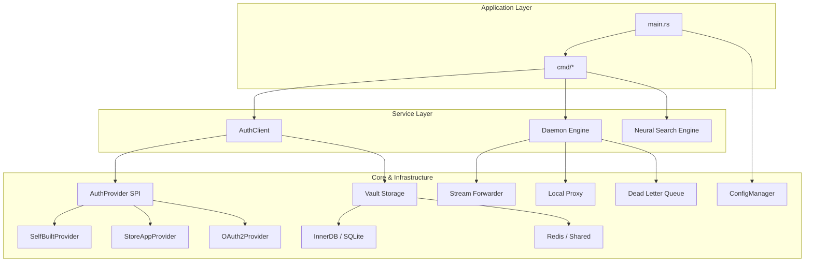

# cowen 架构设计 (Architecture v0.3.0)

本文档详细介绍了 `cowen` CLI 的核心设计理念、模块划分以及实现细节。本项目遵循 **TDD (测试驱动开发)** 与 **OCP (开闭原则)**。

关于 `cowen` 与畅捷通开放平台交互的具体接口清单，请参考 **[开放平台接口集成规范](OPEN_PLATFORM_APIS.md)**。

---

## 🏛️ 总体架构

`cowen` 采用模块化分层架构，核心逻辑通过 Trait 进行抽象，确保了良好的可扩展性。

### 1. 核心分层说明

- **Application Layer**: 负责命令行解析（基于 `clap`）、环境初始化及全局异常捕获。
- **Service Layer**: 业务逻辑层。包含鉴权协调者 `AuthClient`、后台守护进程 `Daemon` 以及语义搜索。
- **Core & Infrastructure**: 基础设施层。提供配置、安全、存储、网络及遙测等基础能力。

---

## 🔌 SPI 与 插件化设计 (OCP Implementation)

`cowen` 核心设计的灵魂在于 **SPI (Service Provider Interface)** 机制。通过将具体实现与核心引擎解耦，系统能够以“零修改”方式扩展鉴权模式和存储后端。

### 1. AuthProvider SPI: 鉴权插件体系

`AuthProvider` Trait 定义了一套完整的生命周期钩子，允许不同的认证模式注入自定义逻辑：

- **令牌治理**:
    - `get_token()`: 核心入口，负责从 `TokenPool` 检查有效性或触发换票。
    - `on_maintenance_tick()`: 后台保鲜逻辑，由 Daemon 定时调用，确保持久化存储中的令牌永不过期。
- **流量拦截与注入**:
    - `intercept_request()`: 在 Proxy 模式下，负责将 `openToken` 或其他安全头动态注入上游请求。
    - `decorate_openapi_request()`: 针对标准 OpenAPI 调用的协议修饰。
- **异步事件响应**:
    - `handle_platform_event()`: 处理来自 WebSocket 的异步信号（如 `AppTicket` 更新、临时码兑换）。
- **初始化与配置**:
    - `initialize()`: 统一起步钩子，负责环境探测与 `Vault` 种子注入。
    - `hydrate_config()`: 启动前从安全存储中恢复敏感信息到内存。

**注册机制**:
`auth/mod.rs` 作为统一注册点，通过 `AuthClient::builder().register(...)` 将不同的 Provider（如 `SelfBuiltProvider`, `StoreAppProvider`）映射到对应的 `AuthMode` 枚举上。

### 2. Store SPI: 多维持久化体系

`Store` Trait 将工具的状态持久化抽象为五个独立领域，每个领域支持不同的后端实现：

- **Config Domain**: 存放 Profile 的静态配置项（URL, AppKey 等）。
- **Secret Domain**: 与 `Vault` 配合，存放加密后的 AppSecret 或私钥。
- **Token Domain**: 存放具有 TTL（生存时间）特性的动态令牌，支持分布式同步。
- **Audit Domain**: 结构化日志序列化存储，支持按级别和时间检索。
- **DLQ Domain**: 异步任务失败后的死信队列，用于 Daemon 自动重试。

**动态加载机制**:
项目使用了 `inventory` crate 实现了 **StoreBuilder 自动收集**：
- 任何新的存储后端只需实现 `StoreBuilder` 并使用 `inventory::submit!` 注册。
- `create_store_from_url()` 会根据 URL Schema（如 `sqlite://`, `redis://`）自动匹配并实例化对应的后端，实现了真正的插件化。

---

---

## 🔄 核心业务流程

### 1. 鉴权与令牌维护流程
`cowen` 并不简单地在每次请求时换票，而是通过 `TokenPool` 进行精细化管理。针对不同的认证模式，其交互链路有所差异：

- **[SelfBuilt (自建模式)](auth/SELF_BUILT.md)**: 传统的自建应用模式，通过 AppTicket 推送机制实现令牌自动维护。
- **[StoreApp (商店应用模式)](auth/STORE_APP.md)**: 开放平台入驻模式（ISV 模式），支持租户级令牌隔离与自动交换。
- **[OAuth2 (三方授权模式)](auth/OAUTH2.md)**: 纯 OAuth2 客户端模式，集成 PKCE 安全验证与本地回调监听，适用于三方授权场景。

核心共性流程：
1. **Cache Hit**: 首先检查 `Store` (如 Redis/SQLite) 中是否存在未过期的有效令牌。
2. **Conflict Protection**: 在并发请求场景下，通过版本号或文件锁确保只有一个线程发起网络换票。
3. **Proactive Renewal**: 令牌快过期前（由 `on_maintenance_tick` 逻辑判定），Daemon 会提前发起异步刷新。

### 2. Daemon 生命周期管理
Daemon 启动后会运行多个并行的 Tokio Task：
- **Proxy Server**: 监听本地端口，劫持请求并自动注入最新的鉴权头。
- **Token Renewer**: 轮询所有 Profile，确保持久化存储中的令牌永不过期。
- **Stream Forwarder**: 维护与云端的长连接，将流式数据转发至本地，处理断线重连。

### 3. 自愈与指数退避 (Backoff)
当遇到云端限流（HTTP 429/409）或网络抖动时：
- 系统会自动记录错误状态。
- 下次尝试将遵循 $2^n$ 的指数级退避时间。
- 状态持久化在 `Store` 中，即使 CLI 进程重启，退避计数也不会重置，有效保护账号信誉。

---

## 🛡️ 安全性保障 (Security Model)

### 1. Vault 凭据保险库
所有敏感数据（AppSecret, Password）在进入 `Store` 前必须经过 `Vault` 处理：
- **算法**: AES-256-GCM 高强度对称加密。
- **密钥派生**: 使用机器指纹 (`machine-id`) 作为 KDF 因子。这意味着加密文件无法在另一台物理机器上解密，防范配置文件外泄。

### 2. 自动化脱敏 (Obfuscation)
`obfs` 模块通过包装器类型，确保在：
- `println!` / `fmt::Debug`
- JSON 序列化
- 结构化日志输出
时，敏感字段（如 `access_token`）会被自动替换为 `<MASKED>`，防止开发/调试期间的泄露。

---

## 💾 存储演进与一致性

`cowen` 支持从单机开发到分布式部署的平滑切换：

| 存储类型 | 适用场景 | 核心技术 |
| :--- | :--- | :--- |
| **InnerDB** | 默认推荐，单机 Daemon | SQLite + WAL Mode |
| **Redis** | 集群/容器化部署，共享令牌 | Redis Multiplexing |
| **Hybrid** | 高性能分布式，读写分离 | SQLite (Persistence) + Redis (Cache) |
| **File** | 简单调试，可读性优先 | YAML + Atomic Write |

**Migration 系统**: 系统启动时会自动检测数据库版本。对于 SQL 后端，会自动应用增量脚本，确保 Schema 始终符合代码预期。

---

## 🔍 语义搜索 (Neural Search Engine)

`cowen api list -s "关键词"` 的实现细节：
- **模型**: BGE-small-zh-v1.5 (量化版 ONNX)。
- **推理**: 使用 `ort` (ONNX Runtime) 执行。
- **原理**: 将所有 API 路径和描述转化为向量，通过 Cosine Similarity 计算相关度，优于传统关键词匹配。

---

## 🛠️ 开发规范 (Engineering Standards)

为确保 `cowen` 的代码质量、安全性及可维护性，所有代码贡献必须严格遵循以下规范：

### 1. 架构遵循原则
- **SPI First**: 核心业务逻辑（如 `AuthClient`）严禁直接依赖具体实现。必须通过 Trait (如 `AuthProvider`, `Store`) 进行解耦。
- **OCP (开闭原则)**: 增加新功能（如新的鉴权模式或存储后端）应当通过“增加类/模块”而非“修改现有判断逻辑”来实现。使用 `inventory` 宏或注册表模式进行发现。
- **Layer Isolation**: 基础设施层（Network, Storage）不应包含业务逻辑。业务逻辑层不应直接处理低级别的 I/O 细节。

### 2. 并发与同步规范
- **异步优先**: 所有 I/O 操作必须使用 `tokio` 异步执行。
- **状态保护**: 跨进程/多线程访问共享资源（如 `TokenPair`）时，必须使用 **文件锁 (File Lock)** 或 **分布式锁**。严禁在无保护的情况下进行原子性写操作。

### 3. 安全与日志规范
- **Vault 存储**: 所有敏感数据（Secrets, Tokens, Keys）必须存入 `Vault` 域。严禁将敏感字面量存入常规配置文件（如 `app.yaml`）。
- **自动脱敏**: 打印日志或向控制台输出 JSON 时，必须通过 `obfs` 模块或包装器类型进行脱敏处理。严禁在日志中出现明文令牌或密钥。
- **硬编码加密**: 内部使用的 API 路径或正则匹配字符串，应使用 `obfs!` 宏进行静态混淆，防止二进制反编译直接暴露接口结构。

### 4. 错误处理规范
- **Contextual Error**: 使用 `anyhow` 处理错误，并务必通过 `.context()` 提供业务层面的上下文信息（例如：指出是哪个 Profile、哪个阶段失败）。
- **Actionable Messages**: 错误信息应具有指引性，告诉用户该如何修复（例如：提示运行 `cowen auth login`）。

### 5. 代码质量 (TDD)
- **测试先行**: 严禁在没有对应失败测试用例的情况下提交生产代码。
- **Git 规范**: Commit message 第一行必须包含当前分支名后缀，第二行留空。

---

## 🧪 质量保证与测试 (QA & Testing)

`cowen` 的稳定性源于严苛的测试体系。我们不仅关注功能覆盖，更关注在异常场景（如断网、限流、数据库故障）下的系统行为。

### 1. 测试驱动开发 (TDD)
项目严格执行 TDD 流程。任何新功能或 Bug 修复必须遵循：
1. **Red**: 编写一个失败的集成测试用例（`tests/case_*.sh`）或单元测试。
2. **Green**: 编写最少量的生产代码使测试通过。
3. **Refactor**: 在测试保护下优化代码结构。

### 2. 多层级测试矩阵

#### 单元测试 (Unit Tests)
- **位置**: 与源代码同文件或位于 `*_test.rs` 中。
- **重点**: 核心算法（如 `backoff` 计算）、数据脱敏逻辑、配置解析。
- **执行**: `cargo test`

#### 端到端集成测试 (E2E Integration Tests)
- **框架**: 基于 Shell 脚本 (`tests/common.sh`) 构建，模拟用户真实命令行操作。
- **并行执行**: 通过 `run_parallel.sh` 调度，每个测试用例拥有独立的：
    - `COWEN_HOME`: 物理隔离的配置与存储目录（位于 `target/cowen_tests/case_xx/`）。
    - **隔离端口**: 动态分配 Mock Server 与 Proxy 端口，防止冲突。
- **核心 Case 验证点**:
    - `case_01-03`: 三大鉴权模式（Self-Built, Store-App, OAuth2）的基础链路验证。
    - `case_04 & 16`: 数据库 Schema 自动迁移与版本安全阻断。
    - `case_07 & 20`: 令牌全生命周期验证（换票、存储、自动过期刷新）。
    - `case_14-18, 31-32`: 分布式存储（Redis/MySQL/PostgreSQL/Shared DB）下的多实例同步与容错。
    - `case_33`: 验证 Exclusive 独占连接的“后浪推前浪”逻辑。
    - `case_34`: 增强型守护进程自愈能力验证。

### 3. Mock 机制与环境隔离
为了实现完全本地化的 E2E 验证，项目内置了强大的 Mock 基础设施：
- **Mock Server (`mock_server.py`)**: 
    - 模拟畅捷通开放平台的所有核心 API（OAuth2 换票、OpenAPI 网关、StoreApp 票据推送）。
    - **确定性控制**: 支持通过特殊 Header 强制 Mock Server 返回 429 (限流) 或 500 (故障)，用于测试 `cowen` 的自愈能力。
- **环境隔离**: 测试期间不依赖任何外部网络服务，确保测试结果在不同开发环境下具有高度一致性。

### 4. 自动化全量验证 (Verification Suite)
通过 `make test` 命令，开发者可以一键运行所有集成测试用例。这包括：
- 模拟 Daemon 进程意外退出后的状态恢复。
- 在高并发压力下验证分布式锁的有效性。
- 验证机器指纹变化后 Vault 的安全性表现。
- 跨环境（Profile）的一致性检查。

---

---
© 2026 Chanjet Advanced Agentic Coding Team.
