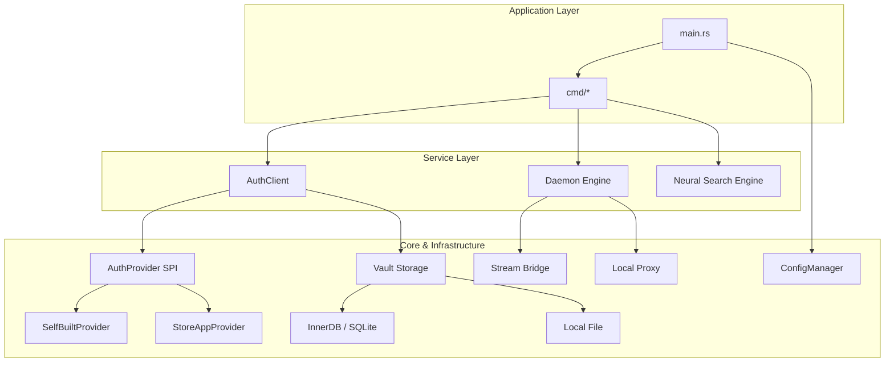

# cowen 架构设计 (Architecture v0.3.0)

本文档详细介绍了 `cowen` CLI 的核心设计理念、模块划分以及实现细节。本项目遵循 **TDD (测试驱动开发)** 与 **OCP (开闭原则)**。

## 🏛️ 总体架构

`cowen` 采用模块化分层架构，核心逻辑通过 Trait 进行抽象，确保了良好的可扩展性。

### 1. 核心模块说明

- **`core/`**: 基础基础设施。
    - **`config/`**: 基于 Profile 的多环境配置管理，支持多后端切换。
    - **`vault/`**: 安全凭据保险库，支持 AES-GCM 加密，绑定机器指纹。
    - **`telemetry/`**: 工业级结构化遥测系统，支持多域路由与滚动策略。
    - **`search/`**: 轻量级 AI 语义搜索，内置 ONNX 引擎 (BGE-small-zh)。
- **`auth/`**: 认证抽象层。
    - **`AuthProvider SPI`**: 遵循 OCP 原则设计的认证插件系统。新增认证模式只需实现 Trait，无需修改核心逻辑。
    - **`TokenPool`**: 自动维护 Token 生命周期，支持提前过期换票与并发冲突保护。
- **`daemon/`**: 守护进程引擎。
    - **`Stream Bridge`**: 基于 WebSocket 的实时消息桥接器。
    - **`Local Proxy`**: 自动注入安全头的反向代理服务器。
    - **`Renewer`**: 后台令牌自动刷新任务。

---

## 💾 存储设计 (Storage Evolution)

从 v0.3.0 开始，`cowen` 引入了可插拔的存储后端：

1. **InnerDB (默认)**: 基于 SQLite 的本地数据库，提供 ACID 特性，适合高并发 Daemon 场景下的状态持久化。
2. **Local YAML**: 传统的 YAML 文件存储，方便人工查阅，适用于简单测试环境。
3. **Remote DB**: 实验性支持 MySQL/PostgreSQL，用于集群部署或云端同步（开发中）。

---

## 🔍 语义搜索 (Neural Search)

`cowen api list -s "关键词"` 背后采用了本地嵌入技术：
- **模型**: BGE-small-zh-v1.5 (量化版 ONNX)。
- **推理**: 使用 `ort` (ONNX Runtime) 在本地 CPU 执行，无需联网。
- **缓存**: 首次搜索会自动构建本地向量索引，提升后续检索速度。

---

## 🛡️ 安全性保障

- **凭据脱敏**: 无论在 JSON 输出还是日志中，敏感字段（AppSecret, Token）都会被自动识别并应用掩码。
- **机器指纹**: Vault 密钥由 `machine-id` 派生，确保配置文件拷贝到另一台机器后无法直接解密。
- **审计留痕**: `audit.log` 记录所有经过 Proxy 或 CLI 发起的请求元数据。

---

## 🧪 开发与扩展

- **插件化认证**: 在 `src/auth/provider/` 中添加新文件并实现 `AuthProvider` Trait。
- **TDD 驱动**: 所有核心逻辑均配有 `*_test.rs`。修改代码前请确保 `cargo test` 能够通过。

---
© 2026 Chanjet Advanced Agentic Coding Team.
