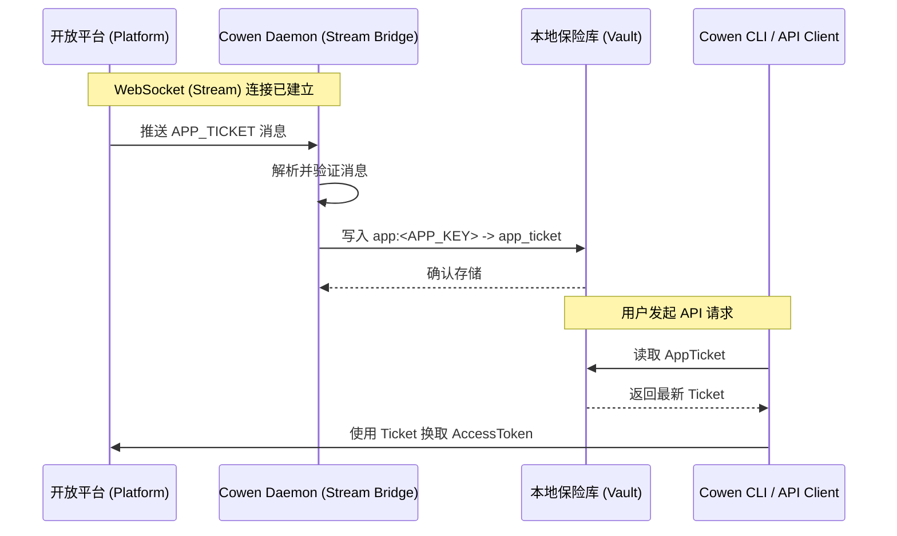
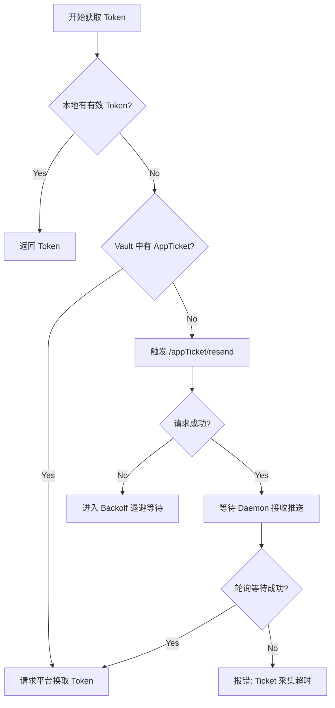

# AppTicket 管理机制文档

AppTicket 是畅捷通 (Chanjet) 开放平台安全架构中的核心凭证，主要用于在零信任环境下实现 **自建应用 (Self-Built)** 与 **商店应用 (StoreApp)** 的令牌自动化发放与刷新。

## 1. 基本概念

*   **定义**：AppTicket 是一个由平台生成的动态安全握手令牌。
*   **用途**：它是换取 `accessToken` 的必要前置参数。没有有效的 AppTicket，客户端无法通过 `appKey` + `appSecret` 获取令牌。
*   **安全特性**：AppTicket 具有时效性且由平台单向推送，增强了凭证泄露后的防御能力。

---

## 2. 工作原理

Cowen CLI 采用了 **“推拉结合”** 的混合模式来确保 AppTicket 的可靠性。

### 2.1 被动接收 (Push Mode) - 首选
这是 AppTicket 更新的标准路径：



---

### 2.2 主动补发 (Pull/Resend Mode) - 补偿
当本地缺失 Ticket 时触发的逻辑判定：




---

## 3. 存储架构

AppTicket 的存储由 `TokenPool` 与 `Vault` 共同管理。

*   **存储位置**：本地持久化存储（取决于配置的存储驱动，如 SQLite 或 YAML）。
*   **逻辑命名空间**：
    *   **Profile**：`app:<APP_KEY>` (例如 `app:666888`)。
    *   **Key**：`app_ticket` (内容) 和 `app_ticket_created` (时间戳)。
*   **共享机制**：由于 Ticket 是应用维度的，因此同一个 AppKey 下的不同 Profile 会共享同一个 AppTicket。

---

## 4. 生命周期

| 阶段 | 动作 | 触发源 |
| :--- | :--- | :--- |
| **初始化** | 首次 `cowen init` | 自动启动 `daemon` 并尝试补发 |
| **更新** | 平台推送 | 长期在线的 `daemon` 进程 |
| **使用** | 换取 Token | `cowen auth` 或 API 请求拦截器 |
| **刷新** | 定时检查 | 守护进程的 `maintenance_tick` (每分钟) |
| **销毁** | 清理凭证 | `cowen auth --clear` |

---

## 5. 状态监测与调试

### 5.1 查看状态
运行以下命令检查 Ticket 采集情况：
```bash
cowen system check
```
在输出结果的 **Authentication** 模块中，可以看到 `AppTicket` 的状态（就绪/缺失）。

### 5.2 强制触发推送
如果一直无法收到 Ticket，可以尝试强制请求：
```bash
cowen auth --trigger-push
```

### 5.3 常见状态码
*   **409 Conflict**：表示请求过于频繁，触发了平台的频率限制。
*   **401 Unauthorized**：AppKey 或 AppSecret 配置错误，平台拒绝生成 Ticket。

---

## 6. 常见问题 (FAQ)

**Q: 为什么我必须启动 `daemon` 才能获取 Token？**
A: 因为 AppTicket 是通过流式通道下发的。如果 `daemon` 未运行，网关无法接收到这个动态握手凭证。

**Q: AppTicket 会过期吗？**
A: 会。但系统会在 Ticket 过期前通过推送机制自动更新。只要保证 `daemon` 长期在线，用户无需关心过期问题。

**Q: 手动从平台控制台复制 Ticket 可以吗？**
A: 不建议。Cowen 旨在自动化管理。手动干预可能导致本地状态与平台流同步冲突。建议始终使用 `daemon` 自动采集。
