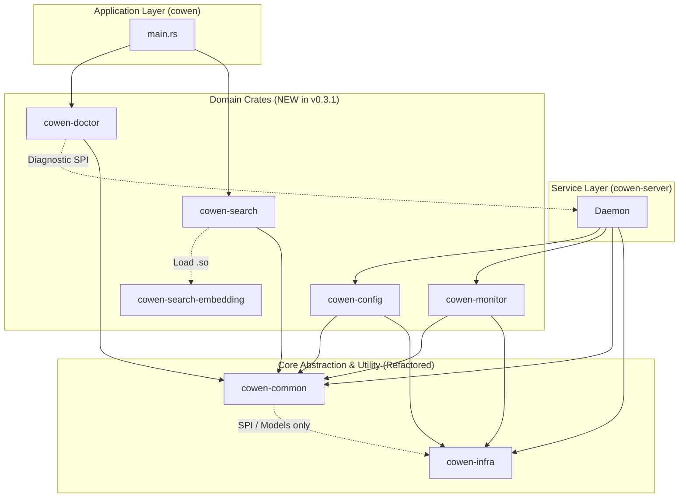

# cli/cowen v0.3.1 概要设计 (HLD)

## 1. 架构目标
v0.3.1 在 v0.3.0 的基础上，通过增强核心引擎的可观测性和灵活性，进一步提升其在复杂生产环境下的表现。同时，引入**严格的物理边界（内部 Crate 分离与去上帝化重构）**，彻底消除“大泥球 (Big Ball of Mud)”的架构衰退风险。

## 2. 变更视图 (System Changes)

### 2.1 模块关系与 Crate 物理边界图

## 3. 核心功能设计 (Feature Design)

### 3.1 配置热重载 (cowen-config)
*   **架构变更**: 
    *   将原有的配置解析逻辑剥离为独立的 `cowen-config` crate。
    *   在其中封装 `notify`，提供跨平台的 YAML 配置监听。
*   **并发策略**: 
    *   暴露 `tokio::sync::watch::Receiver<Config>` 给下游（如 Daemon）。
    *   确保业务层完全不需要关心配置是如何加载和监听的，做到单向数据流。

### 3.2 监控与健康 API (cowen-monitor)
*   **架构变更**: 
    *   新建 `cowen-monitor` crate，封装 `prometheus` 注册表与 Axum 的 `/health`、`/metrics` 路由。
    *   对外暴露声明式的宏（如 `record_proxy_request!()`）供其他 Crate 埋点，保持极低的侵入性。
*   **隔离策略**: 
    *   它独立启动在自己的 Tokio 任务中，仅监听 `127.0.0.1`。

### 3.3 环境自检工具 (cowen-doctor)
*   **架构变更**: 
    *   新建 `cowen-doctor` crate，定义 `Diagnostic` SPI。
    *   作为诊断调度台，支持并发执行多个检查器并聚合结果。
*   **隔离策略**: 
    *   控制反转：`cowen-doctor` 不依赖任何业务逻辑包，而是提供注册接口，由主程序将针对数据库或网络的具体检查器注入进来。

### 3.4 API 搜索插件化 (cowen-search / cowen-search-embedding)
*   **架构变更**: 
    *   彻底拆分，新建极简的 `cowen-search` crate，定义 `SearchProvider` Trait 及其内部实现的字符串匹配。
    *   新建重量级的 `cowen-search-embedding` crate，包含所有的 ONNX 模型及深度学习依赖。
*   **加载逻辑**: 
    1.  **自动发现**: 启动时，`cowen-search` 会扫描配置目录，识别符合当前平台规范（macOS: `.dylib/.so`, Linux: `.so`, Windows: `.dll`）的动态库。
    2.  **显式生效**: 根据配置 `search.plugins.enabled`，系统加载对应的库（编译为动态库）。
    3.  **动态绑定**: 使用 `libloading` 在运行时动态加载符号（ABI 导出 `v1_init`, `v1_free`）。
    4.  **按需触发**: 当且仅当插件被显式生效时，触发索引构建。
    5.  **优雅降级**: 若插件库不存在、无法加载或索引为空，系统自动降级到内置的 `string_matching` 实现。

### 3.5 DLQ 存储异常 Panic 防护 (cowen-server)
*   **架构变更**:
    *   重构 `Forwarder` 和 `DlqStore` 的异常创建机制，将 DLQ 存储的连接/解析失败提升为 `Result` 错误类型传播。
*   **优雅降级与防御策略**:
    *   调用方（[bridge.rs](file:///Users/zhangliang/chanjet/dev/workspace/open-streaming-connector/cli/cowen/crates/cowen-server/src/cmd/bridge.rs) 与 [dlq.rs](file:///Users/zhangliang/chanjet/dev/workspace/open-streaming-connector/cli/cowen/src/cmd/dlq.rs)）捕获错误，输出清晰的致命级别错误日志并安全平滑退出，阻止未定义 Panic 向上波及主守护进程引起进程闪退崩溃。

### 3.6 智能动态 Token 检查与刷新策略 (cowen-server / cowen-auth)
*   **架构变更**:
    *   废弃硬编码的 10 分钟轮询睡眠机制（`sleep(600)`），根据当前 AccessToken 的剩余有效周期自适应计算延迟步长。
*   **自适应与抖动策略**:
    *   采用 `(expires_at - now) * 0.8` 作为自适应步长，设置 `30s` 最小周期和 `3600s` 最大周期防御边界。
    *   引入 `±rand(0..60)` 秒的随机 Jitter 抖动，从网络与时钟分发层面彻底消除 thundering herd 惊群效应。

### 3.7 核心依赖去上帝化重构 (cowen-common / cowen-infra)
*   **架构变更**:
    *   将历史遗留的上帝 common 模块彻底分拆，进行职责极简化：
        1.  `cowen-common`: 仅承载最基础的核心数据模型（Models）与最小化的接口契约/SPI（Traits），退化为完全稳定的声明式依赖层。
        2.  `cowen-infra`: 新设基础工具级 Crate，下沉系统底层工具（如 obfuscation、文件目录路径、基础网络 helper、通用时间转换）等工具类实现逻辑。
*   **物理依赖隔离策略**:
    *   彻底切断并剥离 `cowen-common` 中可能导致高层反向循环引用的网络客户端与业务组件，形成清爽、低耦合的网状依赖树，满足全工程物理隔离编译标准。

## 4. 非功能性设计 (NFRs)
*   **架构健康**: 物理层面的 Crate 隔离确保编译时就能阻断循环依赖。
*   **性能**: 监控采集采用非阻塞方式，对业务流量（Proxy）的影响应小于 1%。
*   **隔离性**: 配置文件重载失败不应导致正在运行的 Daemon 崩溃，需回滚至旧配置。
*   **安全性**: 管理 API 必须严格绑定在 `127.0.0.1`，禁止外网访问。涉及敏感数据时，在相关文档和代码配置中做脱敏保护。
*   **系统稳定性与自愈开销**: 
    *   DLQ 数据库死锁或文件锁死时，系统能优雅报错并退场，且对正常的数据库请求进行错误上报防御。
    *   动态 Token 自适应延迟极大地降低了长效凭证（如 7天、2小时）的磁盘与网络空转开销（降低 >80%），同时确保了短效凭证的即时续约。
