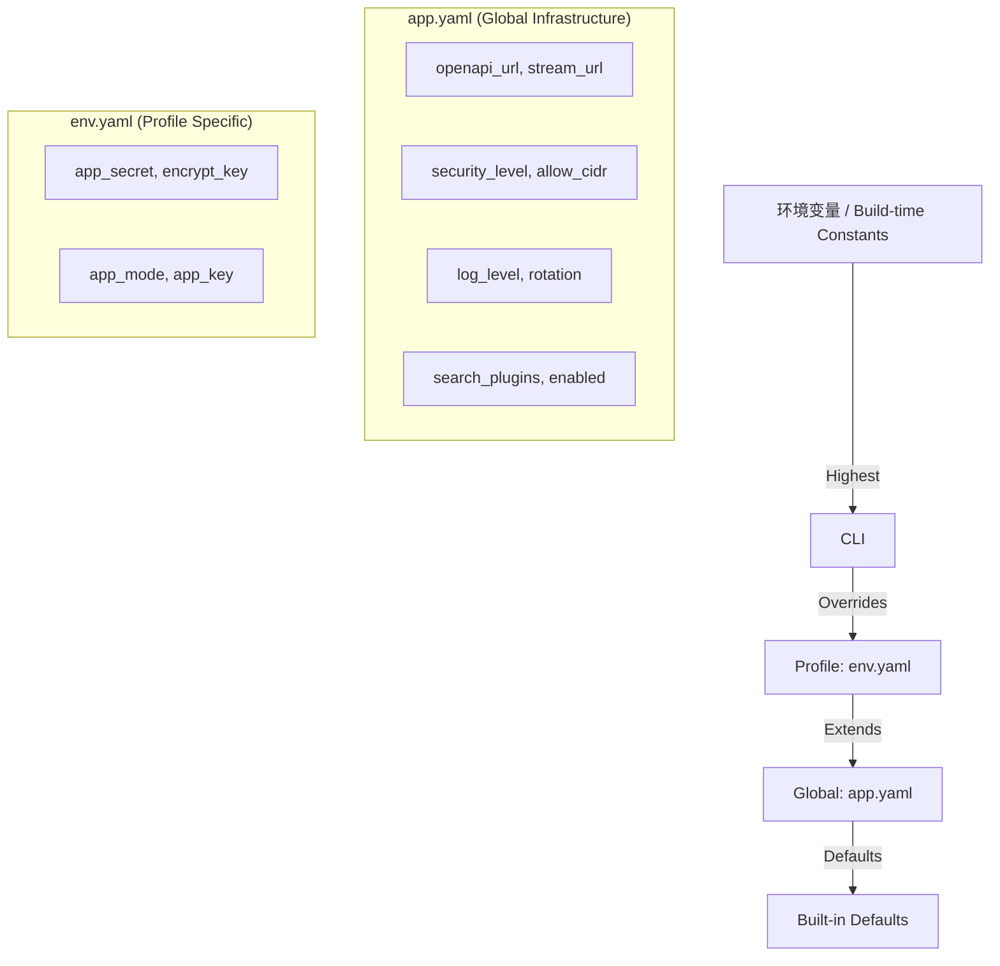

# cli/cowen v0.3.5 概要设计 (HLD)

> **版本**: v0.3.5
> **阶段**: Architecture Blueprint
> **状态**: `DRAFT`

## 1. 系统上下文与层级配置视图 (System Context & Configuration Hierarchy)
v0.3.5 引入了分层配置模型，实现了基础设施与业务环境配置的彻底物理隔离。

## 2. 核心架构设计 (Core Architecture Design)

### 2.1 分层配置寻址 (Layered Configuration)
*   **抽象模型**: 引入 `ConfigLayer` 概念。配置查询不再直接面向文件，而是面向一个聚合的加载器。
*   **隔离原则**: 
    *   **Global Layer**: 承载跨 Profile 的基础设施配置（网络、安全、日志）。
    *   **Profile Layer**: 承载敏感的身份凭证（Secret, Key）。
*   **寻址策略**: 严格单向寻址。Profile 级别禁止重定义全局参数，ConfigManager 强制执行此边界。

### 2.2 构建期常量注入 (Build-time Metadata)
*   **注入机制**: 利用 Cargo 的 `build.rs` 钩子，将外部环境变量映射为编译期环境变量 (`cargo:rustc-env`)。
*   **强约束检查**: 在 `build.rs` 中实施预校验。关键元数据（如 `<CLIENT_ID>`）缺失时，触发 `panic!` 中断构建流程，确保交付产物的确定性。
*   **透明度**: 元数据通过标准的 `const` 导出，支持在 `cowen version --debug` 中统一展示。

### 2.3 插件化系统重置 (Modular Resettable System)
*   **设计模式**: 采用插件注册模式（OCP）。
*   **组件契约**: 定义 `Resettable` SPI。每个状态化组件（Vault, Store, Telemetry, Config）需实现该接口，并声明其管理的所有物理资源（文件、表）。
*   **双相调度**: 
    *   **Phase 1 (Discovery)**: 调度器收集所有组件的待删除清单，支持 Dry Run 预览。
    *   **Phase 2 (Execution)**: 执行原子级的物理清理操作。

## 3. 非功能性需求设计 (NFRs)

### 3.1 健壮性 (Robustness)
*   **IPC 稳定性**: 尽管配置结构调整，UDS 路径生成算法需保持幂等性，且路径 Hash 算法需覆盖用户自定义 `app_dir` 的极端场景。
*   **构建安全性**: 杜绝源码中出现任何生产环境敏感 URL 的字面量。

### 3.2 易用性 (Usability)
*   **无感迁移**: 首次启动时自动识别旧版本配置，根据“当前 Profile 优先”原则自动填充全局 `app.yaml` 并清理 Profile 冗余项。
*   **可预测性**: 通过 `cowen reset --dry-run` 为破坏性操作提供确定性预览。

### 3.3 安全性 (Security)
*   **配置脱敏**: 敏感数据（app_secret）在迁移过程中必须保持在加密存储或受保护的 Profile 目录中，严禁泄露至全局配置文件。

## 4. 架构决策记录 (ADR)

*   **ADR-005**: 选用 `env!()` 宏进行参数获取，而非运行时读取环境变量，是为了保证交付产物的“固化性”，防止运行时环境污染导致的行为不一致。
*   **ADR-006**: 强制 Profile 级别禁用全局参数，而非简单的 Deep Merge，是为了降低配置系统的认知复杂度和排障难度。

## 5. 执行边界 (Implementation Boundaries)
*   **禁止**: 在 LLD 之前开始任何具体的 `build.rs` 复杂逻辑编写。
*   **必须**: 在 LLD 中明确 `Resettable` Trait 的 `dry_run` 方法返回格式（推荐 `Vec<String>` 指明路径或资源 ID）。
*   **必须**: 迁移脚本执行时须输出标准化的迁移日志，清晰体现上移与废弃的配置项明细。
*   **必须**: 严格遵循环境变量命名空间规范：编译期注入前缀为 `COWEN_BUILD_*`，运行时覆盖前缀为 `COWEN_GLOBAL_*`。
