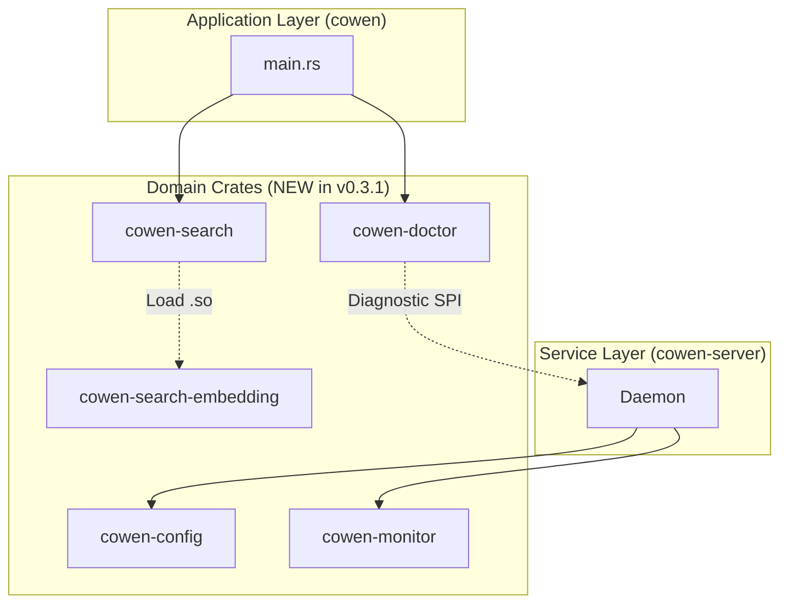

# cli/cowen v0.3.1 概要设计 (HLD)

## 1. 架构目标
v0.3.1 在 v0.3.0 的基础上，通过增强核心引擎的可观测性和灵活性，进一步提升其在复杂生产环境下的表现。同时，引入**严格的物理边界（内部 Crate 分离）**，彻底消除“大泥球 (Big Ball of Mud)”的架构衰退风险。

## 2. 变更视图 (System Changes)

### 2.1 模块关系与 Crate 物理边界图

## 3. 核心功能设计 (Feature Design)

### 3.1 配置热重载 (cowen-config)
*   **架构变更**: 
    *   将原有的配置解析逻辑剥离为独立的 `cowen-config` crate。
    *   在其中封装 `notify`，提供跨平台的 YAML 配置监听。
*   **并发策略**: 
    *   暴露 `tokio::sync::watch::Receiver<Config>` 给下游（如 Daemon）。
    *   确保业务层完全不需要关心配置是如何加载和监听的，做到单向数据流。

### 3.2 监控与健康 API (cowen-monitor)
*   **架构变更**: 
    *   新建 `cowen-monitor` crate，封装 `prometheus` 注册表与 Axum 的 `/health`、`/metrics` 路由。
    *   对外暴露声明式的宏（如 `record_proxy_request!()`）供其他 Crate 埋点，保持极低的侵入性。
*   **隔离策略**: 
    *   它独立启动在自己的 Tokio 任务中，仅监听 `127.0.0.1`。

### 3.3 环境自检工具 (cowen-doctor)
*   **架构变更**: 
    *   新建 `cowen-doctor` crate，定义 `Diagnostic` SPI。
    *   作为诊断调度台，支持并发执行多个检查器并聚合结果。
*   **隔离策略**: 
    *   控制反转：`cowen-doctor` 不依赖任何业务逻辑包，而是提供注册接口，由主程序将针对数据库或网络的具体检查器注入进来。

### 3.4 API 搜索插件化 (cowen-search / cowen-search-embedding)
*   **架构变更**: 
    *   彻底拆分，新建极简的 `cowen-search` crate，定义 `SearchProvider` Trait 及其内部实现的字符串匹配。
    *   新建重量级的 `cowen-search-embedding` crate，包含所有的 ONNX 模型及深度学习依赖。
*   **加载逻辑**: 
    1. 根据 `search_engine` 配置项，若为 `string_matching`，则直接调用 `cowen-search` 中的内置实现。
    2. 若为 `embedding_search`，`cowen-search` 使用 `libloading` 在运行时动态加载 `libcowen_search_embedding`（编译为动态库）。
    3. 发生错误时，优雅降级。

## 4. 非功能性设计 (NFRs)
*   **架构健康**: 物理层面的 Crate 隔离确保编译时就能阻断循环依赖。
*   **性能**: 监控采集采用非阻塞方式，对业务流量（Proxy）的影响应小于 1%。
*   **隔离性**: 配置文件重载失败不应导致正在运行的 Daemon 崩溃，需回滚至旧配置。
*   **安全性**: 管理接口禁止任何跨站或外部访问。
