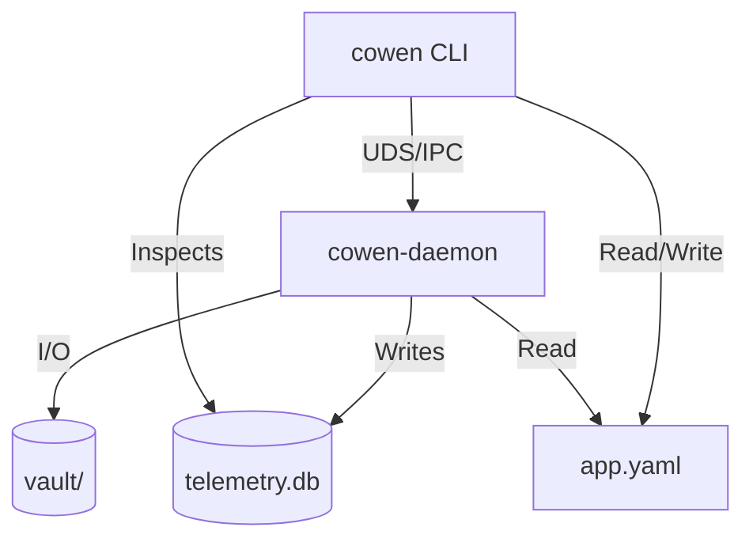

# cli/cowen v0.3.4 概要设计 (HLD)

> **版本**: v0.3.4
> **阶段**: Architecture Blueprint
> **状态**: `APPROVED`

## 1. 系统上下文与依赖拓扑 (System Context & Topology)
v0.3.4 引入了物理上的进程解耦，将原本单进程内部的模块转换为跨进程的 IPC 通信。

## 2. 核心模块设计 (Core Module Design)

### 2.1 独立守护进程 (Standalone Daemon)
*   **物理形式**: 独立的 `cowen-daemon` 二进制。
*   **启动机制**: CLI 发现守护进程未运行且收到相关指令时，执行 `Command::new("cowen-daemon").spawn()`。
*   **同步协议**: 初始版本采用 **Unix Domain Socket**。消息格式使用简单的 JSON-RPC-like 协议。

### 2.2 诊断与观测模块 (cowen-telemetry)
*   **架构**: 异步事件监听器，负责捕获系统运行时的各类状态指标。
*   **持久化**: 采用本地关系型数据库存储，实现故障现场的持久化复盘能力。
*   **清理逻辑**: 依赖自动滚动清理机制，基于时间与容量双重阈值定期回收过时轨迹数据。

### 2.3 配置分发策略模式 (ConfigStrategy)
*   **抽象定义**: 定义标准配置策略接口 (SPI)，统一不同存储/缓存后端的操作契约。
*   **动态分发**: 配置管理器基于路径前缀实施动态分发，底层通过映射表路由至对应的具体策略实现类。

### 2.4 并发诊断插件模型 (Doctor Plugins)
*   **注册机制**: 采用编译期静态注册。各检测项通过标准元数据定义注入全局检测池。
*   **并行执行**: 诊断调度主循环支持任务的并发分发与异步执行，旨在消除长耗时检测项对整体流程的阻塞。

## 3. 部署与物理视图 (Deployment Architecture)
*   **交付产物**: `cowen` (CLI), `cowen-daemon` (Service)。
*   **安装路径**: 默认安装于 `/usr/local/bin/`。
*   **工作目录**: `~/.cowen/`
    *   `telemetry.db`: 诊断数据库。
    *   `uds.sock`: Unix Domain Socket 文件。
    *   `vault/`: 存储分级目录。

## 4. 非功能性需求设计 (NFRs)

### 4.1 可观测性 (Observability)
*   **故障轨迹**: 支持通过 `cowen events` 查看过去 15 天的 Worker 状态机变迁与异常记录。
*   **日志系统**: CLI 与 Daemon 拥有独立的日志文件，分别记录在 `logs/cli.log` 和 `logs/daemon.log`。

### 4.2 高可用与稳定性 (HA & Performance)
*   **进程自愈**: CLI 在执行任何业务命令前，若发现 UDS 连接失败，将尝试自动重启 `cowen-daemon`。
*   **存储开销**: `telemetry.db` 设置 WAL 模式，确保并发读写性能。通过滚动清理控制文件大小不超过 100MB。

### 4.3 安全性 (Security)
*   **IPC 授权**: UDS 文件权限限制为当前用户（`0600`），防止多用户环境下的非法越权操作。
*   **SSRF 级别**: 核心 Forwarder 引入 `SecurityLevel` 过滤器，`Strict` 模式作为代码级默认值。

## 5. 架构决策记录 (ADR)
*   **ADR-003**: 选用 UDS 而非 HTTP 进行 IPC，是为了消除网络权限（如 macOS 弹出网络允许窗口）的干扰并提供文件级安全。
*   **ADR-004**: 诊断数据选用持久化存储而非单纯日志，是为了支持 CLI 侧的交互式历史分析功能。
