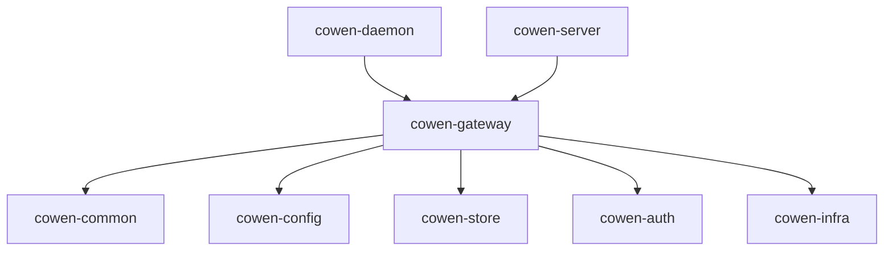

# LLD v0.5.0 - Identity-Aware Gateway (执行级蓝图设计)

## 1. 物理模型契约 (Physical Model Contracts)

### 1.1 YAML 配置声明模型 (Configuration Schema)
```yaml
# 向下完全兼容的平铺结构，由 --config 或 --profile 指定的特定环境加载
proxy_port: 8081  # 透明正向出口代理端口 (Egress)
webhook_target: "http://127.0.0.1:5000/callback" # 长链接异步业务消息接收地址

gateway:
  bind_address: "0.0.0.0:8080"
  upstream_url: "http://127.0.0.1:3000"
  auth_sync_hook: "http://127.0.0.1:3000/internal/auth-hook" # 第一轨换票阻塞同步回调
  auth_routing:
    mode: "PERMISSIVE"  # STRICT | PERMISSIVE
    require_rules: ["/api/**", "/invoice/**"]
    bypass_rules: []
    
apply_plugins:
  - "token-exporter"
```

### 1.2 JWE (JSON Web Encryption) 载荷状态机
```json
// Header
{
  "alg": "dir",
  "enc": "A256GCM",
  "kid": "key_uuid_123"
}
// Payload (解密后内容)
{
  "org_id": "org_123",
  "user_id": "user_456",
  "open_token": "bearer_xxx_yyy",
  "idle_exp": 1718101800, // 滑动过期 (当前时间 + 30m)
  "abs_exp": 1718186400,  // 绝对过期 (通常为 24h)
  "fp": "sha256(Client_IP + User_Agent)" // 指纹加固
}
```

### 1.3 JWKS Store 持久化模型
**键值**: `cowen:system:jwks` (在 Redis 或 MySQL 中)
**格式**:
```json
{
  "keys": [
    {
      "kid": "key_uuid_123",
      "kty": "oct",
      "k": "base64_url_encoded_256bit_key",
      "created_at": 1717200000,
      "status": "ACTIVE"  // 唯一签发态
    },
    {
      "kid": "key_uuid_000",
      "status": "ROTATED" // 历史解密态
    }
  ]
}
```

## 2. 确定性逻辑算子 (Deterministic Logic Operators)

### 2.1 Ingress 入流量全局拦截与清洗算子 (Ingress Operator)
**输入**: HTTP Request `Req`
**输出**: HTTP Response

1. **[CORS 预检穿透]**:
   `IF Req.method == "OPTIONS" THEN RETURN HTTP 200/204 放行给后端;`
   - 注意：CORS 响应头（`Access-Control-Allow-Origin`、`Access-Control-Allow-Credentials` 等）**由 Cowen 网关统一追加**，不再透传给后端处理。
   - 预检响应自动携带 `Access-Control-Allow-Origin: <Origin>`（回显请求中的 Origin）、`Access-Control-Allow-Credentials: true`（配合 withCredentials 规范）、`Access-Control-Allow-Methods: GET,POST,PUT,DELETE,PATCH,OPTIONS`、`Access-Control-Allow-Headers: Content-Type,Authorization,X-Org-Id,X-User-Id`。
2. **[全局 Code 拦截优先权]**:
   `IF Req.query 包含 'code' THEN`:
   a. 请求开放平台换取 `open_token`.
   b. `IF auth_sync_hook 被配置 THEN`:
      - 阻塞调用 `POST auth_sync_hook` (附带 org_id, user_id).
      - 从 Webhook 响应提取 `Set-Cookie` (保存为 `isv_cookie`).
   c. 生成新的 `JWE Payload`，通过 Store 中 ACTIVE 的 `kid` 密钥加密。
   d. 生成去除 `code` 参数后的 URL (`Clean_URL`).
   e. 构造 `HTTP 302 Redirect` 至 `Clean_URL`。
   f. 在响应头附加 `Set-Cookie: cowen_sess_id=<JWE>; HttpOnly; Secure; SameSite=Lax`.
   g. `IF sync_hook 存在 isv_cookie THEN` 附加下发业务 Cookie.
   h. `RETURN`.
3. **[黑白名单路由决断]**:
   a. `IF (mode == STRICT AND Req.path 在 bypass_rules 中) OR (mode == PERMISSIVE AND Req.path 不在 require_rules 中) THEN is_auth_required = false;`
   b. `ELSE is_auth_required = true;`
4. **[会话自省与校验] (leeway_secs = 0, 零容忍时钟漂移)**:
   a. `EXTRACT JWE` 从 `Req.cookies.cowen_sess_id`.
   b. `IF 提取失败 OR 解密失败 OR fp() != JWE.fp THEN`:
      - `IF is_auth_required == false THEN` 继续第5步 (无状态放行).
      - `ELSE IF Req.headers.Accept == "application/json" THEN RETURN HTTP 401 (附带 login_url)`.
      - `ELSE RETURN HTTP 302 (附带 state = Req.path) 至免登地址`.
   c. `IF now() > JWE.abs_exp OR now() > JWE.idle_exp THEN` 判定为超时，执行上一步的 401/302 拦截.
      - 注意：此处不做任何 `leeway` 容忍补偿，时间比较直接使用 `>`（不含等号边界补偿），强制运维侧配置 NTP.
5. **[双时间戳离散滑动续期] (仅当 JWE 合法时)**:
   a. 计算剩余空闲时间: `remaining = JWE.idle_exp - now()`.
   b. **安全区 (免刷新)**：`IF remaining > 10min THEN` 不刷新，不修改 Cookie，直接进入步骤 6.
   c. **临期阈值区 (触发刷新)**：`IF 0 < remaining ≤ 10min THEN`:
      - 触发刷新：基于旧载荷，重写 `idle_exp = now() + 30m`，生成 `New_JWE`。
      - 挂载 Hook：当 Proxy 将后端响应返回给前端时，在 Response Header 追加 `Set-Cookie: cowen_sess_id=<New_JWE>`.
   d. **空闲超时失效**：步骤 4.c 中已处理 `IF now() > JWE.idle_exp` 的 401/302 拦截.
6. **[上下游透传]**:
   a. `IF JWE 合法 THEN` 追加请求头:
      - `x-org-id: JWE.org_id`
      - `x-user-id: JWE.user_id`
   b. `IF token-exporter 插件被启用 THEN` 追加 `X-Cowen-Open-Token` 和 Host Vault 参数。
   c. 将请求 Proxy 转发给 `upstream_url`。

### 2.2 Egress Native Proxy 算子
**角色**: 作为 `127.0.0.1:8081` 监听的正向代理
1. 接收 ISV 发来的对外请求。
2. 提取 `Req.headers.x-org-id` 和 `Req.headers.x-user-id`。
3. 以 `hash(x-org-id + x-user-id)` 为 Key，从本地进程内存的会话缓存中查找对应的 JWE。
4. 解密 JWE 获取真实的 `open_token`。
5. 拼装标头 `Authorization: Bearer <open_token>` 并改写目标地址至开放平台实际网关。
6. 执行网络调用并原样返回结果给 ISV。

### 2.3 自治密钥轮转算子 (JWKS Rotation Operator)
**触发条件**: 进程启动时 / 周期性后台协程 (每小时)
1. `GET cowen:system:jwks FROM Store`
2. 查找状态为 `ACTIVE` 的 key。
3. `IF active_key 不存在 OR now() - active_key.created_at >= 30_days THEN`:
   a. 尝试获取分布式锁 `lock:jwks_rotate`.
   b. 获取锁成功后，再次 Check 避免并发修改。
   c. 将原有 ACTIVE 变为 ROTATED。
   d. 生成随机 256bit 串 `New_Key` 和新 UUID `kid`，状态置为 ACTIVE，Push 进列表。
   e. 原子的 `SET` 回 Store，并通知本地内存更新。
   f. 释放锁。

## 3. 健壮性重试矩阵 (Robustness Retry Matrix)

| 动作类型 (Action) | 异常分类 (Error Scenario) | 重试模型 (Mathematical Model) | 降级兜底行为 (Fallback) |
| :--- | :--- | :--- | :--- |
| **IdP 换取 Token** | 开放平台 500/502/503 | `Exponential(base=100ms, max=2s, retries=3)` | 阻断入口并返回 HTTP 502，提示用户重试。 |
| **Sync Hook 调用** | ISV Webhook 响应超时/500 | `Linear(interval=200ms, retries=2)` | 降级处理：**忽略 Webhook**，仅下发网关侧 `cowen_sess_id` 的 302 洗白跳转（降级为第二轨 Pull 模式）。 |
| **获取/刷新 JWKS** | Store 网络断开/读写超时 | `Exponential(base=50ms, max=1s, retries=5)` | 内存中只要有存量 Keys 则无视网络报错；若内存空且重试穷尽，阻塞所有流量，响应 500。 |

## 4. 原子化方法签名 (Atomic Method Signatures)

```rust
// Ingress 引擎入口点
pub async fn evaluate_ingress_pipeline(req: &HttpRequest, cfg: &GatewayConfig) -> GatewayResult;

// JWE 核心加解密组件
pub fn generate_fingerprint(req: &HttpRequest) -> String;
pub fn encrypt_session(payload: &SessionPayload, jwks: &JwksManager) -> Result<String, CryptoError>;
pub fn decrypt_session(cookie_val: &str, jwks: &JwksManager) -> Result<SessionPayload, CryptoError>;

// Sync Hook 适配器
pub async fn invoke_isv_webhook(url: &str, user_ctx: &UserContext) -> Result<Vec<Cookie>, WebhookError>;

// 离散滑动窗口评判
pub fn should_refresh_session(jwe: &SessionPayload, threshold_secs: i64) -> bool;

// State 编码与免登 URL 构造
pub fn encode_state(redirect_to: &str, app_secret: &str) -> String;
pub fn decode_and_verify_state(state: &str, app_secret: &str, max_age_secs: i64) -> Result<String, StateError>;
pub fn build_login_url(redirect_to: &str, app_key: &str, app_secret: &str) -> String;

// 配置合并
pub fn merge_env_overrides(yaml_root: &mut ConfigNode, env_map: &HashMap<String, String>);
```

## 5. TDD 验证契约 (TDD Verification Contracts)

1. **[Code 全局拦截]**
   - **Given** URL = `/public/page?code=123` 且命中 Bypass (白名单).
   - **When** 收到请求.
   - **Then** 断言未透传给后端 -> 断言发起了 IdP 换票 -> 断言响应是 302 `/public/page` -> 断言存在 `Set-Cookie: cowen_sess_id`.
2. **[离散续期与双向 Cookie 下发]**
   - **Given** 处于临期区（idle_exp 剩余 < 10min）且 fp 指纹匹配的合法请求.
   - **When** Ingress Operator 执行完毕.
   - **Then** 断言透传头含 `x-org-id` -> 断言网关挂载了拦截回调 -> 断言最终发给浏览器的 HTTP 响应中存在刷新了 `idle_exp` 的 `Set-Cookie: cowen_sess_id`.
3. **[黑白名单降级与 CORS 适配]**
   - **Given** Header `Accept: application/json` 且无会话的未授权请求命中 Require 黑名单.
   - **When** 执行路由解析.
   - **Then** 断言无 302 发生 -> 断言响应 401 并在 Body 中提供 `login_url`.
4. **[指纹防盗刷截断]**
   - **Given** 拥有合法有效期 JWE 载荷的 Cookie，但其签发时的 `IP_HASH` 与当前请求 `IP` 不一致.
   - **When** JWE 解密算子验证.
   - **Then** 断言 `fp` 匹配失败 -> 断言视同未登录，阻断并要求重新授权。
5. **[Sync Hook 降级]**
   - **Given** 开启 Sync Hook，但对应的 webhook_url 模拟 500 宕机.
   - **When** Code 拦截完成，尝试回调 ISV.
   - **Then** 断言在重试 2 次后 -> 断言网关不抛出异常 -> 断言依旧成功下发 302 和网关 Cookie (优雅降级).
6. **[Egress 代理转发]**
   - **Given** ISV 后端通过 `127.0.0.1:8081` 代理发出 `GET /v1/invoice/list` 请求，Header 携带 `x-org-id: org_123` 和 `x-user-id: user_456`，且进程内存中存在对应会话缓存.
   - **When** Egress Operator 拦截到请求.
   - **Then** 断言以 `hash(x-org-id + x-user-id)` 定位到缓存 -> 断言解密 JWE 取出 `open_token` -> 断言转发的请求中携带 `Authorization: Bearer <open_token>` -> 断言目标 Host 被改写为开放平台网关地址.
7. **[JWKS 密钥轮转并发安全]**
   - **Given** 两个 Pod 实例同时检测到 Active Key 已过期 30 天.
   - **When** 双方同时尝试获取分布式锁 `lock:jwks_rotate`.
   - **Then** 断言仅一方获取锁成功 -> 断言成功方原子替换 JWKS -> 断言失败方重新读取 Store 后获得新密钥.
8. **[配置合并优先级]**
   - **Given** YAML 配置中 `gateway.bind_address = "0.0.0.0:8080"`，环境变量 `COWEN_GATEWAY_BIND_ADDRESS = "127.0.0.1:9090"`.
   - **When** 网关启动并加载配置.
   - **Then** 断言最终生效值为 `127.0.0.1:9090`（环境变量绝对优先覆盖物理文件）.
9. **[滑动窗口安全区免刷新]**
   - **Given** 合法 JWE 载荷 `idle_exp = now() + 25min`（剩余 25min > 阈值 10min）.
   - **When** Ingress Operator 执行到滑动续期判断.
   - **Then** 断言 `should_refresh_session()` 返回 `false` -> 断言未生成新 JWE -> 断言最终 HTTP 响应中无 `Set-Cookie: cowen_sess_id` -> 断言请求正常透传给后端.
10. **[Egress 代理 401 自动重放]**
   - **Given** ISV 通过 Egress 代理请求开放平台 API，open_token 有效，但目标 API 返回 HTTP 401.
   - **When** Egress Operator 收到 401 响应.
   - **Then** 断言触发了 refresh_token 同步刷新 -> 断言刷新成功后以新 Token 重放了原始请求 -> 断言最终返回给 ISV 的是重放后的成功响应 -> 断言仅重试 1 次.
11. **[Egress 代理 Token 刷新失败回退]**
   - **Given** ISV 通过 Egress 代理请求开放平台 API，open_token 已过期且 refresh_token 也失效.
   - **When** Egress Operator 尝试刷新 Token.
   - **Then** 断言 refresh_token 调用失败 -> 断言未重放原始请求 -> 断言返回 HTTP 401 + 错误码 `GW_EGRESS_TOKEN_EXPIRED` -> 断言不进入无限重试循环.
12. **[State 防篡改校验]**
   - **Given** 用户访问 `/api/invoice`，网关生成 state 并 302 至开放平台登录页，攻击者篡改了 state 中的 `redirect_to` 字段.
   - **When** 开放平台回调时携带篡改后的 state.
   - **Then** 断言 HMAC 签名校验失败 -> 断言返回 HTTP 400 -> 断言未执行 302 跳转（防止 Open Redirect 攻击）.
13. **[白名单路由身份顺手注入]**
   - **Given** URL = `/public/home` 命中 bypass_rules，请求携带合法的 `cowen_sess_id`.
   - **When** Ingress Operator 执行.
   - **Then** 断言 `is_auth_required == false` -> 断言请求透传给了后端 -> 断言透传请求的 Header 中包含 `x-org-id` 和 `x-user-id`（顺手注入）.
14. **[白名单路由无 Session 静默放行]**
   - **Given** URL = `/public/home` 命中 bypass_rules，请求无 `cowen_sess_id`.
   - **When** Ingress Operator 执行.
   - **Then** 断言 `is_auth_required == false` -> 断言请求透传给了后端 -> 断言透传请求的 Header 中不包含 `x-org-id`（无 Session 则不注入） -> 断言无 401/302 发生.

## 6. 启动与初始化流程 (Bootstrap & Initialization)

### 6.1 启动顺序
Gateway 模块作为 `cowen-daemon` 的子模块启动，遵循严格的线性初始化序列：

```
1. 配置加载 (Config Bootstrap)
   ├── 读取物理 YAML 文件 (--config 或 COWEN_CONFIG_PATH)
   ├── 解析当前 --profile 对应的 Profile 级 gateway 配置块
   ├── 扫描 COWEN_ 前缀环境变量，在内存中执行覆盖合并
   └── 校验 mandatory 字段 (bind_address, upstream_url)

2. Store SPI 连通性验证
   ├── 根据 Profile 配置初始化 Store 连接 (Redis/MySQL/SQLite)
   └── 执行 Ping 探针，失败则 Fatal 退出

3. JWKS 密钥初始化
   ├── GET cowen:system:jwks FROM Store
   ├── 若不存在或 Active Key 已过期 -> 触发 §2.3 密钥轮转算子
   ├── 将 JWKS 加载到本地内存缓存 (Arc<RwLock<JwksSet>>)
   └── 若 Store 不可达且内存为空 -> Fatal 退出

4. WASM 插件加载 (可选)
   ├── 遍历 apply_plugins 列表
   ├── 从插件目录加载 .wasm 文件，实例化沙盒运行时
   └── 调用插件 init() 钩子，注入 Host Vault API 引用

5. 端口绑定与监听
   ├── Ingress: 绑定 bind_address (如 0.0.0.0:8080) 启动 HTTP Server
   ├── Egress: 绑定 127.0.0.1:proxy_port (如 8081) 启动正向代理 Server
   └── 注册优雅关闭信号处理器 (SIGTERM/SIGINT)

6. 就绪探针 (Readiness Probe)
   └── 启动后暴露 GET /healthz 端点，返回 200 OK 表示已就绪
```

### 6.2 优雅关闭 (Graceful Shutdown)
```
1. 收到 SIGTERM/SIGINT 信号
2. 停止接受新的 Ingress 连接 (关闭 Accept Loop)
3. Drain 进行中的请求 (最长等待 30s)
4. 关闭 Egress 代理端口
5. 卸载 WASM 插件 (调用 destroy() 钩子)
6. 关闭 Store 连接池
7. 进程退出 (exit code 0)
```

## 7. 可观测性设计 (Observability)

### 7.1 健康检查端点
| 端点 | 用途 | 响应 |
|:---|:---|:---|
| `GET /healthz` | K8s Liveness Probe | 200 OK 或 503 Service Unavailable |
| `GET /readyz` | K8s Readiness Probe | 200 OK（Store 连通且 JWKS 已加载）或 503 |

`/readyz` 内部检查逻辑：
- Store SPI 连通性 (Ping)
- 内存 JWKS 缓存非空
- 若任一检查失败，返回 503 并附带失败原因 JSON

### 7.2 结构化日志规范
继承 `cowen` 现有日志体系，新增 `gateway` 域：

```json
{
  "target": "gateway",
  "level": "info",
  "timestamp": "2026-06-15T10:22:00Z",
  "event": "session_refreshed",
  "profile": "prod_env_app1",
  "trace_id": "abc123",
  "fields": {
    "old_idle_exp": 1718101800,
    "new_idle_exp": 1718103600,
    "reason": "threshold_reached"
  }
}
```

关键日志事件：
| 事件 | 级别 | 触发条件 |
|:---|:---|:---|
| `code_intercepted` | INFO | 拦截到 OAuth code 参数 |
| `code_exchanged` | INFO | 换票成功 |
| `session_refreshed` | DEBUG | 滑动窗口触发续期 |
| `session_expired` | INFO | idle_exp / abs_exp 超时 |
| `fingerprint_mismatch` | WARN | 指纹校验失败（可能盗刷） |
| `jwks_rotated` | INFO | 密钥轮转完成 |
| `sync_hook_failed` | WARN | Sync Hook 调用失败（降级） |
| `sync_hook_retry` | INFO | Sync Hook 重试 |
| `egress_proxy_error` | ERROR | Egress 代理转发失败 |
| `idp_unreachable` | ERROR | 开放平台换票接口不可达 |

### 7.3 关键 Metrics
通过现有遥测体系上报，新增 Gateway 专属指标：

| 指标名 | 类型 | 描述 |
|:---|:---|:---|
| `gateway_ingress_requests_total` | Counter | Ingress 请求总数 (按 status/route 标签) |
| `gateway_code_interceptions_total` | Counter | 拦截 code 的请求总数 |
| `gateway_session_refreshes_total` | Counter | 滑动窗口续期次数 |
| `gateway_session_expirations_total` | Counter | 会话过期拒绝次数 (按 idle/absolute 标签) |
| `gateway_fingerprint_rejections_total` | Counter | 指纹校验失败次数 |
| `gateway_egress_requests_total` | Counter | Egress 代理请求总数 (按 status 标签) |
| `gateway_jwks_rotations_total` | Counter | JWKS 密钥轮转次数 |
| `gateway_idp_latency_seconds` | Histogram | 开放平台换票延迟分布 |
| `gateway_sync_hook_latency_seconds` | Histogram | Sync Hook 调用延迟分布 |

## 8. Egress 代理详细流程 (Egress Proxy Detail)

### 8.1 请求处理流程
```
1. 接收 ISV 发来的 HTTP CONNECT 或普通 HTTP 请求 (127.0.0.1:8081)

2. 会话定位:
   a. 从请求 Header 中提取 `x-org-id` 和 `x-user-id`
   b. 以 hash(x-org-id + x-user-id) 为 Key，从本地进程内存的 LRU 会话缓存中查找对应 JWE
   c. 若缓存未命中，说明此 ISV 后端处理请求前未经过 Ingress 网关（或 Session 已被 LRU 淘汰），
      返回 HTTP 502 + 错误码 `GW_NO_SESSION_FOR_EGRESS`
   d. 设计原理：Egress 和 Ingress 共享同一进程内存，Ingress 阶段解密后的 JWE 载荷已在缓存中，
      因此 ISV 后端仅需传递 `x-org-id` + `x-user-id` 即可定位，无需传递 JWE 本身

3. JWE 解密与校验:
   a. 从 JWE Header 读取 kid
   b. 从内存 JWKS 缓存中查找对应密钥
   c. 解密并验证 fp 指纹
   d. 若解密失败或 fp 不匹配 -> 返回 HTTP 401 + GW_JWE_DECRYPT_FAILED

4. open_token 时效性检查:
   a. 若 open_token 已过期 -> 尝试使用 refresh_token 静默刷新
   b. 若刷新失败 -> 返回 HTTP 401 + GW_EGRESS_TOKEN_EXPIRED

5. 请求组装与转发:
   a. 复制原始请求的 Method, Body, 业务 Headers
   b. 注入 Authorization: Bearer <open_token>
   c. 改写目标 Host 为开放平台 API 网关地址
   d. 移除内部敏感 Header (Cookie, X-Cowen-*, Host)
   e. 通过 HTTP 连接池发送请求

6. 响应回传:
   a. 将开放平台响应的 Status Code, Headers, Body 原样返回给 ISV
   b. 若 open_token 在此次请求中返回了 401:
      - 尝试 refresh_token 同步刷新
      - 刷新成功后重放原始请求（最多 1 次）
      - 刷新失败则原样返回 401 给 ISV
```

### 8.2 连接池配置
```rust
// Egress HTTP Client 连接池参数
pub struct EgressClientConfig {
    pub pool_max_idle: usize,        // 最大空闲连接数 (默认 32)
    pub pool_idle_timeout_secs: u64, // 空闲连接超时回收 (默认 90s)
    pub connect_timeout_secs: u64,   // 建立连接超时 (默认 10s)
    pub request_timeout_secs: u64,   // 请求整体超时 (默认 60s)
    pub keepalive_secs: u64,         // TCP Keep-Alive 间隔 (默认 30s)
    pub max_retries: u32,            // 可重试次数 (默认 1, 仅幂等方法)
}
```

### 8.3 HTTPS 透传处理
- Egress 代理默认信任系统根证书链，与开放平台建立标准 TLS 1.2+ 连接
- 不执行证书固定（Certificate Pinning），以兼容平台侧证书轮换
- ISV 与 Cowen 之间的本地通信默认使用 HTTP（127.0.0.1），无需 TLS

## 9. 时钟偏差与 Leeway 零容忍策略 (Clock Skew)

### 9.1 策略声明
在多 Pod 分布式部署中，若各节点系统时间未对齐，会导致 JWT 的 `nbf`/`exp` 判定紊乱。**Cowen 网关底层代码不设任何 Leeway (时钟宽容度)**，即 `leeway_secs = 0`。

### 9.2 校验实现
```rust
/// JWE 时间有效性校验 - 零容忍策略
/// 该设计强行倒逼运维侧必须配置高精度 NTP 服务保证集群时间一致性
pub fn validate_session_time(jwe: &SessionPayload, now: UnixTimestamp) -> Result<(), SessionError> {
    // 绝对过期检查 (leeway = 0)
    if now > jwe.abs_exp {
        return Err(SessionError::AbsoluteExpired {
            abs_exp: jwe.abs_exp,
            now,
        });
    }

    // 空闲过期检查 (leeway = 0)
    if now > jwe.idle_exp {
        return Err(SessionError::IdleExpired {
            idle_exp: jwe.idle_exp,
            now,
        });
    }

    Ok(())
}

/// 滑动窗口续期判断 - 安全区与临期阈值
pub fn should_refresh_session(jwe: &SessionPayload, now: UnixTimestamp, threshold_secs: i64) -> bool {
    let remaining = jwe.idle_exp - now;
    remaining > 0 && remaining <= threshold_secs
}
```

### 9.3 运维约束
- 必须部署 NTP 服务（如 `chrony` 或 `ntpd`），确保节点间时间偏差 < 1s
- 建议在 K8s Node 层面统一配置 NTP，而非依赖容器内校时
- 若因时钟偏差导致误拦截，运维需排查 NTP 同步状态而非要求代码放宽校验

## 10. 与现有 Crate 的集成方式 (Crate Integration)

### 10.1 新增 Crate：`cowen-gateway`
Gateway 能力以独立 Crate 形式实现，遵循项目既有的物理隔离原则：

```
cli/cowen/
├── cowen-gateway/          # 新增：Identity-Aware Gateway 引擎
│   ├── Cargo.toml
│   └── src/
│       ├── lib.rs          # 公共 API 导出
│       ├── config.rs       # Gateway 配置解析与合并
│       ├── ingress.rs      # Ingress 拦截与清洗算子 (§2.1)
│       ├── egress.rs       # Egress 透明代理算子 (§2.2)
│       ├── session.rs      # JWE 加解密与会话管理
│       ├── jwks.rs         # JWKS 密钥管理与轮转算子 (§2.3)
│       ├── router.rs       # 黑白名单路由引擎
│       ├── webhook.rs      # Sync Hook 调用适配器
│       ├── fingerprint.rs  # 指纹生成与校验
│       ├── login.rs        # State 编码与免登 URL 构造
│       ├── merge.rs        # 配置合并算法（环境变量覆盖）
│       ├── observability.rs # 健康检查端点与 Metrics
│       └── plugin.rs       # WASM 插件生命周期管理
```

### 10.2 依赖关系图


### 10.3 与现有模块的集成契约

| 现有 Crate | 集成方式 | 说明 |
|:---|:---|:---|
| **cowen-common** | 依赖 | 复用 `CowenResult`, `obfs` 脱敏宏, 通用错误类型 |
| **cowen-config** | 依赖 | 复用 Profile 配置解析、`ConfigManager` 分层加载 |
| **cowen-store** | 依赖 (SPI) | 通过 Store SPI 读写 JWKS (`cowen:system:jwks`)，不新增存储域 |
| **cowen-auth** | 依赖 | 调用 `AuthProvider` 完成换票与 Token 刷新（复用 store-app 鉴权逻辑） |
| **cowen-infra** | 依赖 | 复用分布式锁、文件锁、加密原语 |
| **cowen-daemon** | 被依赖 | Gateway 作为 Daemon 的子模块，在 `daemon start` 时一并启动 |
| **cowen-server** | 被依赖 | 复用 IPC 鉴权机制，Gateway 的状态查询通过现有 IPC 通道暴露 |

### 10.4 配置集成
Gateway 配置块作为现有 Profile 配置的扩展节点，不引入新的配置文件：

```yaml
# 现有 Profile 配置 (存储在 Store 中，或通过 YAML 加载)
# 新增 gateway 节点：
proxy_port: 8081
webhook_target: "http://127.0.0.1:5000/callback"

gateway:                          # 新增
  bind_address: "0.0.0.0:8080"
  upstream_url: "http://127.0.0.1:3000"
  auth_sync_hook: "..."
  auth_routing:
    mode: "PERMISSIVE"
    require_rules: ["/api/**"]
    bypass_rules: []

apply_plugins:                    # 新增
  - "token-exporter"
```

### 10.5 CLI 命令扩展
Gateway 能力通过现有 `daemon` 命令体系暴露，不引入新的顶级命令：

```bash
# 启动 Daemon 时自动加载 Gateway 配置（若配置了 gateway 节点）
cowen daemon start --foreground

# 通过现有 system status 查看 Gateway 运行状态
cowen system status
# 输出新增字段:
#   Gateway:
#     Ingress: 0.0.0.0:8080 (active)
#     Egress:  127.0.0.1:8081 (active)
#     Sessions: 12 active
#     JWKS:    key_uuid_xxx (ACTIVE, rotated 3d ago)
```

## 11. 错误码枚举定义 (Error Code Catalog)

### 11.1 错误码体系
所有 Gateway 专属错误码统一使用 `GW_` 前缀，通过 `CowenError` 的 `code` 字段暴露：

| 错误码 | HTTP 状态码 | 描述 | 触发场景 |
|:---|:---|:---|:---|
| `GW_JWE_MISSING` | 401 | 请求缺少 `cowen_sess_id` Cookie | 需认证路由但无 Cookie |
| `GW_JWE_DECRYPT_FAILED` | 401 | JWE 解密失败（密钥不匹配或篡改） | kid 对应的密钥不存在或解密失败 |
| `GW_JWE_FINGERPRINT_MISMATCH` | 401 | 指纹校验失败（IP/UA 剧变） | 用户切换网络或 Cookie 被盗用 |
| `GW_JWE_ABSOLUTE_EXPIRED` | 401 | `abs_exp` 绝对过期 | 超过 24h 未重新登录 |
| `GW_JWE_IDLE_EXPIRED` | 401 | `idle_exp` 空闲过期 | 超过 30min 无操作 |
| `GW_CODE_EXCHANGE_FAILED` | 502 | 开放平台换票失败 | IdP 返回 5xx 或超时（重试耗尽） |
| `GW_SYNC_HOOK_TIMEOUT` | 502 | Sync Hook 回调超时 | ISV Webhook 在重试后仍不可达 |
| `GW_NO_SESSION_FOR_EGRESS` | 502 | Egress 代理无有效会话 | ISV 后端未传递 `cowen_sess_id` 且无缓存命中 |
| `GW_EGRESS_TOKEN_EXPIRED` | 401 | 代理转发的 Token 已过期且刷新失败 | refresh_token 失效 |
| `GW_EGRESS_UPSTREAM_ERROR` | 502 | 开放平台 API 不可达 | 连接超时或 DNS 解析失败 |
| `GW_JWKS_STORE_UNREACHABLE` | 500 | JWKS Store 不可达且内存缓存为空 | 启动阶段或后台轮转时 Store 断开 |
| `GW_CONFIG_INVALID` | 500 | Gateway 配置校验失败 | mandatory 字段缺失或格式错误 |
| `GW_PLUGIN_LOAD_FAILED` | 500 | WASM 插件加载失败 | .wasm 文件损坏或接口不兼容 |

### 11.2 错误响应格式
```json
{
  "error": {
    "code": "GW_JWE_IDLE_EXPIRED",
    "message": "会话已因长时间未操作而过期，请重新登录",
    "login_url": "https://open.chanjet.com/oauth/authorize?client_id=xxx&state=xxx",
    "trace_id": "abc123"
  }
}
```

## 12. 配置合并算法 (Config Merge Algorithm)

### 12.1 环境变量到 YAML 路径的映射规则
环境变量与 YAML 配置项的映射遵循以下转换规则：

```
COWEN_<PATH> = <VALUE>

PATH 转换规则：
1. 移除 COWEN_ 前缀
2. 下划线 `_` → 点号 `.`（表示层级嵌套）
3. 全小写 → 匹配 YAML 中的 snake_case key
```

映射示例：
| 环境变量 | YAML 路径 | 说明 |
|:---|:---|:---|
| `COWEN_PROXY_PORT` | `proxy_port` | 顶层字段 |
| `COWEN_GATEWAY_BIND_ADDRESS` | `gateway.bind_address` | 嵌套字段 |
| `COWEN_GATEWAY_AUTH_ROUTING_MODE` | `gateway.auth_routing.mode` | 深层嵌套 |
| `COWEN_GATEWAY_UPSTREAM_URL` | `gateway.upstream_url` | 嵌套字段 |

### 12.2 合并算法伪代码
```rust
/// 配置合并：环境变量覆盖物理 YAML 文件
/// 前置条件：YAML 已解析为 ConfigNode 树，环境变量已扫描为 HashMap
pub fn merge_with_env(yaml_root: &mut ConfigNode, env_map: &HashMap<String, String>) {
    for (env_key, env_value) in env_map {
        if !env_key.starts_with("COWEN_") {
            continue;  // 跳过非 Cowen 前缀的环境变量
        }

        // 1. 移除前缀并转换为路径
        let path = env_key
            .strip_prefix("COWEN_")
            .unwrap()
            .to_lowercase()
            .split('_')
            .collect::<Vec<_>>();  // "GATEWAY_BIND_ADDRESS" -> ["gateway", "bind", "address"]

        // 2. 在 YAML 树中定位目标节点
        let target = locate_node_mut(yaml_root, &path);

        // 3. 类型推断与转换
        let typed_value = infer_type(env_value);
        // - "true" / "false" -> bool
        // - "123" / "8080" -> i64
        // - "[\"a\",\"b\"]" -> JSON 解析为数组
        // - 其他 -> String

        // 4. 覆盖（环境变量绝对优先）
        *target = typed_value;
        log::info!("env override: {} -> {:?}", env_key, path);
    }
}
```

### 12.3 数组合并策略
- **标量类型字段**（String, bool, i64）：**完全覆盖**，环境变量值替换 YAML 值。
- **数组类型字段**（如 `require_rules`, `bypass_rules`）：环境变量中的 JSON 数组**完全替换** YAML 中的数组，不执行合并追加。
  - 示例：`COWEN_GATEWAY_AUTH_ROUTING_REQUIRE_RULES='["/api/**","/webhook/**"]'` 会完全替换 YAML 中的 `require_rules` 列表。
- **对象类型字段**：环境变量中的 JSON 对象**完全替换** YAML 中的对应对象。

### 12.4 启动时的合并顺序
```
1. 加载 YAML 文件 → 基础配置 base_cfg
2. 扫描 COWEN_ 环境变量 → env_overrides
3. merge_with_env(&mut base_cfg, &env_overrides) → 最终配置 final_cfg
4. 执行 Schema 校验（mandatory 字段检查）
5. 若校验失败 → GW_CONFIG_INVALID，Fatal 退出
```

## 13. WASM 插件沙盒与 Host Vault API (Plugin Sandbox & Host Vault)

### 13.1 插件执行模型
Token-Exporter 等 WASM 插件在受限沙盒环境中运行，遵循"动静分离"安全模型：

```
┌──────────────────────────────────────┐
│ WASM 沙盒 (wasmtime)                  │
│  ├── 线性内存 (64KB 初始, 可增长)      │
│  ├── 无文件系统访问                     │
│  ├── 无网络访问                        │
│  ├── 无环境变量读取                     │
│  └── 仅开放 Host Vault API 导入函数     │
│                                       │
│  插件生命周期:                          │
│  init() → process_request() → destroy() │
└──────────────────────────────────────┘
```

### 13.2 Host Vault API 接口定义
插件通过 WASM 导入函数与宿主机交互，**唯一允许的外部调用**如下：

```rust
/// Host Vault API — 由宿主机暴露给 WASM 沙盒的导入函数集
/// 所有函数均为同步调用，在 WASM 线性内存中通过指针传递数据

/// 从宿主机 Vault 中读取指定 Key 的机密值
/// - key_ptr / key_len: 指向 Key 字符串的指针与长度
/// - out_ptr / out_max_len: 输出缓冲区指针与最大长度
/// - 返回: 实际写入的字节数，0 表示 Key 不存在
/// - 注意: 每次调用均会记录审计日志 (audit: vault_access)
#[link(wasm_import_module = "host_vault")]
extern "C" {
    fn host_vault_get(key_ptr: *const u8, key_len: u32, out_ptr: *mut u8, out_max_len: u32) -> u32;

    /// 列出所有可访问的 Key 名称（逗号分隔）
    /// 返回: 写入 out_ptr 的字节数
    fn host_vault_list_keys(out_ptr: *mut u8, out_max_len: u32) -> u32;
}
```

### 13.3 可访问的 Key 清单
宿主机在注入 WASM 实例时，仅暴露白名单内的 Key：

| Key 名称 | 数据来源 | 用途 |
|:---|:---|:---|
| `APP_KEY` | K8s Secret `COWEN_APP_KEY` | 应用的 Client ID |
| `APP_SECRET` | K8s Secret `COWEN_APP_SECRET` | 应用的 Client Secret |
| `OPEN_PLATFORM_HOST` | 编译期常量或环境变量 | 开放平台 API 网关地址 |

**绝对禁止**通过 Host Vault 暴露的 Key：`STORE_PASSWORD`、`DB_URL`、`ENCRYPT_KEY`、`JWT_SECRET`。

### 13.4 插件加载与注册流程
```
1. 启动阶段扫描 apply_plugins 列表
2. 对每个插件名称:
   a. 从 ~/.cowen/plugins/<name>.wasm 加载字节码
   b. 调用 wasmtime::Module::from_binary() 编译
   c. 实例化 Store + Linker，注册 host_vault 导入函数
   d. 调用插件的 init() 导出函数
   e. 若任一步骤失败 -> GW_PLUGIN_LOAD_FAILED，Fatal 退出
3. 每个插件的 process_request() 在 Ingress 透传阶段（§2.1 步骤6）被调用
4. 优雅关闭时调用每个插件的 destroy() 导出函数
```

## 14. 配置热加载策略 (Config Hot-Reload)

### 14.1 策略声明
- **支持热加载的字段**：`gateway.auth_routing.require_rules`、`gateway.auth_routing.bypass_rules`、`gateway.auth_routing.mode`
- **不支持热加载的字段**：`gateway.bind_address`、`gateway.upstream_url`、`proxy_port`、`auth_sync_hook`、`apply_plugins`

### 14.2 触发方式
- **SIGHUP 信号**：向 Daemon 进程发送 `kill -HUP <pid>`，触发路由规则重新加载
- **ConfigMap 变更**：K8s ConfigMap 更新后，通过 `kubelet` 的周期性同步（默认 60s）更新挂载文件，运维需手动发送 SIGHUP 或等待下一次自动检测周期（120s）
- **自动检测**：后台协程每 120s 检查一次 YAML 文件的 `mtime`，若变更则自动重新加载路由规则

### 14.3 热加载流程
```
1. 检测到变更信号（SIGHUP 或 mtime 变化）
2. 重新解析 YAML + 合并环境变量
3. 校验新配置的合法性
4. 若校验失败 -> 保持旧配置不变，日志记录 WARN，不中断服务
5. 若校验通过 -> 原子替换内存中的路由规则（Arc::swap）
6. 日志记录 INFO: "gateway routing rules reloaded (mode=STRICT, rules=12)"
```

## 15. State 参数编码与免登 URL 构造 (State Encoding & Login URL)

### 15.1 State 参数结构
当未认证用户访问需认证的页面路由时，网关将深层地址编码为 `state` 参数，确保登录后能精确还原现场：

```json
// State 载荷（Base64URL 编码后作为 state 参数值）
{
  "redirect_to": "/invoice/create?id=123",
  "created_at": 1718101800,
  "nonce": "random_16_bytes_hex"
}
```

### 15.2 State 的防篡改机制
为防止 Login CSRF 中 state 被篡改，采用 HMAC-SHA256 签名：

```
state = Base64URL(JSON(payload)) + "." + Base64URL(HMAC-SHA256(JSON(payload), secret=app_secret[0:32]))
```

验证逻辑：
```
1. 从 state 中分离 payload_b64 和 signature_b64
2. 重新计算 HMAC-SHA256(payload_b64, app_secret[0:32])
3. 比对签名，若不一致 -> 拒绝并返回 400
4. 检查 created_at 是否在 10 分钟内 -> 若过期则拒绝
```

### 15.3 免登 URL 构造
```rust
pub fn build_login_url(redirect_to: &str, app_key: &str, app_secret: &str) -> String {
    let payload = StatePayload {
        redirect_to: redirect_to.to_string(),
        created_at: now(),
        nonce: hex::encode(&rand::random::<[u8; 16]>()),
    };

    let payload_json = serde_json::to_string(&payload).unwrap();
    let payload_b64 = base64_url::encode(&payload_json);
    let signature = hmac_sha256(&payload_b64, &app_secret.as_bytes()[..32]);
    let state = format!("{}.{}", payload_b64, base64_url::encode(&signature));

    format!(
        "https://open.chanjet.com/oauth/authorize?client_id={}&response_type=code&state={}",
        app_key, state
    )
}
```

### 15.4 登录回调还原流程
```
1. 用户完成登录，开放平台回调 /invoice/create?code=xxx&state=<encoded_state>
2. §2.1 步骤 2 拦截 code，完成换票与 302 洗白
3. 在构造 302 目标地址时:
   a. 解码 state 参数中的 payload
   b. 验证 HMAC 签名
   c. 提取 redirect_to = "/invoice/create?id=123"
   d. 302 跳转至 redirect_to（而非原始请求路径）
4. 用户最终到达 /invoice/create?id=123，携带 cowen_sess_id Cookie
```

## 16. Egress 代理非浏览器场景会话传递 (Non-Browser Session Propagation)

### 16.1 问题背景
ISV 后端服务在调用 Egress 代理时，自身并不持有浏览器的 `cowen_sess_id` Cookie。ISV 后端仅需将 Ingress 阶段网关注入的身份标识（`x-org-id`、`x-user-id`）原样传递给 Egress 代理即可。

### 16.2 会话传递机制
Egress 和 Ingress 共享同一进程内存。Ingress 阶段解密后的 JWE 载荷（含 `open_token`）已存入进程内存的 LRU 缓存（Key = `hash(x-org-id + x-user-id)`，容量 1000）。ISV 后端调用 Egress 代理时：

```
1. 读取 Ingress 请求中的 Header: x-org-id 和 x-user-id
   - Cowen 网关在 Ingress 透传时，已将这两个 Header 注入请求
   - ISV 后端在调用 Egress 代理时，原样转发这两个 Header

2. Egress 代理以 hash(x-org-id + x-user-id) 为 Key 查找进程内存缓存
   - 命中 -> 解密 JWE 获取 open_token，继续转发
   - 未命中 -> 返回 HTTP 502 + GW_NO_SESSION_FOR_EGRESS
     （说明此请求未经过 Ingress 网关，或 Session 已被 LRU 淘汰）
```

### 16.3 ISV 后端集成示例
```python
# ISV 后端 (Python Flask 示例)
@app.route('/api/invoice/list')
def invoice_list():
    # 1. 读取网关注入的身份 Header
    org_id = request.headers.get('x-org-id')
    user_id = request.headers.get('x-user-id')

    # 2. 调用开放平台 API，通过本地 Egress 代理
    # 仅需传递 x-org-id 和 x-user-id，无需传递 Token
    resp = requests.get(
        'http://127.0.0.1:8081/v1/invoice/list',
        headers={
            'x-org-id': org_id,
            'x-user-id': user_id,
        }
    )
    return resp.json()
```
