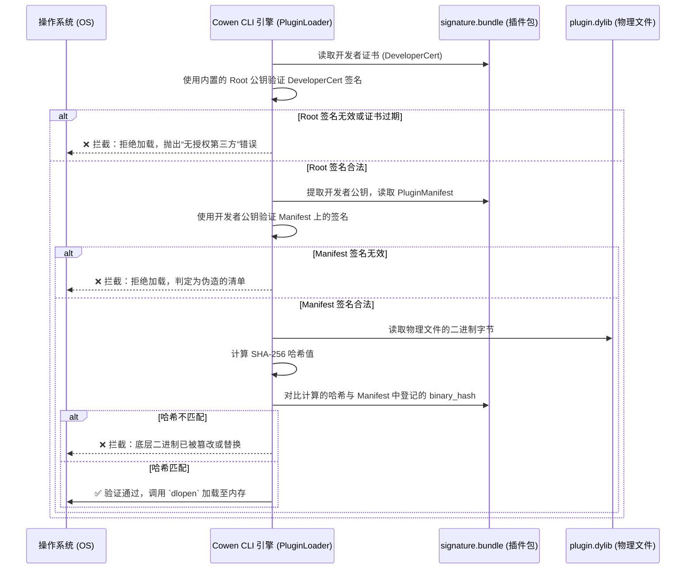

# Cowen Plugin Security Architecture

本文档详细介绍了 Cowen 插件体系的 PKI（Public Key Infrastructure，公钥基础设施）信任链安全机制。

## 1. 核心安全目标
1. **防止未经授权的第三方插件加载**：确保只有受信任的开发者（或官方流水线）编译的插件能够被引擎装载。
2. **防篡改 (Anti-Tampering)**：防止物理磁盘上的动态链接库 (`.dylib`, `.so`) 被恶意替换、注入或篡改。
3. **权限隔离与清单化 (Manifest-Driven)**：插件请求的能力（如文件读写、网络访问）必须被提前声明并签名，从而为后续沙箱控制提供信任根基。

---

## 2. 身份与证书实体说明

在我们的设计中，我们彻底抛弃了重量级的 X.509 标准，采用轻量级 Ed25519 + JSON 的自定义微型信任链。体系中共存在以下实体：

- **Root CA（根证书机构）**：安全级别最高。私钥冷存储在安全环境（如可信私有仓库的 CI 密钥库中），公钥作为**可信锚点（Trust Anchor）**直接硬编码编译在 `cowen` CLI 引擎的二进制中。
- **Developer（开发者/官方 CI 流水线）**：拥有自己独一无二的 Ed25519 密钥对。通过向 Root CA 申请，可获得一份 **Developer Certificate（开发者证书）**，里面包含了其公钥和有效期，并由 Root CA 私钥签名背书。
- **Plugin Manifest（插件权限与哈希清单）**：开发者发布插件时，不直接对 `.dylib` 进行数字签名，而是将 `.dylib` 的 SHA-256 哈希值写入 `manifest.json`，然后开发者使用自己的私钥对 `manifest.json` 进行数字签名。
- **Signature Bundle（最终分发包）**：这是随插件分发的一个捆绑文件（`signature.bundle`），内含：开发者证书 + 插件清单 + 清单签名。

---

## 3. 信任链鉴权全景流程图 (PKI Trust Chain)

当用户执行 `cowen plugins list` 或是加载一个提供者（Search Provider）时，引擎 (`PluginLoader`) 会执行以下安全拦截：



---

## 4. `cowen-signer` 签名工具的职责分离

出于安全性原则，`cowen` CLI 不提供签发证书或签署插件的能力。相关密码学写操作被剥离至独立的 `cowen-signer` 工具。

### 4.1 根密钥生成 (Generate Root)
用于项目初始化或 Root 密钥泄露后的灾备轮换：
```bash
cargo run --bin cowen-signer -- generate-root \
  --out-root-key root_private.pk8 \
  --out-root-pub root_public.bin
```
*执行后会打印 `OFFICIAL_ROOT_PUB_KEY` 字节码供替换进 `pki.rs` 中。*

### 4.2 签发开发者证书 (Issue Certificate)
Root 拥有者为新开发者发放入场券：
```bash
cargo run --bin cowen-signer -- issue-cert \
  --root-key root_private.pk8 \
  --dev-id "official-ci" \
  --out-dev-key official_dev.pk8 \
  --out-cert official_dev_cert.json \
  --days 365
```

### 4.3 构建插件与清单签名 (Sign Plugin)
开发者/CI 在 `cargo build` 生成 `.dylib` 后执行，打包安全分发包：
```bash
cargo run --bin cowen-signer -- sign-plugin \
  --dylib libmy_plugin.dylib \
  --name "my_plugin" \
  --version "1.0.0" \
  --dev-key official_dev.pk8 \
  --dev-cert official_dev_cert.json \
  --out-bundle libmy_plugin.bundle
```

---

## 5. 开发调试的后门 (Dev Mode)

鉴于第三方开发者在早期开发时，没有向官方申请证书，为了保障其本地调试能够加载他们自己编译的 `.dylib`，提供了一个显式的“降级后门”。

当启动参数包含特定的环境变量时：
```bash
COWEN_DEV_MODE=1 cowen plugins list
```
引擎将跳过上述全部 PKI 强验证，但会在控制台（stderr）输出高危的警告日志以提醒用户处于非安全沙箱模式。在无此环境变量的生产客户端上，任何无签名的后门均无法被调用。

---

## 6. 密钥的物理管理与分发生命周期 (Keys Management Lifecycle)

当前源码工程的 `dist_assets/keys` 目录下存放了构建与签名所需的密钥体系：
- `root_private.pk8`：根私钥（未加密，依赖 Git 仓库可信权限隔离）。
- `official_dev.pk8`：官方开发者私钥。
- `official_dev_cert.json`：官方开发者证书。

**安全管理与分发原则：**
1. **私密性隔离**：上述私钥仅托管于内部可信私有 Git 仓库，由 `Makefile` 的 `build-plugins` 阶段在本地或 CI 中自动调用，**绝对不会**被打包进给最终用户的 macOS `.pkg` 或其他操作系统的安装包中。
2. **免密自动化**：生成密钥对时采用了无密码保护的纯 PKCS#8 格式，以便构建流水线执行自动化签名时无需人工干预或配置复杂的加解密管道。其安全性完全由 Git 内部代码库（如 GitLab 权限）的门禁访问控制进行物理兜底。
3. **根公钥熔铸**：根证书公钥（Trust Anchor）绝不以传统的磁盘文件形态分发，而是直接硬编码（Hardcode）编译进 `cowen-daemon` 的 Rust 源文件数组（`OFFICIAL_ROOT_PUB_KEY`）内，从根本上杜绝了终端运行环境下的磁盘文件篡改、伪造 and 替换攻击。
4. **防检测策略适配**：为顺利在安全审查严格的代码托管平台运转，证书 JSON 字段通过重命名或设置了特定的 Bypass 策略，避免被服务端的泄漏扫描（如 Gitleaks）误伤。

---

## 7. 运行期安全防护架构 (Runtime Sandboxing)

除了静态签名验证（分发信任），`cowen` 在运行期根据不同的挂载方案采用不同的物理隔离与沙箱限制机制。

### 7.1 WebAssembly (Wasm) 的天然沙箱防御 (Guest VM Sandboxing)
如果插件编译为 Wasm（由 `wasmtime` 驱动），`cowen` 宿主在运行期对其进行硬核的主动防御：
1. **默认零权限 (Zero-Syscall Default)**：
   Wasm 虚拟机默认禁绝一切直接的操作系统调用。Wasm 插件绝对无法发起原生 socket 连接、无法访问本机的宿主环境变量，也无法读取 `/etc` 等物理路径。
2. **虚拟文件系统限制 (Pre-opened WASI Directory)**：
   如果 Wasm 插件需要读取向量模型或存储临时索引，宿主会在初始化虚拟机时，通过 WASI 手动将一个绝对受控的专有沙箱目录（如 `~/.cowen/plugins/<PLUGIN_ID>/data`）以只读或隔离读写的方式“挂载（Pre-open）”给虚拟机。虚拟机对外部物理磁盘结构完全无感知。
3. **网络路由白名单桥接 (Host API Network Filtering)**：
   Wasm 内部无法直接发起 HTTP 请求。所有网络请求必须向宿主发起的特权 FFI 函数申请。宿主 `cowen` 会根据 `plugin.json` 中的 `requested_permissions` 对请求的 Domain 进行白名单审查，彻底防范插件悄悄向未知恶意 IP 泄露敏感 Key。
4. **算力熔断保护 (Wasmtime Fuel Metering)**：
   为了防止三方插件由于 Bug 或恶意代码写死循环拖垮 CPU，宿主在执行 Wasm 插件时启动 `wasmtime` 的 **Fuel 计数器**。一旦插件消耗的虚拟指令（Fuel）超过安全阈值，虚拟机会被宿主立即强力熔断并抛出异常，实现 100% 的可用性保护。

### 7.2 RPC/Stdio 子进程的系统级沙箱防御 (OS-level Process Isolation)
当插件以独立子进程运行并扮演 MCP Server 时，`cowen` 必须通过操作系统层面的手段进行铁笼式的围堵防护：
1. **进程资源强锁 (Windows Job Objects & Unix rlimit)**：
   宿主在 `spawn` 子进程时，利用 Unix 操作系统的 `setrlimit` 系统调用，将子进程的最大虚拟内存硬锁（例如最多 256MB）、限制文件描述符最大开启数量，并利用 macOS 的 App Sandbox 机制或 Windows 的 **Job Objects** 限制 CPU 核心占有率，防止 JVM/Node.js 等庞大运行时因内存泄漏耗尽用户资源。
2. **无特权隔离运行用户 (Least Privilege Execution)**：
   宿主绝不以当前高权限管理员身份直接执行插件子进程，而是在 Unix 环境下，通过设置 `CommandExt::uid` 将子进程降级运行在一个专门的受限用户（如 `cowen_guest`）下，使其天然失去读写其他用户敏感系统目录的权限。
3. **基于 OS Namespace 的网络断联**：
   在 Linux 下启动子进程时，利用 `unshare` 限制插件在完全独立的网络命名空间（Network Namespace）中运行，剥夺其物理网卡访问权。子进程只能且必须通过 `stdin/stdout` 管道或本地的 Unix Domain Socket 与宿主 `cowen` 进行双向 IPC，彻底斩断了数据从子进程直接向外网偷跑的物理通道。

---

## 8. 三种挂载方案在安全维度上的终极比对

| 安全保障维度 | 1. 动态链接库 (Native DLL) | 2. WebAssembly (Wasm) | 3. RPC/Stdio 子进程 |
| :--- | :--- | :--- | :--- |
| **内存逃逸防范** | 🔴 **极差**（可直接扫描宿主主进程的全部内存） | 🟢 **天然免疫**（Wasm 内存完全物理硬隔离） | 🟢 **完美隔离**（操作系统地址空间完全独立） |
| **敏感数据外流** | 🔴 **无法防范**（可绕过宿主直接调 system socket） | 🟢 **100% 阻断**（所有请求需过 Host API 过滤）| 🟢 **可严密防御**（通过 OS Network Namespace 禁网）|
| **宿主磁盘劫持** | 🔴 **无法防范**（能随意删除/格式化宿主机） | 🟢 **天然免疫**（仅能在 WASI 虚拟映射区操作） | 🟡 **可防御**（需额外配置 chroot / 降权运行） |
| **CPU/内存恶意耗尽**| 🔴 **无法防范**（死循环将直接卡死主线程） | 🟢 **极佳**（通过 Wasmtime Fuel 进行指令熔断）| 🟢 **极佳**（利用 OS rlimit / Job Objects 限制） |
| **安全控制复杂度** | 🔴 **极高**（宿主内部无计可施，需全套外部容器）| 🟢 **极低**（虚拟机底层开箱即用，纯 Rust 实现）| 🟡 **中等**（依赖各系统专属的 IPC 与降权 API）|
