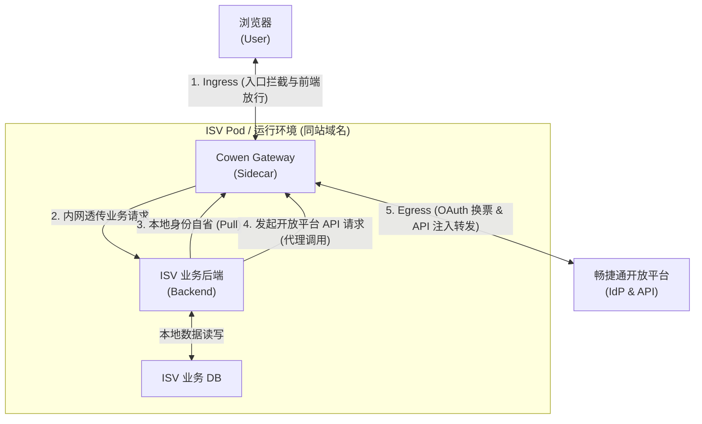
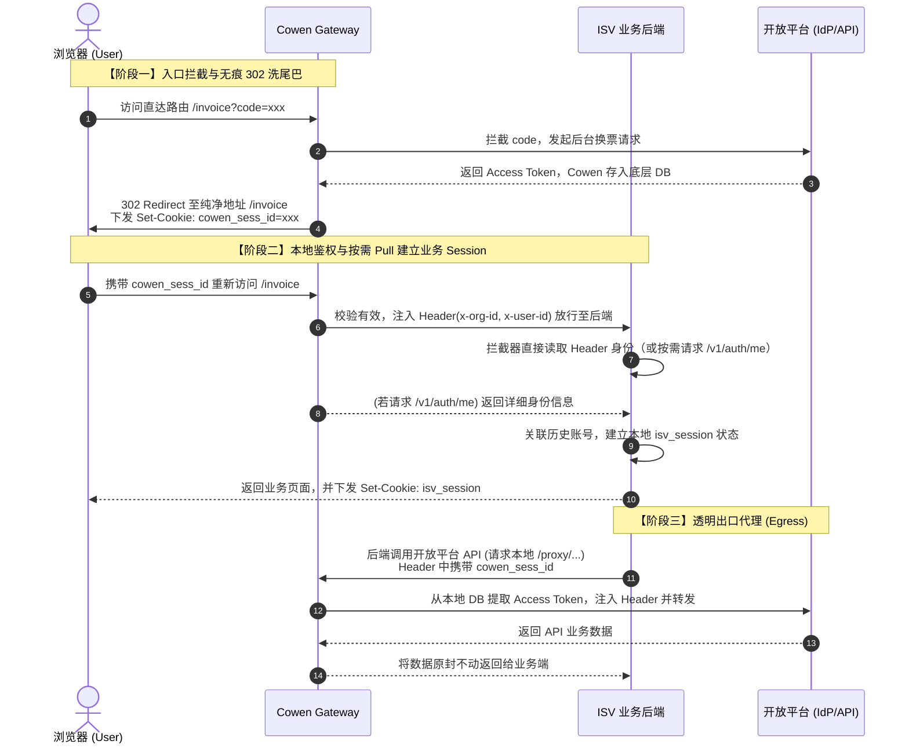
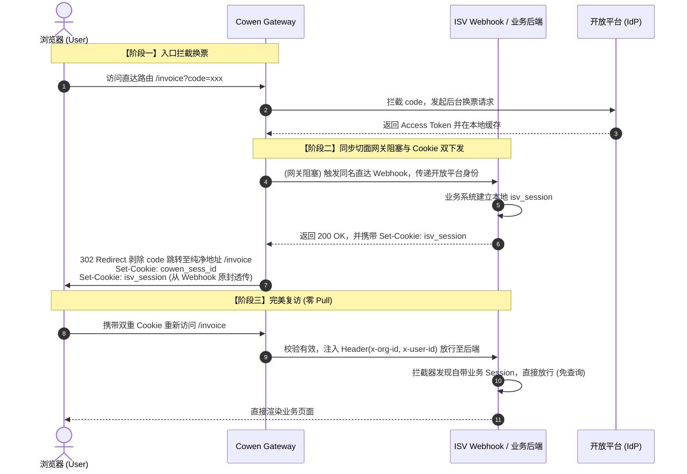

# PRD v0.5.0 – Identity-Aware Gateway (零侵入认证网关方案)

## 1. 背景与痛点
在传统的 `store‑app` 模式下，ISV 开发者必须自行处理冗长的 OAuth2.0 状态机，包括但不限于：配置 `redirect_uri` 回调、处理 Access Token 的换取与定时刷新、以及维护复杂的“开放平台身份 ↔ ISV 本地账号”的映射关系。

传统的中间件方案往往顾此失彼：
* **URL 污染**：重定向层层嵌套，导致难以维护的“套娃 URL”。
* **视觉体验差**：采用假页面（200 OK + JS 跳转）擦除参数时，会引起明显的屏幕白屏或闪烁。
* **业务强耦合**：网关试图强行接管账号映射逻辑（比如强推异步 Webhook），反而让 ISV 面对历史账号存量绑定（断头路）时束手无策。

## 2. 核心演进目标
本架构抛弃了早期的“打补丁”思路，直接将 Cowen Sidecar 升级为企业级的 **Identity-Aware Proxy（身份感知网关）**，直面最终形态：
1. **零前端污染与零闪烁**：无痕洗除认证参数，不注入 JS，不引起页面重绘白屏，实现极客级别的功能直达（Deep Linking）。
2. **双 Session 彻底解耦**：业务侧（ISV）与平台侧（Cowen）会话彻底分离，互不绑架。
3. **极致 Zero-Code**：轻量 ISV 可零代码接入，大型 ISV 也仅需通过本地内网接口自省身份。

## 3. 架构概览 (Dual Session & 兼具 Ingress/Egress)
Cowen 网关以 Sidecar 形式与 ISV 业务同域名、同 Pod 部署。它兼具双重核心职责：
* **Ingress（入口鉴权）**：全局拦截带有授权码的流量，建立网关层身份会话。
* **Egress（出口注入）**：接管 ISV 发往开放平台的流量，依据上下文本地缓存静默注入 Token。

### 3.1 部署拓扑结构
此图展示了 Cowen 网关在系统中的物理位置与通信边界：



### 3.2.1 核心时序：基于按需拉取（Pull 模式）的双 Session 建立
这是最推荐的解耦模式。业务端只需在拦截器中自省身份，完全按需触发：



### 3.2.2 核心时序：基于同步切面（Sync Hook 模式）的双 Session 建立
此模式下，Cowen 像切面一样在 302 跳转前回调业务方，实现一次跳转、双重 Cookie 齐下发：



## 4. 核心设计机制

### 4.1 全局行内回调拦截与“无痕 302 洗尾巴”
为了支持完美的功能直达（Deep Linking）且不污染 HTML：
- **消灭专属 Callback**：前提需开放平台支持通配符或域名级回调校验（如 `https://isv.com/*`）。
- **拦截与换票**：开放平台将认证结果直接跳回真实的业务深层直达地址（如 `/invoice/create?code=xxx`）。Cowen 在底层全局侦听，一旦发现 `code` 参数，立即静默拦截，完成换票并生成网关会话凭证（`cowen_sess_id`）。
- **302 同站无痕洗白**：换票后，Cowen 立刻返回 `302 Found` 跳转，目标 URL 为剔除 `code` 后的纯净业务地址（`/invoice/create`），并在响应头中下发 `Set-Cookie: cowen_sess_id=xxx; HttpOnly; SameSite=Lax`。
- **架构收益**：因为是部署在 ISV 同域名下的顶层导航（Top-Level First-Party Navigation），302 跳转绝对不会触发 Safari ITP 或 SameSite 跨域丢 Cookie 的 Bug；同时网络层的 302 避免了 200+JS 方案导致的屏幕闪烁，实现了**地址栏纯净、视觉零闪烁、零 HTML 代码污染**的终极前端体验。

### 4.2 双 Session 共存与网关 Header 注入鉴权
彻底改变过去通过网关强塞状态的思维，让身份生命周期独立运转：
- **Cowen Session（平台态）**：由网关通过上述 302 过程种在浏览器端，代表“畅捷通开放平台”的身份合法性。在后续的每一次业务请求中，**Cowen 作为 Ingress 网关拦截到请求后，会自动从本地 DB 中解析出会话对应的明文身份，并以 `x-org-id`, `x-user-id` 等 HTTP Header 的形式强制装载，随后才将请求透明代理给 ISV 后端。**
- **ISV Session（业务态）**：由业务侧自主维护。当请求来到 ISV 后端时，ISV 拦截器若发现缺乏本地 Session，可以直接从 HTTP Header 中读取 `x-org-id`, `x-user-id` 获取平台身份（若需更详尽信息也可按需请求 `/v1/auth/me`）。一旦确认为合法存量用户，ISV 立即下发专属的 `isv_session`。两套身份生命周期完全解耦，互不干涉。

### 4.3 种 Session 的双轨制 (Dual-Track) 自由裁量权
为了应对各类开发偏好，Cowen 在入口拦截时提供“双轨制”的身份通知模式，把业务控制权彻底交还 ISV：
- **第二轨（Header 提取或按需 Pull 模式 - 极力推荐）**：正如 4.2 节所述，ISV 随时可通过 Cowen 注入的 Header 读取真实身份。ISV 可自主决定何时将历史账号与畅捷通关联，甚至可以阻断请求，直接在前端渲染“请绑定存量老账号”的表单页面。Cowen 完全作为基础设施，不插手任何交互断头路问题。
- **第一轨（同步切面透传 / Sync Hook 模式 - 可选项）**：Cowen 允许 ISV 注册内部的同步 Webhook。在 Cowen 执行 302 无痕跳转的瞬间，阻塞等待调用 ISV 的 Hook。如果 ISV 在此同步响应中返回了属于自己的 `Set-Cookie` 头，Cowen 会像代理切面一样，将其原封不动地合并进对浏览器的 302 重定向中。这允许在一次网络跳转内，同时完成平台态与业务态的 Cookie 双下发。

### 4.4 极致屏蔽复杂度的内置代理 (Native Proxy)
对于 ISV 对外调用开放平台的诉求，网关彻底摒弃了复杂的动态扩展（WASM）与冗余的出口配置系统，转而直接利用 Cowen 核心原生自带的 `proxy` 能力，提供极致极简的开箱即用体验：
- **弹性端口隔离与多重防御机制**：Cowen 的 Native Proxy 服务独立监听（如 8081 端口），严格区分处理 C 端外网请求的 Ingress 流量平面。
  - **云原生 Sidecar 模式**：默认强制绑定在 `127.0.0.1` (Loopback)。依赖物理网络绝对隔离，确保仅同 Pod/主机的进程可访问。
  - **传统 VM / 集中式 Gateway 模式**：若 ISV 后端与网关部署在异地，代理端口支持放开至 `0.0.0.0`。在此模式下，Cowen 摒弃了应用层复杂的 IP 规则配置防御，**全权交由基础设施级防火墙（Security Group）管控**，实现真正的“零认知摩擦”。
- **协议自带规范，拒绝过度设计**：由于 Cowen 是为畅捷通开放平台量身定制的，其内部已静态硬编码了 `store_app` 的完整鉴权协议。因此这里**不需要任何诸如目标 URL、Header 拼装规则、自定义验签等花哨的配置**。网关天生就懂如何正确发包。
- **透明正向代理的极致体验**：ISV 访问开放平台 API 时，彻底免除一切鉴权逻辑与网络地址改写。只需将业务 HttpClient 的网络代理（HTTP Proxy）全局指向 `127.0.0.1:8081` 即可。Cowen 原生代理会自动在底层透明劫持网络流，静默提取底层 Token、组装标准 `Authorization` Header，并将流量安全送达远端平台。

### 4.5 零信任网关的未认证路由策略
作为 Identity-Aware Proxy，当 Cowen 拦截到缺乏有效 `cowen_sess_id`（或 Session 已过期）的请求时，必须根据网关配置和请求的特征，执行优雅的降级兜底策略。Cowen 提供“黑白名单兼备”的路由引擎，涵盖以下三种核心场景：
1. **场景一：API 数据请求（Fetch / Ajax）—— 优雅阻断并返回 401 Unauthorized**
   - **触发条件**：请求命中了需认证路由，且 HTTP 标头表明是数据交互（如 `Accept: application/json` 或 `X-Requested-With`）。
   - **处理逻辑**：此时若强行 302 跳转会引发前端跨域（CORS）报错。Cowen 直接阻断请求，返回 HTTP 状态码 `401 Unauthorized`，并在响应体中附加开放平台的 `login_url`。
   - **架构收益**：ISV 的前端全局网络拦截器（如 Axios Interceptor）可精准捕捉此 401 状态，提示用户并由前端主动跳转，异常流转极其平滑。
2. **场景二：页面级请求（Browser Navigation）—— 智能 302 自动重定向登录**
   - **触发条件**：请求命中了需认证路由，且标头包含 `Accept: text/html`（如用户直接在地址栏敲入深层链接）。
   - **处理逻辑**：Cowen 将该深层地址编码为 `state`，随后直接返回 `302 Redirect` 跳转至开放平台登录页。
   - **架构收益**：用户无感地被带往登录页，授权完成后按前文所述无痕洗白，完美复原现场，ISV 后端全程免干预。
3. **场景三：黑白名单双向路由与强声明式拦截模式 (Bypass & Require Rules)**
   为给予 ISV 最大的接入灵活性，Cowen 引擎拒绝“潜规则”，强制要求 ISV 在部署时显式声明其**拦截模式 (Auth Mode)**：
   - **模式 A：`STRICT` (默认全拦截 + Bypass 白名单)**。默认所有请求均需校验身份，符合绝对的“零信任”底线。此模式下，ISV 必须通过 `auth_bypass_rules` 配置静态资源白名单（如 `/static/**`, `/health`），网关对白名单路由纯粹放行，不校验亦不注入身份。
   - **模式 B：`PERMISSIVE` (默认全放行 + Require 黑名单)**。默认放行一切，实现对 ISV 现有系统的**零故障无损接入**（极其适合存量复杂业务改造）。ISV 通过 `auth_require_rules: ["/api/**", "/invoice/**"]` 明确圈定防线，网关仅对命中的核心路由进行强力拦截与身份注入。
4. **特殊边缘场景：全局 Code 拦截的绝对优先级**
   在 Cowen 的引擎中，“协议握手优先级”永远大于“路由规则优先级”。假设用户访问了一个**处于免登白名单中**的页面，但 URL 中携带有 OAuth 授权码（如 `/public/home?code=123`）：
   - 网关**绝对不会**将其作为普通白名单请求放行，而是**优先拦截吃掉 Code**，发起后台换票。
   - 随后触发无痕 302 重定向至纯净地址 `/public/home`，并下发 `cowen_sess_id` Cookie。
   - 待浏览器携带 Cookie 重新请求 `/public/home` 时，网关识别到白名单规则，**不强制阻断**，但因为已经拥有合法会话，会**顺手将身份明文注入到 HTTP Header (`x-org-id`)** 后再透传给 ISV。
   - **架构收益**：这确保了一次性的敏感 `code` 绝不泄露给未设防的下游业务，实现了完美的安全兜底和全局行内回调。

### 4.6 声明式配置：作为 Profile 子集的纯粹网关路由策略
由于对外发请求的代理能力已经完全由 Cowen 核心内置的 `cowen proxy` 原生指令接管，且该能力被设定为高度标准化（严格死磕 `store_app` 鉴权规范），因此在声明式配置中，我们**彻底移除了所有冗余的 Egress 代理配置与复杂的动态插件（WASM）概念**。

**关键层级定义**：Gateway 的配置并不是全局的，它是**从属于 Cowen Profile（应用身份环境）的子配置**。这就意味着，Gateway 的行为与对应的 AppKey、AppSecret 等身份属性强绑定。当开发者在 Cowen CLI 中切换 Profile 时，该 Profile 对应的网关路由规则、端口绑定和黑白名单会随之一并切换。这种“应用级隔离”的设计，确保了在单机多开联调时配置绝对不会张冠李戴。

网关的配置结构被剥离到极致，核心只关注一件事：**基于当前 Profile 身份，如何管理入口（Gateway / Ingress）的流量清洗与黑白名单**。

> [!NOTE]
> **高阶用法：远程隔离 ISV 的底层 Token 导出 (Token Export)**
> 如果 ISV 应用与 Cowen 未部署在同一台机器或网络平面（导致 ISV 无法直接调用本地 `8081` 端口的内置 Proxy），ISV 必须亲自向开放平台发起公网请求。
> 此时，Cowen 的全局插件池机制就派上了用场：您可以通过挂载 `token-exporter` 插件，在 Ingress 网关将流量**透传**给远端 ISV 时，直接将原生鉴权凭证作为内部 HTTP Header 注入给 ISV。
> 
> **插件底层实现逻辑 (动静分离与安全保险箱)：**
> 为了绝对防范系统底层机密泄露，该插件的 WASM 代码严格遵循“动静分离”模型：
> 1. **获取动态身份**：插件从网关传入的**请求上下文 (Request Context)** 中提取出刚解密的 JWE 载荷，拿到属于当前用户的动态 `openToken` 与 `x-org-id`。
> 2. **获取静态凭证 (Host Vault 机制)**：插件**绝不**从配置文件或 JWT 中读取机密。而是调用网关宿主机暴露的 `Host Vault API` (如 `host.vault.get("APP_KEY")`)。宿主机会安全地从自身的环境变量中提取静态常量 `appKey` 和 `appSecret` 递交给沙盒内的插件。
> 3. **组装与转发**：插件将上述所有数据组装成自定义 Header (如 `X-Cowen-Open-Token` 等)，强行注入透传请求中，让远端 ISV 获得直接对话开放平台的能力。
> 
> *(工程声明：作为打破“零信任”边界的强力“逃生舱”，`token-exporter` 插件在本期将完成代码研发与内部验证，但出于安全性考量，暂不作为官方标准包进行对外分发，仅供特殊高阶私有化交付或由架构师手动挂载使用。)*

```yaml
# ==========================================
# 示例：全局存储引擎中的 Profile 抽象隔离结构 (逻辑数据模型)
# ==========================================
current_profile: "prod_env_app1" # 当前激活的 Profile

profiles:
  # --- 身份 A: 正式服应用 ---
  prod_env_app1:
    app_key: "xxx"
    app_secret: "yyy"
    
    # Gateway 作为 Profile 的子配置，规则独立且彻底隔离
    gateway:  
      bind_address: "0.0.0.0:8080"
      upstream_url: "https://remote-isv.com" # ISV 业务真实远端地址
      
      auth_routing:
        mode: "PERMISSIVE" # 无损旁路接入
        require_rules:
          - "/api/**"
          - "/user/invoice/**"

      # 【高阶能力挂载】在 Ingress 向上游透传的链路上执行自定义逻辑
      apply_plugins:
        - "token-exporter"

  # --- 身份 B: 测试服应用 ---
  test_env_app2:
    app_key: "aaa"
    app_secret: "bbb"
    
    # 同机多开时，测试服可绑定不同端口，并使用完全不同的严格路由策略
    gateway:
      bind_address: "127.0.0.1:8082" 
      upstream_url: "http://127.0.0.1:3000"
      
      auth_routing:
        mode: "STRICT"     # 绝对零信任拦截
        bypass_rules:
          - "/health"
          - "/static/**"
```

### 4.7 云原生配置挂载：ConfigMap (YAML) 与 环境变量 (Env) 的最佳实践
随着业务演进，当网关的路由黑白名单（`require_rules` / `bypass_rules`）越来越复杂时，单纯依赖环境变量会导致 K8s Deployment 文件极其臃肿且难以维护。
因此，Cowen 网关原生支持 **“物理配置为主，环境变量覆盖为辅”** 的组合拳机制，完美契合云原生的配置管理哲学。

**✅ 最佳实践策略：**
1. **静态且繁杂的路由策略（Gateway Block）**：使用标准的 `.yaml` 文件描述。在 K8s 中可通过 `ConfigMap` 挂载到容器的指定路径，或在构建自定义网关镜像时直接 `COPY` 进去。
2. **动态且敏感的机密凭证（Secret/DB_URL）**：通过 K8s `Secret` 注入为环境变量。Cowen 启动时会自动合并，**环境变量 (`COWEN_` 前缀) 的优先级永远高于物理 YAML 文件**，从而实现对敏感字段的安全覆写。
**典型的 ConfigMap 资源定义 (对应挂载的 /etc/cowen/config.yaml)**：
由于我们在环境变量中剥离了所有机密凭证（AppKey/Secret 等），这个 ConfigMap 将变得非常“干净”，它纯粹只负责描述静态路由逻辑，极其适合提交到 Git 仓库中进行代码化审查 (GitOps)：
```yaml
apiVersion: v1
kind: ConfigMap
metadata:
  name: cowen-gateway-config
data:
  config.yaml: |
    # 纯净的路由配置文件，不包含任何 AppKey / Secret (机密全靠后续的 Env 注入与合并)
    # 向下完全兼容：保持原有的平铺结构，新增 gateway 节点
    
    # --- 1. 侧车基础设施 (原有能力) ---
    proxy_port: 8081  # 开放平台透明出口代理端口 (Egress)
    webhook_target: "http://127.0.0.1:5000/callback" # 开放平台业务消息的统一汇聚与转发接收地址
    
    # --- 2. 网关入口拦截规则 (纯增量能力) ---
    gateway:
      bind_address: "0.0.0.0:8080"
      upstream_url: "http://127.0.0.1:3000" # ISV 主业务容器地址
      auth_sync_hook: "http://127.0.0.1:3000/internal/auth-hook" # 【可选】换票成功时的同步阻塞回调
      auth_routing:
        mode: "PERMISSIVE"
        require_rules:
          - "/api/**"
          - "/user/invoice/**"
          
    # --- 3. 插件资源挂载 ---
    apply_plugins:
      - "token-exporter"
```

**典型的 K8s Deployment 组合注入示例**：
```yaml
      - name: cowen-sidecar
        image: chanjet/cowen:latest
        
        # 1. 指向挂载的物理 yaml 配置文件 (包含了所有的网关路由与拦截规则)
        command: ["cowen"]
        args: ["--config", "/etc/cowen/config.yaml", "--profile", "isv-sidecar", "daemon", "start", "--foreground"]
        
        # 2. 将 ConfigMap (内部存放 yaml 文本) 挂载为容器内的只读物理文件
        volumeMounts:
          - name: cowen-config-volume
            mountPath: /etc/cowen/config.yaml
            subPath: config.yaml
            readOnly: true
            
        # 3. 通过环境变量注入动态覆盖项与机密数据 (这些敏感信息完全不需要写在 ConfigMap 中)
        env:
        - name: COWEN_APP_MODE
          value: "store-app"
        - name: COWEN_APP_KEY
          valueFrom: { secretKeyRef: { name: cowen-secret, key: app-key } }
        - name: COWEN_APP_SECRET
          valueFrom: { secretKeyRef: { name: cowen-secret, key: app-secret } }
        - name: COWEN_DB_URL
          valueFrom: { secretKeyRef: { name: cowen-secret, key: db-url } }
          
      volumes:
        - name: cowen-config-volume
          configMap:
            name: cowen-gateway-config
```

**架构收益**：
通过这种“动静分离”的配置分层，ISV 可以用极其直观的 YAML 语法（ConfigMap）来管理成百上千条复杂的网关路由规则；同时又能利用 K8s Secret 和环境变量机制保证底层数据库密码和 AppSecret 绝不落盘。这极大地降低了配置的“繁重感”，彻底终结了配置管理的脏乱差。

## 5. 核心工程选型与边界决策
在实际代码落地与架构演进中，为适配“云原生弹性扩展”与“开放平台应用生态”，Cowen 网关确立了以下三大工程层面的硬性决断：

### 5.1 极致无状态的存储引擎 (Stateless JWT)
放弃传统的 Redis 或本地 SQLite 等中心化/有状态会话存储。Cowen 将获取到的开放平台 Access Token 及身份信息，进行高强度压缩与加密后，直接签发为无状态的 JWT，并作为 `cowen_sess_id` Cookie 种植在客户端。
- **架构收益**：网关彻底剥离状态，成为纯粹的计算节点。支持在 K8s 中无限水平扩展 (Scale-out)，请求无论路由到哪一个 Pod 实例，均能通过实时解密 Cookie 完成自给自足的鉴权闭环。

### 5.2 兼容“工作台直达”的 CSRF 豁免策略
标准 OAuth 代理通常要求在 `state` 参数中下发防伪造的 `nonce` Cookie 以防范 Login CSRF 攻击。但在本生态中，用户有极大可能从“畅捷通工作台 / 应用商店”直接点击应用图标发起首跳免登（IdP-Initiated SSO）。此时网关拦截到的第一条网络请求就已经携带了 `code`，根本无机会前置下发 `nonce`。
- **工程决断**：为兼容生态层面的直达特性，Cowen 放弃对 `state` 进行死板的同源 Cookie 交叉校验，转而完全信任畅捷通开放平台发放的短时、极简一次性 `code` 作为绝对的安全锚点。

### 5.3 基于双时间戳的离散滑动窗口续期 (Discrete Sliding Window)
在无状态架构中，如果想实现“用户 30 分钟无操作则掉线，持续操作则永不掉线”，最笨的办法是每次请求都生成并下发新的 JWT，但这会造成极大的带宽浪费和 CPU 损耗。因此，Cowen 采用**双时间戳**（`abs_exp` 底层绝对过期 与 `idle_exp` 空闲过期）搭配**刷新阈值**（Threshold）的算法：
- **初始化**：换票成功后，JWT 内部携带 `idle_exp = now() + 30m`。
- **空闲超时失效**：当请求到达时，如果 `now() > idle_exp`（即用户真的 30 分钟没动静了），网关直接判定空闲失效，按标准触发 401 或 302 重新走免登流。
- **活跃与离散刷新 (Proactive Refresh)**：为了实现“只要活跃就不掉线”，网关每次请求都会计算剩余空闲时间 (`idle_exp - now()`)：
  - **安全区（免刷新）**：如果剩余时间 > 10 分钟（意味着用户才活跃了不到 20 分钟），网关不消耗任何性能，不修改 Cookie，直接放行。
  - **临期阈值区（触发刷新）**：如果剩余时间 ≤ 10 分钟（且还在 30 分钟内），网关判断会话即将空闲过期。此时，网关在内存中生成一个新的 JWT（将其 `idle_exp` 重新推至 `now() + 30m`，并在必要时静默去开放平台刷新底层 Access Token）。
  - **响应头劫持下发**：网关在业务后端返回 HTTP 响应时进行拦截，往浏览器的 Response Header 中顺手注入 `Set-Cookie: cowen_sess_id=new_jwt`。这样既实现了无限期顺滑续杯，又把刷新频率从“每次点击”降维到了“每 20 分钟一次”。

**【算法时序示例 (假设空闲期 30 分钟，临期刷新阈值 10 分钟)】**：
1. **`10:00`** 用户登录成功，获取 JWT（记录 `idle_exp = 10:30`）。
2. **`10:05`** 用户点击发票列表。剩余空闲 25 分钟（>10 分钟），处于安全区。网关直接放行，**不刷新 JWT**。
3. **`10:18`** 用户点击发票详情。剩余空闲 12 分钟（>10 分钟），处于安全区。网关直接放行，**不刷新 JWT**。
4. **`10:22`** 用户提交修改。剩余空闲 8 分钟（≤10 分钟临期线）！网关触发离散刷新，生成新 JWT（`idle_exp` 推延至 `10:52`），并在本次 HTTP 响应头中携带 `Set-Cookie` 下发新凭证。
5. **`11:00`** 假设用户去开会了，期间浏览器一直挂机无操作。
6. **`11:25`** 用户回来点击保存。网关比对当前时间 `11:25 > idle_exp (10:52)`，判定会话已**空闲超时死亡**。直接阻断并返回 401/302，要求重新登录。
### 5.4 极端防御下的“主动登出”悖论 (Session Revocation)
无状态 JWT 的核心痛点是“覆水难收”。若用户主动登出或被后台封禁，普通的清理浏览器 Cookie 无法阻止已被黑客恶意复制盗用的 JWT 继续发起请求。
- **工程决断**：坚守绝对无状态。Cowen 网关**不引入**任何内存或 Redis 黑名单（Revocation List）。主动登出仅负责在浏览器侧响应删除 Cookie 的指令。对于 Token 物理泄漏的极低概率安全事件，我们依托于 5.3 节的 `idle_exp` 机制，将其最大理论暴露敞口（Blast Radius）严格控制在 **30 分钟** 以内。

### 5.5 零容忍的分布式时钟漂移 (Clock Skew)
在多 Pod 分布式部署中，若各节点的系统时间未对齐，会导致 JWT 的 `nbf` (生效时间) 或 `exp` (过期时间) 判定发生紊乱，进而误杀合法请求。
- **工程决断**：严苛校验策略。网关底层代码**不设任何 Leeway (时钟宽容度)** 来粉饰基建缺陷。该设计强行倒逼运维侧必须配置高精度的 NTP（网络时间协议）服务以保证集群时间一致性，确保网关的安全校验逻辑绝对纯粹。

### 5.6 跨域预检请求 (CORS OPTIONS) 穿透
在前后端分离（如前端 `app.isv.com`，后端网关位于 `api.isv.com`）架构中，浏览器会在跨域数据请求前发送 HTTP `OPTIONS` 预检请求。由于 `OPTIONS` 默认不携带任何 Cookie，若网关一律拦截，将导致前端网络全盘崩溃。
- **工程决断**：无条件放行策略。Cowen 的路由引擎只要识别到 HTTP Method 为 `OPTIONS`，一律不校验身份，直接当作绿灯全盘透传。将跨域安全验证（`Access-Control-Allow-Origin` 等）的权力彻底交还给业务后端的 CORS 过滤器。

### 5.7 基于 JWKS 规范的自治密钥轮转 (Autonomous Key Rotation)
为了生成底层强加密的 JWE（加密 JWT）作为 `cowen_sess_id`，网关需要高强度的对称加密密钥。若由人工配置不仅门槛高，还容易泄露且极难实现无损更换。
- **工程决断（JWKS 标准与 Store 托管）**：完全摒弃通过环境变量注入单一 `COWEN_JWT_SECRET` 的简陋做法。Cowen 遵循行业标准的 **JWKS (JSON Web Key Set)** 规范，并结合 **Store SPI** 存储抽象，实现了一套极其优雅的“全自动密钥轮转”机制：
  1. **按需生钥**：网关启动时自动向 Store 请求全局 JWKS 集合（如 `GET system:jwks`）。若集合为空或当前激活的主密钥（Active Key）已达轮转周期（例如 30 天），网关会自动生成一把新的 `A256GCM` 顶级密钥，附带唯一的 `kid` (Key ID) 并通过原子操作持久化到 Store 中。
  2. **多版本共存与 kid 匹配**：签发新会话时，网关始终使用当前最新的 Active Key（并将 `kid` 写入 JWT Header）；当收到客户端发来的旧会话时，网关首先读取 Header 中的 `kid` 字段，从 JWKS 中精准提取对应的历史老密钥进行解密。
  3. **架构收益**：这不仅彻底解决了分布式多 Pod 架构下的共享解密漫游问题，更在**绝对零人工干预**的情况下，达成了企业级安全合规中最难解决的**无感平滑密钥轮转 (Zero-Downtime Key Rotation)**！

### 5.8 客户端跨域凭证携带规范 (withCredentials)
在 5.3 节的“滑动窗口离散续期”机制中，网关会在判断会话临期时，通过拦截后端响应，在响应头中强行注入 `Set-Cookie` 将新的 JWT 覆盖至客户端。在现代前后端分离的跨域架构下，浏览器安全策略默认隔离第三方 Cookie 的收发。
- **工程决断（强制客户端规范）**：ISV 的后端服务代码依然零侵入，但我们必须对前端下达一项硬性规范——ISV 的前端全局网络拦截器（如 Axios, Fetch）中必须配置 `withCredentials: true`。这是 HTTP 协议标准的同站/跨域凭证放行开关。唯有开启此项，浏览器发起的 Ajax 才能将存量 Cookie 送达网关，并允许网关下发的 `Set-Cookie` 成功刷新本地缓存，彻底打通无感知续杯的闭环。

### 5.9 会话防盗刷与底层凭证加固 (Security Hardening)
由于 Cowen 放弃了中心化会话状态与 Token 物理吊销能力，`cowen_sess_id` 成为唯一的零信任通行证，必须在网关层做最硬核的兜底加固：
- **强制 JWE 加密**：放弃明文 JWT，网关使用自治密钥将 Open Platform 的真实 Token 与身份标识进行强加密（JWE）。对外部而言，Cookie 只是纯粹的不透明乱码，彻底断绝抓包反解风险。
- **Cookie 铁桶阵**：网关下发 `cowen_sess_id` 时，强制硬编码锁定 `HttpOnly`（绝对防范 XSS 读取）、`Secure`（强迫 HTTPS 传输）、`SameSite=Lax`（防御 CSRF 且兼容应用商店直达首跳）。
- **指纹绑定 (Fingerprint Binding)**：在 JWE 载荷中植入用户的 `User-Agent 哈希` 或 `IP 段`。一旦发生黑客物理拷贝 Cookie 盗刷，网关解密后对比环境指纹不符，瞬间销毁伪造会话。

## 6. 综合结论
这套重新梳理后的 Identity-Aware Gateway 架构，摒弃了一切违背云原生松耦合的过渡性设计。通过 **“全局同站 302 洗尾巴”** 和 **“双 Session 按需解耦”** 两个底层杀招，彻底打破了传统 OAuth 代理中套娃 URL、屏幕闪烁、业务强侵入的固有体验瓶颈。
在面对 ISV 形态各异的存量账号体系时，网关恪守了“只做通道身份透传，绝不干涉业务生命周期”的原则。这是一个真正兼具极客架构美感与企业级健壮性的零信任身份代理范本。
