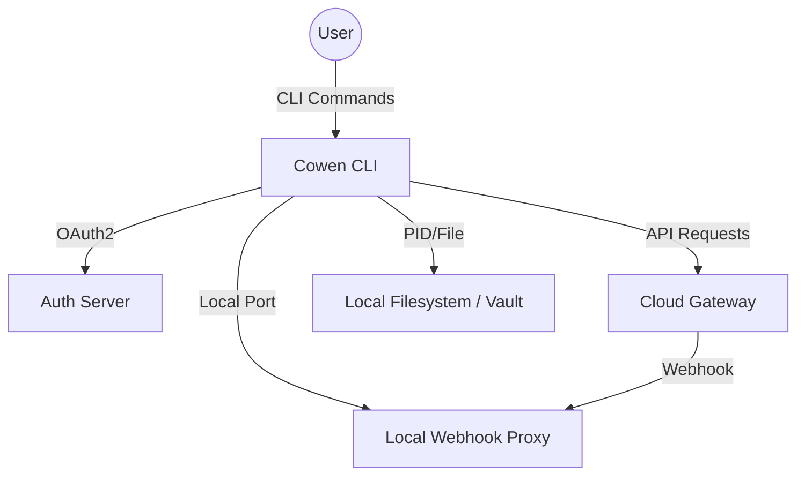

# Cowen CLI 维护与优化 PRD (PRD-20260427-COWEN-MAINTENANCE)

## 1. 概述 (Overview)
本项目旨在解决 Cowen CLI 当前存在的安全风险、用户体验缺陷以及 Windows 平台下的稳定性问题。主要包含 Webhook 回环地址强制限制、OAuth2 会话生命周期自清理、移除无效二维码以及 Windows 守护进程挂死后的自愈机制。

## 2. 架构级概要设计 (Architecture Blueprint)

### 2.1 系统上下文视图 (System Context Topology)

### 2.2 部署与物理视图 (Deployment Architecture)
- **运行环境**: macOS, Linux, Windows.
- **存储**: 用户主目录下的 `.owenc` 文件夹，包含配置文件和加密的 Vault。
- **进程**: 单一二进制文件，支持通过 `daemon start` 启动后台常驻进程。

### 2.3 非功能性需求 (NFRs)
- **安全性**: 所有本地监听服务必须限制在 `127.0.0.1`，严禁外部访问。
- **鲁棒性**: 认证中间状态必须能自动清理，防止状态机死锁。
- **可观测性**: 守护进程状态应通过功能性探测（Health Check）而非仅依赖 PID 文件。
- **高可用**: 在系统重启或休眠恢复后，工具应具备检测并修复挂起进程的能力。

### 2.4 架构决策记录 (ADR)
- **ADR-001**: 强制 Webhook 回环监听。理由：防止本地开发环境意外暴露导致的安全漏洞。
- **ADR-002**: 引入基于端口探测的健康检查。理由：PID 文件在异常退出或系统更新后可能失效，端口响应更真实。

---

## 3. 详细需求与设计 (Requirements & Design)

### 3.1 Webhook 安全策略强化 (SEC-20260423)
**业务规则**:
- Webhook 转换器和 OAuth2 回调监听器必须仅监听回环地址。
- 禁止用户通过配置将其修改为 `0.0.0.0` 等外部 IP。

**详细设计 (LLD)**:
- **逻辑算子**: 在启动监听器前，校验 `listen_addr`。若包含非 `127.0.0.1` 或 `::1` 的地址，则强制抛错退出。
- **方法签名**: `fn validate_loopback_addr(addr: &str) -> Result<(), SecurityError>`

### 3.2 OAuth2 认证周期自清理 (UX-20260423)
**业务规则**:
- 当认证超时或失败时，必须清理 Vault 中的 `pending_auth_session`。
- 每次启动新登录前，强制清理残余的旧会话。

**详细设计 (LLD)**:
- **状态枚举**: `AuthState { Pending, Exchanged, Expired, Failed }`
- **算法步骤**: 
  1. `tokio::select!` 监听超时。
  2. 超时分支调用 `vault.delete("pending_auth_session")`。
  3. `login` 函数入口处调用 `cleanup_old_sessions()`。

### 3.3 移除 OAuth2 初始化二维码 (UX-20260423)
**业务规则**:
- 在 `cowen init` 流程中，不再渲染 OAuth2 授权链接的二维码。
- 引导文案明确要求在“当前机器”完成操作。

**详细设计 (LLD)**:
- **修改点**: 移除 `src/cmd/init.rs` 中调用 `qrcode-generator` 的逻辑。

### 3.4 Windows 守护进程挂死修复 (BUG-20260423)
**业务规则**:
- `cowen status` 或 `ensure_daemon_running` 应增加端口探测。
- 如果 PID 存在但端口无响应，则判定为“挂死”，执行清理并重启。

**详细设计 (LLD)**:
- **探测逻辑**: 尝试建立 TCP 连接至 `127.0.0.1:<PROXY_PORT>`，若超时或拒绝连接，则视为不可用。
- **数学重试模型**: 探测失败后，重试 3 次，间隔 `[1s, 2s, 4s]`（指数退避）。

---

## 4. 影响范围评估 (Impact Assessment)
- **配置兼容性**: 无需修改现有配置文件结构。
- **性能**: 增加端口探测会略微增加 `cowen status` 的响应时间（毫秒级）。
- **交互**: 用户在 Windows 下遇到挂死情况将实现自动恢复，无需手动干预。

## 5. 验收标准 (Acceptance Criteria)
1. 尝试将 Webhook 绑定到公网 IP 时，程序应报错拒绝。
2. 模拟认证超时，检查 Vault 中是否残留 session 数据。
3. `cowen init` 不再显示二维码。
4. 手动 `kill -STOP` 守护进程后，执行 `cowen status` 应能触发自愈或正确报告挂死状态。

---
**小结**: 该 PRD 整合了 4 项核心改进，涵盖了从底层安全到上层交互的全方位优化。
