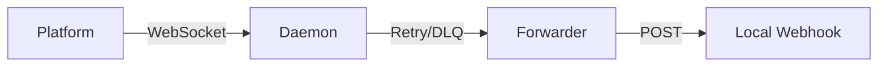

# cowen 技术规范文档 (v0.3.0)

## 1. 核心设计原则

- **OCP (Open-Closed Principle)**: 认证提供者 (AuthProvider) 采用 SPI 插件化设计。
- **Zero Trust**: 凭据不落明文盘，所有存储经过 AES-GCM 加密且绑定机器指纹。
- **Async First**: 基于 `tokio` 构建的高并发异步运行时。

## 2. 存储架构 (Storage & Vault)

### 2.1 多后端支持
系统通过 `StoreAdapter` 兼容不同持久化介质：
- **InnerDB**: SQLite 实现，存储在 `~/.cowen/cowen.db`。
- **Local**: YAML 文件实现，存储在 `~/.cowen/{profile}.yaml`。

### 2.2 Vault 加密机制
`Vault` 是敏感信息的唯一物理出口。
- **Master Key**: 基于 `machine-id` 与环境变量生成的确定性种子派生。
- **Payload**: 使用 AES-256-GCM 进行认证加密。

## 3. 认证链路 (Auth Pipeline)

### 3.1 AuthProvider SPI
所有认证逻辑均通过 `AuthProvider` Trait 抽象。核心代码无需关心 `Oauth2` 或 `SelfBuilt` 的具体握手细节。

### 3.2 令牌维护 (Token Maintenance)
- **Lazy Refresh**: 调用时检查，若剩余有效期 < 10% 则触发同步刷新。
- **Global Lock**: 换票操作受全局文件锁保护，防止多进程竞态导致令牌失效。

## 4. 守护进程逻辑 (Daemon Logic)

### 4.1 自动恢复 (Self-Healing)
Daemon 具备自愈能力：若发现进程挂掉或端口无响应，会自动尝试重启。

### 4.2 消息流转

## 5. 日志与遥测规范

| Domain | 存储文件 | 描述 |
| :--- | :--- | :--- |
| `sys` | `sys.log` | 系统级状态变更、初始化日志。 |
| `audit` | `audit.log` | 安全审计，记录所有 API 请求的元数据（脱敏）。 |
| `stream` | `stream.log` | 长连接心跳、事件推送流水。 |
| `dlq` | `dlq.log` | 失败重试详情。 |

---
© 2026 Chanjet Advanced Agentic Coding Team.
