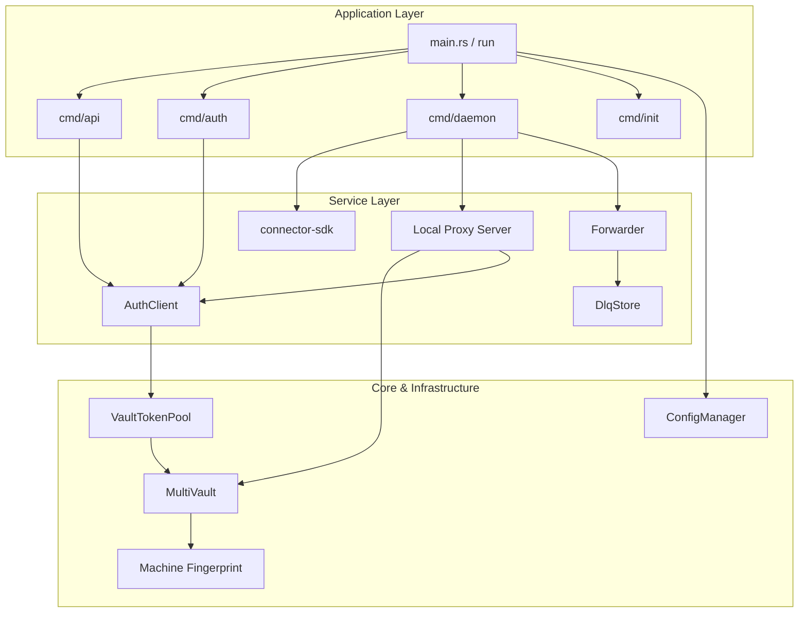
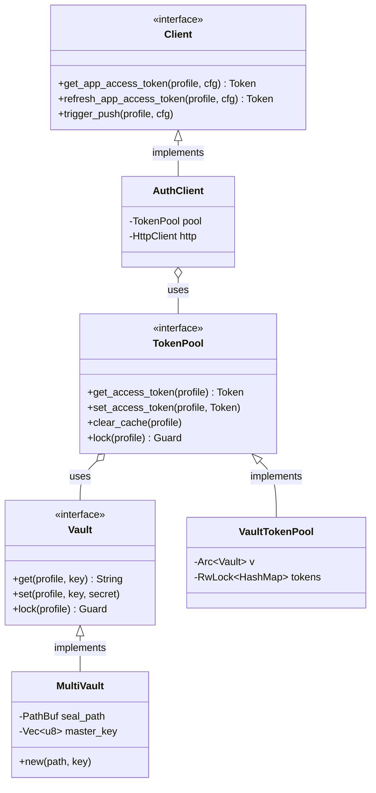
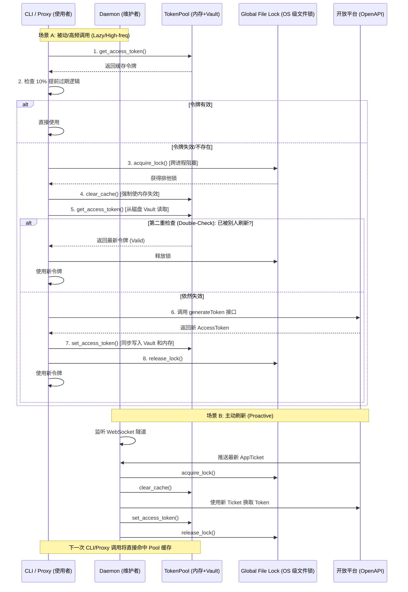

# owenc CLI 技术规范文档 (v0.1.2)

## 1. 核心架构 (Core Architecture)

`owenc` 采用分层解耦的插件化架构，确保安全性、可扩展性与高性能。

### 1.1 模块依赖关系 (Module Dependencies)

### 1.2 核心类图 (Class Diagram)

### 1.3 存储层 (Storage Layer)
- **ConfigManager**: 管理基于 Profile 的 YAML 配置文件（存储在 `~/.owenc/*.yaml`）。
- **Vault (MultiVault)**: 安全加密存储层。使用 **AES-256-GCM** 加密敏感凭据（AppSecret, Certificate, Token）。加密密钥派生自机器唯一指纹，确保凭据无法在机器间拷贝使用。
- **TokenPool**: 令牌池抽象，负责 AccessToken 和 AppTicket 的内存缓存与 Vault 持久化同步，支持多进程并发锁。

### 1.4 认证层 (Auth Layer)
- **AuthClient**: 封装开放平台认证协议。
  - 支持 **被动刷新**（调用 API 时发现过期自动换票）。
  - 支持 **主动刷新**（接收到 AppTicket 推送时即时换票）。
  - 实现 **10% 提前过期逻辑**：本地缓存有效期比服务器短 10%（至少 5 分钟），确保令牌在临界点前的稳定性。

### 1.5 守护进程层 (Daemon Layer)
- **Dispatcher**: 基于 WebSocket 的长连接管理，监听平台推送事件。
- **Forwarder**: 事件转发器，将云端消息可靠转发至本地 Webhook，内置 **DLQ (死信队列)** 补偿机制。
- **Local Proxy**: 本地 127.0.0.1 代理服务器，自动为普通 HTTP 请求注入认证头和签名。

---

## 2. 核心业务逻辑 (Business Logic)

### 2.1 AccessToken 维护机制 (Maintenance Logic)
系统通过 **“双轨驱动 + 全局锁”** 保障 AccessToken 的高可用性：
- **生命周期算法**：令牌在本地的失效时间计算公式为 `RealExpiry - Max(TotalLifetime * 10%, 5min)`。这种提前失效机制能有效规避网络延迟或服务器时钟偏移导致的调用失败。
- **并发冲突保护**：在执行网络换票前，进程必须获取由 Vault 维护的 **全局文件锁**。获取锁后采用 **Double-Check** 模式：调用 `clear_cache()` 强制清理内存副本并再次读取 Vault 确认是否有其他并发进程已完成刷新。若已有新令牌，则直接使用，避免重复换票导致旧令牌瞬间作废。
- **安全隔离**：所有令牌均加密存储于 Vault，即使 CLI 异常崩溃，新启动的进程也能瞬间恢复认证状态。

### 2.2 刷新与同步流程图 (Sequence Flow)

### 2.3 跨模块令牌依赖关系 (Module Dependencies)
- **Daemon (主动维护者 - 第一优先级)**：
    - **职责**：全天候监听 `AppTicket` 的推送。
    - **刷新时机**：一旦平台推送了新的 `AppTicket`，Daemon 会**立即**触发刷新流程。
    - **贡献**：它是令牌“新鲜度”的第一保障，确保用户在运行业务指令时通常已经持有最新令牌。
- **Local Proxy (高频使用者 - 强依赖)**：
    - **职责**：作为 127.0.0.1 的透明网关，处理密集的 API 请求。
    - **策略**：高度依赖 `TokenPool` 的缓存与同步机制。通过 **Double-Check** 确保在极高并发下也不会产生冗余的网络换票请求。
- **CLI 直接调用 (被动使用者 - 兜底逻辑)**：
    - **职责**：执行一次性 API 指令。
    - **策略**：作为最后一道防线。若 Daemon 未启动或推送丢失，CLI 将执行阻塞式的“冷启动”刷新。

### 2.4 AccessToken 强制刷新策略 (`auth login --force`)
采用分级刷新机制确保零中断：
1. **立即刷新**：尝试利用当前已有的 AppTicket 发起网络请求获取新 Token。
2. **回退推送**：若 Ticket 已失效，则触发平台重新推送新 Ticket。
3. **零中断保障**：在获取到新令牌并成功写入 Vault 前，**绝不**删除旧令牌，确保业务连续性。

### 2.5 API 调用预校验
所有 `api call` 命令在发起请求前均会执行：
1. **白名单检查**：校验 Path 是否在加载的 OpenAPI 规约范围内。
2. **规约校验**：根据 OpenAPI 定义，强制检查必填的 Query 参数 and Request Body，非法请求在到达网络层前即被拦截。

### 2.6 动态 OpenAPI 发现 (Dynamic OpenAPI Discovery)
为了降低 CLI 维护成本并实时同步平台能力，系统实现了服务驱动的 Spec 动态发现机制：

- **二级加载策略**：
    1. **静态/完整 Spec 加载**：首先尝试从 `/v1/common/openapi/spec` 下载完整的标准 OpenAPI 定义。
    2. **动态权限发现 (Fallback)**：若完整 Spec 不可用，CLI 将调用 `/developer/api/apiPermissions/isv/open/getInterfaceList` 接口。
- **分页合并逻辑**：
    - 由于权限列表可能非常庞大，系统通过分页（每页 100 条）抓取所有已授权接口。
    - 将散落在各页中的 `openApi` 对象或 `requestPath/method` 信息聚合，动态重建出一个标准的 OpenAPI 3.0.1 描述文件。
- **缓存机制**：
    - 结果存储在 `~/.owenc/{profile}_openapi.yaml`。
    - **TTL 1 小时**：本地缓存有效期为 1 小时。过期后或用户强制执行 `api list --refresh` 时触发更新。
- **环境驱动过滤**：平台服务端会根据当前的 `AppKey` 和 `AccessToken` 自动过滤出当前应用在特定主应用环境（如 T+ 或好业财）下的可用接口集合。

---

## 3. 日志规则 (Logging Standards)

系统采用 **分层解耦日志策略**，确保“终端整洁、文件详尽”。

| 日志域 (Domain) | 记录目标 (Target) | 默认级别 | 说明 |
| :--- | :--- | :--- | :--- |
| **Console** | `stderr` | **ERROR** | 仅输出错误，防止干扰脚本重定向或补全输出。 |
| **audit.log** | `audit` | **INFO** | 核心审计流水：记录所有 API 请求、代理请求、状态码及 TraceID。 |
| **stream.log** | `stream` | **INFO** | 消息流转日志：记录事件接收、Webhook 转发、DLQ 转储记录。 |
| **sys.log** | `sys` / `owenc` | **INFO** | 系统诊断日志：记录启动参数、Vault 加解密异常、Token 刷新逻辑。 |
| **dlq.log** | `dlq` | **INFO** | 死信队列专项日志。 |

### 安全脱敏规范
- **全量掩码**：所有输出至终端或文件的 JSON 响应自动扫描并屏蔽 `accessToken`, `appSecret`, `cert` 等敏感字段。
- **自定义 Debug**：`Config` 结构体禁用派生 Debug，手动实现字段级掩码输出。

---

## 4. 关键运维指令 (Ops Commands)

- **`daemon restart [--all]`**: 
  - 自动扫描系统进程，识别所有运行中的 `owenc` 实例。
  - 提取原有的 Profile 和端口参数，执行“优雅停止 -> 配置重载 -> 重新启动”。
- **`profile list`**: 
  - 扫描配置目录，列出所有可用环境。
  - 实时高亮标注当前正在使用的默认 Profile。
- **`completion`**: 
  - 支持 `bash`, `zsh`, `fish` 补全脚本的一键安装。
  - 修复了 Shell 环境变量缺失时的自动检测逻辑。

---

## 5. 目录规约

- `~/.owenc/` : 主应用目录
- `~/.owenc/logs/` : 统一日志存储路径
- `~/.owenc/completions/` : 补全脚本缓存
- `~/.owenc/.seal` : 加密金库文件
