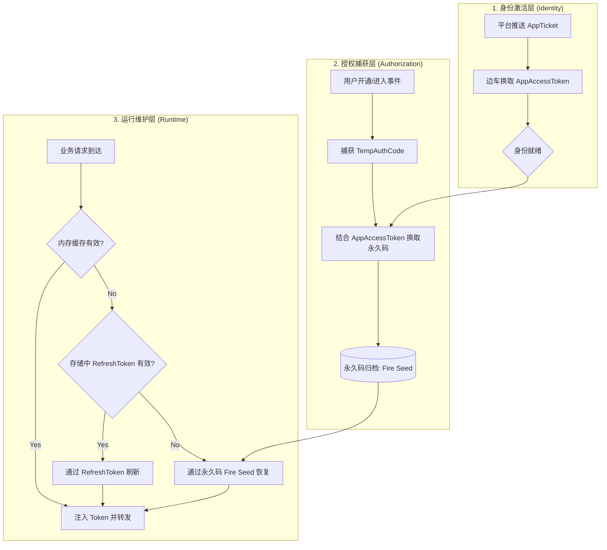

# 商店应用 (Store App) Token 全生命周期维护指南

本指南详细描述了边车（Sidecar）如何通过“根凭证托管”与“静默续期”机制，实现商店应用模式下 Token 的全自动维护，确保业务系统在多租户环境下的授权无感与高可用。

---

## 1. 生命周期阶段概览

Token 的生命周期分为三个核心阶段：**身份建立（种子阶段）**、**授权固化（树干阶段）**、**业务运行（果实阶段）**。

| 阶段 | 关键动作 | 产出物 | 存储策略 |
| :--- | :--- | :--- | :--- |
| **阶段 A：身份建立** | AppTicket 推送 -> 换取令牌 | `AppAccessToken` | 临时缓存 + Vault |
| **阶段 B：授权固化** | 临时授权码 -> 换取永久码 | `PermanentAuthCode` | **永久归档 (Vault)** |
| **阶段 C：业务运行** | 永久码/刷新令牌 -> 换取访问令牌 | `AccessToken` | 分层缓存 (Memory/Vault) |

---

## 2. 全生命周期流程图 (The Lifecycle Flow)

---

## 3. 核心机制详解

### 3.1 凭证的“火种”机制 (The Fire Seed)
在全生命周期中，**永久授权码 (PermanentAuthCode)** 被定义为“火种”。
*   **特性**：除非用户卸载应用，否则永久码不会失效。
*   **价值**：它是边车实现 **“零人工干预”** 的核心。当由于网络抖动、系统重启导致 AccessToken 和 RefreshToken 全部丢失或过期时，边车会自动利用“火种”瞬间重新生成整个授权链路。

### 3.2 分层缓存与持久化 (Layered Storage)
为了平衡性能与安全性，Token 在生命周期中存储在不同层级：
1.  **L1 内存层 (Fast)**：存储当前活动的 `AccessToken`，响应业务请求的毫秒级注入。
2.  **L2 加密存储层 (Vault)**：存储 `RefreshToken` 和 `PermanentAuthCode`，确保进程重启后能够无感恢复。
3.  **三元组索引隔离**：所有存储均以 `AppKey:OrgID:UserID` 为索引，确保多租户数据物理隔离。

### 3.3 静默续期与自愈 (Self-Healing)
边车在 Token 生命周期的“衰老期”（即过期前）执行以下动作：
*   **预警刷新**：在 `expires_in` 剩余 15% 时间时，利用 `refresh_token` 主动轮换新令牌。
*   **硬恢复**：若刷新失败（如 RT 也过期），边车会执行 **“硬恢复策略”**，调用 `oauth2/token (grant_type=permanent_code)` 接口，实现授权链条的完全闭环。

---

## 4. 存储 Key 规范 (Audit Reference)

| 实体 | 存储 Key 模板 | 说明 |
| :--- | :--- | :--- |
| **企业永久码** | `org_permanent_code` | 全局 profile 级别 |
| **用户永久码** | `user_permanent_code_{AppKey}_{OrgID}_{UserID}` | 精细化隔离索引 |
| **用户令牌对** | `oauth2_token_pair_user_{AppKey}_{OrgID}_{UserID}` | 包含 AT, RT, 过期时间 |

---

## 6. 有效期管理与保鲜策略 (Validity & Freshness)

为了确保业务调用的“零报错”，边车对不同凭据实施了差异化的有效期管理：

### 6.1 凭据有效期矩阵

| 凭据类型 | 典型有效期 | 保鲜手段 | 失效后果 |
| :--- | :--- | :--- | :--- |
| **AppAccessToken** | 2 小时 | 预判刷新 (提前 10min) | 无法执行任何授权交换 |
| **UserAccessToken** | 2 小时 | 预判刷新 / 永久码恢复 | 业务请求 401 |
| **RefreshToken** | 30 天 / 永久 | 随 AccessToken 轮转 | 需要使用永久码重新激活 |
| **PermanentAuthCode** | 长期有效 | **无需维护** (唯一锚点) | 用户卸载应用 (不可自愈) |

### 6.2 预判式刷新机制 (Proactive Refresh)
边车采用“请求驱动+预判执行”的策略，确保令牌在任何时刻都是新鲜可用的。

#### 6.2.1 亚健康窗口计算 (Pre-emptive Window)
边车为每个令牌计算一个 **“亚健康阈值”**：
*   **计算公式**：`T_refresh = T_expiry - (T_total * 15%)` 或固定提前 **10 分钟**。
*   **逻辑控制**：当业务请求到达，系统检测到 `Now >= T_refresh` 时，即标记该令牌进入“亚健康状态”，立即触发异步或同步刷新流程。

#### 6.2.2 分布式并发锁定 (Concurrency Control)
为了防止在多实例部署（如 K8s 多副本）下出现“惊群效应”（多个边车同时去平台刷新同一个令牌），边车引入了 **存储层级锁**：
1.  **原子性判定**：边车在发起刷新前，会尝试在存储层（如 Vault/Redis/SQL）设置一个具备极短 TTL 的 `REFRESH_LOCK`。
2.  **单者胜出**：只有获得锁的实例才会真正向平台发起网络请求。其他实例将进入微小的等待重试循环，直接复用获胜者产生的最新令牌。

#### 6.2.3 令牌原子替换与静默切换
1.  **双写策略**：新令牌获取后，边车会以原子操作同时更新 **内存 L1 缓存** 和 **持久化 L2 存储**。
2.  **平滑切换**：正在处理中的陈旧请求会继续使用旧令牌完成本次调用，而 **新到达的请求** 会瞬间切换到新令牌。这种“新旧交替”过程在毫秒内完成，对业务逻辑层完全透明。

#### 6.2.4 审计与观测 (Observability)
每次预判刷新都会产出一条审计日志，包含：
*   `event: token_rotate`
*   `trigger: proactive_window`
*   `latency: <REFRESH_MS>`
这为运维人员监控授权链路的稳定性提供了最直接的数据支撑。

### 6.3 阶梯式自愈流程 (Escalation)
当边车发现 Token 不新鲜时，会执行以下阶梯式保鲜逻辑：
*   **Step 1 (高速路径)**：从内存/Fast Vault 获取，若接近过期，进入 Step 2。
*   **Step 2 (常规路径)**：利用 `refresh_token` 发起 OAuth2 刷新。
*   **Step 3 (兜底路径)**：若 Step 2 失败（如 RT 也过期），利用 `PermanentAuthCode` 发起“硬恢复”，重新初始化整个令牌对。

---

## 8. 令牌换取方式与触发条件矩阵 (Exchange Methods & Triggers)

本表定义了边车在不同生命周期阶段的行为准则：

| 换取方式 (Action) | 输入凭据 (Input) | 输出目标 (Output) | 核心触发条件 (Trigger Condition) |
| :--- | :--- | :--- | :--- |
| **应用身份激活** | `AppTicket` | `AppAccessToken` | 接收到平台推送的动态 Ticket 事件。 |
| **企业授权固化** | `TempAuthCode` | `PermanentAuthCode` | 捕获到企业开通应用或进入应用时的临时码推送。 |
| **用户初始化授权** | `UserAuthCode` | `UserAT` + `UserPermanentCode` | 用户首次登录或执行 OAuth2 授权操作，边车拦截到回调 code。 |
| **常规静默续期** | `RefreshToken` | `New UserAT` | 令牌进入 **“亚健康窗口”** (通常为过期前 10 分钟)。 |
| **硬核灾难恢复** | `PermanentAuthCode` | `New UserAT` | **双失场景**：AccessToken 和 RefreshToken 均失效/缺失。 |

### 8.1 触发场景深度解析

1.  **事件驱动触发 (Event-Driven)**：
    *   这是边车的“被动防御”模式。当平台通过 WebSocket 或回调推送 `Ticket` 或 `TempCode` 时，边车必须立即响应，否则授权链条将从源头断裂。
2.  **流量驱动触发 (Traffic-Driven)**：
    *   这是最常见的触发方式。当业务流量携带 `user-id` 到达边车时，边车根据令牌的“新鲜度”决定是直接透传、异步刷新还是现场恢复。
3.  **自愈驱动触发 (Self-Healing)**：
    *   当边车发现存储中的令牌对已完全不可用（如 RT 超过 7 天失效），它会启动“硬核恢复”，利用持久化的“火种”向平台申请全新的令牌生命周期。

---

## 9. 总结

通过对 Token 全生命周期的精细化管理，边车将原本脆弱的、具有时效性的令牌，转化为了 **稳健的、具备自我修复能力的云原生身份标识**。业务系统只需关注业务逻辑，所有的“令牌续期、凭证固化、灾难恢复”均由边车在全生命周期内闭环处理。
