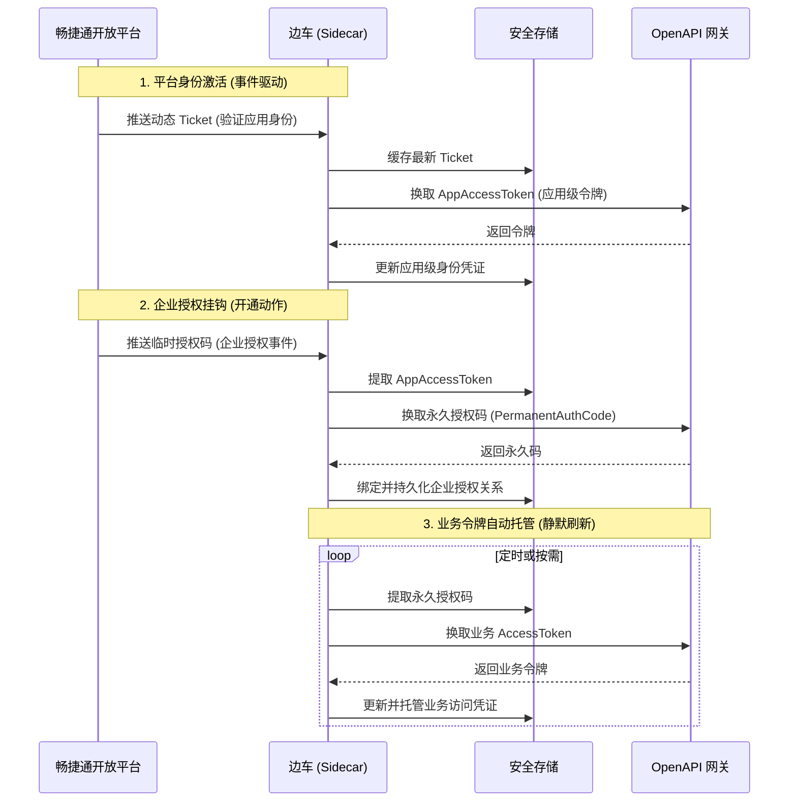
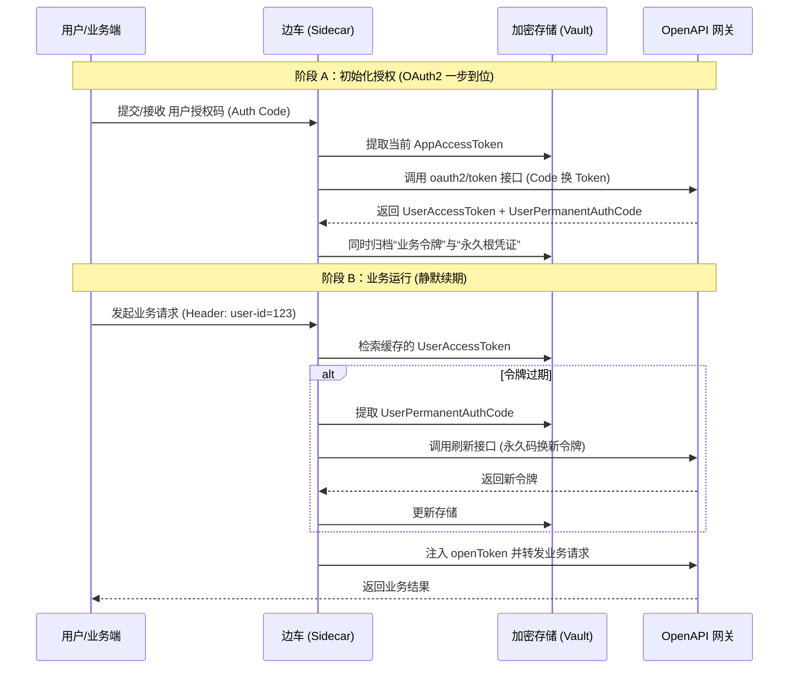

# 开放平台商店应用 (Store App) Token 维护逻辑架构

本手册描述了边车（Sidecar）在商店应用模式下处理“多级授权”与“自动续期”的通用逻辑架构。该架构旨在实现企业级凭据的零人工干预管理。

## 1. 授权实体分层模型

商店应用的授权体系由三层凭据组成，层层递进：

| 凭据层级 | 核心凭据 | 作用域 | 说明 |
| :--- | :--- | :--- | :--- |
| **平台身份层** | `AppTicket` / `AppAccessToken` | 应用全局 | 证明“我是谁”。用于后续所有的授权交换动作。 |
| **企业授权层** | `PermanentAuthCode` (永久授权码) | 企业租户 | 证明“企业授权了我”。是获取业务 Token 的长期钥匙。 |
| **业务访问层** | `AccessToken` (Org / User) | 业务资源 | 证明“我有权访问数据”。调用具体 OpenAPI 时使用的令牌。 |

---

## 2. 广义业务流转图



---

## 3. 关键逻辑机制

### 3.1 零信任身份握手 (Identity Handshake)
边车不依赖静态的凭据，而是通过 **“推拉结合”** 的方式维护应用身份：
*   **推**：实时接收平台推送的动态 Ticket。
*   **拉**：利用动态 Ticket 换取具备时效性的 `AppAccessToken`，作为后续操作的身份底色。

### 3.2 级联自动授权 (Cascading Authorization)
当企业用户在应用商店执行“开通”动作时，边车会自动捕获瞬间失效的“临时授权码”，并在后台自动完成向“永久授权码”的转换。

---

## 4. 用户级 Token (User Token) 的精细化维护

在商店应用模式下，边车通过 OAuth2 协议实现用户级令牌的自动化管理。

### 4.1 用户授权全流程图 (End-to-End Flow)

该流程展示了如何通过标准的 `code` 换取行为，一步到位地获取永久码与访问令牌：



### 4.2 核心机制详解

#### 4.2.1 原始凭据的“一次性获取”
在用户授权维度，`User Permanent Auth Code` 的获取与首次 `User AccessToken` 的产生是**合二为一**的：
*   **接口对齐**：通过调用 `oauth2/token` 接口，边车在响应报文中即可同时获得用于当前访问的令牌和用于长期续期的永久码。
*   **持久化意义**：永久码作为用户身份的“根令牌”被归档，确保了即使 AccessToken 过期，边车也能在后台自主完成续期，无需用户再次确认。

#### 4.2.2 双重锚定身份模型
业务运行阶段的令牌派生基于：
*   **根凭据**：`User Permanent Auth Code`。
*   **上下文**：`UserID`。

#### 4.2.3 三元组空间隔离 (Isolation)
存储层采用 **AppKey : OrganizationID : UserID** 复合索引，确保多租户环境下用户数据的物理隔离与安全。

---

## 5. 接口契约参考 (API Contracts)

### 5.1 获取应用访问令牌 (AppAccessToken)
*   **接口地址**：`/auth/appAuth/getAppAccessToken`
*   **请求示例**：
    ```json
    {
      "appTicket": "<DYNAMIC_APP_TICKET>"
    }
    ```
*   **响应示例**：
    ```json
    {
      "result": {
        "appAccessToken": "<APP_ACCESS_TOKEN>",
        "expireTime": 7200
      },
      "code": "200",
      "message": "成功"
    }
    ```

### 5.2 换取企业永久授权码 (PermanentAuthCode)
*   **接口地址**：`/auth/orgAuth/getPermanentAuthCode`
*   **请求示例**：
    ```json
    {
      "tempAuthCode": "<TEMP_AUTH_CODE_FROM_STREAM>",
      "appAccessToken": "<CURRENT_APP_ACCESS_TOKEN>"
    }
    ```
*   **响应示例**：
    ```json
    {
      "result": {
        "appName": "accounting",
        "appId": "59",
        "permanentAuthCode": "<PERMANENT_AUTH_CODE>",
        "orgId": "90001198862"
      },
      "code": "200",
      "message": "成功"
    }
    ```

### 5.3 用户 OAuth2 授权换票 (Token 接口)
*   **接口地址**：`/oauth2/token`
*   **请求参数** (application/x-www-form-urlencoded)：
    *   `grant_type`: `authorization_code`
    *   `client_id`: `<APP_KEY>`
    *   `code`: `<USER_TEMP_CODE>`
*   **响应示例**：
    ```json
    {
      "access_token": "<ACCESS_TOKEN>",
      "refresh_token": "<REFRESH_TOKEN>",
      "expires_in": 7200,
      "user_id": "user_001",
      "org_id": "org_999",
      "user_auth_permanent_code": "<USER_PERMANENT_CODE>..." 
    }
    ```
    > **注意**：响应中的 `user_auth_permanent_code` 即为后续维护用户 Token 的“火种”。

---

## 6. 总结

本架构通过将“长效凭据（永久码）”与“瞬时上下文（用户ID）”相结合，构建了一套兼具稳定与灵活的令牌维护体系。它将复杂的 OAuth2 协议细节（如 code 换 token 时同步下发永久码）封装在边车内部，为业务系统提供了极其简单的开发体验。
