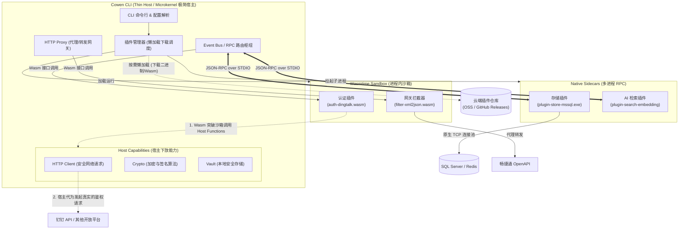

# Cowen CLI 插件化架构演进探索 (Wasm & RPC 方案)

> [!NOTE]
> 本文档记录了关于将 `cowen` CLI 的插件系统向 WebAssembly (Wasm) 或 RPC 独立进程演进的架构推演与讨论。当前为概念设计阶段，暂不实施。

## 1. 背景与目标

当前 `cowen` 使用动态链接库 (`.dylib`, `.so`) 作为插件（如 `embedding-search`）。这种模式在实际分发中面临严重的架构不兼容问题（如 Mac 上的 `arm64` 与 `x86_64` 冲突），且存在内存安全风险。

**重构目标**：
1. **跨平台与 0 兼容性问题**：Write once, run anywhere。
2. **安全沙箱**：隔离第三方插件，防止宿主崩溃或越权访问。
3. **坚守 0 运行时依赖**：用户安装 `cowen` 时，不应被强制要求手动安装 C++ 运行库或特定硬件驱动（如 `wasmedge-ggml`）。

## 2. 核心架构困境与解法 (胖宿主 vs 胖插件)

对于涉及重型计算（如 AI Embedding）的插件，存在经典的架构两难：

### 方案一：胖宿主 + 瘦插件 (推荐)
* **思路**：摒弃外部依赖极重的 WasmEdge WASI-NN，改用纯 Rust 的 **Wasmtime** 运行时。在 `cowen` (宿主) 内部静态集成极轻量的纯 Rust ML 框架（如 HuggingFace Candle）。
* **通信**：宿主对外暴露 Host Function `cowen_host_embed(text)`。插件 (`.wasm`) 只负责业务逻辑组装，遇算力需求直接调宿主。
* **优劣**：实现了真·0依赖，且 Wasm 跨平台。代价是 `cowen` 宿主二进制体积会膨胀约 10-20MB。

### 方案二：按需懒加载的 RPC Sidecar 进程 (企业级终极解法)
* **思路**：对于重度依赖硬件或底层 C 库的插件，完全放弃 Wasm，采用 **独立可执行文件 + 标准输入输出 (RPC)**。
* **流程**：用户执行 `cowen plugin enable <name>` 时，CLI 根据当前 OS/Arch 从云端自动下载独立的插件二进制文件到 `~/.cowen/plugins/bin/`。
* **优劣**：宿主保持极度精简 (0 膨胀)，插件进程彻底解耦。这是目前 Terraform、LSP、Cursor 采用的主流架构。

**架构结论**：
* **重度原生插件（AI、GPU、数据库引擎）** ➡️ 采用 RPC Sidecar 架构。
* **轻量级逻辑插件（数据流转换、鉴权、路由）** ➡️ 采用 Wasmtime 架构。

## 3. Cowen 的 Wasm 插件化推荐切入点

以下是建议优先进行 Wasm 插件化改造的核心业务场景，这些场景属于典型的“数据流中间件”，完美契合 Wasm 的强项。

### 🥇 优先级 1：代理网关的请求/响应拦截器 (API Gateway Filters)
* **场景**：用户需要自定义 Headers 剥离、请求体 XML 转 JSON、响应结果字段脱敏等。
* **设计**：借鉴 Envoy Proxy-Wasm，在代理流中挂载 `.wasm` 拦截器。插件暴露 `on_request_body` 和 `on_response_body` 接口，实现极速的动态路由和报文改造。

### 🥈 优先级 2：自定义验证与鉴权 (Custom Auth Providers)
* **场景**：扩展现有的 `self_built`, `oauth2`, `store_app` 模式，允许大型企业通过插件无缝接入内部 SSO 或其他云厂商（如钉钉、企业微信）的开放平台认证体系。
* **设计**：将在第 4 节深入推演。

### 🥉 优先级 3：Webhook 事件负载转换器 (Payload Transformer)
* **场景**：本地 ERP 或飞书机器人所需的 JSON 格式与畅捷通开放平台推送的格式不一致。
* **设计**：用户编写一个 Wasm 插件专门处理 JSON 映射，`cowen` 在 Forwarder 模块调用插件，直接把转换后的数据 Push 给目标端，免去用户自建中间件服务的成本。

## 4. 深入场景：多平台 Auth Provider 插件设计推演 (以钉钉为例)

如果我们要通过 Wasm 插件实现对钉钉 API 的认证和代理，其架构抽象（基于 Wasm Component Model / WIT）如下：

### 4.1 统一的 WIT 接口标准
所有鉴权插件必须实现一套跨语言的 Wasm 接口协议：

```wit
package cowen:auth;

interface provider {
    /// 1. 动态配置声明：插件通知宿主需要哪些特有配置字段
    /// (例如返回 ["dingtalk_corp_id", "dingtalk_app_secret"])
    required-config-keys: func() -> list<string>;

    /// 2. Token 获取逻辑：宿主调用以获取最新 Token 供缓存
    get-token: func(config: string) -> result<string, string>;

    /// 3. 请求拦截改造：在发包前，向请求体/Header注入平台特有签名或 Token
    intercept-request: func(req: http-request) -> http-request;

    /// 4. 目标网关重定向：将请求路由到钉钉的 OpenAPI 域名
    target-domain: func() -> string;
}
```

### 4.2 宿主能力下放 (Host Functions)
为了让 `dingtalk.wasm` 能在沙箱内完成任务，`cowen` 宿主必须向 Wasm 注入核心底层能力：
1. **网络通信能力**：下放一个安全的 HTTP Client (如基于 `wasi-http`)，因为钉钉插件需要调用 `/gettoken` 接口拉取凭证。
2. **加密基建**：下放 HMAC-SHA256 等加密方法，供插件在 `intercept-request` 阶段计算 `x-acs-dingtalk-signature`。

### 4.3 执行流闭环
1. 用户执行 `cowen profile use dingtalk`。
2. `cowen` 加载 `dingtalk.wasm`，调用 `required-config-keys` 并引导用户输入企业 ID 等信息保存到 Vault。
3. 用户调用 `cowen api GET /v1.0/user/me`。
4. `cowen` 将请求交给插件的 `intercept-request`，插件利用宿主下放的 Crypto 能力计算签名并塞入 Headers。
5. `cowen` 获取插件返回的 `target-domain`，将请求打向 `api.dingtalk.com`。

这种架构能将 `cowen` 从单平台的 CLI 跃升为**统一的多云生态连接器**。

## 5. 补充：为什么 Store 扩展 (如 mssql) 必须采用 RPC Sidecar？

对于需要扩展底层数据存储（如 DLQ 存入 SQL Server `mssql`、PostgreSQL 或企业内部缓存）的场景，**强烈建议不要使用 Wasm，而是采用基于 gRPC/JSON-RPC 的独立进程 (Sidecar) 模式**。

### 5.1 Wasm 的底层局限性
1. **TCP/TLS Socket 限制**：数据库驱动（如 `sqlx`, `tiberius`）重度依赖底层的原生 TCP 连接池和异步 I/O (epoll)。将其编译为 `wasm32-wasi` 极易遭遇缺少 OS 系统调用和 TLS 证书链处理的问题。
2. **驱动依赖过于庞大**：包含各种序列化和连接管理代码的数据库驱动体积庞大，编译为 Wasm 会导致加载缓慢，违背轻量中间件初衷。

### 5.2 最佳实践：基于 STDIO 的 RPC 独立进程
参考 HashiCorp Vault 的存储后端插件设计：
* **架构**：为 `mssql` 编译一个完全独立的跨平台可执行文件（`cowen-store-mssql`）。该可执行文件原生包含全部驱动，没有任何沙箱限制。
* **通信机制**：宿主 `cowen` 通过 `std::process::Command` 启动该进程。双方不走外部网络通信，直接通过标准输入输出 (`stdin/stdout`) 管道，使用 JSON-RPC 或 gRPC 进行指令交互。
* **接口示例**：
  宿主只需发送 `{"method": "store.dlq.save", "params": {...}}`，插件进程收到后利用原生连接池写入数据库，并向标准输出返回成功状态。
* **极致稳定性**：如果数据库连接池死锁或内存泄漏，崩溃的只是插件子进程，`cowen` 主进程可以平滑捕获并重启它。

### 总结法则
* **改变数据流、无状态、拦截请求 ➡️ 用 Wasm**
* **建立 TCP 连接池、操作重型数据库、有状态存储 ➡️ 用 RPC 独立进程**

## 6. 未来演进蓝图：完全的“瘦宿主 + 胖插件”微内核架构



如果您决定将 `cowen` 全面推向**“瘦宿主 (Thin Host) + 胖插件 (Fat Plugin)”**的方向，未来的 `cowen` 将不再是一个具体的业务工具，而会演化为一个**通用基础设施基座 (Microkernel Architecture)**。

### 6.1 核心理念：宿主退化为纯粹的“调度器”
未来的 `cowen` 二进制文件体积可能只有 5MB，它将剥离所有畅捷通特有的业务逻辑。
它的**唯三**核心职责是：
1. **CLI 交互与配置解析**（解析用户的终端命令、读取基础 Yaml 配置）。
2. **插件生命周期管理**（负责向云端查询、下载、缓存、启动、停止和监控各种插件）。
3. **RPC 路由与事件总线**（作为主控节点，把各个插件连接起来，让数据在插件之间流转）。

### 6.2 繁荣的胖插件生态 (Plugin Ecosystem)
所有核心业务能力，全部剥离为独立插件。开发者就像在玩乐高积木一样组装 `cowen`：
* **认证插件群 (Auth)**：`plugin-auth-chanjet.wasm`, `plugin-auth-dingtalk.wasm`, `plugin-auth-wecom.wasm`
* **存储插件群 (Store)**：`plugin-store-sqlite` (内置), `plugin-store-mssql.exe`, `plugin-store-redis`
* **网关过滤器 (Gateway)**：`plugin-filter-ratelimit.wasm`, `plugin-filter-xml2json.wasm`, `plugin-filter-log.wasm`
* **AI 增强群 (AI/Search)**：`plugin-search-local-embedding` (静态链接了 ML 推理框架的原生可执行文件)

### 6.3 极致的终态用户体验 (懒加载架构)
当架构演进到这一步，用户的使用体验将发生质的飞跃：
1. **极简安装**：用户无论需要对接什么系统，最初下载的永远是那个 5MB 的纯净版 `cowen` 二进制。
2. **声明式环境准备**：用户执行一条命令 `cowen init --template erp-to-dingtalk`。
3. **按需热插拔**：`cowen` 宿主在后台默默地从对象存储下载 `auth-dingtalk` 和 `store-mssql` 插件到 `~/.cowen/plugins/`，并瞬间拉起。
4. **瞬间变形**：前一秒 `cowen` 还是一个空壳，下一秒它就变成了一个完美适配“钉钉鉴权 + SQL Server 死信存储”的企业级连接器。

### 6.4 架构终局评估
走向**“瘦宿主 + 胖插件”**是软件工程中极为高级且优美的形态（正如 VS Code、Terraform、Envoy 所走过的路）。
它意味着 `cowen` 彻底**突破了业务边界的限制**，任何人都可以为其编写插件来代理自己的业务系统。只要制定好 **WIT (Wasm 接口)** 和 **JSON-RPC (进程接口)** 这两套核心契约，`cowen` 甚至有可能成为开源界极具竞争力的多云数据桥接中间件。
