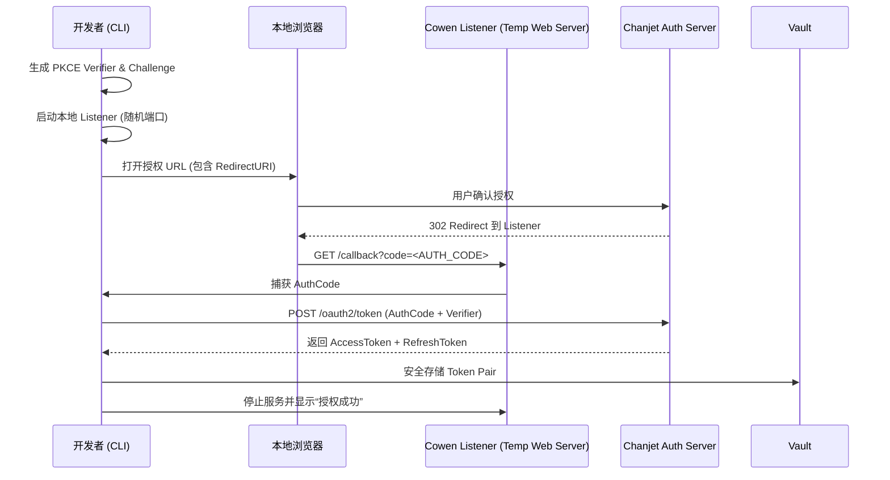

# 鉴权流程详情：标准 OAuth2 (三方授权)

标准 OAuth2 模式遵循 RFC 6749 规范，并集成了 **PKCE (Proof Key for Code Exchange)** 以增强安全性，特别适用于命令行工具环境。

## 流程特性

- **PKCE 支持**: 自动生成 `code_verifier` 和 `code_challenge`，防范中间人攻击。
- **本地回调监听**: 自动启动临时 Web 服务（Callback Listener）接收授权码。
- **令牌自动滚动**: 利用 `RefreshToken` 实现长达数月甚至永久的免登录体验。

## 交互流程图

## 实现细节

### 1. PKCE 实现
`cowen` 在每次 `init` 或 `auth login` 时，会生成一个 64 字节的随机字符串作为 `verifier`，并计算其 SHA256 哈希值作为 `challenge`。平台在兑换令牌时会验证 `verifier`，确保换票请求确实来自发起授权的同一个 CLI 实例。

### 2. 令牌自动刷新 (Rotation)
- **AccessToken**: 有效期通常为 2 小时。
- **RefreshToken**: 有效期通常为 7 天或更久。
Daemon 进程会监控 `AccessToken` 的剩余寿命。当剩余时间不足 15 分钟时，会自动调用 `refresh_token` 接口。每次刷新成功后，平台可能会返回一个新的 `RefreshToken`（即旋转机制），`cowen` 会同步更新 `Vault`。

### 3. 多进程并发控制
在执行令牌刷新时，`cowen` 使用 **文件锁 (File Lock)** 确保在同一台机器上，即使有多个并发请求或多个 CLI 实例，也只有一个实例在执行网络刷新操作，避免 `RefreshToken` 因竞争而失效。

## 故障处理
- **invalid_grant**: 通常意味着 `RefreshToken` 已失效（如用户修改了密码或手动撤销了授权）。此时 CLI 会提示用户重新运行 `cowen auth login`。
- **4029 (Session Timeout)**: 意味着登录会话已彻底过期，需要重新初始化环境。
