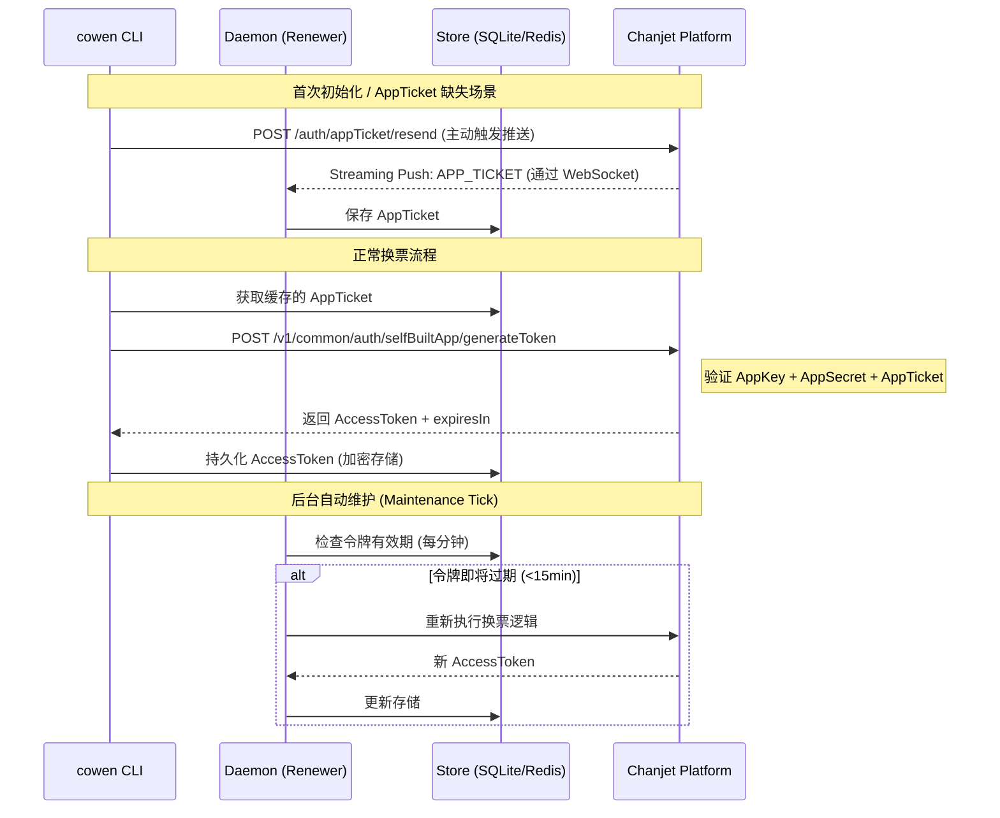

# 鉴权流程详情：自建应用 (Self-Built)

自建应用模式（Self-Built）适用于开发者拥有自己的 AppKey 和 AppSecret，且能够直接与畅捷通开放平台 API 通信的场景。

## 核心概念

- **AppTicket**: 由开放平台定期推送的安全性凭证，用于在换取 `AppAccessToken` 时证明身份。
- **AppAccessToken**: 最终用于调用业务接口的令牌。

## 交互流程图

## 实现细节

### 1. 换票逻辑 (`exchange_token`)
自建应用模式下，`cowen` 会尝试从本地 `Store` 读取 `AppTicket`。如果 `AppTicket` 不存在，系统会执行指数退避策略并等待后台 Daemon 接收推送。如果等待超时，CLI 会尝试调用 `resend` 接口强制平台推送。

### 2. 安全性保障
- **AppSecret**: 绝不以明文形式存储，必须经过 `Vault` 使用机器指纹加密后存入 `Secret Domain`。
- **传输加密**: 所有换票请求均通过 HTTPS 进行，并在 Header 中注入身份标识。

### 3. 守护进程的作用
在自建应用模式下，Daemon 的主要职责是：
- **消息桥接**: 维持 WebSocket 连接以接收 `AppTicket`。
- **自动续约**: 轮询令牌状态，确保 CLI 在调用时始终能命中缓存。

## 常见问题
- **Q: 为什么提示 Missing AppTicket?**
  - A: 平台推送可能存在延迟，或者 Daemon 进程未启动。请确保运行了 `cowen daemon start`。
