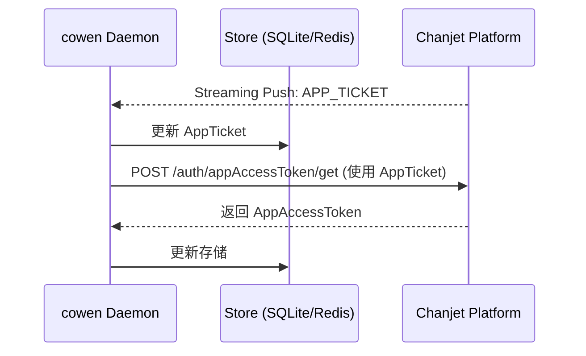
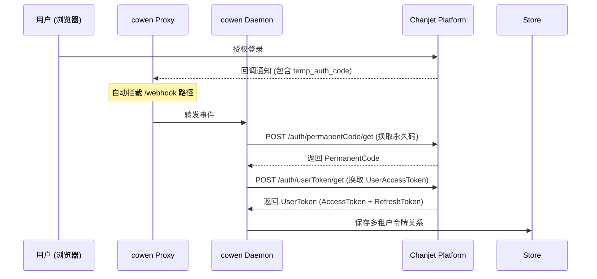

# 鉴权流程详情：商店应用 (StoreApp / Sidecar)

商店应用模式（StoreApp）通常以 Sidecar 模式运行，支持多租户场景，并能自动处理来自平台的多种异步事件。

## 核心能力

- **多令牌管理**: 同时维护 `AppAccessToken`（应用级）和 `UserAccessToken`（用户/组织级）。
- **Webhook 劫持**: 在 Proxy 模式下自动拦截并处理平台的回调。
- **自动码兑换**: 自动将 `TempAuthCode` 兑换为永久授权码或令牌。

## 交互流程图

### 1. 应用级令牌 (AppAccessToken) 维护

### 2. 用户授权 (TempAuthCode) 自动兑换

## 实现细节

### 1. Webhook 拦截机制
当启用 `cowen daemon start --proxy-port` 后，`StoreAppProvider` 会拦截所有以 `/webhook` 结尾的 POST 请求：
- **APP_TICKET**: 自动更新本地票据池，无需主应用处理。
- **TEMP_AUTH_CODE**: 自动启动兑换流程，实现静默授权。

### 2. 多租户令牌池
`cowen` 的 `Store` 协议支持按 `org_id` 存储不同的令牌。对于商店应用，系统会自动管理成百上千个组织的令牌续约，开发者只需通过 Proxy 访问，系统会根据请求上下文自动注入正确的令牌。

### 3. 令牌自愈
如果 `UserAccessToken` 失效（401），Proxy 会尝试使用 `RefreshToken` 进行同步刷新，如果刷新失败，则通知主应用重新引导用户授权。

## 配置要求
- 必须配置 `encrypt_key` 用于解密平台推送的消息体（如果启用了加密）。
- 建议在分布式环境下使用 `Redis` 作为 `Store` 后端，以共享多租户令牌状态。
