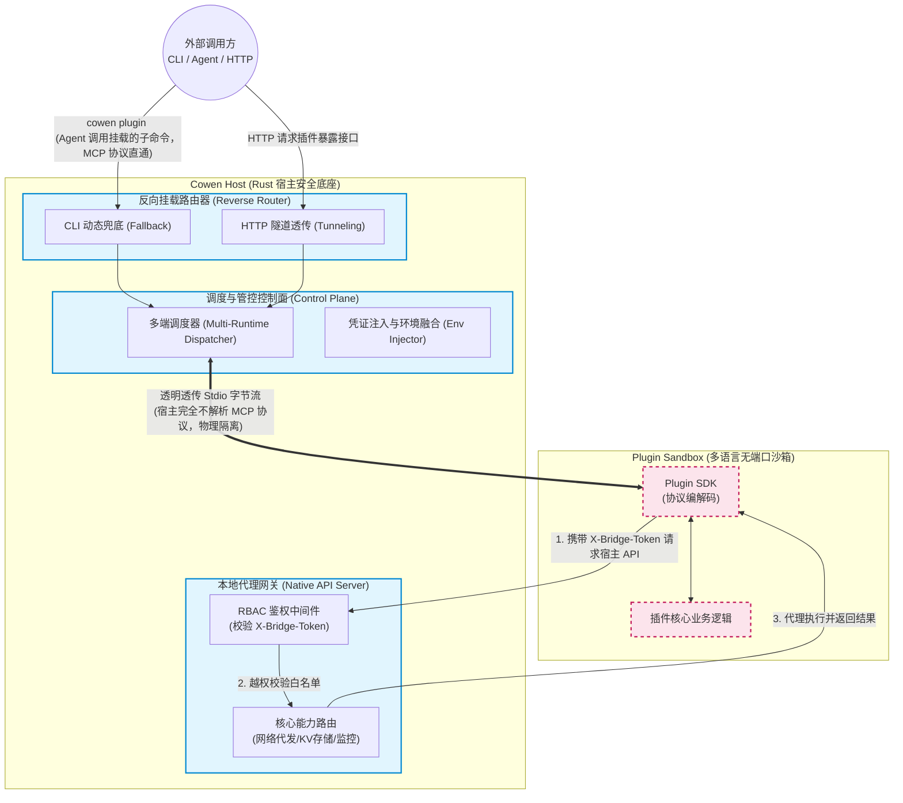
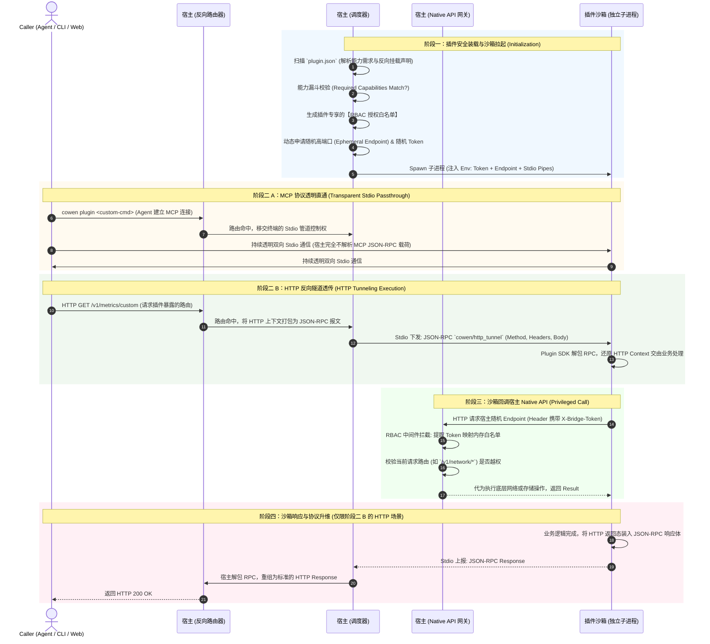

# 宿主统一代理与通用插件管控设计 (Generic Plugin Host Design)

本文档详细描述了 `cowen` 作为“通用插件宿主底座 (Universal Plugin Host Foundation)”的核心架构职责。为了最大程度降低任意多语言三方插件的开发成本与安全风险，宿主摒弃了将网关逻辑下放到插件的做法，而是将绝大部分底层复杂逻辑（如鉴权、路由、凭证管理、进程隔离、生命周期）收拢到了 Rust 核心常驻服务中。

虽然目前该设计被成熟运用于 MCP (Model Context Protocol) 插件的渐进式接入，但其底层的管控哲学完全是一个**高度通用化的多语言插件沙箱架构**。

本报告旨在针对 `cowen` CLI 未来向第三方开放插件生态，特别是面向 AI Agent 的 **MCP（Model Context Protocol）** 对接以及**指令集渐进式扩展**这一核心诉求，对现有的**动态链接库**、**WebAssembly (Wasm)** 以及 **RPC/Stdio 子进程**三种技术路线进行深度的物理架构对比与落地可行性评估。

### 宿主全局管控架构图 (Host Global Control Architecture)

---

## 1. 统一接管代理与进程管控 (Universal Process & Wrapper Management)

宿主完全接管了外部调用方（如 AI Agent 或 CLI 终端）与底层插件之间的通信生命周期。结合上方的架构图，整个底座被严格划分为四大逻辑模块：

1.  **反向挂载路由器 (Reverse Router)**：调用方不再需要执行类似 `cowen plugin run <id>` 这样暴露底层的僵硬命令。插件可以通过声明式配置将自身的能力挂载为 `cowen` 的原生子命令（如 `cowen mcp-github`）或 HTTP 路由。当外部流量打入时，由宿主的动态路由（CLI Fallback / HTTP Tunnel）无缝捕获并移交控制权。
2.  **调度与管控控制面 (Control Plane)**：宿主根据路由匹配到的插件配置，安全拉起子进程。对于 Stdio 模式，宿主**完全不解析底层交互协议（如 MCP 的 JSON-RPC）**，而是作为一个“瞎子”直接对接 `stdin` 和 `stdout`，提供物理级隔离的透明透传隧道。
3.  **多语言无端口沙箱 (Plugin Sandbox)**：插件无需（也被禁止）在本地监听任何 TCP 端口。它仅仅是一个只通过 Stdio 说话的纯净子进程，依靠内部 SDK 完成协议解码与业务运算。
4.  **本地代理网关 (Native API Server)**：为了赋能“空壳”沙箱，宿主在侧边暴露出鉴权网关。子进程持一次性 Token 回调网关，安全地拉取宿主底层的特权能力。

**Stderr 结构化劫持与审计**：在此过程中，宿主会强制接管子进程的 `stderr` 流。任何插件内部的打印、崩溃堆栈或运行日志，都会被宿主精准捕获，并在追加 `[Plugin: <id>]` 标识后统一路由至宿主的本地结构化日志系统中，杜绝排障“全盲”。

---

## 2. 动态凭证安全内存透传 (Generic Memory Env Injection)

在传统的插件配置模式下，高危的认证凭证常常被迫静态写入到磁盘文件或用户全局配置中。而通用宿主架构实现了零落盘的安全分发：

*   **真实资产绝对防泄漏**：业务真实的数据库密码、用户 `<APP_SECRET>`、外部 `<ACCESS_TOKEN>` 等高价值凭证，宿主只在自身的安全内存区域（Keychain）中持有。**绝对禁止**将这些真实的敏感资产通过环境变量或任何方式传递暴露给插件子进程。插件必须是一个无法窃取资产的物理“空壳”。
*   **临时协商 Token 动态注入**：宿主在 `spawn` 拉起子进程的瞬间，仅在内存中随机生成一个一次性生命周期的 `COWEN_BRIDGE_TOKEN`（旁路内部网关的局部协商凭证），并通过系统级进程环境空间 (`envs`) 注入给插件。插件在动用特权网络或数据资产时，需持有此 Token 呼叫宿主的 Native API 代理层，由宿主在核心安全区代为拼装真实密钥完成请求转发。
*   **声明式非敏感配置合并 (Profile Merge)**：针对插件在 `plugin.json` 中声明的非敏感运行参数（如 `LOG_LEVEL`、`CACHE_DIR`），宿主会优先读取其 `default_config` 默认值，并与宿主当前活跃 `Profile` 配置文件中针对该插件的自定义重写配置进行 Merge。合并后的最终配置在子进程启动时统一作为环境变量注入，确保插件状态随宿主环境无缝切换。

---

## 3. 宿主原生管控 API 接口 (Host Native APIs)

为了让“空壳插件”具备强大的能力，宿主在本地按需暴露轻量的 HTTP / UDS 服务，充当插件的基础设施底座：

### 3.1 动态能力注册与发现 (Dynamic Capability Registry)
*   插件可以被动向宿主发起请求，拉取当前上下文中（基于用户权限与环境）可用的工具、API 或路由表。宿主根据权限动态返回，实现了插件能力的“渐进式自适应”。

### 3.2 统一安全网关代理 (Unified Security Proxy)
*   对于需要调用外网或核心资产的请求，插件作为无状态空壳，仅将“意图”和“参数”通过内部 RPC / HTTP 发给宿主。
*   **宿主侧基于 RBAC 的网关鉴权生命周期**：
    1.  **前置白名单生成**：插件扫描加载时，宿主比对 `plugin.json` 中的 `required_capabilities` 与宿主自身能力库，验证通过后，在内存中为该插件实例生成一份对应的**授权白名单集合 (Authz Whitelist)**。
    2.  **中间件拦截与防越权鉴权**：插件发起请求时，宿主的 HTTP Middleware 首先拦截请求，通过解析 Header 中的 `X-Bridge-Token` 识别出对应插件的内存白名单。随后，Middleware 提取请求的 URL 路由（如 `/v1/network/*`）并反向映射出其所属的能力组（如 `native.network.proxy`）。若该能力不在白名单集合内，则直接抛出 `HTTP 403 Forbidden` 拒绝访问，在网关入口处切断越权风险。
    3.  **网络代发与鉴权计算**：越权审查通过后，底层 Proxy 接管复杂的 URL 拼装，并在高安全内存区使用真实资产代为计算签名。
    4.  **结果代理**：向真实目标发起请求，将返回结果透明解密、安全审计后，再交还给插件。

### 3.3 本地基础设施能力支撑 (Local Infra)
宿主提供高度抽象的本地能力服务供插件调用，例如：
*   **向量检索/缓存**：提供统一的本地嵌入库（RAG）或 KV 缓存，避免每个插件重复引入厚重的数据库依赖。
*   **文件沙箱 IO**：为插件提供统一且受限的文件读写 API。

### 3.4 动态随机端点分配 (Ephemeral API Endpoint)
针对上述所有的本地旁路 API (Native APIs)，宿主坚决不复用现有的公用代理端口 (`proxy_port`) 或后台监听端口 (`monitor_port`)。
*   **一次一协商**：在拉起每一个插件子进程前，宿主都会在 `127.0.0.1:0` 上动态申请一个全新的随机端口（或分配独占的 Unix Domain Socket）。
*   **阅后即焚**：将该唯一端口组装为 URL 后通过环境变量 (`COWEN_API_ENDPOINT`) 注入子进程。当插件进程或宿主包装器退出时，该端口立刻销毁，从物理网络层级彻底杜绝端口冲突与横向越权风险。

---

## 4. 多租户上下文变形与进程隔离 (Tenant Morphing & Isolation)

系统支持多 Profile 档案（如 `dev`, `prod`, `tenant_a`），并提供通用的插件隔离生命周期：

1.  **自适应形态转换 (Context Morphing)**：当调用方切换 Profile 时，宿主内部的能力注册表热重载。通用插件在下次请求宿主 API 时，会获取到截然不同的能力集合（如从开发工具变更为生产监控工具），实现逻辑层面的“变脸”。
2.  **基于 Tenant Mode 的物理隔离**：
    *   **独占模式 (`exclusive`)**：宿主为每个 Profile 独立拉起一个全新的插件子进程，并通过环境变量硬锁死 `ACTIVE_PROFILE`。插件的所有行为天然具有强物理隔离、防串流保障，适合重状态插件。
    *   **共享模式 (`shared`)**：宿主全局仅维持一个轻量级插件常驻进程。宿主要求插件在请求 Native API 时必须携带显式的租户路径标识，由宿主核心网关在运行时动态审查越权行为。适合极轻量的无状态插件。

---

## 5. 声明式扩展点注入与反向协议翻译 (Declarative Contributions & Reverse Proxy)

宿主不仅支持标准的 MCP 工具调用，还提供了一个极其强大的“反向控制反转”机制。通过解析 `plugin.json` 中的 `contributes` 扩展点声明，宿主能在自身的控制面上为插件“代行挂载”，并在流量到达时进行**反向协议翻译 (Protocol Tunneling)**，确保插件本身维持绝对的“纯 Stdio 零端口沙箱”形态。

### 5.1 CLI 命令行反向挂载 (CLI Fallback)
1.  **挂载至 Plugin 命名空间拦截**：为了避免与 Cowen 原生的顶级指令发生冲突，所有插件声明的指令强制挂载在 `plugin` 子命令下。当用户调用扩展命令（如 `cowen plugin custom-cmd`）时，宿主会扫描各插件的 `contributes.cli_commands` 声明。
2.  **动态参数校验与代理执行**：校验参数后，宿主安全拉起插件子进程代办指令，将结果流式返回至终端，体验宛如内置命令。

### 5.2 HTTP 路由反向注入与隧道透传 (HTTP Tunneling)
如果插件希望能对外暴露原生的 Web API（如富网页或流式监控），宿主坚决不允许插件在本地绑定 TCP 端口或 UDS Socket，而是由宿主充当“协议翻译官”：
1.  **动态挂载**：宿主扫描 `contributes.http_routes`，在自身的 `monitor_port` 或 `proxy_port` 上动态注册 HTTP 路由（如 `/v1/metrics/custom`）。
2.  **降维打包 (HTTP -> JSON-RPC)**：外部 HTTP 流量到达后，宿主将其 HTTP Method、Headers 和 Body 打包成标准的 `cowen/http_tunnel` JSON-RPC 报文，通过 Stdio 塞给插件。
3.  **升维拆包 (JSON-RPC -> HTTP)**：插件处理完毕后，将状态码和返回值封装在 JSON-RPC Result 中返回，宿主解析后重组为原生 HTTP Response 返给外部调用方。
4.  **安全闭环**：该设计完美化解了“网络开放性”与“零端口安全沙箱”的矛盾。插件可以响应甚至处理 SSE/WebSocket 长连接（通过多次 JSON-RPC Notification 透传），但其物理形态始终是一个与网络隔离的纯净子进程。

---

## 6. 全局生命周期与隧道透传执行时序图 (Execution Sequence)

以下时序图完整展示了：宿主如何通过能力漏斗安全挂载插件，并在接收到外部 HTTP 请求时，通过隧道将请求降维传递给零端口沙箱，最后沙箱持 Token 回调宿主网关的闭环全过程。

