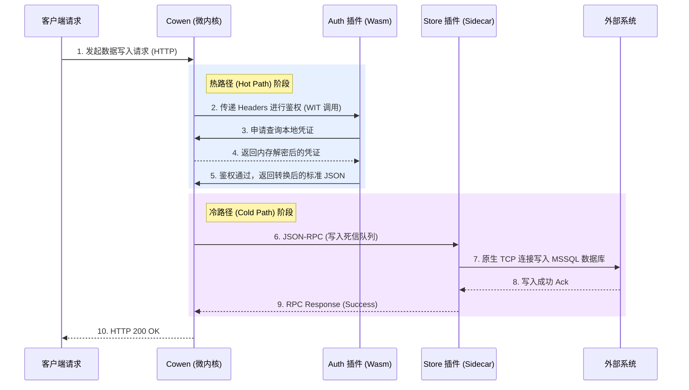
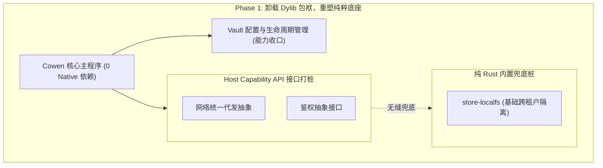
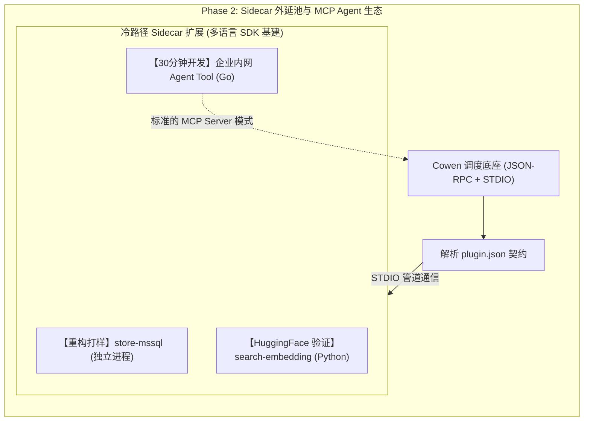
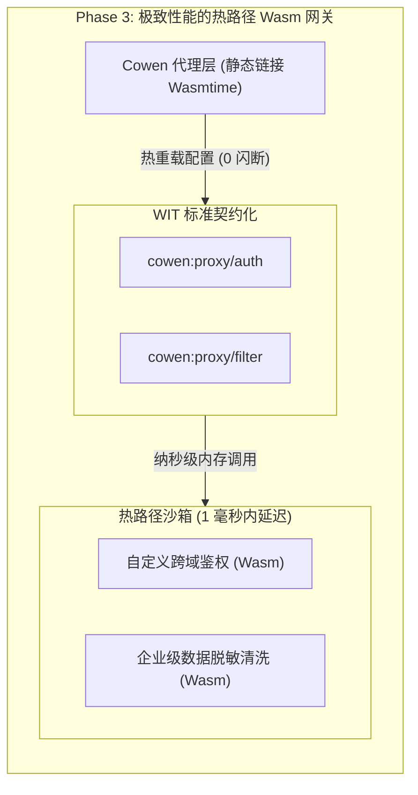
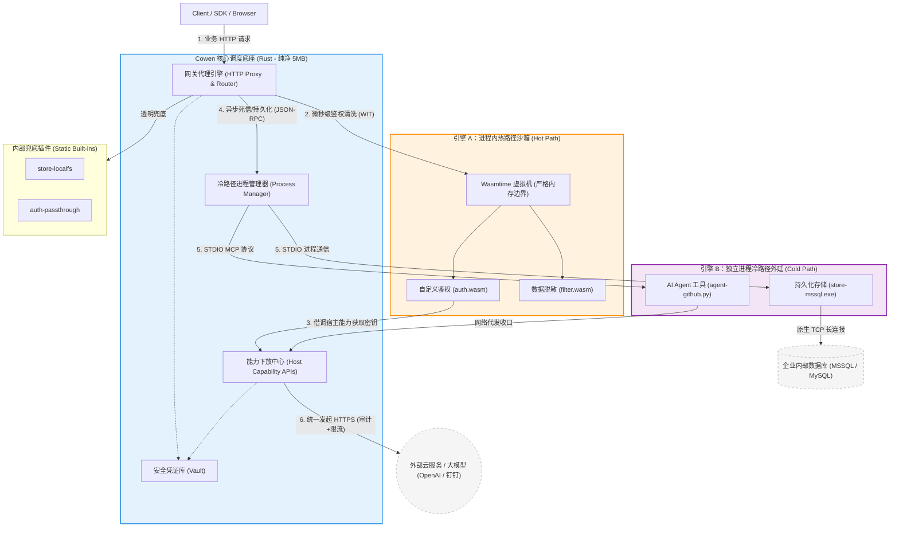

# Cowen 插件化基座架构白皮书 (Platform Architecture Whitepaper)

**版本**: v1.1.0
**状态**: Approved (核心架构纲领)
**背景**: 本白皮书旨在为 `cowen` CLI 从单一业务工具向通用型“微内核底座 (Microkernel Foundation)”的演进提供全景式的架构指导，彻底解决长尾业务集成、多平台部署分发、系统稳定性与安全沙箱之间的工程博弈。

---

## 核心术语释义 (Terminology)

为了更好地理解本文档中的架构设计，请先了解以下核心工程概念：

* **热路径 (Hot Path)**：系统中**高频触发、对延迟极度敏感**的核心执行流。在 `cowen` 中，特指处理每一个 HTTP 反向代理请求的生命周期（如数据拦截、鉴权过滤）。由于每个网络请求都会流经此路径，该路径上的任何操作都必须在**微秒级**完成，绝不允许任何阻塞或慢速网络/磁盘 IO。
* **冷路径 (Cold Path)**：系统中**低频触发、重资源占用**或对延迟不敏感的辅助执行流。在 `cowen` 中，特指将错误日志持久化到重型数据库（如 SQL Server）、调用外部 AI 大模型（MCP Agent）或执行定时离线计算等任务。
* **微内核底座 (Microkernel Foundation)**：一种架构模式，特指主程序（宿主）剥离了所有具体的业务逻辑，纯粹只负责“资源调度”、“路由分发”、“进程生命周期管理”和“安全鉴权”的极简系统中心。
* **宿主兜底 / 内置轻量桩 (Static Built-ins)**：为了确保工具在断网或无插件配置下依然能“离线开箱即用”，宿主硬编码在自身二进制文件内的一套最基础、零依赖的默认逻辑（如将数据写到本地文本文件）。

---

## 1. 架构演进背景与困境剖析

在传统的单体或基于动态链接库 (`.dylib`/`.so`) 的扩展模式中，我们遭遇了不可调和的工程瓶颈：
1. **ABI 碎片化与分发噩梦**：不同操作系统、不同芯片指令集（如 Apple Silicon ARM64 vs Intel x86_64）导致原生编译的动态库难以分发。
2. **用户使用环境准备成本极高**：在传统方案下，如果某个插件底层使用了 C++ 的深度学习算子或特定依赖，用户就必须在自己的电脑上痛苦地配置编译链、安装 Node.js、JVM 或特定的本地动态库，这严重违背了 CLI 工具“开箱即用”的初心。
3. **零物理安全隔离**：第三方恶意或不稳定的库与宿主运行在同一内存空间，一旦发生 OOM (内存溢出) 或空指针，主程序随之崩溃。
4. **多语言生态受阻**：难以吸纳由 Python、Node.js、Go 编写的优秀开源生态组件，将极客与社区开发者拒之门外。

为此，`cowen` 确立了**“退化为调度底座，能力完全外延”**的核心哲学，并提出了**双轨制插件架构 (Dual-Track Plugin Architecture)**。

---

## 2. 微内核与双轨制插件架构模型

微内核的本质在于**隔离机制与策略**。`cowen` 宿主只负责最基础的：**多租户配置管理 (Vault/Profile)**、**统一 HTTP 网络 IO 代发**、**插件生命周期管理**以及**进程/沙箱调度**。

为了兼顾“极端性能 (微秒级网关)”与“无限生态 (重型 AI/存储)”，我们设计了严格隔离的双引擎：

### 2.1 引擎 A：基于 Wasmtime 的进程内沙箱 (面向“热路径”)
* **定位**：运行于 HTTP 代理网关的主干道上，负责每个请求的同步处理。
* **通信协议**：基于 Wasm Component Model (WIT) 进行内存级别的安全数据交换。
* **物理特征**：极低延迟（纳秒至微秒级）、严格的内存上界限制、完全无系统权限（必须由宿主映射能力）。
* **典型场景**：
  * **Custom Auth Providers**：处理飞书、钉钉、企业微信的复杂认证握手与签名逻辑。
  * **Payload Filters**：在网关层对流经的 JSON 数据进行快速脱敏、字段映射或 XML->JSON 转化。

### 2.2 引擎 B：基于 Stdio/RPC 的多进程 Sidecar (面向“冷路径”)
* **定位**：运行于独立的操作系统物理进程中，处理离散型、重资源占用型任务。
* **通信协议**：基于操作系统的匿名管道 (`stdin/stdout`) 运行 JSON-RPC (MCP 协议) 进行异步指令交互。
* **物理特征**：允许极高的资源消耗（如拉起 GPU 显存跑大模型）、独立的文件句柄与网络连接池、语言栈完全自由（Python/Go/Java 等）。
* **典型场景**：
  * **MCP Agent Tools**：如操作 GitHub Repo、查询 Jira 的智能体工具。
  * **Storage/Database Drivers**：如 `plugin-store-mssql`，直接使用原生连接池与 SQL Server 交互，死锁或崩溃仅销毁子进程。
  * **AI Embedding/Vector Search**：加载 HuggingFace 模型进行离线向量计算。

---

## 3. 架构防冲突与边界法则

为了防止两套引擎互相干扰，引发架构灾难，必须遵循以下绝对红线：

1. **禁止越界滥用**：绝对禁止使用 Wasm 来建立持续的 TCP 长连接或操作本地重型文件系统（避免沙箱穿透与性能暴跌）；绝对禁止使用 Sidecar 子进程来处理高并发网关每个数据包的清洗（避免 IPC 管道成为吞吐量瓶颈）。
2. **统一的能力下放接口 (Host Capability Delegation)**：
   任何插件都严禁自行在磁盘上保存 API Secret 或 Token。
   * Wasm 插件通过 `import cowen:host/vault` 的 WIT 接口，向宿主索要当次计算需要的密钥。
   * Sidecar 插件在被拉起瞬间，由宿主将密钥作为内存环境变量（如 `COWEN_BRIDGE_TOKEN`）注入其进程空间。
3. **网络收口**：所有涉及跨域或外部环境的 HTTP 请求，插件只产出“请求意图 (Intent)”，并交还给宿主的 `HTTP Proxy` 代发，宿主完成网络层面的 SSL 校验、审计日志打印和统一限流。

### 3.1 内部插件模式与宿主兜底 (Internal Plugin Pattern & Fallbacks)
在微内核架构下，系统仍需保证“离线开箱即用”的基础体验。对于必须存在的基础设施（如网关、本地存储），宿主采用**内部插件模式 (Internal Plugin Pattern)** 进行兜底：
* **热路径透明直通 (No-op Pass-through)**：当用户未配置特定拦截器（如 `auth`）或下载插件失败时，宿主路由默认执行“放行”策略，直接跳过该跳路由。
* **冷路径内置轻量桩 (Static Built-in)**：对于必须存在的资源组件（如 `store` 死信队列），宿主在主程序中**硬编码**了一份零依赖的本地实现（如 `store-localfs`，基于原生文件系统）。
* **接口绝对对齐 (Interface Parity)**：无论是静态链接在宿主内存中的 `store-localfs`，还是外部挂载的 `store-mssql.exe` 子进程，它们在调度器（RPC Router）眼中必须实现**同一个 Trait 契约**。这种“自带电池且随时可拔插 (Batteries Included, but Removable)”的设计，既保证了微内核的极致离线生命力，又未破坏其高度的扩展性。

---

## 4. 全景数据流与交互时序图

本图展示了一个复杂的业务请求是如何在“宿主 - Wasm 拦截器 - Sidecar 数据存储”中流转的：

---

## 5. 生命周期管理与云端动态分发

实现“极简体验”的核心在于“**懒加载与即时变形**”。
* **用户使用环境 0 依赖 (Zero End-User Dependencies)**：在终端用户的视角里，无论是使用 Wasm 还是独立二进制编写的复杂重型插件，都**绝不需要在本地系统提前安装任何运行时环境或第三方依赖库**（例如 Node.js 环境、Python 解释器或复杂的 C++ 编译链）。用户永远只下载一个仅有约 5MB 大小的、极致纯净的单一 `cowen` 可执行文件，就能完成一切开箱即用的部署。
* **声明式环境编排**：当用户执行 `cowen profile init --template mssql-sync` 时，宿主解析到该模板依赖 `cowen-auth-wecom.wasm` 和 `cowen-store-mssql.exe`。
* **按需拉取**：宿主后台通过 HTTPS 从官方 Plugin Registry (如 GitHub Releases 或自建 OSS) 下载对应架构的文件，置于 `~/.cowen/plugins/`，并进行 SHA256 校验。
* **租户隔离 (Tenant Isolation)**：如果是 Sidecar 插件，宿主支持根据 Profile 上下文，为其拉起 `exclusive` (独占) 或 `shared` (共享) 模式的子进程，彻底断绝租户间的数据串流。

---

## 6. 插件供应链与零信任安全分发 (Plugin Supply Chain & Zero-Trust Distribution)

在“微内核 + 第三方动态代码”的架构体系下，防范供应链投毒是不可触碰的底线。`cowen` 在插件分发与加载生命周期中，贯彻了**“零信任 (Zero-Trust)”**的安全策略，构建了三道纵深防御防线：

1. **绝对防篡改：强签名与哈希双重校验 (Code Signing & Hash Verification)**
   * **防替换**：宿主在下载插件包时，不仅会校验 `plugin.json` 声明的 SHA256 Hash，更会强制要求对文件本体执行**非对称加密签名校验**。
   * **内置公钥锚点**：`cowen` 宿主在静态编译阶段，就已将官方受信任的数字公钥固化至二进制文件中。任何未被受信任私钥合法签发的 Wasm 字节码或 Sidecar 执行文件，宿主在执行加载前将直接触发**安全熔断**，拒绝落盘与执行，彻底阻断第三方源被黑客投毒的可能。
2. **防网络劫持：私有化可信源支持 (Private Trusted Registry)**
   * **内网隔离**：针对高涉密的政企内网部署环境，`cowen` 支持在核心配置中将 Plugin Registry 无缝切换为内网自建的 OSS 或静态文件服务。
   * **HTTPS 强制拦截**：插件的分发下载请求由宿主底层的统一网络模块代发，强制要求 TLS 加密并执行严格的证书链审查，从网络层阻断局域网内的中间人 (MITM) 劫持与重放攻击。
3. **运行时沙箱与自动降级 (Runtime Blast Containment & Fallback)**
   * **爆炸半径控制**：即便一个拥有合法签名的插件存在逻辑漏洞（0-day），如果是 Wasm 插件，其爆炸半径 (Blast Radius) 也被死死限制在 `wasmtime` 分配的线性内存沙箱内，**绝对无法**穿透沙箱读取宿主机磁盘或悄悄发起网络外联。
   * **无缝安全降级**：一旦宿主在冷启动阶段检测到外部插件包损坏、校验失败或无法连通网络下载源，路由总线会立即熔断外部调用，自动将相关能力降级至第 3.1 节提到的 **“内部内置兜底桩 (Static Built-ins)”**，确保系统在断网、被篡改等极端恶劣环境下，最基础的连接与网关代理功能依旧能够平稳自举运行。

---

## 7. 技术演进路线图 (Strategic Roadmap)

为了确保架构演进的平稳落地，我们规划了三个包含明确任务与成功验收标准（Milestones）的演进阶段：

### Phase 1: 物理拆解与调度底座重塑 (当前阶段)
**目标**：彻底卸下历史重负载，让 `cowen` 主程序退化为一个纯粹、安全、轻量的调度底座。
**关键任务 (Key Tasks)**：
1. **清理硬编码**：移除主干中所有依赖 `Native Dylib` 动态库加载的逻辑，实现与特定底层环境的解耦。
2. **能力收口**：完善 `cowen` 核心服务，将 Vault 敏感配置加密存储和生命周期管理逻辑 100% 收敛于 Rust 宿主。
3. **接口打桩**：在宿主内部预留标准的 Host Capability API 接口（如网络代发、鉴权等抽象）。
**成功里程碑 (Milestones)**：
* 🏆 `cowen` 二进制包体积缩减显著，实现全平台（Mac/Win/Linux）一致的静态编译，达成 **0 Native 运行时依赖**的基座雏形。
* 🏆 跑通第一套完整的“跨租户隔离”配置管理测试用例。

**【Phase 1 预览架构：内聚的纯粹底座】**

### Phase 2: 铺开 Sidecar 引擎与 Agent 生态爆发
**目标**：确立 MCP 与 Sidecar 双向通信规范，建立“冷路径”的长尾能力外延池。
**关键任务 (Key Tasks)**：
1. **制定契约**：发布 `plugin.json` 声明规范与 `cowen` JSON-RPC (STDIO) 通信交互协议草案。
2. **SDK 基建**：提供官方认证的 Go 与 Python 版 Plugin Wrapper Boilerplate (开发脚手架)，极大降低第三方生态的接入门槛。
3. **内部重构打样**：将现有的重量级存储组件 (`store`) 和 向量检索计算 (`search`) 重构为完全脱离主仓库的标准化 Sidecar 插件。
4. **Agent 网关打通**：无缝对接 MCP 协议，支持以标准的 MCP Server 模式向外部大模型应用提供工具调用池。
**成功里程碑 (Milestones)**：
* 🏆 成功通过独立的 Python Sidecar 插件，赋予系统强大的 HuggingFace 本地离线向量计算能力，且 `cowen` 主程序内存无感知、崩溃不闪断。
* 🏆 外部社区开发者利用官方脚手架，能在 **30 分钟内** 独立完成一个对接第三方企业内网系统的 Agent 工具开发并顺利挂载。

**【Phase 2 预览架构：Sidecar 外挂生态爆发】**

### Phase 3: 引入 Wasm，打造极致性能的热路径网关
**目标**：在核心 HTTP 反向代理主链路上引入 Wasm 沙箱，优雅解决高并发网关的极速安全定制诉求。
**关键任务 (Key Tasks)**：
1. **微内核嵌入**：在 `cowen` Proxy 层静态链接纯 Rust 编写的 `wasmtime` 执行引擎。
2. **WIT 标准化**：严谨定义 `cowen:proxy/auth` (跨域自定义鉴权) 和 `cowen:proxy/filter` (数据流向清洗) 的 WebAssembly Interface Types (WIT) 标准契约。
3. **解耦式热更新**：支持配置文件热重载时，静默替换网关 Wasm 模块实例。
**成功里程碑 (Milestones)**：
* 🏆 `cowen` 在处理高达几千 QPS 的高频事件转发时，挂载 Wasm 拦截器的请求延迟损耗严格控制在 **纳秒/微秒级**，完美满足热路径性能要求。
* 🏆 运维人员只需下发新的 Wasm 字节码并更新配置清单，网关即可瞬间切换企业级数据脱敏逻辑，全程 **0 进程重启、0 连接阻断**。

**【Phase 3 预览架构：完全体双轨制微内核】**

---

## 8. 结语

基于上述严格划分边界的“Wasm + Sidecar”混合架构，`cowen` 不仅能完美兼顾**底层网关的极限性能**与**长尾业务的重型计算**，更将自身化作了一个具备无限扩展可能性的开放生态平台。这不仅是工程上的精巧设计，更是软件演进的高级形态。

---

## 9. 附录：终极全景架构图 (Ultimate Architecture Panorama)

本图融合了白皮书中提到的所有架构准则，包括“双轨制引擎 (Wasm/Sidecar)”、“能力下放 (Host Delegation)”、“网络收口”以及“宿主内部兜底 (Internal Built-ins)”，呈现了 `cowen` 进化到完全体后的全局数据流与架构边界：

