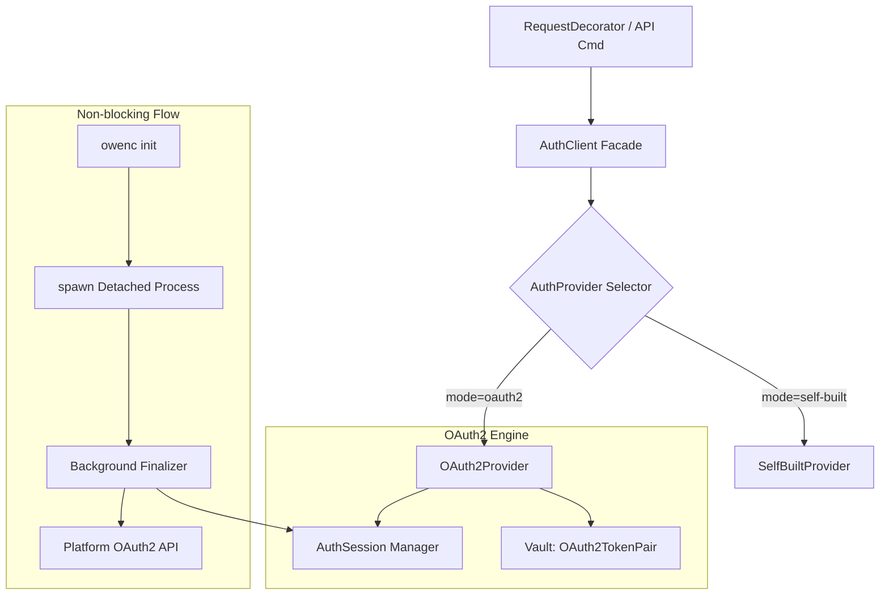
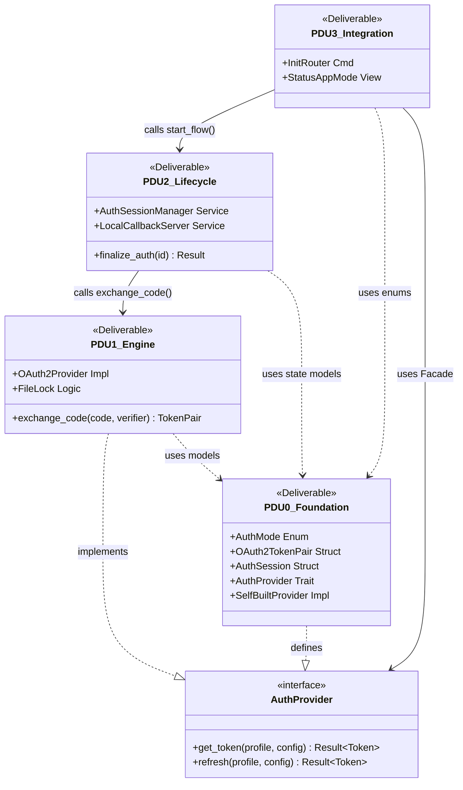

# Cowen CLI v0.2.0 OAuth2 (PKCE) 模式深度设计规格书

## 1. 设计概述 (Design Overview)

本设计旨在 Cowen CLI v0.2.0 中引入 OAuth2 (PKCE) 认证模式。核心目标是支持现代化的、内置 ClientID 的"零输入"授权流，同时维持对 v0.1.x 存量"自建应用"模式的 100% 兼容。

### 1.1 核心挑战
- **版本不兼容风险**：v0.1.x 依赖于 AppKey/AppSecret/AppTicket，而 v0.2.0 使用 Code/PKCE/Refresh Token。
- **并发刷新冲突**：Refresh Token 具有单次使用失效特性，多进程环境下（CLI + Daemon）极易产生竞态。
- **跨版本代码合并**：需要确保 0.1.x 分支的 Bug 修复能平滑合并至 0.2.x，而不引起逻辑冲突。

---

## 2. 架构设计：策略模式 (Strategy Pattern)

为了实现逻辑解耦与物理隔离，引入 `AuthProvider` 抽象层。

### 2.1 架构拓扑


### 2.2 核心组件职责
- **`AuthClient` (Facade)**：作为统一入口。它不包含具体的换票业务逻辑，仅负责根据配置路由至对应的 Provider。
- **`AuthProvider` (Trait)**：定义统一的令牌获取接口。
- **`SelfBuiltProvider`**：封装 0.1.x 的 AppTicket -> AccessToken 交换逻辑。由 PDU 0 负责从 `AuthClient` 中迁移。
- **`OAuth2Provider`**：处理新版 PKCE 与令牌轮换逻辑。详见 [Section 3.1](#31-authprovider-接口定义)。

---

## 3. 技术规格 (Technical Specification)

### 3.1 `auth::provider` 接口定义
**文件位置**：`src/auth/provider/mod.rs`

```rust
#[async_trait]
pub trait AuthProvider: Send + Sync {
    /// 获取当前可用令牌。若过期则触发刷新或网络重整。
    async fn get_token(&self, profile: &str, config: &Config) -> Result<Token>;
    
    /// 强制执行网络刷新逻辑（忽略内存或本地缓存）。
    async fn refresh(&self, profile: &str, config: &Config) -> Result<Token>;
}
```

#### OAuth2 端点与注入规格
- **授权端点 (Authorize)**: `https://market.chanjet.com/v2/userAuth/authorize`
- **令牌端点 (Token)**: `https://openapi.chanjet.com/oauth2/token`
- **注入要求**:
    - 域名部分必须由 `build.rs` 注入环境变量 `DEF_MARKET_URL` 与 `DEF_OPENAPI_URL`。
    - 代码引用必须使用 `obfs!(env!("..."))` 模式进行构建时混淆，严禁硬编码。

### 3.2 `OAuth2TokenPair` 存储规格
**Vault 序列化策略**：将完整结构体 JSON 序列化为单个 String，通过一次 `vault.set()` 操作原子写入。

```rust
#[derive(Serialize, Deserialize)]
struct OAuth2TokenPair {
    access_token: String,
    refresh_token: String,
    expires_at: i64,
    refresh_expires_at: i64,
}

// 存储：vault.set(profile, "oauth2_token_pair", &serde_json::to_string(&pair)?)
// 读取：serde_json::from_str::<OAuth2TokenPair>(&vault.get(profile, "oauth2_token_pair")?)
```

> [!IMPORTANT]
> Vault Trait 接口 (`get/set` 均为 `String`) 保持不变。序列化/反序列化逻辑封装在 `OAuth2TokenPair` 的 `impl` 方法中，作为 PDU 0 的交付物之一。

### 3.3 `auth::oauth2` 异步状态管理
**文件位置**：`src/auth/oauth2/`

- **`AuthSession` 模式 (Schema)**：
  存储路径：`~/.owenc/auth/auth_<UUID>.json` (权限 0600)
  ```rust
  struct AuthSession {
      profile: String,       // 绑定的 Profile 名称
      code_verifier: String, // PKCE 原始码
      state: String,         // 防重放 State
      redirect_uri: String,  // 完整回调地址，格式固定为 http://127.0.0.1:<PORT>/callback
      redirect_port: u16,    // 动态绑定的回调端口
      expires_at: i64,       // 会话硬超时时间 (5min)
  }
  ```

- **后台 Finalizer 行为**：
  执行入口：`owenc auth login --finalize <UUID>` （隐藏参数，用户不可见）
  - 使用 `process_group(0)` 脱离终端。
  - 绑定随机端口并监听 `/callback` 路径。成功后读取 Session JSON 还原上下文。
  - 完成换票后更新 Vault 并清理临时文件。

### 3.4 Finalizer 的 Clap 注册方案
Finalizer 作为 `AuthCommands::Login` 的隐藏参数注册，不暴露给用户：

```rust
#[derive(clap::Subcommand)]
pub enum AuthCommands {
    // ... Status, Reset, Token 保持不变 ...
    Login {
        #[arg(short, long)]
        force: bool,
        /// 内部使用：后台 Finalizer 的会话 UUID，终端用户不可见。
        #[arg(long, hide = true)]
        finalize: Option<String>,
    },
}
```

### 3.5 `init` 命令参数扩展
需在 `Init` struct 中新增 `--app-mode` 参数，并实现与 `--app-key` 等参数的互斥校验：

```rust
Init {
    /// 认证模式选择。默认为 oauth2，使用内置 ClientID。
    #[arg(long, default_value = "oauth2")]
    app_mode: String,
    // 以下参数仅在 app_mode = self-built 时必填
    #[arg(long, help = "开放平台 AppKey")]
    app_key: Option<String>,
    #[arg(long, help = "开放平台 AppSecret")]
    app_secret: Option<String>,
    // ... 其余参数保持不变 ...
}
```

> [!IMPORTANT]
> **互斥校验规则**：当 `app_mode = "oauth2"` 时，若用户传入 `--app-key` 或 `--app-secret`，应立即报错："参数冲突：OAuth2 模式使用内置 ClientID，不支持手动指定 --app-key/--app-secret。"

### 3.6 OAuth2 模式下 `init` 的行为差异
- **不自动启动 daemon**：与 self-built 模式不同，OAuth2 模式下 `init` 完成后 **不自动调用 `daemon::start()`**。
- **原因**：
    1. OAuth2 模式下 daemon 禁止启动 Stream/WebSocket 监听（PRD 约束）。
    2. 此时授权流尚未完成（Finalizer 在后台运行），启动 daemon 无意义。
- **用户引导**：`init` 退出前打印提示："授权完成后，您可以通过 `owenc daemon start` 启动后台守护进程。"

---

## 4. 令牌生命周期维护 (Token Maintenance)

### 4.1 被动与主动混合刷新策略
- **被动刷新 (Passive/Lazy)**：在 API 调用发现令牌过期时触发。
- **主动刷新 (Active/Proactive)**：由 `owenc daemon` 定期唤起。
  - **预热机制**：在令牌到期前 30 分钟，由守护进程主动完成轮换，消除 API 调用的网络首字节延迟。

### 4.2 并发换票保护 (Locking)
使用 `fs2` 提供的 **文件级排他锁 (Exclusive File Lock)**。
- **流程**：获取锁 -> 读取 Vault -> 确认是否已被其他进程刷新 -> 执行网络刷新 -> 原子更新 Vault -> 释放锁。

---

## 5. 兼容性与影响评估 (Compatibility Impact)

### 5.1 逐命令影响分析表 (Command-by-Command Matrix)

| CLI 命令 | 存量模式 (Self-Built) 影响 | 新模式 (OAuth2) 行为 | 兼容性保障 (Back-compat) |
| :--- | :--- | :--- | :--- |
| `owenc init` | 无影响，通过 `--app-mode self-built` 进入。 | **默认行为**。启动异步授权流，唤起浏览器。**不自动启动 daemon**。 | 旧版命令行参数继续支持并在 self-built 下生效。 |
| `owenc api *` | 无感。调用 `AuthProvider` 获取令牌。 | 无感。自动执行 Refresh Token 轮换逻辑。 | `AuthProvider` 为上层装饰器提供统一 `Token` 结构。 |
| `owenc auth status`| 输出原有的 Ticket/Token 状态。 | 输出 Access/Refresh Token 的双效期状态。 | 界面布局保持一致，增强模式标记。 |
| `owenc auth login` | 触发云端重发 Ticket。 | 触发一次强制的被动刷新 (Refresh Grant)。 | 指法与语义保持一致，底层逻辑按模式分发。 |
| `owenc auth reset` | 清理 Vault 中原有 Key。 | 清理 `oauth2_token_pair` 键值及 Session 文件。 | 物理隔离 Key，互相清理不干扰。 |
| `owenc daemon` | 继续执行旧有的 Ticket 预热。 | 执行 Proactive Refresh 轮换。 | 守护进程由于只调用 Trait 接口，代码逻辑几乎零变动。 |
| `owenc status` | 报告已有 Profile 的健康度。 | 报告 OAuth2 会话的有效性。 | 对各版本的 Profile 均能准确识别并汇报。 |

### 5.2 配置与存储兼容性
- **配置层 (Config)**：新增 `app_mode` 字段，默认为 `self-built` (通过 `serde(default)`)，确保 0.1.x 的 YAML 无需任何修改即可运行。
- **存储层 (Vault)**：通过不同的 Key (`app_ticket`/`access_token` vs `oauth2_token_pair`) 物理隔离两种模式的数据，防止版本切换导致的数据损毁。

---

## 6. 故障处理与错误码映射 (Error Handling)

| 平台错误码 | 含义 | CLI 应对策略 | UI 展示建议 |
| :--- | :--- | :--- | :--- |
| `4029` | Refresh Token 已过期 | 标记会话失效，引导重新授权 | "登录会话已超时（7天），请执行 `owenc init` 重新授权。" |
| `4007` | Refresh Token 不正确 | 检查是否超过 5 分钟宽限期，若是则引导重新授权 | "令牌已失效，请执行 `owenc auth login` 重新授权。" |
| `4006` | AppKey 不匹配 | 属于配置错误，引导用户检查 Profile | "ClientID 与令牌颁发者不一致，请检查配置。" |
| `4001` | PKCE 验证失败 | 属于内部错误，记录日志，引导重新 init | "授权校验失败，请重新执行 `owenc init`。" |

---

## 7. 并行开发单元与契约验收 (PDU Spec & Acceptance)

本项目拆分为 4 个高度自治的开发单元。一旦 **PDU 0** 完成接口定义，PDU 1-3 可同时动工。

### PDU 0: 核心抽象与基建 (Foundation)
- **交付物**：
    - `AuthMode` 枚举与 `Config` 字段适配（含 `serde(default)`）。
    - `AuthProvider` Trait 定义与 `AuthClient` 分发逻辑。
    - `OAuth2TokenPair` 结构体及 Vault 序列化/反序列化辅助方法。
    - `AuthSession` 结构体定义。
    - **`SelfBuiltProvider`**：从 `AuthClient` 中迁移既有的 AppTicket -> Token 逻辑。
    - 更新 `build.rs`：支持 `DEF_MARKET_URL` 环境变量注入。
- **SelfBuiltProvider 迁移方案**：
    - 将 `AuthClient` 中的 `request_token()`、`refresh_token()`、`ensure_ticket()` 等方法迁移至 `SelfBuiltProvider`。
    - 迁移后 `AuthClient` 仅保留 Facade 分发逻辑（根据 `AuthMode` 选择 Provider）。
    - 原 `AuthClient` 的 `Client` Trait 对外接口保持不变。
- **验收要求 (AC)**：
    1. 不携带 `app_mode` 的旧配置文件能被成功解析为 `SelfBuilt`。
    2. `RequestDecorator` 在切换底层模式时，无需修改任何代码即可正常调用 `Client` 接口。
    3. `SelfBuiltProvider` 通过全部原有单元测试（等价于回归验证）。

### PDU 1: OAuth2 协议引擎 (Engine)
- **交付物**：
    - `OAuth2Provider`：实现 `AuthProvider` Trait，包含换票与轮换核心逻辑。
    - `exchange_code(code, verifier)` 方法。
    - 基于 `fs2` 的 Profile 级文件排他锁适配器。
- **验收要求 (AC)**：
    1. Mock `/oauth2/token` 返回 4007 时，Provider 应抛出自定义 `AuthExpired` 异常。
    2. Mock `/oauth2/token` 返回 4029 时，Provider 应抛出 `SessionExpired` 异常。
    3. 模拟两个线程同时检测到 Token 过期，通过日志确认仅有一次网络请求。

### PDU 2: 后台 Finalizer 与生命周期 (Lifecycle)
- **交付物**：
    - `AuthSessionManager`：Session JSON 加密读写服务。
    - `LocalCallbackServer`：轻量级 `tiny_http` 监听程序，监听 `/callback` 路径。
    - Finalizer 隐藏命令处理逻辑 (`auth login --finalize`)。
    - 子进程脱离终端的 Detachment 封装。
- **验收要求 (AC)**：
    1. 启动 Finalizer 后，主进程退出，通过 `ps` 确认后台进程存活。
    2. 无论授权成功或超时失败，必须物理删除 `~/.owenc/auth/` 下对应的临时 JSON 文件。
    3. 5 分钟超时后进程必须自动退出并清理资源。

### PDU 3: init 链路组装 (UI/UX)
- **交付物**：
    - `Init` struct 新增 `--app-mode` 参数及互斥校验逻辑。
    - `init_oauth2_flow` 路由实现（含浏览器唤起与 Finalizer 派生）。
    - `auth status` 增强 OAuth2 双效期展示。
- **验收要求 (AC)**：
    1. 运行 `owenc init` 后，浏览器弹出授权页，终端应在 1 秒内回到可输入状态。
    2. OAuth2 模式下 `init` 不自动启动 daemon。
    3. 传入 `--app-mode oauth2 --app-key xxx` 时立即报错参数冲突。
    4. 授权完成后，`owenc status` 正确显示模式为 `oauth2` 且令牌有效。

---

## 8. 模块边界与 Mock 点 (Mocking Contract)

单元间通过以下 Mock 点进行隔离，无需等待外部完成：

| 单元 | 模拟对象 (Mock Point) | 说明 |
| :--- | :--- | :--- |
| **PDU 1** | `PDU 0: AuthProvider Trait` | 实现 Trait 即可，无需考虑 Config 分发。 |
| **PDU 2** | `PDU 1: OAuth2Provider` | 模拟 `exchange_code()` 接口，返回预定义的 `OAuth2TokenPair`。 |
| **PDU 3** | `PDU 2: start_flow()` | 模拟启动过程，仅验证浏览器是否成功唤起。 |

---

## 9. 跨版本维护建议 (Branch Merging)

- **逻辑解耦优先级**：严禁在核心库中使用 `if mode == OAuth2` 做硬分支。
- **通用能力下沉**：针对 HTTP、JSON、Vault 的基础优化应保留在 `core/`，确保双版本受益。

---

## 10. 依赖关系与关键路径 (Dependency & Critical Path)

### 10.1 交付物依赖 UML 类图



### 10.2 关键节点与路径分析
1. **关键节点：PDU 0 (Foundation)**
    - **等级**：BLOCKER。
    - **原因**：它定义了所有单元共享的数据结构和核心 Trait。PDU 0 延期将导致全员无法通过编译。
    - **策略**：建议由架构组先行完成 PDU 0 的基础占位（Stub），仅定义结构和方法名，不实现逻辑，以便后续单元立即开工。

2. **关键路径：PDU 0 -> PDU 2 -> PDU 3**
    - PDU 2 负责捕获 Code，PDU 3 负责在 `init` 最后一步拉起 PDU 2。这两者的集成测试决定了"非阻塞流程"的成败。

3. **解耦点：PDU 1 (Engine)**
    - 虽然 PDU 1 逻辑最复杂（涉及文件锁和协议自愈），但它与 PDU 2/3 的耦合极低。可以使用 Mock Token 直接验证 PDU 2/3 的交互逻辑。

---
© 2026 Chanjet Advanced Agentic Coding Team.
