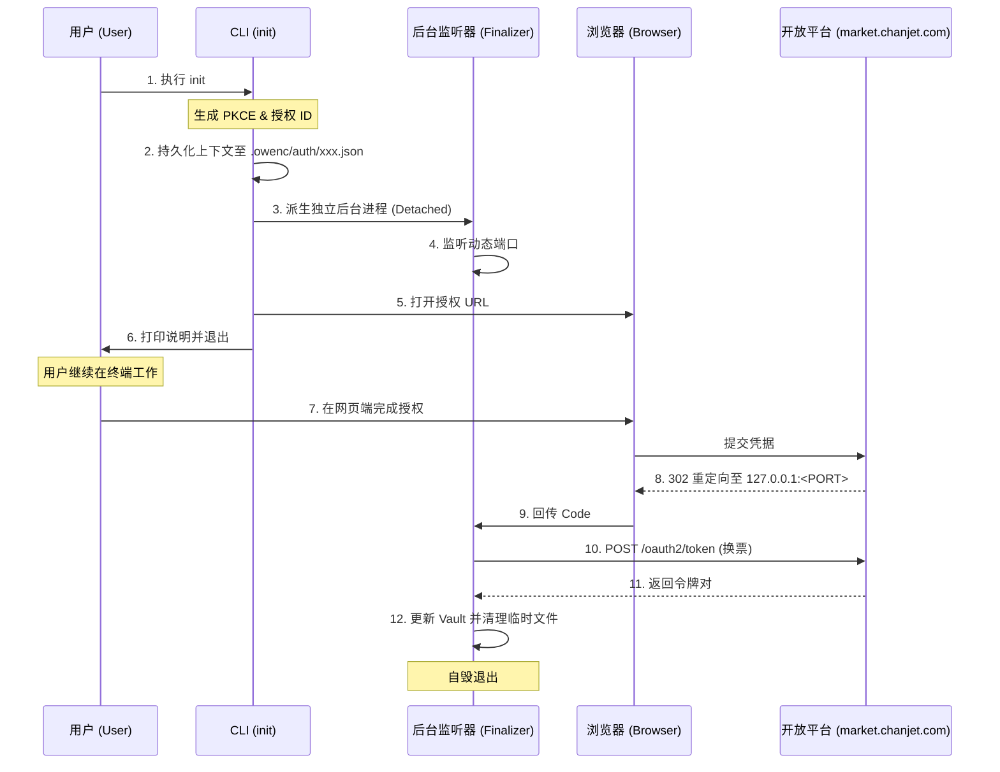

# Cowen CLI (owenc) 需求规格说明书 (PRD) - v0.2.0

| 属性 | 内容 |
| :--- | :--- |
| **项目名称** | Cowen CLI (owenc) |
| **版本号** | v0.2.0 |
| **特性名称** | OAuth2 (PKCE) 认证模式集成 |
| **状态** | 草案 (Draft) |

---

## 1. 业务背景 (Background)
随着畅捷通开放平台安全架构的演进，标准化的 OAuth 2.0 (PKCE) 协议由于其更高的安全性（尤其在客户端环境中）成为首选。`cowen` CLI 需要支持这种模式，以满足不具备 `appSecret` 直接暴露能力或不具备消息推送接收能力的集成场景。

## 2. 用户故事 (User Stories)

### 2.1 首次极简接入 (First-time Onboarding)
**作为** 一名初次使用 `cowen` 的开发者，  
**我希望** 能够通过简单的命令启动授权，授权过程能自动完成回调捕获，  
**以便于** 快速进入 API 调试状态，无需手动拷贝验证码。  
- **核心路径**：执行 `init` -> 选择或指定 `oauth2` -> CLI 启动本地监听并弹出授权页 -> 网页授权 -> CLI 自动获取 Code -> 成功。

### 2.2 无感令牌维护 (Seamless Token Maintenance)
**作为** 一名将 `cowen` 集成到自动化脚本中的用户，  
**我希望** CLI 能自动处理 AccessToken 的失效刷新，且对脚本执行过程透明，  
**以便于** 我的业务逻辑不会因为 2 小时一次的令牌过期而中断。

### 2.3 消息隔离运行 (Message Isolation)
**作为** 一名仅使用 API 调用功能的用户，  
**我希望** 在不配置 Webhook 的情况下工具也能稳定运行，  
**以便于** 避免因为内网环境无法建立 WebSocket 隧道而导致的报错噪音。

---

## 3. 业务规则 (Business Rules)

### 3.1 凭据管理规则
- **内置 ClientID**：`client_id` (AppKey) 为固定的内置值 `<BUILTIN_CLIENT_ID>`。系统**严禁**用户通过配置文件或 `--client-id` 参数进行修改，确保接入通道的确定性。
- **动态 Verifier**：每次执行授权流程必须即时生成唯一的 `code_verifier` (长度 64 字符)，并存放在内存中直至换取令牌成功。

### 3.2 令牌刷新与轮换 (Rotation)
- **强制轮换**：系统必须遵循标准端点 `/oauth2/token` 的轮换逻辑。每次使用 `refresh_token` 换票成功后，必须将响应中返回的**新** `refresh_token` 覆盖存储到 Vault 中。
- **宽限期处理**：在并发调用场景下，如果发生网络重试进入 5 分钟宽限期，系统应能弹性处理返回的重复令牌对而不抛出致命错误。

### 3.3 运行模式约束
- **单向能力**：在该模式下，`cowen` 的 `daemon` 进程禁止启动 `Stream/WebSocket` 监听模块。
- **Profile 冲突校验**：一个 Profile 只能选择“自建应用模式”或“OAuth2 (PKCE) 模式”中的一种。

---

## 4. 详细交互设计 (Interaction Design)

### 4.1 初始化流程 (`init`)

#### 参数矩阵 (Parameter Matrix)
`init` 指令的参数支持范围根据 `--app-mode` 的不同表现为互斥或可选：

| 参数 | OAuth2 模式 (默认) | 自建应用模式 (self-built) | 说明 |
| :--- | :--- | :--- | :--- |
| `--app-mode` | 可选 (`oauth2`) | **必填** (`self-built`) | 认证模式选择 |
| `--profile` | 可选 | 可选 | 环境别名，默认为 `default` |
| `--app-key` | **禁用** | **必填** | 自建模式需手动输入 |
| `--app-secret`| **禁用** | **必填** | 自建模式需手动输入 |
| `--cert` / `-c`| **禁用** | **必填** | 自建模式需指定证书路径 |

> [!NOTE]
> 在 `oauth2` 模式下，系统将直接使用内置的 `client_id`，若用户强行传入 `--app-key` 等参数，应报错提示参数冲突。

#### 交互步骤描述 (Interaction Model)
为了提升用户体验，`owenc` 采用 **非阻塞 (Non-blocking)** 初始化模型：

| 步骤 | 操作方 | 交互描述 | 结果期望 |
| :--- | :--- | :--- | :--- |
| 1 | 用户 | 执行 `owenc init` | **默认**进入 OAuth2 初始化流程 |
| 2 | CLI | 生成 PKCE 凭据，持久化 `AuthSession` 上下文，并派生 **脱离主终端的后台 Finalizer 进程** | 进程分离成功，终端显示“授权会话已启动” |
| 3 | CLI | 构造授权链接，自动调用系统浏览器打开 | 浏览器弹出授权页面 |
| 4 | CLI | **即刻退出并返回控制台** | **用户可立即继续在终端执行其他操作**，无需等待授权完成 |
| 5 | 用户 | 在浏览器完成登录授权 | 浏览器接收到 Code 并重定向至 **后台 Finalizer** 监听地址 |
| 6 | Finalizer| 自动捕获 Code，读取上下文换取令牌，并更新 Vault | 全自动完成配置，随后 Finalizer 自主销毁 |

#### 授权时序图 (Sequence Flow)


### 4.2 错误路径处理
- **Code 过期/无效**：提示：“验证码无效或已过期，请重新运行 `init` 命令。”
- **刷新失败 (4007)**：若检测到 `refresh_token` 彻底失效，所有后续 `api call` 必须报错并给出强提示：“当前授权已失效，请执行 `owenc login --app-mode oauth2` 重新授权。”

---

## 5. 结果期望 (Expected Outcomes)
- **接入时间指标**：从安装工具到完成首次 API 调用，平均耗时应低于 120 秒。
- **稳定性指标**：在授权周期（7 天）内，非网络断开引起的 `refresh` 成功率应为 100%。
- **用户感知**：用户在调用 `api call` 时，除了首次授权外，不应感觉到令牌刷新的存在。

---

## 6. 关键技术设计 (Technical Design)

### 6.1 授权回调监听 (Auth Callback Listener)
为了实现“零输入”授权，`owenc` 需集成轻量级 HTTP 服务端（如 `tiny_http` 或基于 `tokio` 的简易实现）：
- **监听地址**：使用 `127.0.0.1:0` 进行动态绑定，防止 18080 等常用端口被占用。
- **URL 构造**：绑定成功后，提取 `local_addr().port()` 并注入到授权链接的 `redirect_uri` 参数中。
- **超时机制**：若 5 分钟内未收到有效回调，则自动退出并提示授权超时。
### 6.2 存储扩展 (Vault Expansion)
`VaultTokenPool` 结构体需要从单 `access_token` 扩展为支持 `OAuth2TokenPair`：
```rust
struct OAuth2TokenPair {
    access_token: String,
    refresh_token: String,
    expires_at: i64,
    refresh_expires_at: i64,
}
```

### 6.3 刷新锁机制
在执行 `/oauth2/token` 刷新请求前，必须竞争 **Profile 级全局文件锁**。由于 Refresh Token 具有单次使用失效的特性，`double-check` 逻辑显得尤为重要：获取锁后先读取 Vault，若发现 Token 已被其他进程更新，则直接加载而不重新发起网络请求。

---

## 7. 影响范围评估 (Impact Assessment)
- **数据兼容**：老版本的加密 Vault 结构需要平滑迁移或通过版本标记进行区分，避免读取失败。
- **命令树**：`auth` 子命令需要增加对 `oauth2` 模式的感知。
- **遥测日志**：`audit.log` 需新增 `token_rotate` 审计事件，记录刷新流水但不包含敏感内容。

---
> [!CAUTION]
> **安全红线**：
> 1. `refresh_token` 在本地落地必须经过 AES-256-GCM 物理指纹加密。
> 2. 日志中严禁打印任何 `refresh_token` 或 `code_verifier` 的明文或部分掩码。
