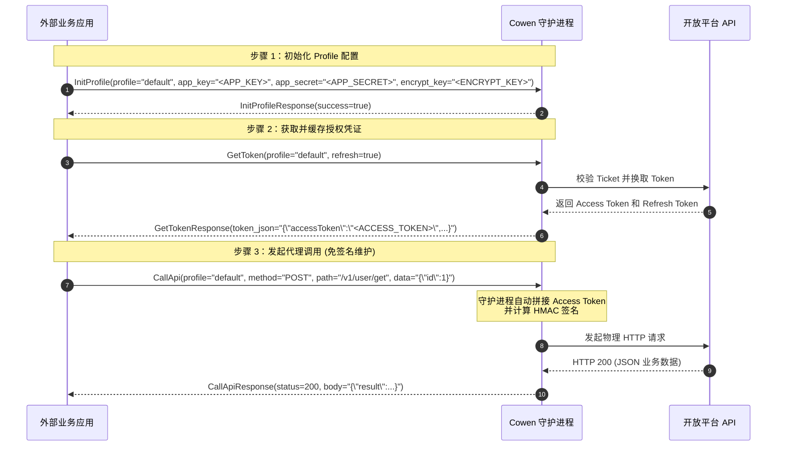
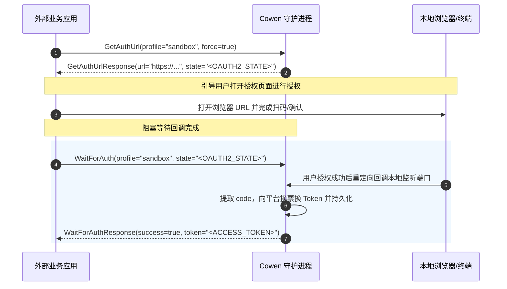

# Cowen Daemon Protobuf API 接入与集成指南

Cowen 守护进程（`cowen-daemon`）作为本地常驻服务，通过 gRPC 协议对外提供 IPC（进程间通信）能力。外部应用程序（如 Java, Node.js, Go 服务等）可以通过引入本目录下的 `.proto` 协议定义文件，与守护进程进行对接，实现免签名调用开放平台接口、流式数据通道消费和自动化认证等功能。

---

## 1. 连接寻址规范 (Connection Specification)

守护进程默认通过 **Unix Domain Socket (UDS)** 在本地进行高效、安全的通信（Windows 平台上使用命名管道 Named Pipes）。

* **UDS 物理路径**：默认位于用户家目录下的 `.cowen/ipc.sock`。
  * **macOS/Linux**: `~/.cowen/ipc.sock` 或物理绝对路径 `file:///Users/<USERNAME>/.cowen/ipc.sock`
* **寻址格式**：
  * gRPC 客户端连接字符串应指定为：`unix:///Users/<USERNAME>/.cowen/ipc.sock`

---

## 2. 核心服务列表与能力边界 (Core Services & Capabilities)

| 协议文件 | 对应的 gRPC 服务 | 职责说明 |
| :--- | :--- | :--- |
| [native_auth.proto](file:///Users/zhangliang/chanjet/dev/workspace/open-streaming-connector/cli/cowen/proto/native_auth.proto) | `NativeAuthService` | 应用注册初始化、OAuth2 网页登录授权换票流程、以及 Access/Refresh Token 本地获取与清理。 |
| [native_config.proto](file:///Users/zhangliang/chanjet/dev/workspace/open-streaming-connector/cli/cowen/proto/native_config.proto) | `NativeConfigService` | 全局和环境隔离（Profile 级）的配置读写、配置包整包导入导出。 |
| [native_api_registry.proto](file:///Users/zhangliang/chanjet/dev/workspace/open-streaming-connector/cli/cowen/proto/native_api_registry.proto) | `ApiRegistryService` | 发现可用开放接口、查看接口规格定义，并作为本地高可用网关提供自动附加签名与 Token 的代理调用服务（`CallApi`）。 |
| [native_worker.proto](file:///Users/zhangliang/chanjet/dev/workspace/open-streaming-connector/cli/cowen/proto/native_worker.proto) | `NativeWorkerService` | 后台消息接收连接器（Worker）的起停、热重载控制与运行时退避状态监控。 |
| [native_dlq.proto](file:///Users/zhangliang/chanjet/dev/workspace/open-streaming-connector/cli/cowen/proto/native_dlq.proto) | `NativeDlqService` | 消费失败且重试耗尽的消息会归入死信队列。该服务提供死信明细查看、手动重试重投和清空。 |
| [native_system.proto](file:///Users/zhangliang/chanjet/dev/workspace/open-streaming-connector/cli/cowen/proto/native_system.proto) | `NativeSystemService` | 数据库/保险箱（Vault）健康状态、一键系统诊断体检（Doctor）、以及插件输入输出双向流隧道。 |
| [native_audit.proto](file:///Users/zhangliang/chanjet/dev/workspace/open-streaming-connector/cli/cowen/proto/native_audit.proto) | `NativeAuditService` | 提供系统关键安全、通信和操作足迹审计日志的读取与尾部追踪能力。 |
| [public_system.proto](file:///Users/zhangliang/chanjet/dev/workspace/open-streaming-connector/cli/cowen/proto/public_system.proto) | `PublicSystemService` | 暴露给第三方插件的初始注册握手和基础系统能力协商接口。 |

---

## 3. 典型业务调用流程时序 (Sequence & Lifecycle Flows)

### 3.1 自建应用常规初始化与调用流


### 3.2 托管/三方应用 OAuth2 网页登录流


---

## 4. 错误处理与故障排查契约 (Error Handling & Code Map)

在对接过程中如果请求返回了非 `OK` (0) 的 gRPC 状态码，应按照以下规范在客户端中进行拦截和重试引导：

| gRPC 状态码 | 典型触发场景 | 建议客户端的处理策略 |
| :--- | :--- | :--- |
| `UNAVAILABLE` (14) | 本地 UDS 物理文件不存在，即守护进程没有启动。 | 提示或自动拉起守护进程：`cowen daemon start`。 |
| `INVALID_ARGUMENT` (3) | 传入的参数校验失败（如 Profile 名称为空，或者必填的 API Path 缺失）。 | 检查客户端请求体，并进行传参日志记录。 |
| `UNAUTHENTICATED` (16) | 目标 Profile 的本地票据/Token 缺失、过期或被云端拉黑失效。 | 引导调用 `GetAuthUrl` 发起 OAuth2 流程，或自建应用重新设置 `app_secret`。 |
| `FAILED_PRECONDITION` (9) | 系统处于不可用状态（例如数据库锁文件被其他进程硬锁定）。 | 提示用户检查并发锁，或使用 `StoreStatus` 查询诊断。 |
| `INTERNAL` (13) | 守护进程内部致命异常（如写磁盘满、段错误等）。 | 检查守护进程的本地运行日志 `~/.cowen/logs/daemon.stderr.log`。 |

---

## 5. 跨语言集成示例 (Minimal Integration Code Snippet)

以下提供常用开发语言连接本地守护进程 UDS 调用的最简脱敏集成 Demo，请勿在此使用真实或随机生成的敏感密钥字面量。

### 5.1 Rust 客户端集成示例（使用 `tonic`）

```rust
use std::path::Path;
use tokio::net::UnixStream;
use tonic::transport::{Endpoint, Uri};
use tower::service_fn;

// 引入自动生成的 gRPC Stub 模块
pub mod api_registry {
    tonic::include_proto!("cowen.daemon.native.api_registry.v1");
}

#[tokio::main]
async fn main() -> Result<(), Box<dyn std::error::Error>> {
    // 1. 本地 UDS 物理路径
    let socket_path = "/Users/username/.cowen/ipc.sock";
    
    // 2. 建立 UDS 连接服务通道
    let channel = Endpoint::try_from("http://[::]:50051")?
        .connect_with_connector(service_fn(move |_: Uri| {
            UnixStream::connect(socket_path)
        }))
        .await?;

    let mut client = api_registry::api_registry_service_client::ApiRegistryServiceClient::new(channel);

    // 3. 构造请求，向本地守护进程请求调用开放接口（已自动脱敏）
    let request = tonic::Request::new(api_registry::CallApiRequest {
        profile: "default".to_string(),
        method: "POST".to_string(),
        path: "/v1/user/get_info".to_string(),
        data: Some("{\"user_id\":\"12345\"}".to_string()),
        force: false,
    });

    let response = client.call_api(request).await?;
    println!("API Status Code: {}", response.into_inner().status);

    Ok(())
}
```

### 5.2 Node.js 客户端集成示例（使用 `@grpc/grpc-js`）

```javascript
const grpc = require('@grpc/grpc-js');
const protoLoader = require('@grpc/proto-loader');
const path = require('path');

// 1. 加载 Proto 定义文件
const PROTO_PATH = path.join(__dirname, 'native_api_registry.proto');
const packageDefinition = protoLoader.loadSync(PROTO_PATH, {
  keepCase: true,
  longs: String,
  enums: String,
  defaults: true,
  oneofs: true
});

const protoDescriptor = grpc.loadPackageDefinition(packageDefinition);
const apiRegistryService = protoDescriptor.cowen.daemon.native.api_registry.v1.ApiRegistryService;

// 2. 使用 Unix Domain Socket 连接本地守护进程
const socketPath = 'unix:/Users/username/.cowen/ipc.sock';
const client = new apiRegistryService(socketPath, grpc.credentials.createInsecure());

// 3. 发起请求并接收响应
client.CallApi({
  profile: 'default',
  method: 'POST',
  path: '/v1/user/get_info',
  data: JSON.stringify({ user_id: "12345" }),
  force: false
}, (err, response) => {
  if (err) {
    console.error('Connection/gRPC Error:', err);
    return;
  }
  console.log('HTTP Return Status:', response.status);
  console.log('Platform Body Data:', response.body);
});
```

---

## 6. 自动化 HTML/Markdown 文档生成说明 (Automated Doc Generation)

如果需要将协议目录下的所有 `.proto` 生成便于浏览器查阅的 HTML 或者更精美的 Markdown，可以使用以下官方推荐的自动化编译插件：

### 使用 Docker 一键编译 (推荐)
在当前项目根目录下运行以下命令，会自动抽取 `.proto` 文件中的文档注释并输出为可读文档：

```bash
docker run --rm \
  -v $(pwd)/proto:/protos \
  -v $(pwd)/proto:/out \
  pseudomuto/protoc-gen-doc --doc_opt=html,index.html
```

编译完成后，您可以直接使用浏览器打开 `proto/index.html`，即可以图形化界面的方式阅读最新的接口树、数据字段类型、约束规则及 API 全景定义。
