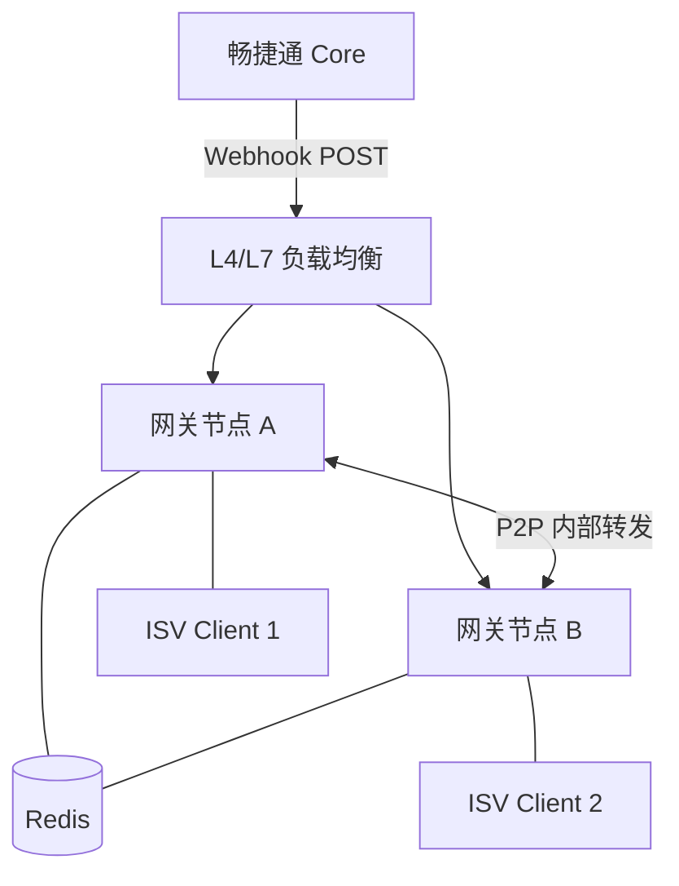

# 畅捷通 Stream Gateway 架构设计文档 v0.1.0

## 1. 概述

畅捷通 Stream Gateway 是一个高性能、低延迟的 Webhook-to-WebSocket 透明同步桥接器。它解决了 ISV 在无公网 IP 和 SSL 证书环境下无法接收畅捷通 Core 服务 Webhook 的痛点。

### 1.1 设计目标
- **免公网 IP**：ISV 仅需发起 WebSocket 连接即可接收业务事件。
- **透明转发**：网关不存储业务明文数据，不对业务数据进行二次解析。
- **高可用与自愈**：集群模式部署，通过 Redis 实现 P2P 路由及重试机制。
- **同步阻塞桥接**：利用 Core 原生的 Webhook 衰减重试机制，网关层不设消息队列。

## 2. 整体架构

### 2.1 部署架构图
系统采用对称部署模式，所有节点地位平等，共同承担 HTTP 接收与 WebSocket 连接维护职责。

### 2.2 核心组件说明

| 组件名称 | 职责 |
| --- | --- |
| **WebhookController** | 接收来自 Core 的 Webhook。负责提取 AppKey 并调用 MessageDispatcher。 |
| **DefaultWsHandler** | 管理 WebSocket 连接生命周期。维护本地会话注册表，处理路由注册/注销。 |
| **MessageDispatcher** | **大脑**。执行本地优先单播、集群路由查询及 P2P 转发重试逻辑。 |
| **RemoteCjtCoreAdapter** | 适配器。代理 Core 的 Verify-PreAuth/Sign 及推送状态同步接口。 |
| **RestP2PClient** | 通讯器。负责节点间基于直连 HTTP 的 P2P 转发。 |

## 3. 核心业务流

### 3.1 消息分发策略 (Local-First Unicast)

1. **本地优先**：Node A 收到 Webhook，首先检索本地连接管理器。若持有连接，直接推送并返回。
2. **集群路由**：若本地无连接，查询 Redis 路由表获取全局在线实例。
3. **单播重试**：Node A 选定目标 Node B 进行 P2P 转发。若 Node B 响应失败，Node A 会自动尝试路由池中的下一个可用节点。
4. **防环路**：P2P 请求携带 `X-GW-Hop-Count`。若跳数超过 1，目标节点在本地推送失败后禁止再次发起转发。

## 4. 技术栈选型

- **开发语言**：JDK 21
- **核心框架**：Spring Boot 3.2.4 / Spring Framework 6.1.5
- **并发模型**：基于 Java 21 **Virtual Threads (Project Loom)** 实现高并发阻塞 IO。
- **中间件**：Redis (用于路由与 Nonce)、Nacos MSE (服务注册)。
- **监控运维**：Spring Boot Actuator (独立端口 8081)。

## 5. 安全架构

### 5.1 No-Secret 模式
网关不持有 `AppSecret`。鉴权代理至 Core 服务：
- **PreAuth**: 校验 16 位 HMAC 前缀（防 DDoS）。
- **Sign**: 校验基于 Nonce 的完整签名。

### 5.2 内部 P2P 认证
集群节点间通讯通过 `connector.internal-tokens` 令牌列表进行校验，支持令牌的平滑滚动更新。

---
**版本日期**: 2026-03-19
