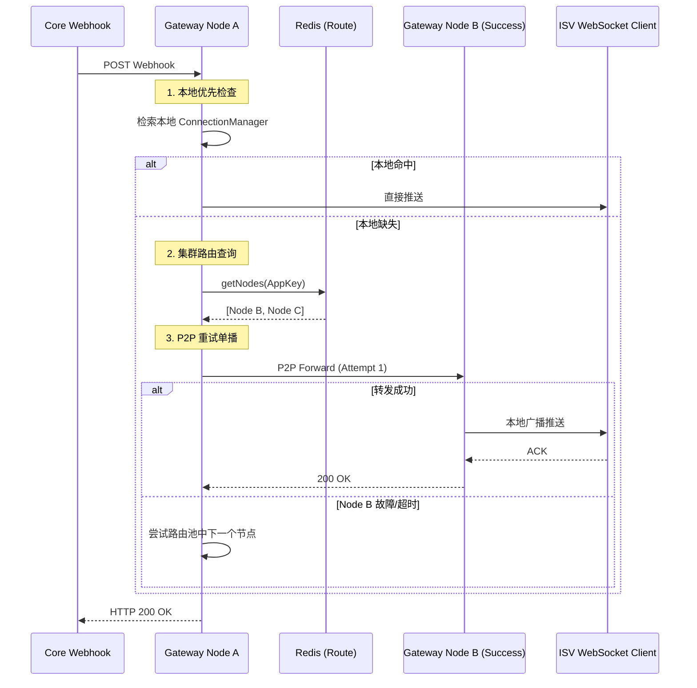

# 畅捷通 Stream Gateway 详细 UML 与 Package 设计 v0.1.0

## 1. 领域组件架构图 (Component Diagram)

```mermaid
component {
  package "connector-server (接入层)" as server {
    [WebhookController]
    [DefaultWsHandler]
    [WsSessionRegistry]
  }

  package "connector-core (领域逻辑层)" as core {
    [MessageDispatcher]
    [ToleranceManager]
    [InMemResilienceManager]
  }

  package "connector-api (契约层)" as api {
    interface "IRouteStore"
    interface "IP2PClient"
    interface "IConnectionManager"
    [ConnectorProperties]
  }

  package "connector-infra (基础设施层)" as infra {
    [RedisRouteStore]
    [RemoteCjtCoreAdapter]
    [RestP2PClient]
  }

  server ..> core : 触发业务逻辑
  core ..> api : 依赖抽象
  infra --|> api : 实现契约
  server ..> infra : 运行时注入实现
}
```

---

## 2. 核心领域职责与 Package 边界

### 2.1 `connector-api` (契约领域)
- `com.chanjet.connector.api.store`: 存储契约（Route, Nonce, FailStore）。
- `com.chanjet.connector.api.connection`: 通讯契约（`IP2PClient`, `IConnectionManager`）。
- `com.chanjet.connector.api.config`: 核心配置模型（`ConnectorProperties`）。

### 2.2 `connector-core` (逻辑领域)
- `com.chanjet.connector.core.dispatcher`: 
    - **职责**: 消息分发决策。实现 **本地优先单播** 与 **P2P 转发重试** 逻辑。
- `com.chanjet.connector.core.state`:
    - **职责**: 容忍期状态机（`ToleranceManager`）。维护 AppKey 的在线自愈状态。
- `com.chanjet.connector.core.resilience`:
    - **职责**: 并发限流与熔断逻辑。

### 2.3 `connector-server` (接入领域)
- `com.chanjet.connector.server.websocket`:
    - **职责**: WebSocket 会话管理（Registry）与协议升级处理。
- `com.chanjet.connector.server.controller`:
    - **职责**: REST 入口（Webhook Dispatch 与 Challenge 颁发）。
- `com.chanjet.connector.server.config`:
    - **职责**: 运行时 NodeId 解析（`NodeIdResolver`）与 Spring Bean 组装。

---

## 3. 核心交互时序图 (Resilient Webhook Flow)

展示本地优先及失败重试的协作时序。



---

## 4. 设计约束

1.  **NodeId 动态性**: `nodeId` 严禁在代码中写死，必须由 `NodeIdResolver` 在启动时动态生成（IP:Port 格式），以适配 K8s 环境。
2.  **配置刷新**: `ConnectorProperties` 必须支持 `@RefreshScope`，以确保 `internal-tokens` 在 Nacos 变更后实时生效。
3.  **线程模型**: 系统强制运行在 **Java 21 Virtual Threads**。禁止在 IO 密集型逻辑（如分发循环）中使用 `synchronized`，优先使用 `ReentrantLock` 以避免载体线程锚定。

---
**更新日期**: 2026-03-19
