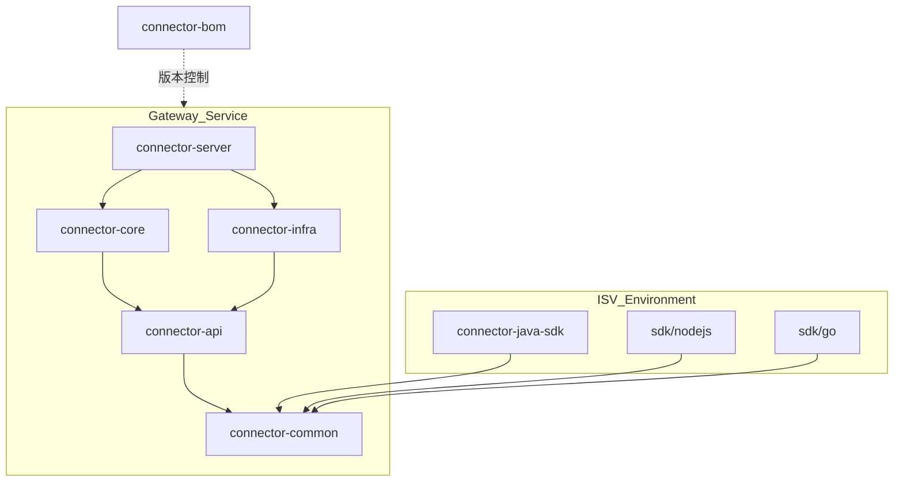

# 项目结构与模块依赖关系 (Project Structure & Dependencies)

> **修订日期**: 2026-03-19
> **版本**: v0.1.0

---

## 1. 模块概览 (Module Overview)

项目采用典型的领域驱动多模块架构，旨在实现业务逻辑与底层基础设施的物理隔离。

| 模块名 | 核心定位 | 关键技术栈 |
| :--- | :--- | :--- |
| `connector-bom` | 版本物料清单 | Maven BOM |
| `connector-common` | 协议定义层 | Protobuf, Jackson |
| `connector-api` | 领域契约层 (SPI) | Java Interfaces, Spring Config |
| `connector-core` | 领域实现层 (大脑) | Resilience4j 思想, 状态机 |
| `connector-infra` | 基础设施落地层 | Redis, Spring Cloud, HttpClient |
| `connector-server` | 接入与组装层 (壳) | Spring Boot, WebSocket |
| `connector-java-sdk` | Java 客户端工具包 | Java 21 HttpClient |
| `sdk/nodejs` | Node.js 客户端工具包 | Node.js, ws, TypeScript |
| `sdk/go` | Go 客户端工具包 | Go, Gorilla WebSocket |

---

## 2. 依赖拓扑图 (Dependency Graph)

---

## 3. 依赖关系详解 (Dependency Details)

### 3.1 协议纽带: `connector-common`
- **地位**: 最底层模块。
- **依赖**: 仅依赖 Jackson 和 SLF4J。
- **作用**: 被 SDK 和服务端同时引用，确保两端对 `EventFrame` 的序列化协议完全一致。

### 3.2 领域抽象: `connector-api`
- **依赖**: `connector-common`。
- **规范**: 严禁引入 Redis 或 HTTP 等具体实现库。
- **职责**: 定义所有 SPI 接口（如 `IRouteStore`）。

### 3.3 核心解耦: `connector-core` vs `connector-infra`
- **同级隔离**: `core` 和 `infra` 模块在代码上互不依赖。
- **共同基座**: 它们都依赖 `connector-api`。
- **解耦逻辑**: `core` 编写分发逻辑，调用 `API` 接口；`infra` 编写存储逻辑，实现 `API` 接口。

### 3.4 最终组装: `connector-server`
- **依赖**: `connector-core` + `connector-infra`。
- **职责**: 作为 Spring Boot 宿主，将 `infra` 提供的物理实现 Bean 注入到 `core` 的逻辑组件中。

---

## 4. 模块准入红线 (Module Boundaries)

1.  **禁止循环依赖**: 严禁 `core` 依赖 `infra`，反之亦然。
2.  **SDK 纯净性**: `connector-java-sdk` 和 `sdk/nodejs` 禁止引用除 `connector-common` 以外的任何内部模块，防止将服务端重量级依赖（如 Redis）带入 ISV 环境。
3.  **配置下沉**: 所有跨模块使用的配置类（如 `ConnectorProperties`）必须定义在 `connector-api` 中。
