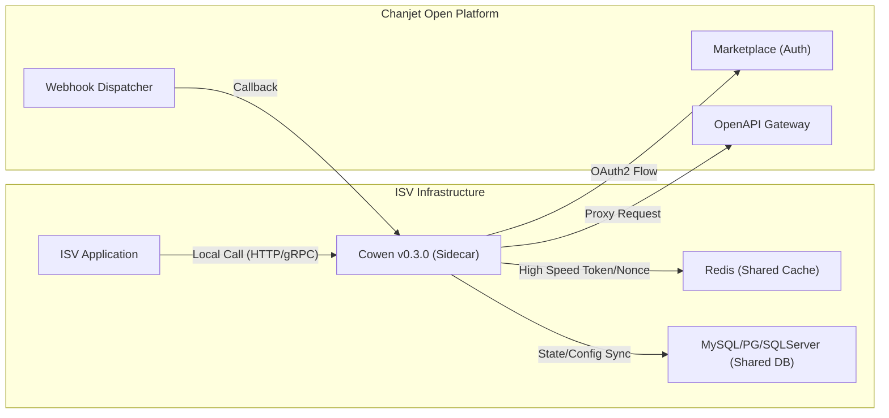

# 系统上下文视图 (System Context Topology)

## 1. 系统边界与外部集成
Cowen v0.3.0 在 IT 环境中扮演 **ISV 应用侧边车 (Sidecar)** 的角色，负责处理所有与开放平台相关的认证、代理与回调逻辑。

## 2. 数据流向与协议
- **应用请求代理**：ISV App -> Cowen (HTTP/HTTPS) -> OpenAPI (HTTPS)。
- **Token 刷新与自愈**：Cowen -> Market (HTTPS) 使用 refresh_token 或 **永久授权码** 换取新票 -> Cowen (更新 Cache/DB)。
- **Webhook 异步接收**：Webhook Dispatcher -> Cowen (HTTPS) -> ISV App (HTTP)。
- **分布式协同**：Cowen <-> Redis (RESP), Cowen <-> DB (TCP/IP JDBC)。

---
*关联 PRD：[外部交互边界](../../srs/sections/01-external-interfaces.md)*
