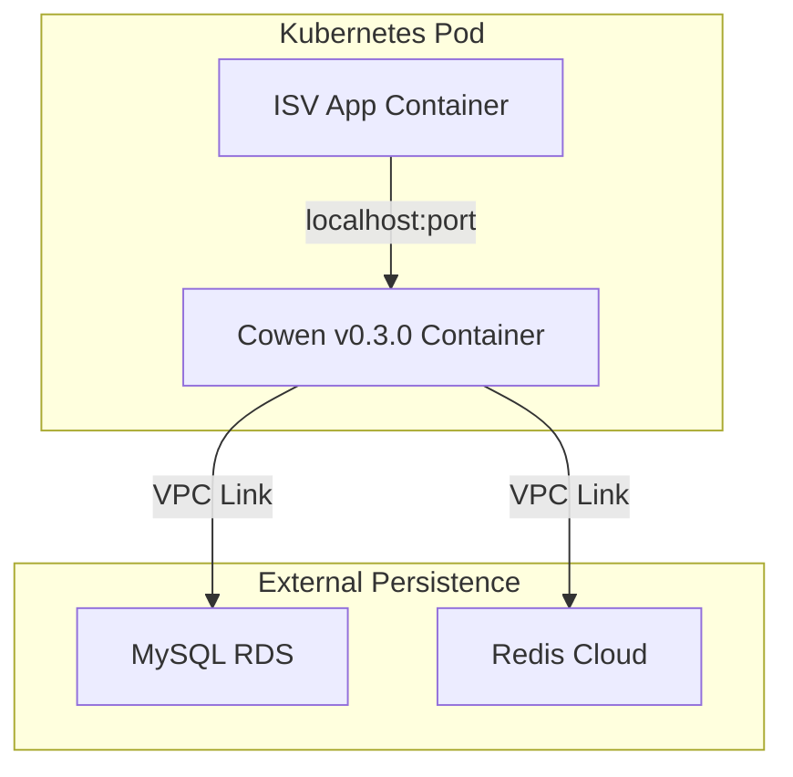

# 部署与物理视图 (Deployment Architecture)

## 1. 容器化部署拓扑
Cowen 支持在 Kubernetes 环境中作为 **Sidecar Container** 与业务容器共存在同一个 Pod 中。

## 2. 物理资源要求
- **操作系统**：Linux (Alpine/Ubuntu), Windows, macOS。
- **内存占用**：
  - 基础运行：~50MB。
  - 高并发代理：~200MB (视连接池大小而定)。
- **存储后端**：
  - MySQL 5.7+, PostgreSQL 12+, SQLServer 2017+。
  - Redis 6.0+。

---
*关联 PRD：[负载预期](../../prd/sections/03-audience-kpi.md#scale)*
