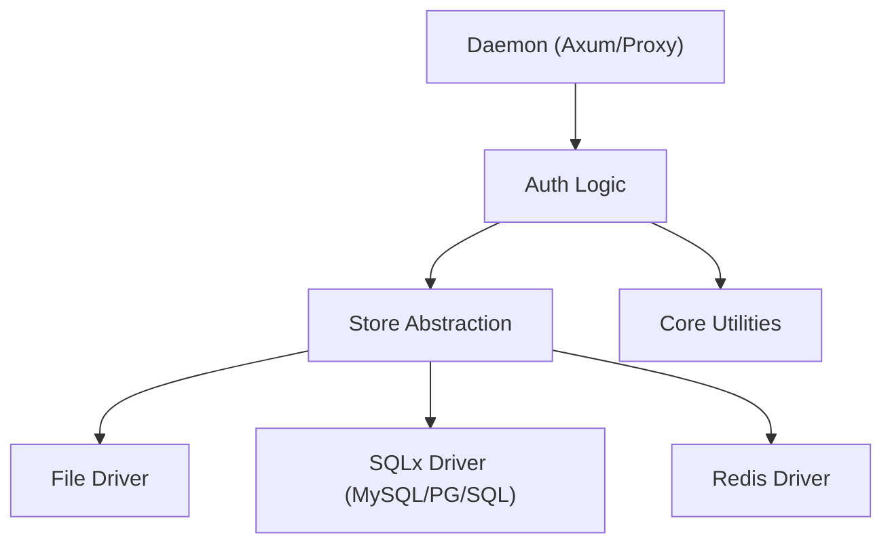

# 模块划分与依赖关系 (Module Partitioning)

## 1. 高阶架构层级
Cowen v0.3.0 采用典型的小型边车分层架构：

- **Core Module**: 提供配置管理、加密加解密、日志与遥测基础能力。
- **Store Module**: **核心变更点**。提供 `Store` 接口及各种驱动（File, Redis, SQLx）。
- **Auth Module**: 业务逻辑层。负责 OAuth2 握手、Token 刷新、多租户管理。
  - **核心增强**：支持 `userToken` / `orgToken` 的长效维护机制。
  - **自愈能力**：集成“永久授权码”获取逻辑，在 refresh_token 失效时实现凭据自动召回。
  - **依赖关系**：强依赖 Store Module 进行凭据持久化。
- **Daemon Module**: 运行时。负责 Proxy Server (Axum) 与 Webhook 监听。

## 2. 模块依赖图

---
*关联 PRD：[可插拔存储架构](../../prd/sections/03-feature-list.md#Feature-01)*
