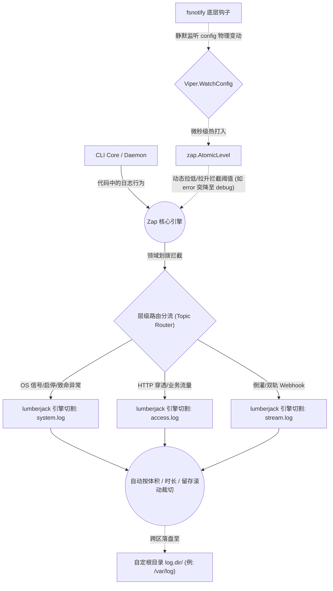
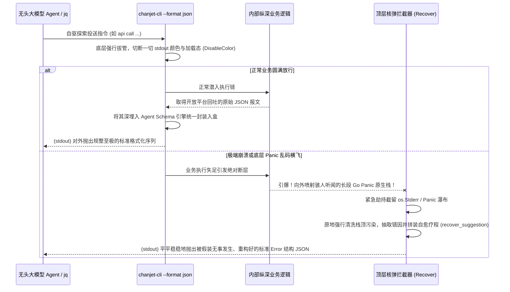

# Agent 交互扩展与向量调度设计 (Agent Interactions & Semantic Search)

*文档版本*: v0.1.1 (Detailed Design)

---

## 1. 大模型（Agent）输出底线规约 (Output Interceptor)

为了不对大模型 Agent 的管道解析（或人类后置的 `jq` 脚本）构成灾难性文本污染，CLI 日志系统绝对摈弃标准库 log，整体基于 `Uber-go/zap` 搭配 `lumberjack` 构建工业级的“收放自如”型静流底座：

### 1.1 禁绝前端控制台装潢污染
- **斩断花哨装潢**：所有输出至终端(`stdout/stderr`)的字符流，必须被强控挂载 `DisableColor=true` / `QuietTTY=true`，彻底消声抹杀一切加载进度条、跳跃动画与终端混码色彩。
- **Stderr 绝对净空**：不准在 `stderr` 输出“*请稍后...正在请求*”等向导噪音。`stderr` **有且仅能**被用于喷吐最后爆炸期的 **Fatal 结构化 JSON 抛错**，或者当用户前台主动挂载 `--verbose` 时强行破开闸门外溢的网桥级探针报文。

### 1.2 日志底盘高阶特性 (层域、滚动、热更与重挂载)
由于涉及到重态势的长联 Daemon，这套基建引擎必须在本地系统维度（特别是脱机孤岛长跑环境下）提供出极强的高级管控特权能力：

1. **按需归域的分片隔离落盘 (Log Routing by Scope)**
   引擎绝不把日志大锅乱炖混为一谈，而是严格按照核心业务切片，原生独立出多条并行的高性能落盘管线，且各自受控：
   - `system.log`：底座 Daemon 守护线程启停、OS 信号捕获、SQLite 迁移等非流务重型事件与错误专属崩溃落盘地。
   - `access.log`：全部由于直接调用 `api call` 向外抛射与承接的双向 HTTP 业务流量记录留底（类似于 Nginx json 结构化访问日志）。
   - `stream.log`：专供常驻网桥通道记录从公网端砸落、并向内侧局域双轨倒灌 Proxy 过程的事件明细轨迹与断流重连心跳。

2. **全局可热加载的动态滚动机 (Hot-Reload & Rolling)**
   - **自旋裁切滚动 (Auto-Rolling)**：利用 `lumberjack` 挂载 Zap 的 io.Writer 底层，配置通过 CLI config 暴露微调权：支持设定 **单体极值界限 (如 max-size=100MB)**、**最长生存切分时长 (max-age=30天)**、**极值轮替比余下备份上限 (max-backups)** 等。作为常驻后台服务，绝不允许发生跑一个月后因恶劣吐日志直接爆满吃垮宿主磁盘空间从而导致物理级宕机雪崩！
   - **动态无缝热更 (Atomic Watcher)**：架构的杀手锏。底层基于 `viper.WatchConfig()` 原生挂钩并打通 `zap.AtomicLevel()`。当生产调试告急时，运维只需极其丝滑优雅地敲下 `chanjet-cli config set log.level debug`！系统无需下流切断 Daemon 长连接去暴力强制重启进程。Zap 内核探测到变动后，日志网眼的颗粒度就会在 **几微秒内动态拉低阈值实施热切换**！瞬间在本地硬盘内狂爆抛出底深海底层的协议调试长流。定位抓虫排障后，只需再次执行撤销复位回 `error` 高警戒封喉态，流水立断收放自如。

3. **随心所欲的位置挂载靶标 (Target Path Injection)**
   - 生产级项目日志绝对不能被死锁写死固化在什么执行命令脚底的盲区当前目录！架构支持经由外部设定挂指定引流：通过预插 `chanjet-cli config set log.dir /var/log/chanjet` 实施全局日志落盘跨区越级强行挂载转移（在 Linux Systemd 下被全面管控接管运行时尤其关键，极大地满足尊重了 Linux 系统极度严苛的 FHS `/var/log` 规约传统）。

## 1.3 静流日志底座与热切架构图 (Logging & Hot-Reload Architecture)



## 2. 格式化 JSON 纠偏 (Agent Formatting Schema)
即便是成功的正常回流报文，也严禁散养式向外堆砌字符串。必须被收敛穿过一个极其严密的唯一中心化固定 Payload Schema（统一模具）进行终极打包装箱后，才能按全量体打入供大模型呼吸的标准输出管道 `stdout`。
   - 全局兜底隔离：所有哪怕是在程序千沟万壑最底层深处破裂抛出的 `os.Stderr` 系统级软报错乃至致命级 `panic` 核弹崩坏捕捉，都绝对越不过顶层命令的绝对壁障钩子 (Recover Middleware)。它们会被一网打尽直接强行劫持，并严格被逆向重塑为带有精确机器错误代码的纯净标准 JSON 序列化隔离对象后，再次以“无惊无险”的死水池姿态平稳抛出。这绝对彻底地杜绝了哪怕一丝光秃秃的底层长段 Go 原生乱码堆栈反向泄漏，以绝不增加大模型因读取乱麻引发的推演崩溃迷信及幻觉级灾变！

### 2.1 大模型管道截获与格式重塑图解 (Agent Output Pipeline)



**标准化回吐结构约定 (Standard Agent Payload)：**
```json
{
  "code": "OK",                      // 全局统筹的业务错误编码
  "success": true,                   // 严格的布尔标识
  "data": { ... },                   // 具体的执行结果包（例如 API 回包实体、搜索集）
  "recover_suggestion": ""           // 【高光特性】当且仅当 success=false 时必须附带极具语义化的纠错动作建议文本
}
```

---

## 2. 大模型自愈建议与自裁防爆 (Recovery Strategy)

让一个完全无感外部世界的悬空 Agent 去瞎猜试探着调用复杂的微服务网关 CLI 是高门槛的风险操作。尤其是在遇到类似于 `401 openToken 票据逾期长久未刷`、或者深层级的 `Config Not Found (本地挂载漏写)` 等阻断型硬性系统状态异常时。
为了使 Agent 不仅能报告错误，甚至具备能顺藤摸瓜**自行修复配置断层**的高级能力，CLI 报错框架必须强制携带高度人类归纳过的语义化自愈建议，从而诱导诱发 Agent 向工具再次重打请求（Re-Tool Calling）：

| 常见触发靶点 (Trigger) | 对应返回体 `recover_suggestion` 引导原句库范例 | 对接收 Agent 的期望后续智能力动作 |
| :--- | :--- | :--- |
| 读取态未搜查到 `openToken` | `"Please execute 'chanjet-cli auth login' to bootstrap credentials via interactive prompt or pass arguments."` | Agent 抽取这段纯正英语提示并在本地推演匹配后，会主动截盘调起另一个针对控制台工具的子节点执行 `auth login`。 |
| Webhook倒灌 `--target` 拒接 | `"The local endpoint <url> refused connection. Please confirm your local web daemon is fully bootstrapped."` | Agent 退回到外层系统，去检索开发机当前是否 npm 启动故障，或甚至主动尝试跑脚本帮人类拉起对应端口下的容器实例靶场。 |
| 扫描出 DLQ 死信库高度积压 | `"Found 50+ dead webhooks blocking, execute 'chanjet-cli dlq retry --all' highly recommended."` | Agent 巡检报警至自然语言侧时顺带夹带方案，或是获取用户确认权限后主动去帮人类完成全量一键补放扫尾。 |

---

## 3. 面向自然语言的内联语义向量调度树 (Semantic Vector Search)

试想：当一个主修代码辅助的大模型，面对开放平台高达成百上千个包含嵌套及变异端点路由的复杂业务群网络时（例如用户随口对它说：“帮我把这段逻辑接上，查个刚才提到的对公那张销售流水单”），如果 CLI 强迫大模型只能单纯倚赖纯粹落后的词典级/正则倒排去搜索官方 OpenAPI 文档名，那它遭遇重度理解偏移及命中漏判的概率极高，且模型自身由于理解大吞吐信息极其拉升耗时费比。
为此，CLI 颠覆性内置了强力子命令 `api search "自然语言"` 作为专门投喂大模型的**本地离线智能向量降维外挂搜索层**。

**单兵端技术引擎执行流 (Semantic Search Lifecycle)：**
1. **沙盒降级矩阵热加载 (Vector Index Loading)**：一旦 Agent 下达检索动作，底层立即将枪管直指 `~/.chanjet-cli/.config/cache/vector_index.idx` 并拉闸吸入。该库事先封藏了随安装包同频拉发或是开机静默被预先下发对齐拉取至本地的高维浮点型结构矩阵集（它们在服务商后端提前被洗炼完毕，满载了每一根 OpenAPI 下挂载逻辑文档抽象的天然特征语义标量 `Float32[]`）。
2. **孤岛封闭推理机计算 (In-process Inference)**：接受到 Agent 下发的非结构化询问（例如 `chanjet-cli api search "查对公销售单"`），程序旋即拉动内嵌极其轻量微服打点的纯粹 Go 库算子（即便是选用极其微型的编译绑定的无 CGO 版低依赖 ONNX 运行时）。当机立断把极短问法映射重算，编译转换拉直为单条粗向标量搜捕向量。
3. **点积穿透匹配 (Cosine Similarity Match)**：无需请求哪怕一次消耗云端鉴权，全部在内存浅池内执行几无损耗延迟的正向余弦相似度排次，将远近向量高分差全部精准圈出。
4. **截断成表极速吐文 (Top-N Output)**：把推演匹配加乘得分极高（例如超过界定线 `>0.85 相似比`）的头部位 Top 3 最吻合项中的 OpenAPI 网关摘要及必须连带填上的参数 Payload Schema 结对绑定。最终塞入 `data: [{}]` 再走上方的 `--format json` 拦截器火线抛出。大模型截取后顺手解开 JSON 包装袋，像获得了精准打击信标一般，转瞬之间又可以一字不差地拼回长串发起 `chanjet-cli api call` 来执行下文调用步骤，将人类模糊自然语言至具体强类型代码函数间的天堑变作物理通衢。
