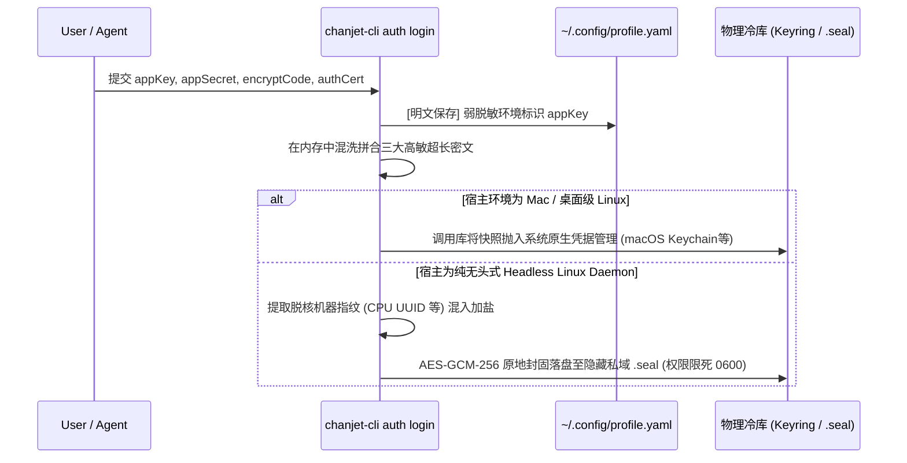

# 凭证生命周期与状态机详细设计 (Auth & Ticket Lifecycle)

*文档版本*: v0.1.1 (Detailed Design)
*应用模式限定*: 本期严格作用于 `self-built` (企业自建应用) 模式。

---

## 1. 静元：基础机密数据的物理冷存 (Static Credentials Vault)

在 CLI 被拉起之前，必须有一个极高安全等级的冷存区域存放授权根骨。
**注入链路 (`chanjet-cli auth login`)**：
用户或 Agent 提交 `appKey`、`appSecret`、`encryptCode` 以及首版核心基建数据 **`authCert` (授权证书，形态为长段字符串)** 后：
1. `appKey` 作为明文环境标识，可直接写入至 `~/.chanjet-cli/.config/<profile>.profile.yaml` 中进行弱脱敏持久化。
2. `appSecret`、`encryptCode` 以及 `authCert` (授权证书) 三大高危核心资产，**绝对禁止**落盘至明文甚至弱暗文外露配置文件中。必须在内存中全量组装成复合快照后打入纯 Go 加密底库（如选用 `zalando/go-keyring` 等）：
   - Mac 宿主下：将调用 CGO 级桥塞入 `macOS Keychain`。
   - Linux 宿主下（若是桌面支持 DBus）：塞入 `Secret Service / KWallet`。
   - Linux 无头形态（Headless Daemon 服务器态）自动引发 AES-GCM-256 降级回落机制：基于 `appKey` 及当前宿主 CPU UUID 甚至机器网卡 MAC 动态混码求拔盐作混，将该组四大金刚加密后落盘为隐藏私有区专属绝对路径下的 `.seal` 固化块（强行按住权限掩码死锁于 `0600`，防越权旁路穿透）。

### 1.1 冷库全景挂载时序图 (Static Vault Flow)

---

## 2. 动元：动态票据热获取与内存保活 (Dynamic Tickets Bootstrap)

### 2.1 差异化跨域票据校验引擎 (Differentiated Auth Bootstraper)

必须在这里澄清一条最核心的能力边界红线：**`appTicket` 在这套架构生态体系里的最重要、甚至可以说是唯一核心作用，就是作为锚点去向开放平台周期性地换取 `openToken`**。绝不是所有动作都需要被它拦截。CLI 底层必须依据指令类型的不同，执行严格的“按需取证”机制：

1. **纯净静元签名域 (零 `openToken` 依赖体系)**：
   - 这包含了两种截然不同但都**绝对无需**换取流动 Token 的调用动作：
     - **轻态单列动作**：纯离线搜索（`api search`）、拉取 OpenAPI 列表、乃至要求“平台立即下发推送 Ticket”等公共基建短程指令。
     - **重态长链接守望者 (Background Daemon Stream)**：这是**极其重要**的底壳级域墙！当系统的后台暗影服务 (Daemon) 开辟长效隧道用以静默死接开放平台 Webhook 事件瀑布流时，它**绝不使用也根本无需关联**任何由外部索要的 `openToken` 和 `appTicket`。这条逆驱命脉必须越界穿过表层拦截器直探底库 Keyring，提取最为硬核厚重的绝对物理四大基建密码（`appKey`、`appSecret`、`encryptCode`、`authCert` 及衍生签算）以本源态进行底层握手，构筑无需换票的坚实 WebSocket/TCP 网联支架。
   - 此域的所有底层网关调用，必须被路由层硬编码为“直男式放行”，绝不干涉或查验 `openToken` 是否存活与过期。

2. **核心层强阻击域 (完全依赖 `openToken` 签发的 API 业务态)**：
   - 当且仅当发函触发**面向指定租户底层核心数据的实质性开放 API 动作**（即 `api call` 透传直打具体业务接口）时，前置路由才切入真正的 **深水区轮询寻活（Polling Bootstrap）**。
   - 此高度受控域执行极度严苛的 **“定装轮询与异步获取 (Async Poll & Wait)”** 流水线：
     1. **首查短锁 (openToken)**：系统死卡 `Context` 内存是否存在且未过期的 `openToken`。若有效，免检直通，放行 `api call`。
     2. **再查长锚 (appTicket)**：若 `openToken` 失效，接着巡查 `Context` 里是否存在尚未燃尽的 `appTicket` 母体。由于 `appTicket` 会伴随已经于开机/预设时自动打通了长效链接的底层后台服务 (Daemon Stream) 被平台主干在幕后定期且周期性地自动推送更新并投递至本地共享内存区，原则上系统中游**极大概率**能随时握牢一份散发着温热鲜活期的现成老件。只要这个基础挂载大阵未燃尽，系统就理所应当横端着这根母体直取敌阵，同步向开放平台无损换领一枚满血新造的 `openToken`，继而放行打透下方业务网段。
     3. **绝境异步索票与阻塞轮询 (Async Push & Wait Polling)**：当且仅当极其苛刻或倒霉——连内存里都彻底获取不到任何依然有效存活的 `appTicket` 时（例如真正的刚拔刃冷启动、持久断网宕机初醒）。代码严禁自作主张死扛硬造或盲目狂刷撞库！网关必须派出一支横移的纯虚小分队，只凭借轻态基础权限向开放平台端发令强呼：**“指令：要求平台端立即向我的流通道推送下发一枚重新生成的 Ticket”**。呼叫指令瞬间即抛脱手，当前前台那些排着长龙正待调用 `api call` 的业务协程簇全部被拦截，并被切入**「定点轮询挂起（Polling Wait）」**态持续空转待命。
     4. **哨兵回填穿透**：待默默悬浮在水底暗处的长链监控进程 (Daemon) 监听到顺水推舟扑面而下砸来的那纸全新专属 Webhook 事件包后，迅猛接防暴力拆卸提取出其内珍藏的新版真金白银 `appTicket`，以雷霆万钧之势一举强压覆写、拍入覆盖全局的 `Context` 内存池槽位！那边群情激奋正被阻挂急不可耐的 `api call` 前方先遣军，经过极为短促内卷的时隙探针（异步轮询法）感知到了那份带露水的新品落盘后，全数原地火爆苏醒完成 `步骤2` 的置后拼图！最终劫夺下生的 `openToken` 狂喜而归，满仓提证挂起向下游敌区发起全速猛攻打劫业务返回体。

*(⚠️防崩设计核心注：由于这类获取机制本质是“非同步发文+轮询回文等待”式的异构空窗闭环，对于有着海量大并发量大吞吐的微服务网关节点，必须内嵌**单机起航阻控壁垒 (Single-Flight Barrier)**：最开始首个缺票的落难协程替所有身后人发“呼叫空投新票”信号的一秒钟内，尾随跟进挤压进来的剩下成群结队的几百条无票协程只能被迫强行一旁静室挂号共守同一个定标，决不允许每一条没票的死士都无脑朝天空吼叫“给我新票！”。直到底座 stream 神明接收降临的那个奇点微秒，全体静默池集体回拨打通，物理碾断任何能引致全网崩盘的下发求票风暴！)*

### 2.1.1 业务调用防暴死网关底层逻辑闭环简图 (Async Poll & Wait Architecture)

```mermaid
sequenceDiagram
    participant Command as 业务前锋 (api call)
    participant Cache as 内存池浅缓存区 (Context)
    participant Server as 开放平台 (Chanjet)
    participant Stream as 驻底守护通道 (stream listen)
    
    %% 常见常态（免检连通）
    rect rgb(0, 50, 0)
        Note over Command, Server: 【免检连通】凭千年长锁直穿深水
        Command->>Cache: 首探：有活着的 openToken 吗？
        Cache-->>Command: Bingo 命中 (Hits)
        Command->>Server: 拿存活的 openToken 极速并发打底业务
    end
    
    %% 轻微老化（同步秒换票）
    rect rgb(50, 50, 0)
        Note over Command, Server: 【同步秒换区】由于 openToken 老化终于过期，但 appTicket 完好鲜活
        Command->>Cache: 短锁过期 (Miss!)
        Command->>Cache: 再探长锚：有随 Stream 飘落积攒下来的 appTicket 吗？
        Cache-->>Command: 取出鲜活母本 (Hits)
        Command->>Server: 携老挂载母点 appTicket 同步换发一枚全新的 openToken
        Server-->>Command: 回吐配套的 openToken 牌照
        Command->>Cache: 火线覆写 L1 浅缓存并续命
        Command->>Server: 满仓重新带新证发起最初的业务请求
    end
    
    %% 重度溃败大冷启（被迫降级挂起呼死式被动索票）
    rect rgb(50, 0, 0)
        Note over Command, Stream: 【异构异步投送区】刚切出冷启或遇上小概率双重长锁双过期大灭绝
        Command->>Cache: 短锁与长锚点均惨遭大灭绝失联 (Miss Double!)
        Command->>Server: 退向基础端，全速抛出单程指令信号：请要求空投一张新 Ticket 给我！
        Note over Command: 🚀 抛信即秒入 Async Polling Wait 闭眼空转挂起态 (后驱排队协程齐挂共生)...
        
        Server-->>Stream: (通过后台潜海早接通的常驻流信道) 投递 Event：Ticket下发
        Stream->>Stream: 驻底神明极速撕开 JSON 箱壁，取出新生代嫡系母本 appTicket
        Stream->>Cache: 降维打击一举覆写拍稳至 Context 池
        
        Command-->>Cache: (阻挂者轮询刺探发觉) 新老母库异动！锚来了！
        Note over Command: 全体火爆苏醒！狂跳回【同步秒换区】拿新锚点换 openToken 继续征途！
    end
```

### 2.2 极简自然剥离的被动兜底机制 (Passive Fallback Resiliency)

得益于底层极度高明解耦的超长生周期机制刻度：
1. **`appTicket` 的物理有效期 远远大于长连接 `stream` 的重推下发周期**。
2. **`openToken` 的存活有效期 更是远远大于 `appTicket` 的发版生命周期**。

这意味着对于一个成熟连接了 Stream 的 CLI 守护端而言，设计任何“常驻后台每隔一段时间拉起个心跳定时器（Background Ticker）主动追命刷票”的操作，或是配置极度繁琐沉重如同惊弓之鸟般的连环指数退避重试模型，都已经成了赤裸裸的 **过度设计 (Over-Engineering)** 与空转无能算力的极大浪费！

**极其自信的低频动用架构断言**：
- **常驻保鲜，何必求人**：因为连入了长通道 `stream`，系统几乎能舒舒服服地躺在被动喂养的暖潭里周期性接收到最新且鲜活极度的 `appTicket`。它犹如深海的一具天然呼吸阀门，根本不需要再自己主动浮出水面深呼吸。
- **千年老锁，何患无辞**：最外设的干活下位锁 `openToken` 本身是一个生命力极其长效冗长的凭证。极其恐怖的长度意味着大片段的时空中，即便外界涌入几百万次海啸般的高频密集 `api call` 并发轰炸，它们也只需从胸口掏出最初那唯一共享的一把未过期的 `openToken` 就能在业务网疯狂穿透到底。这直接导致充当母源的 `appTicket` 被真正提取去网关“换短票”的实操出场频次**低得令人发指**。
- **断臂抛弃冗余，拥抱异步空降**：CLI 架构就此可以果断干脆地砍掉并抛弃任何内部定时引擎轮换机与避退算力协程池。整个防御体系只依赖于 `2.1 节` 中钦定的**极致的异步请求下发通道**作为本源最终兜底：即便在极度倒霉的小概率长时断连、微服务宿主僵死停电之中，直等到那寿命极度漫长的 `openToken` 几十时辰后终于烂掉，且内存中海量积攒倒灌的肥厚 `appTicket` 都极其碰巧恰好同时过期的那一至高绝境刻。“轻装网关”也只需往虚空之上淡然弹射一条：“请立刻下落空投一张新票（Push Request）”。紧接着优雅地原地进入闭眼挂起态（Async Poll Wait），便能通过 Stream 事件捕手从悬崖勒回百分之百的满血状态流。极简，即坚不可摧的最美微服务防弹兵书。
