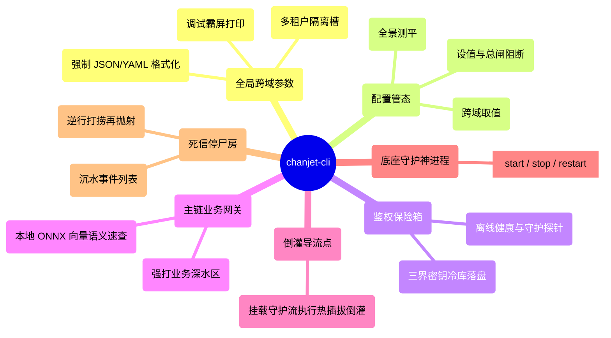

# CLI 指令图谱与全局规约 (CLI Topology & Flags Design)

*文档版本*: v0.1.1 (Detailed Design)
*核心目标*: 彻底拆解 `chanjet-cli` 的人机交互入口结构，确保所有指令语义清晰、路径正交，并对 AI Agent（如 OpenCLaw）输出结构化结果提供最高优的支持。

---

## 1. 跨域全局参数 (Global Flags)

全局参数是指附加在**任意**层级子命令结构中，均被顶层 Root 拦截并施加全局状态变更的超级配制器。

| 参数标志 | 简称 | 预期值 (Type) | 说明 (Description) | 对 Agent 的影响 |
| :--- | :---: | :--- | :--- | :--- |
| `--profile` | `-p` | `string` | **指定运行上下文（多租户切换）**。默认值为 `default`。此参数直接决定本次命令调用的 Keyring 沙箱区与本地 config 配置文件。 | **高**。Agent 并行跑多账号任务时，必传该参。 |
| `--format` | `-f` | `enum: json/yaml`| **全局输出格式拦截**。默认 `json`。本工具主打极简极客，彻底剔除所有花哨且不易于二次解析的 `table` 报表渲染。无论是人类查阅时依赖的 Pretty Print（带色彩高亮与精准缩进的美化 JSON/YAML），还是供大模型及 `jq` 脚本冷血提取时抽取的标准数据，统统收敛至这两种最高效的解析图谱。不论输出多复杂、遇到何种硬异常挂起崩溃，最终抛出的全貌都必被底层拦截，强行重塑为您所选的格式结构树。 | **致命**。Agent 调用的底线保证。 |
| `--verbose` | `-v` | `bool` | 打通内核级长堆栈流转监控，把原本默默静默进 `logs/system.log` 的请求出参、TCP/HTTP 明细直接刷屏到控制台 `stderr`。 | 低。Agent 一般只拿返回值（除非开启纠错推理）。 |
| `--app-mode` | 无 | `string` | 【隐式参数】声明接入的平台底座。v0.1.1 默认死锁为 `self-built` (强制自建应用)，控制台下隐藏。 | 低。 |

*(⚠️ 底层设计规约：所有 Global Config 挂载必须采用 `Viper` 进行树形合并，优先级层级：**Command Flag > Environment Variable (带 CH_ 前缀) > config.yaml 固化配置**)*

---

## 2. 工具链指令拓扑树 (Command Tree)

CLI 主干按业务边界高度解耦并切分为各大强聚合指令树簇。为便于大模型或人类研发在脑海中建立投影，以下为全景骨架状态脑图：

### 2.0 CLI 路由全景脑图 (CLI Command Mindmap)



### 2.1 配置管态 (Config Module)
专门作用于控制 `~/.chanjet-cli/.config/` 域内针对各个 `--profile` 身份槽的独立数据册。
- `chanjet-cli config set <key> <value>`
  - 功能：修改脱敏类的物理参数，从而精准调配后台守护进程在不同环境下的代理发炮与引流表现。极其关键的配置例如：
    - `webhook.target=http://...`：【静态倒灌靶心指向】。如果在当前的 Profile 内配死了此靶址，Daemon 在默认强行打通驻网流通道后，将会静态锁定该目标地址狂倾 Webhook 泻水倒灌！
- `chanjet-cli config get <key>`
  - 功能：大模型 Agent 通过 `--format json` 发出提取指令，用于对当前沙箱 Profile 的环境参数（如 Proxy 地址）实施快照查体。
- `chanjet-cli config view`
  - 功能：全局平铺展开当前所处的 Profile 身份侧的所有固化预设树态地图。

### 2.2 核心保险箱 (Auth & Keyring Module)
专门拦截、解密出操作系统底层 `OS Keyring` 加密栈。
- `chanjet-cli auth login`
  - 功能：初始化全场景靶机挂载底座。
  - 参数：`--app-key`, `--app-secret`, `--encrypt-code`, `--auth-cert`。这四大核心金钥作为构建长链流与业务验签的极度高敏凭证（尤其是 `authCert` 授权证书长串），严禁回传或落照明文。如果不传对应 Flag，系统转入交互遮罩模式（防窥输入）。Agent 必须在此步通过带密环境变量隐式传入，死死避开交互态挂起死机。
- `chanjet-cli auth status`
  - 功能：轻量级的本地域离线健康看板。**绝不主动向开放平台发起任何网络探针或请求以防触发频控消耗**。一切票据令牌（`openToken` / `appTicket`）的生存性均严格基于本地缓存中截获、定格下发的原始报文内含 `expireAt / expiresIn` 倒计时进行纯离线的时间对齐推演计算。
  - 探活与全栈排障：该子命令在推算票据的同时，还会自动刺探并通报当前后台驻留 Daemon 守护服务的链路存活度（即：公网 Stream Webhook 长循环是否建联？本地 Local Proxy 靶场靶点是否正在正常倒灌监听？），一口气为 Agent 或开发者回吐出极具深层故障自证排查价值的复合状态树。
  - `--format json` 态（大模型调用强截获）回吐样例如下：
    ```json
    {
      "valid": true,
      "tokens": {
        "openToken_valid": true,
        "openToken_expireAt": "2026-04-25T14:30:00Z",
        "appTicket_valid": true,
        "appTicket_expireAt": "2026-03-25T18:30:00Z"
      },
      "daemon_status": {
        "running": true,
        "stream_connected": true,
        "webhook_target_url": "http://localhost:8080/api/webhook",
        "proxy_listening_port": 3000
      }
    }
    ```

### 2.3 开放网关重定向 (API Module)
拦截通用平台动作的基础网关路由。
- `chanjet-cli api call <method> <path> [flags]`
  - 功能：核心指令。携带底层 `openToken` 发送透传深水区业务请求。所有 `--data` 和 `--query` 全部采用强类型转换。
- `chanjet-cli api list [flags]`
  - 功能：全景 API 概览探针。默认以极其无损的脱机离线态，极速输出当前底层打包夹带或本地历史缓存下来的全部可用 API 字典映射集。
  - 参数：`--remote` (或简写 `-r`)。一旦被 Agent 或开发者挂载此指令，系统将彻底无视任何本地缓存！它会利用底层的纯净基础静元认证（如 `appKey`，注意：此动作属于公共基建查询，绝对无需也绝不消耗 `openToken` 状态位），直刺开放平台远端心脏，强制全量拉取并重构整个畅捷通最新发布的 OpenAPI 目录全貌！抓取倒灌后，将静默在底座更新覆写本地 JSON 字典库。
- `chanjet-cli api search <keyword>`
  - 功能：触发 Agent-First 核心的**向量化智能检索器**。加载本地内置的极速 ONNX 嵌入模型，去比对上方 `api list` 维护那座最新缓存矩阵库。专为大模型针对海量 OpenAPI 文档输出最高余弦匹配度的确切接口调用说明与深层结构化 Payload Schema 模型。

### 2.4 守护常驻内核与死信管控 (Daemon & DLQ Module)
这是整个 Edge Gateway (边缘网关) 的脱机生命中枢体系。
**Stream (长链接 Webhook 网桥)** 体系被整体抽象并打包为隐藏的系统后台常驻守护服务 (Background Daemon)。它在系统底层初醒阶段便会被**全自动无感静默拉起**。
对于向本地倒灌的 Webhook 事件，系统采取**极度灵活的动静双轨策略**：
1. **静态全托底**：通过 `chanjet-cli config set` 定死全局 `webhook.target`，Daemon 获取完票据打通公网时将自带 Proxy 管线朝内网连贯狂暴倾泻。
2. **按需热插拔**：若不配全盘地址，平时长链只囤流接票而不向内网倒灌转发。直到当人或 Agent 前台敲击 `proxy start` 指令时，瞬间架构出分支牵引水闸实施引流。

### 2.4.1 流控制代理转发图解 (Proxy Dataflow Architecture)
```mermaid
graph TD
    A[畅捷通开放平台] -->|TCP / WebSocket 长链推送| B((后台驻留 Daemon 服务))
    B -->|高敏拆封清洗| C{解析校验 JSON 事件包}
    
    C -->|A类单据：新下发的 appTicket| D[强制覆写刷新本地 Context / Keyring]
    C -->|B类单据：标准业务 Webhook 报文| E{双轨路由分流 Proxy}
    
    E -->|1. 静态直灌 (已配 webhook.target)| F[目标本地主机测试微服务端口]
    E -->|2. 热插拔导流 (proxy start --target)| F
    
    F -.->|响应回执 HTTP 200 OK| E
    F -.->|响应回执 503/超时/拒绝连接| G[(DLQ 死信落盘 db/dlq.sqlite)]
    
    G -->|脱机滞留...| H(人为或定时驱动 chanjet-cli dlq retry)
    H -->|逆向提取报文| F
```

- `chanjet-cli proxy start --target <url>`
  - 功能：【热插拔引流代理靶机】专为未能在 `config` 中固化落盘预先配定倒灌域名的按需实验场景设计。以当前指定 `--profile` 身份启动前台随行进程，极其丝滑地瞬间切入并挂靠上后台早已建联暗通的 Stream 巨型事件瀑布流。强行开辟出一条专属分支管道，立刻朝向该条临时带入的本地测试端口（如 `http://localhost:3000/webhook`）实施动态无延迟重代理发炮倾泻！
- `chanjet-cli daemon [start|stop|restart]`
  - 功能：【高阶系统管控令】平常绝对无需动用，仅供运维时手工强行干预、物理切断或暴力重载这套脱机默默跑在内网深底层的神明级进程守护池。
- `chanjet-cli dlq list`
  - 功能：法医探针。展示 `db/dlq.sqlite` 中那些因为本地靶机宕机或程序崩溃抛出惨烈 5xx 而落水受溺的巨量沉压死信梗概。
- `chanjet-cli dlq retry [id | --all]`
  - 功能：心肺复苏。驱动内嵌重推栈引擎，强行打捞激活海底的死信 Event，由 SQLite 库内一把火捞出后，再次对准 `--target` 靶场疯狂倒灌开炮脱水度劫。
---

## 3. Agent 原生容错回吐约定 (Error Recovery Emitting)

为了支撑像 OpenClaw 这类的自动化工具调用失败后不宕机，我们从指令输出设计上强制贯彻**恢复指导（Recovery Strategy）**。

当且仅当命中 `--format json|yaml` 且程序以非零 `os.Exit(1)` 退出时，底座错误捕获器 (Global Panic & Error Handler) 必须拦截并格式化抛出标准的错栈包：

```json
{
  "code": "ERR_AUTH_TICKET_EXPIRED",
  "success": false,
  "message": "appTicket has expired on channel fetching",
  "recover_suggestion": "Please execute 'chanjet-cli auth status' or restart Daemon to bootstrap new tokens",
  "data": null,
  "stack_id": "0b5966ed"
}
```
*（设计意图：大模型一旦截获带有 `recover_suggestion` 强字段的 JSON，它通常具备自主使用 CLI 尝试新命令来自行熔断重拔的能力，直接让全托管调试成为物理现实。）*
