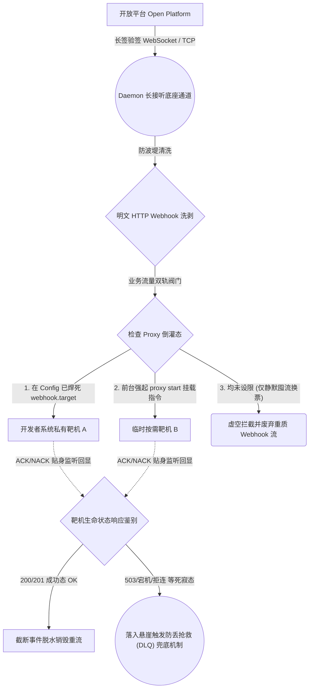
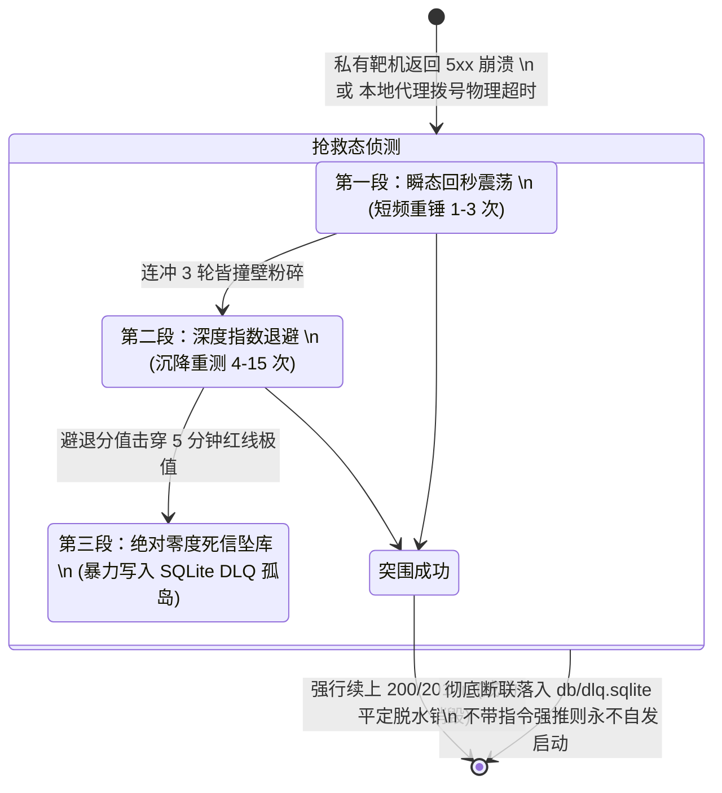

# Webhook 监听与死信管道落盘设计 (Webhook & DLQ Transmission)

*文档版本*: v0.1.1 (Detailed Design)

---

## 1. 核心业务痛点与流转架构

在过去无全景伴生代理网关的传统落后开发流中，开发者必须提供一台公网裸露可达的环境域名机器，才能接得住由天外飞来的开放平台 Webhook 发射流。这在本地开发期间构成了极度反人类的断流障碍。
本 CLI 架构伴随 Daemon 后台守护进程所开辟的自动隐形通信能力，其本质就是为桌面级开发环境打造了一个全天候免维护的 **“云直穿底内网的隐身暗网隧道与按需引流的代理集散口”**。

**核心网络交火流 (The Streaming Lifecycle)：**

### 1.1 双路靶场倒灌架构全景图 (Proxy Forwarding Dataflow)

1. **云端硬核自动取联 (Upstream Listening)**：此时一并驻留在系统深水区的 Daemon 守护服务**无论如何**都会全速强硬逆转底盘，探入系统级保险箱（Keyring）内解密调出不容置辩的冷绝秘源（`appKey`、`appSecret`、`encryptCode` 及 `authCert`）。以此长串为祭签出不可伪称的长链强认凭据，在开机即刻便于黑幕后排深海构筑点燃起一条穿过公网直捅平台的 WebSocket/TCP 钢铁长驻隧道。
2. **报文流洗牌 (Payload Parsing)**：全天候不眠死死侦听从暗网接头内被高压砸落下来的深层事件流簇瀑布（诸如业务单据扭转，特别是用于给前端续命的新生 `appTicket` 事件），过手高敏防波堤撕开报文摘壳与洗涤。
3. **收放自如的双轨内网倒灌 (Local Forwarding Proxy)**：驻海长接听通道是保障本地生态系统（尤其是核心 Auth State Machine）无头保命的心血源泉，**其绝对没有启停控制，Daemon 一旦挂起，长连必通**！但在完成了天外收流与洗脱剥出明文的 `HTTP Webhook` 后，是否还要继续掉头向内网本地开发者靶机倒流开路？则严格遵照以下双水坝收控策略：
   - 【**全局挂载托底直连态**】：如果在跨平台脱离干预的配置文件库里已被人事先硬性烙下倒流集散器孔（预装配有 `webhook.target` URL）。隐匿守护中的伴生 Daemon 压根不会跟你商量废什么话，它会自行打通代理内鬼分路器，毫不留情地强硬朝准该靶心引爆疯狂火力齐射暴雨！
   - 【**按需热插挂分装导流管**】：倘若并未事先被烙下死亡坐标。后台这尊卧倒的大佛哪怕从公网接到了天量事件簇，它也绝不会冒失向内网毫无准星的地方疯狂盲灌数据垃圾，它只紧紧闭眼安安稳稳囤兵截流暗库。直至某年某月——无论是人类还是大模型 Agent 为了联调除虫突发奇想要拦截数据 —— 它只需起手发劲，直接在前台横切挂上一道极度霸道的临时暴力牵引管指令鞭：`chanjet-cli proxy start --target http://localhost:8080/api/webhook`。这一绝命爆斩指令下场之隙，代理分水的压水水闸豁然剧烈撕开。隐匿内网流口顺势全量无缝逆转，满载着的压仓急流如同那失控开闸的防洪水泄洪般狂乱倒卷而出，疯狂冲毁向开发者那台临开着后门端口的主权研发靶洞持续执行疯狂鞭打！
4. **强硬签收锁 (ACK / NACK)**：不管是在重火力直射态或是极不稳定的热插拔式随动连网关倒灌引流，网内水枪每一次猛射向倒闭本尊靶台后，都必须强制性逆向拽住靶机濒死那刻回传极其微弱残存的物理握手命脉码（也就是那个纯正不过的 HTTP Status Code 层级反馈体），据实做成极致验货的真假判定凭证账本，严丝合缝紧锁住下一条倒钩铁绳链般死信全生命同期后置防丢失打底救援机制！

---

## 2. 三段式防丢抢救算法 (3-Stage Rescue Fallback)

即便内网发生最残酷的死寂阻断、或是开发者本地代码写错了一个 Fatal 导致 `HTTP 500` 甚至大面积全线崩溃重启。CLI 底层内核系统对于收紧的流水账网也绝不留情，它绝对不可能随随便便、轻描淡写地就把好不容易剥干净的黄金 Webhook 事件抛弃到下水道里。为了强效抵御这道死亡墙，我们会强制顺着这套极其凶狠的老牌纯固化“三段式阶梯抢救兜底算法”：

### 2.1 避退抢救状态时序图 (Rescue Fallback State Machine)

### 2.2 瞬态回秒震荡 (Retries 1-3)
**定局**：当打出倒灌 Proxy 并瞬间遭遇 `TCP RST / HTTP 502/504` 等极短硬中断物理异常时。
**运作**：假定系统可能仅仅是本地 Node/Golang 框架热重启中造成的几百毫秒空窗。此时绝不放弃，内核即刻触发原地微秒级阻塞睡眠，并火线祭出至多 3 次的连发重锤。正是利用这电光火石的几秒钟，硬生生越过了由于防波堤抖动、或本地开发者恰好正在手工执行 `go run` / `npm start` 重启 Web 靶环境所产生的微时差真空期。若在这几鞭子下成功捕获靶机 HTTP 200 回魂，则该悬空之危就此化解，流水事件全本即刻脱水销毁作废。

### 2.3 深度指数避退 (Retries 4-15, Exponential Backoff)
**定局**：前置的“瞬态回秒震荡”三发全数耗尽落空，或是靶程序持续稳定吐出 `HTTP 502/503` 代表重度故障未恢复。
**运作**：立即滑入长程消耗战。系统挂靠 **指数退避带基础抖动 (Exponential Backoff with Jitter)**。
- 探测步进时隙将被极度拉长：`1s -> 2.4s -> 5s -> 11s -> 24s -> 53s...`
- 在保护系统免受密集无效试探自我洪泛的基础上，内核在这段时间内会将事件暂时封印进 `DLQ.pending` 存活内存池，它不会消失，但每一次苏醒都变得更慢。
- 此流程最高阻断封路时间通常设定为 **5分钟** 阈值。超过极值点，则宣告病危，放弃无意义重连。

### 2.4 深度冻结落库 (Dead-Letter Queue Serialization)
- **触发条件**：数小时的 T2 宽容退避重测子弹打空，事件彻底坏死。
- **机制**：
  1. 将庞大的流水线上下文拦截截断（含 Request Header, Payload, 流式 EventID），全面剥离出越来越臃肿的网关层内存。
  2. 调用底层极光文件库（如无 CGO `go-sqlite3`），强行将失联尸体落盘打印入单机物理孤岛文件库：`~/.chanjet-cli/db/dlq.sqlite`。
  3. 借由本机的 `stderr` 或由 Lumberjack 切割器管控的专门日志列阵 `logs/dead-letter.log`，发出通红触目惊心的高度警报鸣。
- **目的**：认输入库，防止持续高并发带来的内存失控撑爆，移交停尸房，等候人工开发者后续带参（或 Agent 介入研判）的手工挖坟指令恢复。

---

## 3. 手术台死信逆向召回指令 (DLQ Recovery Operations)

一旦死信真正冰封入库 `.sqlite`，它便成为了永恒的尸体，不会由守护线程再自发生效拉起。CLI 为应对这段逻辑专门设计了手术台对开门指令钩子：

- **心肺复苏 (`chanjet-cli dlq retry <uuid> | --all`)**：通过给定的尸源凭据从高压库 `SELECT` 捞出尸体全包内容 -> 逆重构 `JSON Unmarshal` 重注灵魂复原为活体标准通信 Request -> 利用内部剥离的 HTTP Client Proxy 发射管再次向 `--target` 对准发射 -> 只要靶机返回出 `HTTP 200/201 ACK` 签收号，就转身对 SQLite 执行 `DELETE <uuid>` 彻底销毁作案记录完成脱水度劫。
