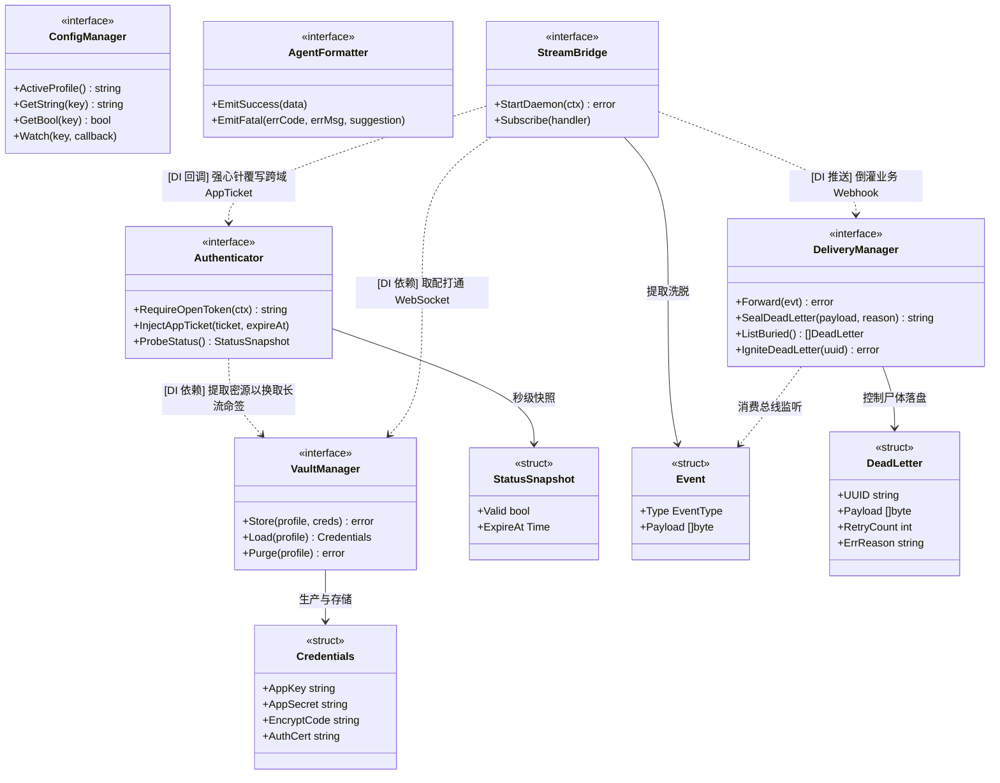

# 模块级解耦与接口边界设计文档 (Module Breakdown & Interfaces)

> **版本定位**：v0.1.1 内部开发契约  
> **设计纲要**：为了保证多维度的并行开发推进，且严格恪守 **TDD（测试驱动开发）** 军规，我们对整个系统实施了极其干脆正交的“面向接口编程 (Interface-Oriented Programming)”切割。该文档清晰界定了各模块的能力圈与隔离带。

---

## 0. 六大基座类协同解耦图谱 (Unified Micro-Kernel Class Architecture)

为使得 TDD 测试替身（Mock）能够跨模块无缝插拔，CLI 内核彻底摒弃了包级别耦合函数的一锅乱炖，全量升级为以下 **“六大接口洋葱防腐模型”** 依赖注入架构。



---

## 1. 核心底盘领域 (Core Framework)

### 1.1 全息配置编排引擎 (`core/config`)
横向收集合并并统摄调度所有 `--profile` 宿主环境沙箱、CLI Flags 与 本地 `config.yaml`。
- **能力边界**：无缝对接挂载 `Viper` 和 `Cobra`，不仅处理多租户环境和指令挂载的解析合并，更利用强大的 `WatchConfig` 为日志网桥提供微秒级底盘热修重制心跳监听。
- **解耦契约要求**：其它任何兄弟模块都**绝对严禁**自作主张地去磁盘乱读 `~/.config/`。如果想拿到诸如 Proxy 倒灌靶标等数据，一律通过向此黑箱 Manager 开口提取强类型值！它被隔离为绝对的数据总线单例。
- **Core Interface**:
  ```go
  package config

  type Manager interface {
      // 当前激活的沙箱实体标识 (如 default 或 test-user)  
      ActiveProfile() string
      GetString(key string) string
      GetBool(key string) bool
      // 注册对某敏感参数 (如 log.level) 的文件热变更微秒级监听触发器
      Watch(key string, callback func(newVal interface{}))
  }
  ```

### 1.2 暗物质密文冷库 (`core/vault`)
彻底屏蔽不同操作系统间极其繁琐复杂的加解密环境调用坑洞。
- **能力边界**：它是唯一有资格经手 `appSecret` 及 `encryptCode` 原生明文段的模块。向下调用机制对接 macOS/桌面 Linux 原生级 OS 凭证库，或在 Headless 态下跌落回退成自己打盐搓造的 AES-GCM-256 私属掩码 `.seal` 固卷加密。
- **解耦契约要求**：它是绝对纯粹、死寂般的“无状态函数黑盒”。给它一个 `appKey`，它就通过解密为您提取还魂出长效核心源件。
- **Core Interface**:
  ```go
  package vault

  // 源初实体
  type Credentials struct {
      AppKey      string
      AppSecret   string
      EncryptCode string
      AuthCert    string 
  }

  type VaultManager interface {
      // 按 Profile 隔离池冷入密库，落盘加密
      Store(profile string, creds Credentials) error
      // 提取明文被解密出鞘的高敏绝对死源件
      Load(profile string) (*Credentials, error)
      // 彻底清空并注销该账户隔离组密码
      Purge(profile string) error
  }
  ```

### 1.3 生命周期鉴权状态机 (`core/auth`)
掌控天下 API 命运、统管 `openToken`/`appTicket` 取用与双锁替换逻辑的死硬心脏。
- **能力边界**：网关的唯一守门员。负责控制“单轨阻挂请求下传 (Single-Flight Barrier)”、“极低频微秒轮询寻活换血”策略。
- **解耦契约要求**：它是彻头彻尾的逻辑计算和内存缓存池！它完全不知道怎么发真正的 HTTP 请求（这必须归 `client` 管）。当它需要票时它就挂起阻塞，一旦外部（比如 Stream 底座收到长连推流）拿到新票，直接顺位回调强心针注入。
- **Core Interface**:
  ```go
  package auth

  type StatusSnapshot struct {
      Valid    bool
      ExpireAt time.Time
  }

  type Authenticator interface {
      // 核心业务拿 Token 的唯一隘口
      // 若失效它内部必将引爆抛挂，阻起全量大并发进入轮询长休眠倒计时！
      RequireOpenToken(ctx context.Context) (string, error)
      
      // 专供水底长驻 Stream 在接取到下落的 webhook 事件时逆向覆盖回内存池！
      InjectAppTicket(ticket string, expireAt time.Time)
      
      // status 命令调用的秒级离线快照推演
      ProbeStatus() (openToken StatusSnapshot, appTicket StatusSnapshot)
  }
  ```

### 1.4 无头 Agent 拦截底座 (`core/telemetry`)
大模型友好的静流输出与滚动落盘基建站。
- **能力边界**：封装底层日记（如 `zap/lumberjack`）进行分域的隔离生成与极值存量切割（`system.log`/`stream.log`等）。内嵌核爆级拦截器将 `panic` 捕捉还原重溯。
- **Core Interface**:
  ```go
  package telemetry

  // 面向 Agent 抛出标准格式约束
  type AgentFormatter interface {
      EmitSuccess(data interface{})
      // 拼装 recover_suggestion
      EmitFatal(errCode int, errMsg string, suggestion string)
  }
  ```

---

## 2. 守护生命线领域 (Daemon Domain)

### 2.1 长效流信道守望者 (`daemon/stream`)
绝对无条件向畅捷通底座挂出的后台常驻 TCP/WebSocket 隧道。
- **能力边界**：它向 `Vault` 提纯一把秘钥就径直穿过公网防火墙建立通讯。一旦接到滚落的高压事件流，立刻扒光无用的封装壳膜，还原为纯净 JSON 并无情甩给下流的事件池。
- **解耦契约要求**：它绝对不关心任何 Webhook 数据逻辑（甚至连看都不看），它只负责连网、抗抖、高敏接包、推脱洗白！
- **Core Interface**:
  ```go
  package stream

  type EventType string
  const (
      EventAppTicket EventType = "appTicket_refresh"
      EventWebhook   EventType = "webhook_biz_forward"
  )

  type Event struct {
      Type    EventType
      Payload []byte
  }

  type StreamBridge interface {
      // 强打通天外潜海起航，在背后默默运行
      StartDaemon(ctx context.Context) error
      // 供双轨分发 Proxy 或 Auth 向其暗中挂靠注入回调函数接收水滴流量
      Subscribe(handler func(evt Event))
  }
  ```

### 2.2 双轨靶场与死信拦截闸 (`daemon/proxy`)
接替 Stream 处理业务 Webhook 后续流转机制，负责向内网引流或执行死信阻截双发。
- **能力边界**：接收纯业务级的 `EventWebhook`，按配置判断是应该顺着 `webhook.target` 静态倾泻倒灌，还是配合 `proxy start` 指令顺势热引流。
- **极寒兜底**：如果靶场抛锚，它会严酷引爆内置的多维三段式阶梯死信倒钩拦截网（Exponential Backoff & DLQ SQLite Fallback）。
- **Core Interface**:
  ```go
  package proxy

  // 倒灌事件发源实体
  type DeadLetter struct {
      UUID        string
      Payload     []byte
      RetryCount  int
      ErrReason   string
  }

  type DeliveryManager interface {
      // 双轨分发主导向，内含微秒级重锤连射倒退机制！
      Forward(evt stream.Event) error
      
      // 绝境下死信 SQLite 深冰封印库
      SealDeadLetter(payload []byte, reason error) (uuid string, err error)
      ListBuried() ([]DeadLetter, error)
      
      // 被手工 dlq retry 脱机钩起拉活
      IgniteDeadLetter(uuid string) error
  }
  ```

---

## 3. 并行并发测试赋能 (Parallel TDD Orchestration)

上述高度割裂的 Interface 层，使得我们可以开启跨越物理壁垒的极端并发测试：
1. **开发者甲**：可以直接引入 `MockVault` + `MockConfig`，单独去撰写 `core/auth` 的 Single-Flight 压测用例，验证防雪崩逻辑，根本不用建网。
2. **开发者乙**：可以通过注入 `MockStream` 制造假乱水流，专项爆破 `daemon/proxy` 的防衰退与掉电重启死信入库测算，互不污染冲突点。
