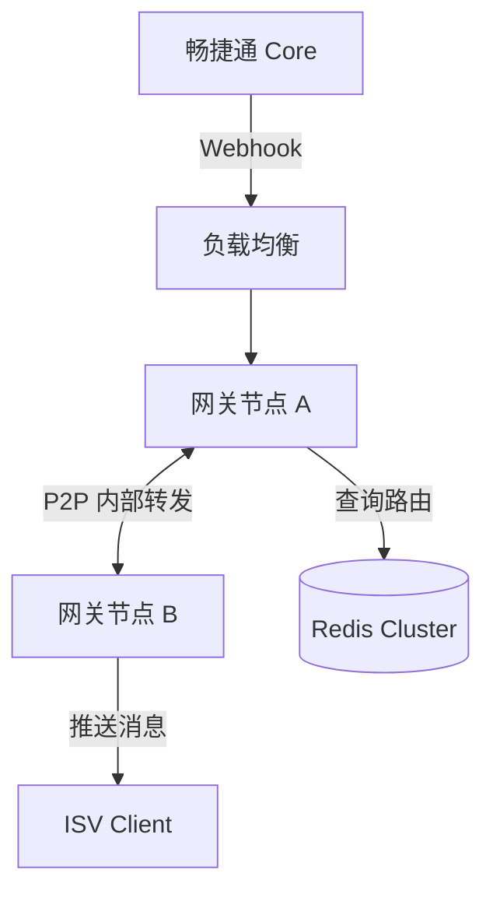
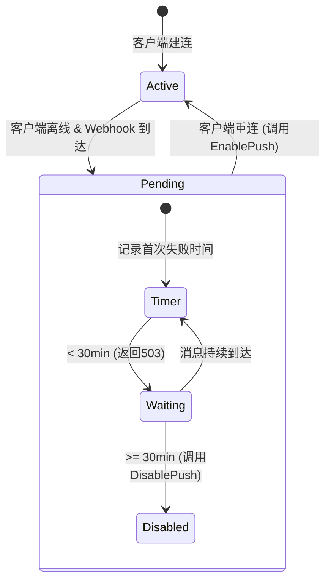
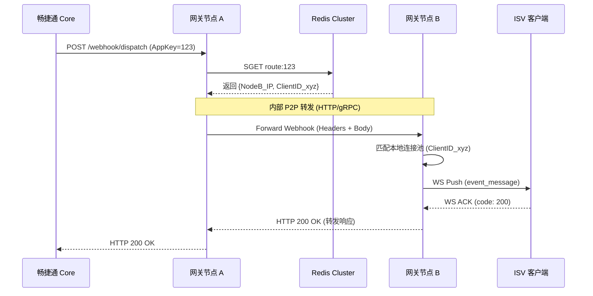
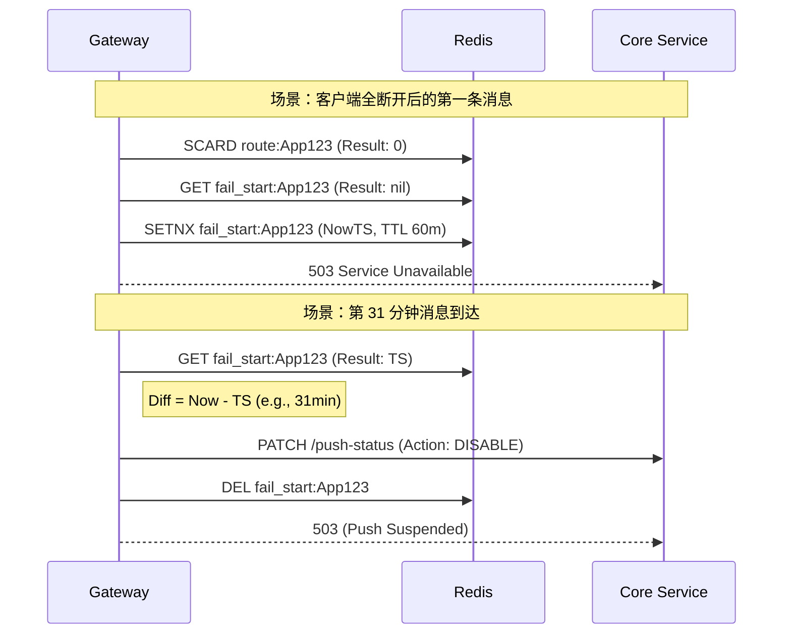
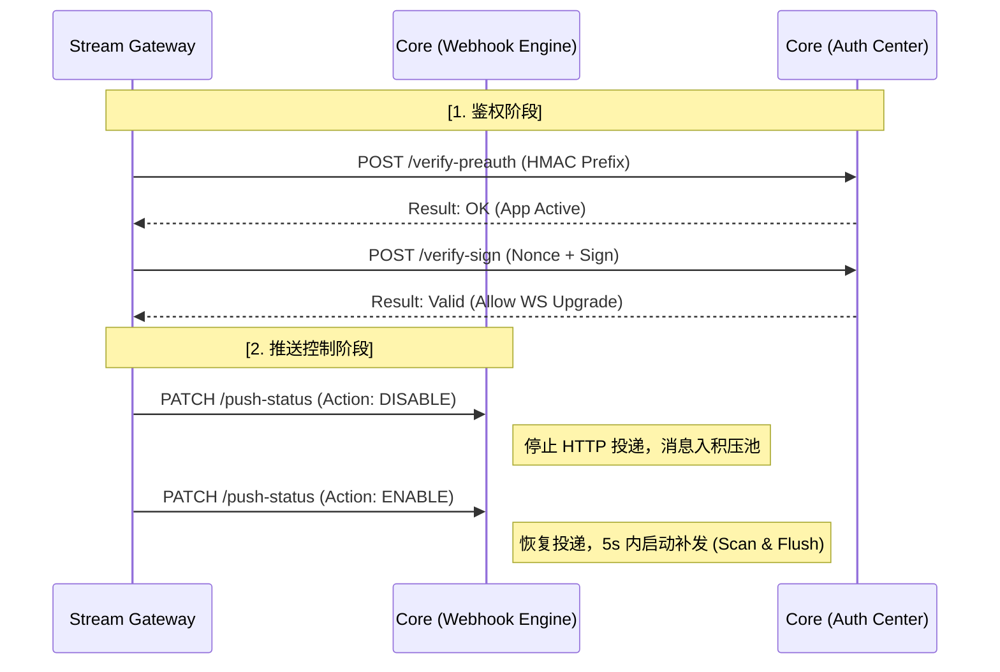

# 畅捷通 Stream Gateway 需求草案 v0.0.5

这是为您整理的 **畅捷通 Stream Gateway 需求草案 v0.0.5**。

本版本在 v0.0.3 的基础上，完整保留了核心架构设计，并深度补充了“在线鉴权（No-Secret 模式）”、“基于流量触发的 30 分钟动态推送控制”、“全链路审计”以及“核心服务（Core）配套改造 PR”。

---

# 畅捷通 Stream Gateway 需求草案 v0.0.5

| 维度 | 内容 |
| --- | --- |
| **文档状态** | 草案（内部评审中） |
| **版本** | v0.0.5 |
| **基于版本** | v0.0.3 |
| **主要新增** | 在线鉴权逻辑 / 30min 失败容忍期 / 动态推送控制 / 审计日志规范 |
| **Core 协作项** | 增加验证 API、推送状态控制 API (Enable/Disable)、离线消息暂存要求 |

---

## 1. 背景与产品定位

### 1.1 核心痛点

● **网络限制**：ISV 接入 Webhook 必须具备公网 IP 和 SSL，内网/本地环境接入困难。 ● **安全风险**：开放公网端口存在被攻击风险。 ● **接入复杂**：Webhook 签名校验与 URL 自动验证对开发者门槛较高。

### 1.2 产品定位

作为畅捷通开放平台的官方基础设施组件，提供 Webhook-to-WebSocket 透明同步桥接能力。实现免公网 IP、免证书、高安全、低延迟的事件订阅体验。

---

## 2. 核心架构设计

### 2.1 同步阻塞桥接模式

● **无状态代理**：网关不设消息队列，不持久化业务数据。 ● **状态回传**：网关挂起 HTTP 请求，等待 WebSocket 客户端的 ACK。 ● **压力回传**：若客户端离线或处理超时，网关向畅捷通 Core 返回 503/504，利用上游原生的 Webhook 衰减重试机制实现消息积压与重补。

### 2.2 P2P 动态路由机制

● **路由注册表（Redis Cluster）**：使用 Redis 存储 `route:{AppKey} → Set{node_ip:client_id}`。 ● **分布式路由**：     ○ Webhook 随机打到任一 Node。     ○ 该 Node 查询 Redis 获知客户端连接所在的物理节点。     ○ 通过内部 P2P HTTP 转发报文至目标节点。 ● **分散接入**：建议 ISV 部署多个实例，通过负载均衡分散连接到不同网关节点，消除单点故障。

---

## 3. 负载均衡与分发策略

### 3.1 职责划分

● **基础设施层（L4/L7 LB）**：负责客户端到网关节点的物理连接分发，采用 Least Connections 策略。 ● **应用逻辑层（Gateway Internal）**：负责消息到具体客户端实例的逻辑分发。

### 3.2 双层公平分发算法

● **跨节点分发（Cross-Node）**：从 Redis Set 中随机/轮询选择目标 Node 进行内部转发。 ● **节点内分发（Intra-Node）**：当目标 Node 本地存在多个同一 AppKey 的连接时，采用 Round-Robin 算法选择连接进行推送。

---

## 4. 握手与鉴权协议（在线验证模式）

### 4.1 设计背景

网关节点**不存储 AppSecret**。采用 Nonce 挑战-应答机制，由网关实时请求 Core 服务完成在线签名校验。

### 4.2 两步握手流程

**Step 1 — 获取 Nonce**`GET /challenge?app_key={AppKey}` Header: `X-CJT-PreAuth: {HMAC_SHA256(app_key, AppSecret).hex()[:16]}` 网关行为：调用 Core `verify-preauth` 接口，验证通过后下发 Nonce（30s TTL）。

**Step 2 — WebSocket 建连**`wss://gateway.cjt.com/connect?app_key={AppKey}&nonce={nonce}&sign={sign}&client_id={client_id}` ● sign 计算: `HMAC_SHA256(app_key + "&" + nonce, AppSecret).hex()` 网关行为：调用 Core `verify-sign` 接口。

**Step 3 — 建连成功确认帧（网关 → 客户端）**

```json
{
 "msg_type": "system",
 "event": "connected",
 "client_id": "{client_id}",
 "server_time": 1704067200123,
 "ping_interval": 10000
}

```

### 4.3 安全防护

1.  **频率限制**：同一 AppKey 10次/分钟；同一 IP 20次/分钟。
    
2.  **熔断机制**：同一 IP 5 分钟内 sign 校验失败 >= 5 次，封禁 30 分钟。
    

---

## 5. WebSocket 消息协议

### 5.1 推送消息（Gateway → Client）

网关仅透传 Header 白名单：`X-C-APP_ID, X-C-APP_KEY, X-C-ORG_ID, Content-Type, X-MSG-ID`。

```json
{
"msg_type": "event", 
"msg_id": "UUID-v4", 
"headers": { "X-MSG-ID": "msg_abc123", "X-C-APP_KEY": "<APP_KEY>" },
"payload": "{\"event_type\":\"order.paid\",\"data\":{...}}"
}

```

#### 5.2 ACK 应答协议 (Client → Gateway)

客户端在接收到 `msg_type: "event"` 的推送消息后，必须在 **3 秒内** 通过原 WebSocket 连接返回 ACK 帧。

**消息格式 (JSON)**：

```json
{
  "msg_type": "ack",
  "msg_id": "UUID-v4",      // 必须与推送消息中的 msg_id 严格一致
  "code": 200,              // 200/4xx 代表成功；5xx 代表失败
  "message": "success",     // 描述信息
  "timestamp": 1704067200500 // 客户端处理完成的时间戳
}

```

**字段说明**：

| 字段 | 类型 | 必须 | 说明 |
| --- | --- | --- | --- |
| **msg\_type** | string | 是 | 固定为 `"ack"` |
| **msg\_id** | string | 是 | **关键字段**。必须引用推送消息（Gateway → Client）中的 `msg_id`，用于网关关联挂起的 HTTP 请求。 |
| **code** | int | 是 | 业务处理状态码。**200**：成功；**4xx**：请求错误；**5xx**：系统错误。 |
| **message** | string | 否 | 辅助说明信息，如错误原因。 |
| **timestamp** | long | 是 | 13 位毫秒级时间戳。 |

---

#### 5.3 ACK 处理规则与超时机制

1.  **引用一致性**：网关内部维护一个“待确认消息表”。客户端返回的 `msg_id` 若无法匹配任何活跃的挂起请求，网关将直接丢弃该 ACK 帧。
    
2.  **3 秒硬超时**：
    
    *   从网关发出 WS 消息开始计时，若 3 秒内未收到该 `msg_id` 的有效 ACK，网关将立即释放对应的 HTTP 请求。
        
    *   网关向 Core 返回 `HTTP 504 Gateway Timeout`。
        
    *   网关向客户端发送 `system:timeout` 指令（可选），告知该消息已失效。
        
3.  **单连接顺序性**：虽然 WebSocket 支持异步交互，但为了降低 ISV 实现复杂度，网关建议客户端按接收顺序依次返回 ACK，避免长耗时任务阻塞连接。
    

---

#### 5.4 ACK 映射关系 

网关根据收到的 `code` 字段，决定向畅捷通 Core 返回何种响应：

| 客户端 ACK code | 网关响应 Core 状态码 | 网关响应 Core Body | 核心决策 (Core) |
| --- | --- | --- | --- |
| **200** | `200 OK` | `{"result":"success"}` | **停止重试** |
| **4xx / 5xx** | `503 Service Unavailable` | `{"result":"error", "message":"client_err"}` | **触发衰减重试** |
| **超时 (无 ACK)** | `504 Gateway Timeout` | `{"result":"error", "message":"ack_timeout"}` | **触发衰减重试** |
| **连接断开** | `503 Service Unavailable` | `{"result":"error", "message":"conn_lost"}` | **触发衰减重试** |

网关作为透明桥接层，必须严谨地透传客户端的处理结果。为了保证数据投递的绝对可靠性，收紧了成功的判定标准：

*   **成功确认 (Success Confirmation)**：
    
    *   **触发条件**：客户端返回 code: 200（业务处理成功）。
        
    *   **网关向 Core 返回**：HTTP 200 OK
        
    *   **响应 Body**：{"result":"success"}
        
    *   **效果**：Core 停止该消息的所有重试。
        
*   **失败/异常处理 (Failure/Exception)**：
    
    *   **触发条件**：
        
        1.  客户端返回 code: 4xx（业务参数错误/非法请求）。
            
        2.  客户端返回 code: 5xx（客户端系统异常）。
            
        3.  **3 秒内未返回 ACK**（网络超时或客户端挂起）。
            
    *   **网关向 Core 返回**：HTTP 503 Service Unavailable 或 HTTP 504 Gateway Timeout。
        
    *   **响应 Body**：{"result":"error", "message":"client\_response\_fail"}
        
    *   **效果**：Core 将该消息计入失败，并启动原生的衰减重试逻辑。
        

### 5.3 心跳协议

● 网关每 10s 发送 ping 帧，客户端须在 5s 内回 pong。20s 无交互则断连。

---

## 6. 动态推送控制（失败触发 30min 容忍期）

### 6.1 核心逻辑 (Push-on-Demand)

1.  **重试容忍期**：当 Webhook 到达且无在线连接时，网关在 Redis 记录 `fail_start:{AppKey}` = 当前时间。
    
2.  **503 阶段**：若 `当前时间 - fail_start < 30分钟`，网关向 Core 返回 **503**，利用 Core 侧重试队列暂存消息。
    
3.  **触发禁用**：若 `当前时间 - fail_start >= 30分钟`，网关调用 Core `DisablePush` 接口挂起投递，并清理计时器。
    
4.  **即时恢复**：当 AppKey 的任一客户端重连，网关立即请求 Core `EnablePush` 恢复投递并补发。
    

---

## 7. 消息幂等与可靠性

### 7.1 客户端幂等（必须实现）

1.  查幂等表：基于 `X-MSG-ID` 判断是否处理过。
    
2.  执行业务 -> 标记已处理 -> 发送 ACK。
    

### 7.2 极致自愈

● **见死即埋**：内部转发遇连接重置，立即清理 Redis 路由并返回 503。 ● **内存背压**：限制单机总挂起请求数（如 5000）。

---

## 8. 客户端重连退避协议

### 8.1 强制规则

● **退避公式**：`wait = min(60s, 1s x 2^attempt) + jitter(0~30%)`。 ● **稳定重置**：连接稳定 60s 后 attempt 计数归零。401/403 错误禁止自动重连。

---

## 9. 可观测性与审计日志 (新增)

### 9.1 审计流水

● **连接流水**：记录 `client_id` 建连/断开原因、IP。 ● **消息流水**：记录 `X-MSG-ID`、`trace_id`、状态、耗时。**不记录业务 Payload**。

### 9.2 监控指标

● 单 AppKey 并发数、P99 处理耗时、节点连接总数（阈值 4000/5000）。

---

## 10. Redis 宕机降级策略

● **路由表**：不可用时降级读本地内存缓存（TTL 60s）。 ● **Nonce**：拒绝新建连，返回 503。 ● **恢复重建**：Redis 恢复后，节点全量同步本地活跃连接至 Redis。

---

## 11. RESTful 接口规范 (新增)

*   **快速 ACK 原则**：ISV 客户端收到消息后，应立即存入本地队列或数据库（持久化），然后立刻返回 `code: 200` 的 ACK。严禁在返回 ACK 前执行复杂的业务逻辑、远程调用或大事务操作，以防触发网关的 3 秒超时限制。
    
*   **重试去重**：若客户端因为处理过慢导致网关超时（504），Core 会随后发起重试。客户端必须利用 `headers` 中的 `X-MSG-ID` 进行业务去重，不能依赖网关或 WS 链路的可靠性。
    

---

### 11.1 统一响应结构

```json
{ "code": "GW-0000", "message": "success", "trace_id": "...", "data": { ... } }

```

### 11.2 对外接口

● `GET /v1/ws/challenge`: 获取 Nonce。

#### 1.3 \[对内\] 接收 Core Webhook 推送 (Dispatch)

*   **接口路径**：POST /internal/v1/webhook/dispatch
    
*   **Response 行为规范 (严格收紧版)**：
    

| **客户端 ACK 状态** | **网关返回 HTTP 状态码** | **网关返回 Body** | **Core 侧行为** |
| --- | --- | --- | --- |
| **200 (OK)** | 200 OK | {"result":"success"} | **停止重试** |
| **4xx (Client Err)** | 503 Service Unavailable | {"result":"error", "message":"client\_4xx"} | **触发重试** |
| **5xx (Server Err)** | 503 Service Unavailable | {"result":"error", "message":"client\_5xx"} | **触发重试** |
| **超时 (3s)** | 504 Gateway Timeout | {"result":"error", "message":"timeout"} | **触发重试** |
| **离线 (No Client)** | 503 Service Unavailable | {"result":"error", "message":"no\_online\_client"} | **触发重试** |

---

## 12. 跨团队协作：畅捷通 Core 服务配套改造需求 (PR)

### 12.1 身份验证 API (Auth Verify)

Core 需提供内网高性能接口供网关校验（P99 < 50ms）：

*   `POST /internal/v1/auth/verify-preauth`: 验证 HMAC 前缀。
    
*   `POST /internal/v1/auth/verify-sign`: 验证 WebSocket 建连签名。
    

### 12.2 推送状态控制 (Push Control)

*   `PATCH /internal/v1/subscriptions/{app_key}/push-status`
    
*   **Action: DISABLE**: 挂起投递，消息进入离线积压池。
    
*   **Action: ENABLE**: 恢复投递，并在 5s 内触发积压消息扫描补发。
    

### 12.3 Webhook 引擎升级

*   **X-MSG-ID**: 投递 Header 必须包含全局唯一且重试不变的消息 ID。
    
*   **TraceID 复用**: 重试请求必须复用首次生成的 `trace_id`。
    
*   **URL 激活**: 兼容网关代为响应的 Webhook URL 自动验证逻辑。
    

---

## 13. 架构图示补充

### 13.1 部署拓扑与 P2P 转发



### 13.2 动态推送控制状态机


---

## 14. 关键决策记录 (ADR)

● **在线鉴权**：Secret 不下发至网关，极大提升安全性。 ● **失败触发计时**：比定时扫描更精准，减少对 Core 的干扰。 ● **ACK 映射**：4xx 映射为 200，有效防止因 ISV 业务逻辑错误导致的无限重试风暴。

## 15. 详细交互时序图

### 15.1 跨节点消息路由时序 (Node A -> Node B)

展示当 Webhook 打到节点 A，而客户端连接在节点 B 时的完整 P2P 转发过程。



### 15.2 动态推送控制：30 分钟计时器转换逻辑

展示 Redis 计时器如何驱动 Core 状态变更。


---

## 16. 全局错误码映射矩阵 (Error Code Registry)

| 来源 | 状态码 / Code | 含义 | 触发场景 | 建议客户端行为 |
| --- | --- | --- | --- | --- |
| **HTTP** | `401 Unauthorized` | 鉴权失败 | `/challenge` 的 PreAuth 错误或 WS 签名错 | **停止重连**，检查密钥 |
| **HTTP** | `410 Gone` | Nonce 过期 | 使用了超过 30s 的 Nonce 建连 | 重新请求 `/challenge` |
| **HTTP** | `429 Too Many Requests` | 频率限制 | 触发 AppKey 或 IP 级限流阈值 | 延迟 `Retry-After` 秒重试 |
| **HTTP** | `503 Service Unavailable` | 路由不可达 | 客户端离线（在 30min 容忍期内） | 无需处理，由 Core 自动重试 |
| **HTTP** | `504 Gateway Timeout` | 处理超时 | 客户端 3s 内未回 ACK | 优化本地业务处理为异步 |
| **WS** | `1008 Policy Violation` | 协议违规 | 未按要求发送心跳或 ACK 格式错 | 检查 SDK 实现逻辑 |

---

## 17. 性能指标基准 (Performance Benchmarks)

网关作为高并发桥接组件，必须满足以下性能要求：

| 指标 | 目标值 | 备注 |
| --- | --- | --- |
| **单机并发连接数** | 5,000 ~ 8,000 | 受限于 Linux 文件句柄与内存（每连接约 10-20KB） |
| **单请求网关损耗** | < 50ms | 不计 Core 推送延迟与 ISV 业务处理延迟 |
| **鉴权接口响应 (P99)** | < 100ms | 包含网关到 Core 的内部往回时间 |
| **最大挂起请求数** | 5,000 (全局) | 超过此值网关将返回 503 保护自身内存 |
| **心跳超时阈值** | 20s | 10s Ping + 10s Pong Wait |

---

## 18. 测试与验收标准 (DoD)

### 18.1 安全性测试方案 (Security)

*   [ ] **非法 Access**：使用错误的 
    
*   [ ] **重放攻击**：使用同一个 
    
*   [ ] **暴力破解保护**：模拟短时间内大量错误的 
    

### 18.2 动态控制专项测试 (Stability)

*   [ ] **容忍期验证**：客户端离线，发送消息，确认网关返回 503；29 分钟时重连，确认 Core 
    
*   [ ] **禁用触发验证**：客户端离线，第 31 分钟发送消息，确认网关调用了 Core 的 
    
*   [ ] **快速补发验证**：在 
    

### 18.3 鲁棒性测试 (Robustness)

*   [ ] **节点崩溃切换**：手动 Kill 掉 Client 所连接的 Node A，观察 Client 是否通过 LB 漂移到 Node B，并检查 Redis 路由表是否在 1 分钟内更新。
    
*   [ ] **Redis 抖动**：模拟 Redis 阻塞 10s，观察网关是否能利用内存缓存继续处理已有的路由转发。
    

---

## 19. 客户端集成最佳实践 (SDK Advice)

为了降低 ISV 接入门槛，建议提供官方 SDK 或参考实现：

1.  **异步化处理**：客户端收到消息后，应先将 Payload 放入本地内存队列或数据库，**立即返回 ACK: 200**，严禁在 ACK 返回前执行耗时的数据库写入或远程调用。
    
2.  **固定 ClientID**：建议 `client_id` 包含 `hostname` 或 `mac_address`，方便在网关审计日志中追踪特定实例的连接历史。
    
3.  **连接预热**：在服务启动时，先调用 `/challenge` 获取 Nonce，若成功则预连 WS，确保业务流量到达前连接已 Ready。
    

---

## 20. 关键决策记录 (ADR) 复盘

*   **ADR-06: 放弃定时扫描，改用流量触发禁用**
    
    *   _原因_：定时扫描（Cron）在多节点环境下容易产生竞态，且对从未产生流量的僵尸 AppKey 造成 Redis 压力。流量触发方案将成本平摊到了请求路径上。
        
*   **ADR-07: X-CJT-PreAuth 的必要性**
    
    *   _原因_：`/challenge` 是公开接口，不加 PreAuth 会导致攻击者可以无成本消耗网关的 CPU 和 Redis 资源生成 Nonce。PreAuth 是首道静态屏障。
        
*   **ADR-08: 强制 Payload 为 String**
    
    *   _原因_：避免网关层做 `JSON.parse` 再 `JSON.stringify` 导致的 Key 顺序变更，从而确保 ISV 客户端收到的明文与 Core 发出时完全一致。
        

---

**文档修订结束 (v0.0.5)**

_审核：架构委员会_

_日期：202X年XX月XX日_

为了确保畅捷通 Stream Gateway (v0.0.5) 顺利落地，畅捷通 **核心服务（Core Service / Webhook 引擎）** 需要进行相应的配套改造。

以下是为您整理的 **核心服务配套改造需求公函 (PR - Project Requirements)**，包含逻辑定义、接口规范及关键图示。

---

# 附录：畅捷通 Core 服务配套改造需求 (PR v0.5)

| 协作项 | 描述 | 优先级 |
| --- | --- | --- |
| **项目名称** | 畅捷通 Stream Gateway 基础设施配套 | **P0** |
| **主要目标** | 升级 Webhook 引擎，支持在线鉴权验证、动态推送控制及消息幂等标识 | **核心任务** |

---

## 1. 业务交互图示 (Sequence & Logic)

### 1.1 在线鉴权与动态控制流

核心服务（Core）作为身份凭证（Secret）的唯一持有方，需支撑网关的建连验证及推送状态切换。


---

## 2. 身份验证 API 需求 (Auth Provider)

由于网关采用 **No-Secret 模式**（内存不存密钥），Core 需提供高性能验证接口。

### 2.1 验证 PreAuth 前缀

*   **用途**：网关在处理 `/challenge` 接口时，初步过滤非法请求。
    
*   **接口**：`POST /internal/v1/auth/verify-preauth`
    
*   **参数**：`{ "app_key": "string", "pre_auth_prefix": "string(16位)" }`
    
*   **要求**：Core 检索 Secret，计算 HMAC 后对比前 16 位。响应需包含 App 状态（禁用/欠费等）。
    

### 2.2 验证 WebSocket 签名

*   **用途**：WebSocket 建连时的最终身份确认。
    
*   **接口**：`POST /internal/v1/auth/verify-sign`
    
*   **参数**：`{ "app_key": "string", "nonce": "string", "sign": "string" }`
    
*   **逻辑**：Core 计算 `HMAC_SHA256(app_key + "&" + nonce, AppSecret)`。
    
*   **性能**：该接口位于建连关键路径，**P99 响应必须 < 50ms**。
    

---

## 3. 推送控制 API 需求 (Push Control)

支持网关根据 ISV 在线情况动态挂起或恢复投递。

### 3.1 推送状态切换

*   **接口**：`PATCH /internal/v1/subscriptions/{app_key}/push-status`
    
*   **动作定义**：
    
    *   **DISABLE**：
        
        1.  停止向网关发起新的 Webhook HTTP 请求。
            
    *   **ENABLE**：
        
        1.  恢复该应用的 Webhook 推送。
            

---

## 4. Webhook 投递协议升级 (Webhook Engine)

为了配合网关的幂等与容忍期逻辑，Core 侧投递引擎需做以下调整：

### 4.1 引入 `X-MSG-ID` (DEP-01)

*   **需求**：在 Webhook 的 HTTP Headers 中必须包含 `X-MSG-ID`。
    
*   **规则**：同一业务消息在重试（Retry）过程中，`X-MSG-ID` 必须保持 **全局唯一且绝对不变**。
    
*   **用途**：ISV 客户端据此实现幂等。
    

### 4.2 保持 Payload 稳定性

*   **需求**：Core 必须保证同一消息在多次重试投递时，Body 字符串内容完全一致。
    
*   **原因**：防止 JSON 序列化（如 Key 顺序改变）导致签名校验失败。
    

---

## 5. URL 自动验证支持

*   **需求**：Core 在进行 Webhook URL 激活验证（`check_code`）时，需允许 Stream Gateway 代理响应。
    
*   **逻辑**：若订阅模式为“Stream”，Core 应忽略对该 URL 的 `GET` 存活性强制校验，或由网关侧拦截并统一返回校验成功。
    

---

## 6. 性能与可靠性要求 (SLA)

1.  **高并发支持**：推送控制接口（Enable/Disable）需支持在高频断连场景下的并发请求。
    
2.  **重试一致性**：Core 在进行衰减重试时，必须复用首次生成的 `X-Trace-Id`。
    
3.  **持久化保证**：进入 `DISABLE` 状态期间，积压消息不可丢失，直至达到 24 小时过期阈值。
    

---

## 7. 交付清单 (Deliverables)

| 编号 | 交付内容 | 验收标准 |
| --- | --- | --- |
| **01** | 在线验证接口 | 网关可通过 API 实时验证 ISV 签名，无 Secret 存储。 |
| **02** | 推送开关逻辑 | 接收网关指令并能正确挂起/恢复特定 App 的 Webhook 流。 |
| **03** | 补发机制 | 恢复推送后，积压的消息能迅速下发至网关。 |
| **04** | Header 升级 | Webhook 请求头 100% 包含 `X-MSG-ID`。 |

---

**PR 提交人**：架构组 **审批人**：核心服务部 / 开放平台组 **生效日期**：202X-XX-XX