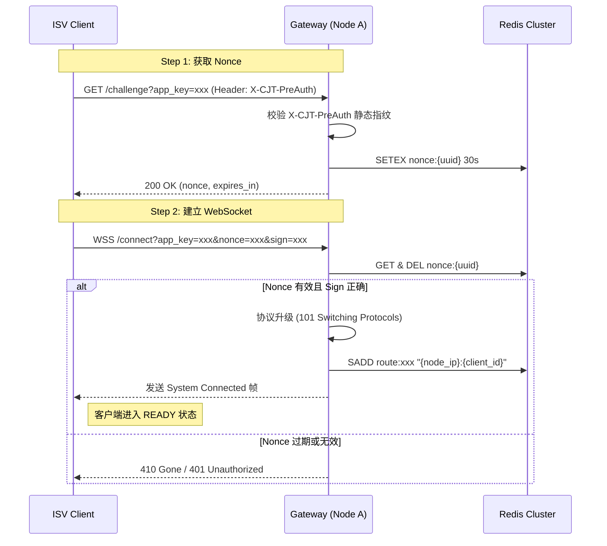
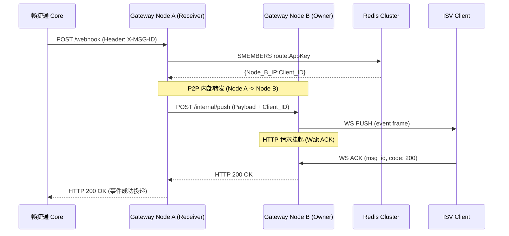

# 畅捷通 Stream Gateway需求草案v0.0.3

# 畅捷通 Stream Gateway 需求草案 v0.0.3

| 维度 | 内容 |
| --- | --- |
| **文档状态** | 草案（内部评审中） |
| **版本** | v0.0.3 |
| **基于版本** | v0.0.2 |
| **主要新增** | 握手协议 / WS Schema / 幂等策略 / 重连退避 / Redis 降级 |
| **Core 协作项** | Webhook Header 增加 X-MSG-ID；Core 重试复用 trace\_id 确认 |

---

## 1. 背景与产品定位

### 1.1 核心痛点

*   **网络限制**：ISV 接入 Webhook 必须具备公网 IP 和 SSL，内网/本地环境接入困难。
    
*   **安全风险**：开放公网端口存在被攻击风险。
    
*   **接入复杂**：Webhook 签名校验与 URL 自动验证对开发者门槛较高。
    

### 1.2 产品定位

作为畅捷通开放平台的官方基础设施组件，提供 **Webhook-to-WebSocket** 透明同步桥接能力。实现免公网 IP、免证书、高安全、低延迟的事件订阅体验。

---

## 2. 核心架构设计

### 2.1 同步阻塞桥接模式

*   **无状态代理**：网关不设消息队列，不持久化业务数据。
    
*   **状态回传**：网关挂起 HTTP 请求，等待 WebSocket 客户端的 ACK。
    
*   **压力回传**：若客户端离线或处理超时，网关向畅捷通 Core 返回 503/504，利用上游原生的 Webhook 衰减重试机制实现消息积压与重补。
    

### 2.2 P2P 动态路由机制

*   **路由注册表（Redis Cluster）**：使用 Redis 存储 `route:{AppKey} → Set{node_ip:client_id}` 的映射（TTL 60s）。
    
*   **分布式路由**：
    
    *   Webhook 随机打到任一 Node。
        
    *   该 Node 查询 Redis 获知客户端连接所在的物理节点与连接标识。
        
    *   通过内部 P2P HTTP 转发报文至目标节点。
        
*   **分散接入**：建议 ISV 部署多个客户端实例，通过基础设施负载均衡分散连接到不同网关节点，消除单点故障。
    

---

## 3. 负载均衡与分发策略

### 3.1 职责划分

*   **基础设施层（L4/L7 LB）**：负责客户端到网关节点的物理连接分发，采用 **Least Connections** 策略。
    
*   **应用逻辑层（Gateway Internal）**：负责消息到具体客户端实例的逻辑分发。
    

### 3.2 双层公平分发算法

*   **跨节点分发（Cross-Node）**：从 Redis Set 中随机/轮询选择目标 Node 进行内部转发。
    
*   **节点内分发（Intra-Node）**：当目标 Node 本地存在多个同一 AppKey 的连接时，采用 **Round-Robin** 算法选择连接进行推送。
    

---

## 4. 握手与鉴权协议（新增）

### 4.1 设计背景

由于不强制要求 ISV 同步时钟，采用 **Nonce 挑战-应答机制**，完全不依赖客户端时钟。

### 4.2 两步握手流程

#### Step 1 — 获取 Nonce

**GET** `/challenge?app_key={AppKey}`**Header**: `X-CJT-PreAuth: {HMAC_SHA256(app_key, AppSecret).hex().toLowerCase()[:16]}`

**Response 200**:

```json
{
 "nonce": "<NONCE>",
 "expires_in": 30
}

```

#### Step 2 — WebSocket 建连

`wss://gateway.cjt.com/connect?app_key={AppKey}&nonce={nonce}&sign={sign}&client_id={client_id}`

*   **sign 计算**: `HMAC_SHA256(app_key + "&" +nonce, AppSecret).hex().toLowerCase()`
    

#### Step 3 — 建连成功确认帧（网关 → 客户端）

```json
{
 "msg_type": "system",
 "event": "connected",
 "client_id": "{client_id}",
 "server_time": 1704067200123,
 "ping_interval": 10000
}

```

_注：客户端收到 connected 帧后才进入就绪状态。_

### 4.3 鉴权参数说明

| 参数 | 类型 | 必须 | 说明 |
| --- | --- | --- | --- |
| **app\_key** | string | 是 | ISV 应用标识，用于查询路由表 |
| **nonce** | string | 是 | 从 /challenge 获取，30s TTL，单次有效 |
| **sign** | string | 是 | HMAC\_SHA256 签名结果 |
| **client\_id** | string | 是 | 客户端自生成并持久化。建议：`{app_key}{hostname}{pid}` |
| **X-CJT-PreAuth** | Header | 是 | HMAC 前 16 位，防 Nonce 获取接口被 DoS 攻击 |

### 4.4 /challenge 安全防护

1.  **静态门槛**：无 AppSecret 无法构造 `X-CJT-PreAuth`，切断攻击路径。
    
2.  **频率限制**：同一 AppKey 10次/分钟；同一 IP 20次/分钟。
    
3.  **熔断机制**：同一 IP 5 分钟内 sign 校验失败 >= 5 次，封禁 30 分钟。
    
4.  **密钥强度**：强制 AppSecret 长度 >= 32 字节。
    

### 4.5 握手错误码

| 接口 | 状态码 | 触发条件 | 客户端行为 |
| --- | --- | --- | --- |
| /challenge | 403 | AppKey 不存在/已禁用 | 不重试，告警 |
| /challenge | 429 | 频率超限 | 读 Retry-After，退避重试 |
| WS Upgrade | 401 | sign 校验失败 | **停止重试**，检查密钥 |
| WS Upgrade | 410 | nonce 过期 | **重新调用 /challenge** |
| WS Upgrade | 503 | 网关节点过载 | 退避重试，LB 自动切节点 |

---

## 5. WebSocket 消息协议（新增）

### 5.1 推送消息（Gateway → Client）

```json
{
"msg_type": "event", 
"msg_id": "UUID-v4", 
"trace_id": "t-20240101-xxx", 
"timestamp": 1704067200000, 
"headers": {
 "X-C-APP_ID": "app_xxx",
 "X-C-APP_KEY": "<APP_KEY>",
 "X-C-ORG_ID": "org_zzz",
 "Content-Type": "application/json; charset=utf-8",
 "X-MSG-ID": "msg_abc123" 
},
"payload": "{\"event_type\":\"order.paid\",\"data\":{...}}"
}

```

*   **payload 必须为 string**：保证签名可验证性（防止 JSON 序列化改变 Key 顺序），支持非 JSON 格式。
    

### 5.2 ACK 消息（Client → Gateway）

```json
{
 "msg_id": "UUID-v4", 
 "code": 200, 
 "message": "ok" 
}

```

**ACK 映射关系：**

*   **200/4xx** → 网关向 Core 返回 **200 OK**（停止重试）。
    
*   **500/超时** → 网关向 Core 返回 **503/504**（触发衰减重试）。
    

### 5.3 Headers 白名单

仅透传以下字段：`X-C-APP_ID`, `X-C-APP_KEY`, `X-C-ORG_ID`, `Content-Type`, `X-MSG-ID`。

### 5.4 心跳协议

*   网关每 **10s** 发送 `ping` 帧。
    
*   客户端须在 **5s** 内回 `pong`（ACK code=200）。
    
*   **20s** 未收到交互则断开连接并触发重连。
    

---

## 6. 消息幂等策略（新增）

### 6.1 重复消息来源

*   **A**: ACK 超时，Core 触发重试（高频）。
    
*   **B**: 消息已送达但回包丢失（偶发）。
    
*   **C**: 节点切换瞬间多实例重复推（低频）。
    

### 6.2 网关层去重（可选）

使用 `dedup:{X-MSG-ID}` 写入 Redis，TTL 10 分钟。命中则直接返回 200。

### 6.3 客户端层幂等（必须实现）

**标准处理流程：**

1.  **查幂等表**：基于 `X-MSG-ID` 判断是否处理过。
    
2.  **执行业务**：本地落盘/处理。
    
3.  **标记已处理**：更新幂等状态。
    
4.  **发送 ACK**。
    

---

## 7. 可靠性与自愈机制

### 7.1 极致自愈（Self-Healing）

*   **见死即埋**：内部转发遇 ECONNREFUSED，立即清理 Redis 路由并返回 503。
    
*   **内存背压**：限制单机总挂起请求数（如 5000）及单租户并发数（如 100）。
    

---

## 8. 客户端重连退避协议（新增）

### 8.1 退避公式

`wait = min(cap, base x 2^attempt) + jitter`

*   `base` = 1000ms, `cap` = 60000ms, `jitter` = 0~30%。
    

### 8.2 ISV 强制规则

*   **禁止立即重连**：onClose 不得直接 connect。
    
*   **必须包含 Jitter**：打散惊群效应。
    
*   **401/403 禁止重连**：必须人工介入。
    
*   **稳定重置**：连接稳定 **60s** 后 attempt 计数归零。
    

---

## 9. Redis 宕机降级策略（新增）

### 9.1 基础设施

生产环境采用 **Redis Cluster** 分片集群。

### 9.2 降级行为

*   **路由表**：Redis 不可用时降级读 **本地内存缓存**（TTL 60s）。
    
*   **Nonce**：拒绝新建连，返回 503。
    
*   **去重/限流**：降级为节点内存级控制，允许少量重复。
    

### 9.3 恢复重建

Redis 恢复后，各节点立即将内存中的活跃连接重新全量同步至 Redis，完成后再开放新建连请求。

---

## 10. 模块解耦与演进设计

*   **对称部署（Phase 1）**：全功能节点，资源利用率高。
    
*   **非对称部署（Phase 2）**：流量剧增时拆分为 **无状态 HTTP 负载层** 与 **有状态 WS 连接层**。
    

---

## 11. 接口与规范

*   **不解密原则**：网关仅透传，不解析业务 Body。
    
*   **URL 自动激活**：网关自动处理 Core 的 `check_code` 验证。
    
*   **快速 ACK**：客户端必须在 **3 秒** 内返回 ACK，严禁同步执行耗时业务。
    

---

## 12. 运维与可观测性

*   **全链路 Trace**：透传 `trace_id` 记录全生命周期日志。
    
*   **监控指标**：
    
    *   单 AppKey 并发数（阈值 80）。
        
    *   P99 处理耗时（阈值 3s）。
        
    *   节点连接总数（阈值 4000/5000）。
        

---

## 13. 跨团队依赖事项

| 编号 | 依赖事项 | 优先级 |
| --- | --- | --- |
| **DEP-01** | Core Webhook 请求头中增加全局唯一 `X-MSG-ID` | **P0** |
| **DEP-02** | 确认 Core 重试时 `trace_id` 是否复用 | **P0** |
| **DEP-03** | 确认 Webhook `Content-Type` 是否固定为 JSON | **P1** |

---

## 14. 关键决策记录（ADR）

*   **防重放**：Nonce 方案优于 Timestamp，解决时钟同步难题。
    
*   **ACK 策略**：4xx 映射为 200，减少无效重试风暴。
    
*   **Payload 类型**：String 保证验签一致性。
    
*   **重连退避**：指数退避 + Jitter 是长连接高可用的标准实践。
    

---

## 附录：架构图示

### 图一：部署拓扑

```text
                                  ┌───────────────────────┐
                                  │   畅捷通开放平台 Core   │
                                  └──────────┬────────────┘
                                             │ (1) Webhook POST
                                             ▼
                                  ┌───────────────────────┐
                                  │  基础设施负载均衡 (LB)   │
                                  └─────┬──────────┬──────┘
         ┌──────────────────────────────┘          └──────────────────────────────┐
         ▼                                                                        ▼
┌─────────────────────────┐            内部 P2P 转发通道            ┌─────────────────────────┐
│     Node A (网关节点)    │ ◄────────────────────────────────────► │     Node B (网关节点)    │
├─────────────────────────┤          (HTTP / gRPC)                ├─────────────────────────┤
│ [本地连接池]             │            ┌───────────┐               │ [本地连接池]             │
│  - Client 1 (WS)        │            │   Redis   │               │  - Client 2 (WS)        │
└──────────┬──────────────┘            │ (路由注册表)│               └──────────┬──────────────┘
           ▼                           └─────▲─────┘                          ▼
   ┌───────────────┐                 (4) 路由查询/注册               ┌───────────────┐
   │ ISV Client 1  │                         │                     │ ISV Client 2  │
   └───────────────┘ ◄───────────────────────┴────────────────────►└───────────────┘

```

### 图二：双层负载均衡逻辑

```text
[ Webhook 到达 Node A ]
          │
          ▼
[ 第一层：跨节点路由 (Cross-Node) ]
    查 Redis: route:App123 -> Set {Node_A_IP, Node_B_IP}
          │
          ├─ (A) 命中本地连接? ──▶ 继续下行
          └─ (B) 命中远程节点? ──▶ 转发至 Node B
          │
          ▼
[ 第二层：节点内分发 (Intra-Node) ]
    查本地内存: App123 -> List {WS_Conn_1, WS_Conn_2}
          │
          └─ 轮询 (Round-Robin) ──▶ 选中 WS_Conn_2 ──▶ 推送并等待 ACK

```
---

根据您提供的 v0.0.3 草案内容，为了使这份文档更具可落地性，我为您补充了**关键流程的时序图（Mermaid 格式）**、**ISV 客户端伪代码实现参考**、**异常场景应对矩阵**以及**测试与验收标准**。

---

## 15. 关键流程时序图

### 15.1 鉴权与建连时序 (Step 1 & 2)

展示 Nonce 挑战应答与 WebSocket 升级过程。



### 15.2 消息路由与背压时序

展示跨节点转发与同步阻塞逻辑。


---

## 16. ISV 客户端实现参考 (伪代码)

为确保 ISV 严格遵守退避协议与幂等规范，建议提供官方伪代码逻辑：

```python
class StreamClient:
    def __init__(self, app_key, app_secret):
        self.attempt = 0
        self.max_base = 1000 # 1s
        self.cap = 60000     # 60s

    def connect_with_retry(self):
        while True:
            try:
                # 1. 严格退避逻辑
                if self.attempt > 0:
                    wait_time = min(self.cap, self.max_base * (2 ** self.attempt))
                    jitter = wait_time * 0.3 * random.random()
                    sleep(wait_time + jitter)

                # 2. 获取 Nonce
                nonce_info = self.http_get_nonce() 
                
                # 3. 建立连接
                ws = self.open_websocket(nonce_info)
                
                # 4. 重置计数器 (稳定连接 60s 后)
                timer.start(60s, lambda: self.reset_attempt())
                
                ws.run_forever()
            except Exception as e:
                if e.code in [401, 403]: # 鉴权错误不重试
                    log.error("Auth failed, manual intervention required")
                    break
                self.attempt += 1

    def on_message(self, ws, message):
        msg = json.loads(message)
        if msg['msg_type'] == 'event':
            # 5. 幂等校验 (必须)
            msg_id = msg['headers']['X-MSG-ID']
            if not db.exists(msg_id):
                self.process_business(msg['payload'])
                db.save(msg_id)
            # 6. 快速响应 ACK
            ws.send(json.dumps({"msg_id": msg['msg_id'], "code": 200}))

```
---

## 17. 异常场景应对矩阵 (Edge Case Matrix)

| 场景 | 现象 | 网关行为 | 客户端行为建议 |
| --- | --- | --- | --- |
| **客户端进程崩溃** | TCP 连接断开 | Node 立刻感知，向 Core 返回 503，删除 Redis 路由 | 依靠外部进程守护（Supervisor）拉起后重新建连 |
| **网络波动（假死）** | 心跳超时 | 20s 无交互后强制切断连接 | 监听 `onClose`，进入指数退避重连流程 |
| **Redis 全集群宕机** | 路由查询失败 | 降级使用节点内存缓存；无缓存则返回 503 | 保持重连尝试；Core 会自动衰减重试 |
| **AppSecret 在线修改** | Sign 校验失败 | WS Upgrade 返回 401 | **必须停止重连**，更新本地配置后再启动 |
| **ISV 处理耗时 > 4s** | 阻塞超时 | 网关主动向 Core 返回 504 | 优化代码，将业务逻辑改为异步，先落盘即 ACK |
| **网关节点缩容/重启** | 连接被强制切断 | 发送 `system/reconnect` 指令（尽量）并断开 | 收到指令后随机延迟 1-5s 再发起重连 |

---

## 18. 测试与验收标准 (QA)

### 18.1 功能测试

*   [ ] 握手安全性：使用过期的 nonce、错误的 sign、错误的 X-CJT-PreAuth 建连，必须被拒绝。
    
*   [ ] 路由准确性：多实例部署下，Webhook 请求能否准确轮询到不同的客户端实例。
    
*   [ ] 自动激活：配置 Webhook URL 后，Core 发起的 GET 
    

### 18.2 稳定性测试

*   [ ] 断线重连：断开网关 1 分钟/10 分钟，观察客户端退避曲线是否符合预期。
    
*   [ ] 惊群效应：重启网关集群，观察 1000 个并发连接是否因 Jitter 机制平滑回归，无 CPU 尖峰。
    
*   [ ] Redis 故障切换：模拟 Redis 主从切换，观察网关是否能在 5s 内自动恢复路由读写。
    

### 18.3 性能压力

*   [ ] 单机并发：单节点维持 5000 个长连接，CPU 占用应 < 20%。
    
*   [ ] 消息延迟：端到端延迟（Core -> Gateway -> Client ACK -> Core）P99 应 < 500ms（不计 ISV 业务耗时）。
    

---

## 19. 后续演进规划 (Roadmap)

1.  **Phase 1 (v1.0)**: 核心功能上线，支持基础建连与路由转发，提供 Python/Java 示例。
    
2.  **Phase 2 (v1.1)**: 上线**网关层去重**功能，增加图形化监控看板（Grafana），支持 ISV 查看实时连接状态。
    
3.  **Phase 3 (v1.2)**: 引入 **WebAssembly (Wasm)** 插件系统，允许在网关层进行简单的报文过滤或转换。
    
4.  **Phase 4 (v2.0)**: 架构拆分，将 HTTP 接收与 WS 维护彻底解耦，支持万级节点横向扩展。
    

---

**文档结束**

_如有修改意见，请反馈至架构组。_