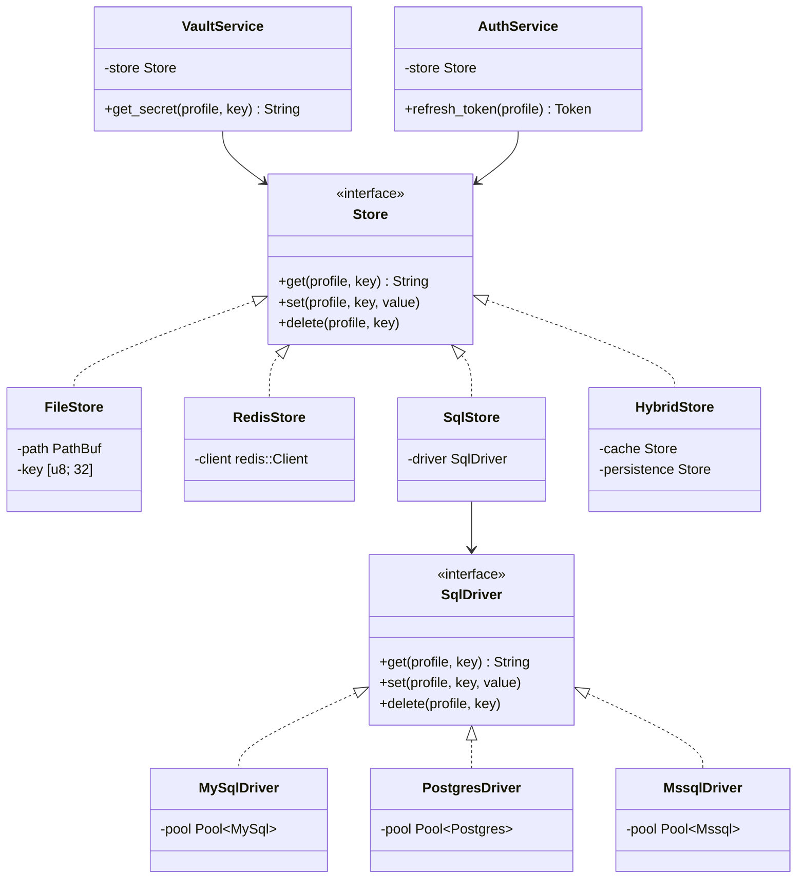

# 静态依赖视图 (Static Structure)

## 1. 模块依赖防腐图 (Anti-Corruption Layers)

## 2. 核心包划分
- `crate::core::store`: 包含 `Store` Trait 定义及多种后端驱动。
- `crate::core::vault`: 修改为依赖 `Store` Trait，而非硬编码 `MultiVault`。
- `crate::auth`: 依赖 `Store` 进行 Token 的分布式持久化与缓存。

---
*关联 HLD：[模块划分与依赖关系](../../hld/sections/04-modules.md)*
